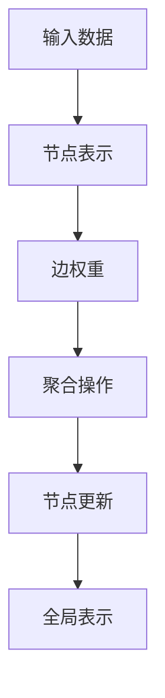
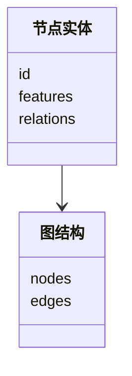
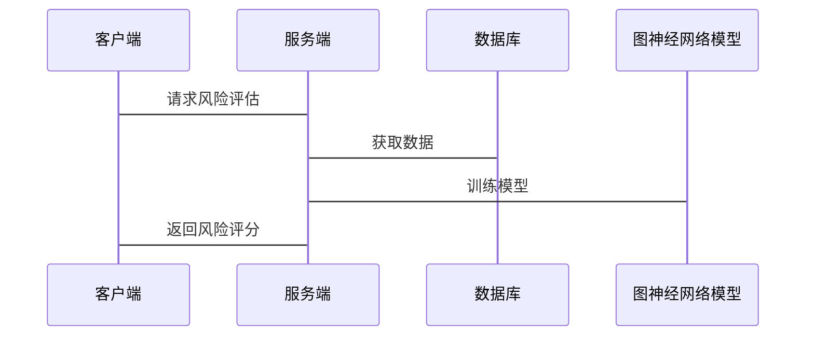

                 


# 《金融领域图神经网络的创新应用》

---

## 关键词：
金融、图神经网络、人工智能、风险管理、深度学习、复杂网络、金融建模

---

## 摘要：
本文系统地探讨了图神经网络在金融领域的创新应用。首先，我们介绍了图神经网络的核心概念及其在金融中的潜力，对比了传统方法的局限性。接着，详细讲解了图神经网络的算法原理，包括数学模型和实现代码。随后，通过构建金融风险评估系统，展示了图神经网络在系统设计中的优势。最后，通过实战案例分析，总结了图神经网络在金融领域的应用经验，并展望了未来的发展方向。

---

# 第一部分: 图神经网络与金融领域的结合背景

## 第1章: 图神经网络的核心概念与背景

### 1.1 图神经网络的核心概念
#### 1.1.1 图神经网络的定义与特点
图神经网络（Graph Neural Network, GNN）是一种基于图结构的数据进行学习的深度学习模型。其核心思想是通过节点之间的关系和属性来捕捉数据的语义信息，适用于处理复杂关联的数据。

#### 1.1.2 图神经网络在金融领域的应用潜力
金融数据具有高度的关联性和复杂性，传统的基于特征的模型难以捕捉复杂的交互关系。图神经网络能够通过建模实体之间的关系，揭示隐藏的模式，从而在金融风险评估、欺诈检测等领域展现出强大的潜力。

#### 1.1.3 金融领域中的复杂关系建模需求
金融领域的数据通常涉及多个实体（如公司、个人、交易等）之间的复杂关系。图神经网络通过构建图结构，可以有效地捕捉这些关系，从而提高模型的准确性和鲁棒性。

### 1.2 金融领域的核心问题与挑战
#### 1.2.1 金融数据的复杂性与关联性
金融数据通常涉及多个维度和复杂的交互关系，传统的统计方法和机器学习模型难以充分捕捉这些关系。

#### 1.2.2 传统方法的局限性与不足
传统方法在处理复杂关联性数据时，往往难以捕捉全局信息，导致模型的准确性和鲁棒性不足。

#### 1.2.3 图神经网络在金融领域的创新解决方案
图神经网络通过建模实体之间的关系，能够捕捉全局信息，从而在金融风险评估、欺诈检测等领域提供更准确的解决方案。

### 1.3 图神经网络与金融领域的结合意义
#### 1.3.1 提升金融数据分析的效率与准确性
通过建模实体之间的关系，图神经网络能够更准确地捕捉数据的语义信息，从而提高金融数据分析的效率和准确性。

#### 1.3.2 开拓金融领域的新兴应用场景
图神经网络在金融领域的应用拓展了新的研究方向，如社交网络分析、实时风险管理等。

#### 1.3.3 推动金融技术的智能化与创新
图神经网络的应用推动了金融技术的智能化发展，为金融机构提供了更强大的工具和方法。

---

# 第二部分: 图神经网络的算法原理与数学模型

## 第2章: 图神经网络的算法原理

### 2.1 图神经网络的基本算法流程
#### 2.1.1 图的表示与节点关系
图由节点和边组成，边通常带有权重，表示节点之间的关系强度。

#### 2.1.2 图神经网络的基本操作
- **节点表示**：通过聚合邻居节点的信息来更新当前节点的表示。
- **边权重**：边权重反映了节点之间关系的强度。
- **聚合函数**：将邻居节点的表示进行聚合，得到当前节点的更新表示。

#### 2.1.3 图神经网络的传播与聚合机制
图神经网络通过在图中传播信息，逐步更新节点的表示，最终得到全局的节点表示。

### 2.2 图神经网络的数学模型
#### 2.2.1 图的表示与邻接矩阵
图可以表示为一个邻接矩阵$A$，其中$A_{i,j}$表示节点$i$和节点$j$之间的边权重。

#### 2.2.2 节点表示的数学公式
节点$v_i$的表示$h_i^{(l)}$可以通过聚合其邻居节点的表示来更新：
$$h_i^{(l+1)} = \text{aggregate}(\{h_j^{(l)} | j \in \mathcal{N}(i)\})$$
其中，$\mathcal{N}(i)$表示节点$i$的邻居节点集合。

#### 2.2.3 图神经网络的损失函数与优化目标
图神经网络的目标是最小化损失函数$L$，通常使用交叉熵损失：
$$L = -\sum_{i} y_i \log(p_i) + (1 - y_i) \log(1 - p_i)$$
其中，$y_i$是真实标签，$p_i$是模型预测的概率。

### 2.3 图神经网络的算法实现
#### 2.3.1 图神经网络的Python源代码实现
```python
import torch
from torch import nn

class Graph Neural Network:
    def __init__(self, input_dim, hidden_dim, output_dim):
        self.W1 = nn.Parameter(torch.randn(input_dim, hidden_dim))
        self.W2 = nn.Parameter(torch.randn(hidden_dim, output_dim))

    def forward(self, x, adj):
        h = x.mm(self.W1)
        h = h.mm(self.W2)
        return h
```

#### 2.3.2 图神经网络的算法流程图


#### 2.3.3 图神经网络的数学公式
节点$v_i$的表示更新公式：
$$h_i^{(l+1)} = \sigma(h_i^{(l)} \cdot W + \sum_{j \in \mathcal{N}(i)} h_j^{(l)} \cdot A_{i,j})$$
其中，$\sigma$是激活函数，$W$是权重矩阵，$A_{i,j}$是边权重。

---

# 第三部分: 图神经网络在金融系统中的应用

## 第3章: 图神经网络的系统设计

### 3.1 金融风险评估系统的架构
#### 3.1.1 系统功能设计
- 数据采集与预处理
- 图结构构建
- 风险评估模型训练
- 风险评分与预警

#### 3.1.2 领域模型设计


#### 3.1.3 系统架构设计


#### 3.1.4 系统交互设计


### 3.2 金融风险评估系统的实现

#### 3.2.1 环境安装
- Python 3.8+
- PyTorch 1.9+
- NetworkX 2.6+

#### 3.2.2 系统核心实现代码
```python
import torch
import networkx as nx

class FinancialRiskAssessment:
    def __init__(self, graph):
        self.graph = graph
        self.model = self.build_model()

    def build_model(self):
        # 初始化模型参数
        input_dim = self.graph.nodes().shape[-1]
        hidden_dim = 64
        output_dim = 1
        model = GraphNeuralNetwork(input_dim, hidden_dim, output_dim)
        return model

    def train(self, X, y):
        # 训练模型
        optimizer = torch.optim.Adam(self.model.parameters(), lr=0.001)
        loss_fn = nn.BCEWithLogitsLoss()
        for epoch in range(100):
            outputs = self.model(X, self.graph.adj_matrix)
            loss = loss_fn(outputs, y)
            optimizer.zero_grad()
            loss.backward()
            optimizer.step()
```

#### 3.2.3 系统实现细节解读
- 数据预处理：将金融数据转换为图结构，提取节点特征和边权重。
- 模型训练：使用图神经网络模型进行训练，优化模型参数以最小化损失函数。
- 模型推理：利用训练好的模型进行风险评估，输出风险评分。

#### 3.2.4 项目实战案例分析
- 案例：某银行客户信用评估
- 数据来源：银行客户交易记录、信用历史等。
- 实施步骤：数据采集、图结构构建、模型训练、风险评估。

---

# 第四部分: 图神经网络在金融领域的最佳实践

## 第4章: 图神经网络的应用经验总结

### 4.1 应用经验总结
#### 4.1.1 项目小结
图神经网络在金融领域的应用能够有效捕捉复杂关系，提升模型的准确性和鲁棒性。

#### 4.1.2 经验与教训
- 数据质量对模型性能影响重大，需谨慎处理缺失值和异常值。
- 模型的可解释性有待进一步提升，以便更好地应用于实际业务场景。

### 4.2 注意事项
#### 4.2.1 模型选择
根据具体业务需求选择合适的图神经网络模型，如GAT、GCN等。

#### 4.2.2 数据隐私与安全
金融数据涉及敏感信息，需注意数据隐私和安全问题。

#### 4.2.3 模型部署与维护
图神经网络模型的部署和维护需要考虑计算资源和实时性要求。

### 4.3 未来趋势
#### 4.3.1 技术进步
随着深度学习技术的发展，图神经网络在金融领域的应用将更加广泛和深入。

#### 4.3.2 应用场景拓展
未来可能在金融诈骗检测、智能投资组合管理等领域有更广泛的应用。

#### 4.3.3 模型优化
研究更高效的图神经网络算法，提升模型的训练速度和预测精度。

---

## 作者：
**AI天才研究院/AI Genius Institute & 禅与计算机程序设计艺术 /Zen And The Art of Computer Programming**

---

通过以上详细的内容设计，我们可以看到，图神经网络在金融领域的应用前景广阔，能够为金融行业带来显著的创新和提升。希望本文能够为读者提供有价值的参考和启发，帮助他们在实际应用中更好地理解和运用图神经网络技术。

