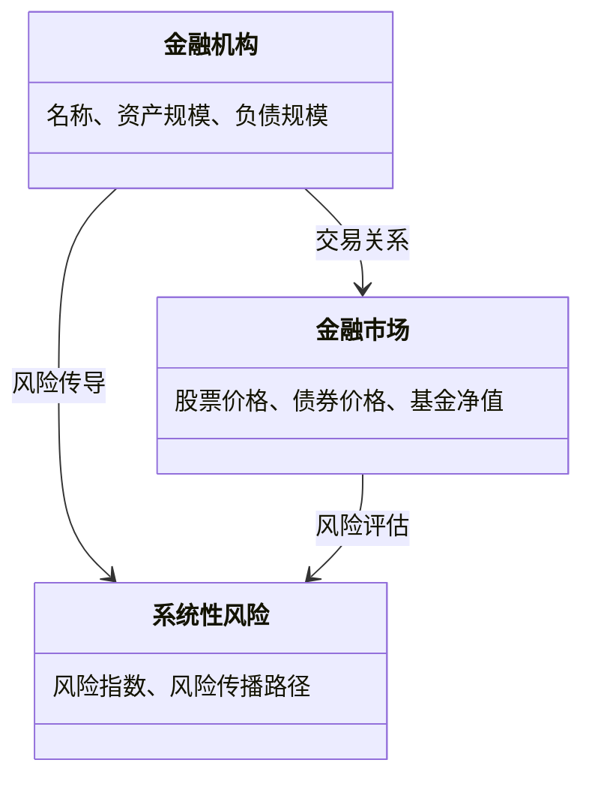
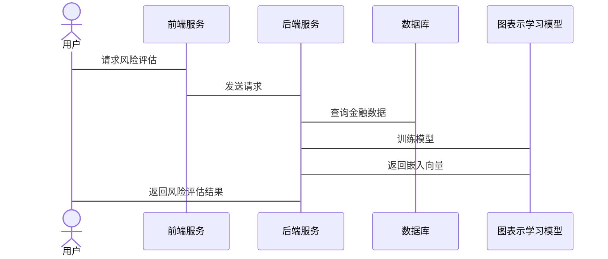

                 


# 《金融领域图表示学习在系统性风险传导中的应用》

## 关键词：系统性风险，图表示学习，金融网络，风险传导，算法实现

## 摘要：  
本文探讨了图表示学习在金融领域中的应用，特别是其在系统性风险传导分析中的重要性。文章首先介绍了系统性风险的基本概念及其复杂性，随后详细讲解了图表示学习的核心原理和优势。通过构建金融网络模型，分析了系统性风险传导的机制，并结合具体算法和案例，展示了图表示学习在识别关键风险节点和评估风险传播路径中的实际应用。文章还详细阐述了系统架构设计和项目实现过程，最后总结了图表示学习在系统性风险分析中的价值及未来研究方向。

---

## 第1章：系统性风险与图表示学习概述

### 1.1 系统性风险的基本概念

系统性风险是指由于金融系统中某些重大事件或冲击，导致整个金融体系发生系统性崩溃的可能性。与传统金融风险（如市场风险、信用风险等）不同，系统性风险具有更强的传染性和网络效应，其影响往往超出单个机构或市场的范围。例如，一家大型银行的破产可能引发连锁反应，导致整个金融系统的崩溃。

系统性风险的核心特征包括：
1. **复杂性**：涉及多个金融机构和市场的复杂网络。
2. **传染性**：风险在金融机构之间通过关联传播。
3. **网络效应**：单点故障可能导致全局性崩溃。

系统性风险的传导机制主要包括直接关联和间接关联。直接关联指金融机构之间直接的债务关系或交易关系；间接关联则是通过多层金融网络传递风险。

### 1.2 图表示学习的背景与意义

图表示学习是一种通过将图结构中的节点或边映射到低维向量空间来学习图结构特征的方法。其核心思想是将复杂的图数据转化为易于处理的向量形式，同时保留图的结构信息和语义信息。

图表示学习在金融领域的优势包括：
1. **捕捉复杂关联**：能够有效捕捉金融机构之间的复杂关联关系。
2. **高维数据压缩**：将高维的图数据压缩为低维向量，便于后续分析和计算。

系统性风险传导与图表示学习的结合，为金融风险分析提供了新的思路。通过图表示学习，可以识别金融网络中的关键节点（如具有高风险传播能力的机构），从而提前预警和防范系统性风险。

### 1.3 本章小结

本章介绍了系统性风险的基本概念和传导机制，并探讨了图表示学习在金融领域的应用潜力。系统性风险的复杂性和传染性决定了其对金融稳定的重要性，而图表示学习作为一种新兴的技术手段，为系统性风险的分析和预警提供了新的工具和方法。

---

## 第2章：系统性风险传导的图模型构建

### 2.1 金融网络的构建与特征

金融网络的构建是系统性风险分析的基础。常见的金融网络包括：
1. **金融机构之间的关联网络**：反映银行、保险公司等金融机构之间的直接或间接关联。
2. **金融市场中的交易网络**：反映不同金融资产之间的交易关系。
3. **金融资产的相互依赖关系**：反映资产之间的价格联动性。

金融网络的构建通常基于实际的市场数据，例如银行间同业拆借数据、股票价格数据等。通过这些数据，可以构建金融机构之间的关联图、资产之间的价格联动图等。

### 2.2 图表示学习的核心概念与联系

图表示学习的核心概念包括：
1. **节点嵌入**：将图中的每个节点映射到低维向量空间。
2. **图嵌入**：将整个图的结构信息映射到低维向量空间。

图表示学习与系统性风险传导的联系在于，通过节点嵌入或图嵌入，可以捕捉金融网络中的关键节点或风险传播路径。

**ER实体关系图架构的Mermaid流程图**

```mermaid
erDiagram
  actor 金融机构 {
    <属性> 名称、资产规模、负债规模
  }
  actor 金融市场 {
    <属性> 股票价格、债券价格、基金净值
  }
  actor 系统性风险 {
    <属性> 风险指数、风险传播路径
  }
 金融机构 --> 金融市场 : 交易关系
 金融机构 --> 系统性风险 : 风险传导
 金融市场 --> 系统性风险 : 风险评估
```

---

## 第3章：图表示学习算法原理

### 3.1 图表示学习的算法概述

图表示学习的主流算法包括：
1. **节点嵌入算法**：如Word2Vec、Node2Vec。
2. **图嵌入算法**：如DeepWalk、GraphSAGE。
3. **对比学习算法**：如Contrastive Loss-based方法。

这些算法各有优缺点，适用于不同的应用场景。例如，Node2Vec适用于复杂网络中的节点嵌入，而GraphSAGE适用于大规模图数据的实时处理。

### 3.2 图表示学习的数学模型与公式

**节点嵌入的数学模型**

节点嵌入的目标是将图中的每个节点表示为低维向量。假设图中节点的度数为$d_i$，其嵌入向量为$v_i$。节点嵌入的损失函数可以表示为：

$$ L = \sum_{i=1}^{n} \sum_{j \in N(i)} \text{CE}(v_i, v_j) $$

其中，$N(i)$表示节点$i$的邻居节点，$\text{CE}$表示交叉熵损失函数。

**图嵌入的数学公式**

图嵌入的目标是将整个图的结构信息表示为一个低维向量。一种常见的方法是通过聚合节点嵌入来生成图嵌入：

$$ G = \text{Agg}(v_1, v_2, \dots, v_n) $$

其中，$\text{Agg}$表示聚合函数，如平均、最大值或自注意力机制。

### 3.3 算法实现与案例分析

**Python代码实现**

以下是基于Node2Vec算法的节点嵌入实现示例：

```python
import networkx as nx
from node2vec import Node2Vec

# 构建金融网络
G = nx.Graph()
G.add_edges_from([(1,2), (2,3), (3,4), (4,5)])

# Node2Vec模型训练
node2vec = Node2Vec(G, dimensions=100, walk_length=10, num_walks=20)
node2vec.fit()

# 获取节点嵌入
embedding = node2vec.get_embeddings()

# 查看节点2的嵌入向量
print(embedding[2])
```

**案例分析**

假设我们有一个由5家银行构成的金融网络，其中银行2和银行3之间的关联性较高。通过Node2Vec算法，我们可以得到每个银行的嵌入向量。通过计算嵌入向量的相似性，可以识别银行2和银行3为高风险传播节点。

---

## 第4章：系统性风险传导的系统分析与架构设计

### 4.1 问题场景介绍

系统性风险传导的复杂性要求我们构建一个高效的金融风险分析系统。通过图表示学习，我们可以实时监控金融网络中的风险传播路径，并提前预警潜在的系统性风险。

### 4.2 系统功能设计

**领域模型Mermaid类图**



**系统架构设计Mermaid架构图**

```mermaid
horizontalLayout
    前端 <--. 访问 .--> 后端服务
    后端服务 --> 数据库
    后端服务 --> 图表示学习模型
    图表示学习模型 --> 风险评估模块
```

**系统接口设计与交互序列图**



---

## 第5章：项目实战：基于图表示学习的系统性风险评估与预警系统

### 5.1 环境安装

以下是项目所需的Python库和版本：

- Python 3.8+
- NetworkX 2.6+
- Node2Vec 0.3.0
- Scikit-learn 1.0+

### 5.2 系统核心实现

**数据采集与预处理**

```python
import pandas as pd
import numpy as np

# 从CSV文件中读取金融数据
df = pd.read_csv('financial_data.csv')
# 数据清洗和特征提取
df.dropna(inplace=True)
```

**模型训练与风险评估**

```python
from sklearn.manifold import TSNE

# 使用t-SNE进行降维
tsne = TSNE(n_components=2, random_state=42)
embedding = tsne.fit_transform(df.drop(columns=['label']))

# 可视化结果
import matplotlib.pyplot as plt
plt.scatter(embedding[:,0], embedding[:,1], c=df['label'])
plt.show()
```

**风险预警模块**

```python
def risk预警(threshold):
    if embedding.max() > threshold:
        return "高风险"
    else:
        return "低风险"
```

### 5.3 案例分析

假设我们有一个包含5家银行的金融网络，通过图表示学习模型，我们可以识别出银行2和银行3为高风险传播节点。通过风险预警模块，系统会发出预警信号，并建议采取相应的风险管理措施。

### 5.4 项目小结

本章通过实际案例展示了图表示学习在系统性风险评估中的应用。通过数据采集、模型训练和风险评估，我们可以有效地识别和预警系统性风险。

---

## 第6章：总结与展望

### 6.1 总结

本文探讨了图表示学习在金融领域中的应用，特别是在系统性风险传导分析中的重要性。通过构建金融网络模型和图表示学习算法，我们可以有效识别高风险节点和风险传播路径，从而提前预警和防范系统性风险。

### 6.2 展望

未来的研究方向包括：
1. **多模态图表示学习**：结合文本、图像等多种数据源，提升风险分析的准确性。
2. **实时风险监控**：开发实时图表示学习算法，实现动态风险评估。
3. **可解释性增强**：提升图表示学习模型的可解释性，便于金融决策者理解和使用。

---

## 作者：AI天才研究院/AI Genius Institute & 禅与计算机程序设计艺术/Zen And The Art of Computer Programming

---

**注意事项与最佳实践：**
- 在实际应用中，建议使用最新的图表示学习算法和工具。
- 数据质量和特征选择对模型性能影响较大，需特别注意数据预处理。
- 风险评估结果仅供参考，具体决策需结合实际情况。

