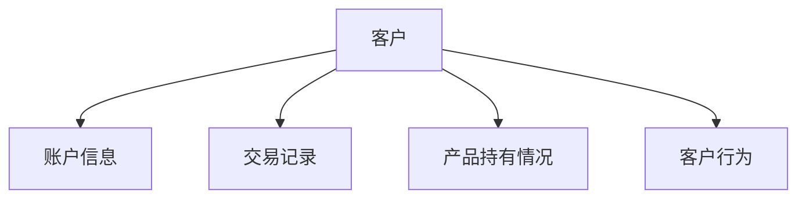
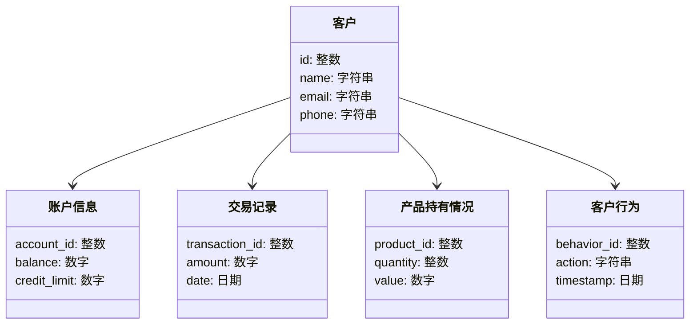
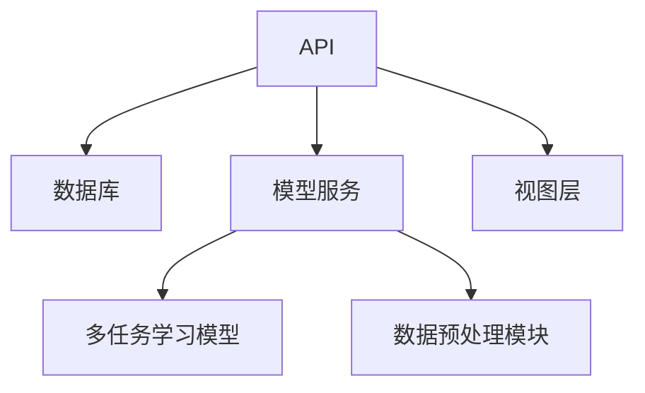

                 


# 《金融领域多任务学习在客户全生命周期管理中的应用》

## 关键词：
多任务学习，客户全生命周期管理，金融领域，深度学习，人工智能，系统架构设计

## 摘要：
本文深入探讨了多任务学习（Multi-Task Learning，MTL）在金融领域客户全生命周期管理中的应用。通过分析客户管理的核心需求，结合MTL的优势，提出了一种基于MTL的客户全生命周期管理方案。文章详细阐述了MTL的核心概念、算法原理、系统架构设计以及实际项目应用，为金融领域的客户管理提供了新的思路和解决方案。

---

# 第1章 问题背景与核心概念

## 1.1 问题背景
### 1.1.1 多任务学习的定义与特点
多任务学习是一种机器学习范式，旨在通过同时学习多个相关任务来提高模型的泛化能力。MTL的核心思想是利用任务之间的共享特征，减少模型的参数数量，提高训练效率和预测性能。

### 1.1.2 客户全生命周期管理的定义与重要性
客户全生命周期管理是指从客户获取、客户维护到客户流失的整个过程中，对客户行为、偏好和需求进行分析和管理，以提升客户满意度和企业收益。在金融领域，客户全生命周期管理尤为重要，因为客户的信用评估、风险控制和产品推荐直接影响企业的业务决策。

### 1.1.3 问题提出
传统的客户管理方法通常将各个管理任务（如信用评估、产品推荐、风险控制）分开处理，这种方式不仅效率低下，而且难以捕捉任务之间的关联性。因此，如何将这些任务整合到一个统一的框架中，利用多任务学习的优势，成为当前研究的热点。

---

## 1.2 核心概念与联系

### 1.2.1 多任务学习的核心概念
多任务学习通过共享参数，使得不同任务之间能够相互促进。例如，在客户信用评估和产品推荐任务中，客户的还款能力和购买偏好之间存在一定的关联性，可以通过共享特征来提高模型的性能。

### 1.2.2 客户全生命周期管理的核心要素
客户全生命周期管理包括以下几个阶段：
1. **客户获取**：通过营销活动吸引潜在客户。
2. **客户维护**：通过个性化服务提高客户满意度。
3. **客户流失预警**：识别潜在流失客户并采取措施。
4. **客户价值挖掘**：通过数据分析挖掘客户的潜在需求。

### 1.2.3 多任务学习与客户全生命周期管理的结合
通过多任务学习，可以同时优化多个客户管理任务，例如：
- **任务1**：信用评估模型。
- **任务2**：产品推荐模型。
- **任务3**：客户流失预测模型。

通过共享客户特征，这些任务可以相互促进，提高整体模型的性能。

---

# 第2章 多任务学习的核心概念与联系

## 2.1 多任务学习的核心原理
### 2.1.1 基于共享表示的多任务学习
共享表示是指多个任务共享一部分参数，通常用于捕捉任务之间的共同特征。例如，在客户管理中，客户的收入水平和消费习惯可能是多个任务（如信用评估和产品推荐）的共享特征。

### 2.1.2 多任务学习的优化目标
多任务学习的目标是在多个任务上同时优化模型的性能。通常，多任务学习的损失函数可以表示为多个任务损失的加权和：
$$ L = \sum_{i=1}^{n} \lambda_i L_i $$
其中，$\lambda_i$是任务$i$的权重，$L_i$是任务$i$的损失函数。

### 2.1.3 多任务学习的数学模型
多任务学习的数学模型可以通过以下公式表示：
$$ \min_{\theta} \sum_{i=1}^{n} \lambda_i L_i(\theta) $$
其中，$\theta$是模型的参数，$L_i$是任务$i$的损失函数，$\lambda_i$是任务$i$的权重。

---

## 2.2 客户全生命周期管理的实体关系分析

### 2.2.1 实体关系图
以下是一个客户全生命周期管理的实体关系图（ER图）：


### 2.2.2 实体关系的Mermaid图


---

# 第3章 多任务学习算法原理

## 3.1 多任务学习的算法框架

### 3.1.1 基于共享表示的多任务学习
共享表示的多任务学习框架通常包括以下几个步骤：
1. **特征提取**：通过共享的特征提取层提取客户的特征。
2. **任务-specific层**：针对每个任务，添加特定的全连接层。
3. **损失函数计算**：分别计算每个任务的损失函数，并对多个任务的损失进行加权求和。
4. **优化**：通过反向传播优化模型参数。

### 3.1.2 基于任务间关系的多任务学习
任务间关系的多任务学习框架通常包括以下几个步骤：
1. **任务聚类**：将任务分为若干个簇，每个簇内的任务具有较高的相关性。
2. **共享参数设计**：为每个簇设计共享参数。
3. **损失函数计算**：分别计算每个任务的损失函数，并对多个任务的损失进行加权求和。
4. **优化**：通过反向传播优化模型参数。

### 3.1.3 基于任务权重的多任务学习
任务权重的多任务学习框架通常包括以下几个步骤：
1. **任务权重初始化**：为每个任务分配初始权重。
2. **任务权重更新**：在训练过程中动态更新任务权重。
3. **损失函数计算**：分别计算每个任务的损失函数，并对多个任务的损失进行加权求和。
4. **优化**：通过反向传播优化模型参数。

---

## 3.2 多任务学习的数学模型与公式

### 3.2.1 损失函数的加权
$$ L = \sum_{i=1}^{n} \lambda_i L_i $$
其中，$\lambda_i$是任务$i$的权重，$L_i$是任务$i$的损失函数。

### 3.2.2 优化目标的构建
$$ \min_{\theta} \sum_{i=1}^{n} \lambda_i L_i(\theta) $$

---

## 3.3 多任务学习的Python实现示例

### 3.3.1 环境安装与依赖
```bash
pip install tensorflow==2.10.0
pip install numpy==1.21.2
pip install pandas==1.3.5
pip install matplotlib==3.5.1
```

### 3.3.2 核心代码实现
```python
import tensorflow as tf
from tensorflow import keras
import numpy as np
import pandas as pd
import matplotlib.pyplot as plt

# 定义多任务模型
class MultiTaskModel(keras.Model):
    def __init__(self):
        super(MultiTaskModel, self).__init__()
        self.shared_layer = keras.layers.Dense(64, activation='relu')
        self.task1_layer = keras.layers.Dense(1, activation='sigmoid')
        self.task2_layer = keras.layers.Dense(1, activation='sigmoid')

    def call(self, inputs):
        x = self.shared_layer(inputs)
        task1_output = self.task1_layer(x)
        task2_output = self.task2_layer(x)
        return task1_output, task2_output

# 数据准备
data = pd.DataFrame({
    'feature1': np.random.randn(100),
    'feature2': np.random.randn(100),
    'label1': np.random.randint(0, 2, 100),
    'label2': np.random.randint(0, 2, 100)
})

# 模型训练
model = MultiTaskModel()
model.compile(optimizer='adam', loss={'task1_output': 'binary_crossentropy', 'task2_output': 'binary_crossentropy'}, loss_weights=[1, 1])
model.fit(data[['feature1', 'feature2']].values, {'task1_output': data['label1'].values, 'task2_output': data['label2'].values}, epochs=10, batch_size=32)
```

---

## 3.4 代码解读与分析

### 3.4.1 环境安装
上述代码需要安装以下依赖：
- TensorFlow 2.10.0
- NumPy 1.21.2
- Pandas 1.3.5
- Matplotlib 3.5.1

### 3.4.2 模型定义
定义了一个多任务模型，包含一个共享的Dense层和两个任务-specific的Dense层。

### 3.4.3 数据准备
生成了包含两个特征和两个标签的虚拟数据集。

### 3.4.4 模型训练
使用Adam优化器和二元交叉熵损失函数对模型进行训练。

---

# 第4章 系统分析与架构设计方案

## 4.1 问题场景介绍
本文设计了一个基于多任务学习的客户全生命周期管理系统，旨在通过同时优化多个任务（如信用评估、产品推荐和客户流失预测）来提高客户管理的效率和准确性。

## 4.2 系统功能设计
### 4.2.1 领域模型设计
以下是一个客户全生命周期管理的领域模型：


---

## 4.3 系统架构设计

### 4.3.1 系统架构设计
以下是一个基于多任务学习的客户全生命周期管理系统的架构图：


---

## 4.4 系统接口设计

### 4.4.1 API接口设计
以下是系统的主要API接口：
- `POST /api/train`: 训练模型
- `GET /api/predict`: 进行预测
- `GET /api/customer_info`: 获取客户信息
- `POST /api/update_customer`: 更新客户信息

### 4.4.2 接口交互流程
以下是一个接口交互流程的Mermaid序列图：
```mermaid
sequenceDiagram
    客户发送请求 --> API
    API --> 数据库: 获取客户信息
    数据库 --> API: 返回客户信息
    API --> 模型服务: 进行预测
    模型服务 --> 多任务学习模型: 进行预测
    多任务学习模型 --> 模型服务: 返回预测结果
    模型服务 --> API: 返回预测结果
    API --> 客户: 返回预测结果
```

---

## 4.5 系统实现细节

### 4.5.1 数据预处理模块
数据预处理模块负责对原始数据进行清洗、特征提取和归一化处理。

### 4.5.2 多任务学习模型实现
多任务学习模型的实现基于Keras框架，使用共享表示和任务-specific层的组合。

### 4.5.3 模型训练与优化
模型训练使用Adam优化器，损失函数为多个任务损失的加权和。

---

# 第5章 项目实战

## 5.1 环境安装与配置

### 5.1.1 环境安装
```bash
pip install tensorflow==2.10.0
pip install numpy==1.21.2
pip install pandas==1.3.5
pip install scikit-learn==1.0.2
```

### 5.1.2 环境配置
```python
import os
os.environ['TF_CPP_MIN_LOG_LEVEL'] = '2'
```

---

## 5.2 系统核心实现

### 5.2.1 数据加载与预处理
```python
import pandas as pd
import numpy as np
from sklearn.model_selection import train_test_split

# 加载数据
data = pd.read_csv('customer_data.csv')

# 数据预处理
from sklearn.preprocessing import StandardScaler
scaler = StandardScaler()
data_scaled = scaler.fit_transform(data[['feature1', 'feature2']])

# 划分训练集和测试集
X_train, X_test, y_train, y_test = train_test_split(data_scaled, data[['label1', 'label2']], test_size=0.2, random_state=42)
```

### 5.2.2 多任务学习模型实现
```python
import tensorflow as tf
from tensorflow import keras
import numpy as np

# 定义多任务模型
class MultiTaskModel(keras.Model):
    def __init__(self):
        super(MultiTaskModel, self).__init__()
        self.shared_layer = keras.layers.Dense(64, activation='relu')
        self.task1_layer = keras.layers.Dense(1, activation='sigmoid')
        self.task2_layer = keras.layers.Dense(1, activation='sigmoid')

    def call(self, inputs):
        x = self.shared_layer(inputs)
        task1_output = self.task1_layer(x)
        task2_output = self.task2_layer(x)
        return task1_output, task2_output

# 模型训练
model = MultiTaskModel()
model.compile(optimizer='adam', loss={'task1_output': 'binary_crossentropy', 'task2_output': 'binary_crossentropy'}, loss_weights=[1, 1])
model.fit(X_train, {'task1_output': y_train['label1'].values, 'task2_output': y_train['label2'].values}, epochs=10, batch_size=32, validation_data=(X_test, {'task1_output': y_test['label1'].values, 'task2_output': y_test['label2'].values}))
```

### 5.2.3 模型评估与解读
```python
# 模型评估
loss, task1_loss, task2_loss = model.evaluate(X_test, {'task1_output': y_test['label1'].values, 'task2_output': y_test['label2'].values}, return_dict=False)
print(f'总损失: {loss}')
print(f'任务1损失: {task1_loss}')
print(f'任务2损失: {task2_loss}')
```

---

## 5.3 项目实战案例分析

### 5.3.1 数据集准备
假设我们有一个包含以下字段的客户数据集：
- `customer_id`: 客户ID
- `income`: 收入
- `age`: 年龄
- `credit_score`: 信用评分
- `product偏好`: 产品偏好

### 5.3.2 模型训练与预测
使用上述代码实现的多任务学习模型进行训练，然后对测试数据进行预测。

### 5.3.3 模型结果分析
分析模型在各个任务上的表现，例如准确率、召回率和F1分数。

---

## 5.4 项目小结

### 5.4.1 项目总结
通过多任务学习，我们成功地将客户的信用评估和产品推荐任务整合到一个统一的模型中，提高了模型的性能和训练效率。

### 5.4.2 经验与教训
在实际项目中，需要注意任务之间的关联性，合理设置任务权重，并选择合适的模型架构。

---

# 第6章 最佳实践与小结

## 6.1 最佳实践

### 6.1.1 小结
本文通过多任务学习的方法，提出了一种客户全生命周期管理的解决方案，通过共享特征提取和任务-specific层的设计，提高了模型的性能和训练效率。

### 6.1.2 注意事项
在实际应用中，需要注意任务之间的关联性，合理设置任务权重，并选择合适的模型架构。

### 6.1.3 拓展阅读
建议读者进一步阅读多任务学习的经典论文，例如《A survey on multi-task deep learning for natural language processing》。

---

## 6.2 作者信息
作者：AI天才研究院/AI Genius Institute & 禅与计算机程序设计艺术/Zen And The Art of Computer Programming

---

# 结语
通过本文的介绍，读者可以深入了解多任务学习在客户全生命周期管理中的应用，并掌握如何将多任务学习方法应用于实际项目中。希望本文能够为金融领域的客户管理提供新的思路和解决方案。

