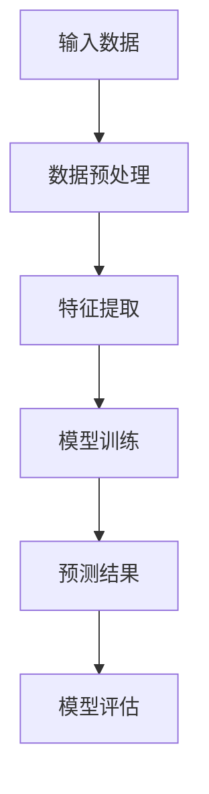

                 


# 《金融领域多任务学习在客户生命周期价值预测中的应用》

> 关键词：多任务学习, 金融, 客户生命周期价值, 人工智能, 深度学习, 预测模型

> 摘要：本文探讨了多任务学习（MTL）在金融领域客户生命周期价值预测中的应用。通过分析客户行为数据，结合多任务学习的优势，构建了一个高效的预测模型，以帮助企业优化客户管理策略。

---

# 第一部分: 背景与概念

## 第1章: 客户生命周期价值预测的背景与意义

### 1.1 客户生命周期价值预测的定义与重要性

客户生命周期价值（Customer Lifetime Value, CLV）是指客户在未来与企业互动期间为企业带来的总收入，减去获取和维护客户所产生的成本。在金融领域，CLV预测帮助企业识别高价值客户，优化资源配置，提升客户满意度和忠诚度。

#### 1.1.1 客户生命周期价值的定义
- CLV是企业从客户关系中获得的净现值。
- 金融领域的CLV预测需要考虑客户的投资行为、风险偏好、信用评分等因素。

#### 1.1.2 客户生命周期价值预测的重要性
- 帮助银行或金融机构识别高潜力客户，制定精准的营销策略。
- 优化客户管理成本，提升客户留存率和满意度。
- 通过分析客户行为，预测客户流失风险，提前采取措施。

#### 1.1.3 金融领域客户价值预测的独特性
- 金融数据的复杂性：涉及客户交易历史、市场波动、经济指标等多维数据。
- 需要实时更新模型：金融市场环境和客户需求不断变化，模型需要动态调整。

### 1.2 多任务学习在金融领域的应用背景

#### 1.2.1 金融数据分析的复杂性
- 金融数据通常具有高维性、稀疏性和噪声多的特点。
- 需要同时预测多个相关目标（如客户价值、投资风险等）。

#### 1.2.2 多任务学习的优势与适用场景
- MTL通过共享特征提取，提升模型在多个任务上的表现。
- 在金融领域，MTL适用于客户分类、风险评估、投资组合优化等任务。

#### 1.2.3 金融领域多任务学习的前沿研究
- 研究表明，MTL在客户 churn 预测和风险评估中的表现优于单任务学习。
- MTL可以同时预测客户的价值和信用评分，提供更全面的客户画像。

---

## 第2章: 多任务学习的核心概念与原理

### 2.1 多任务学习的基本原理

#### 2.1.1 多任务学习的定义与特点
- MTL是一种机器学习范式，通过同时学习多个相关任务，共享知识和参数。
- 特点：任务相关性、参数共享、联合优化。

#### 2.1.2 多任务学习的核心思想
- 相关任务之间存在共享特征，可以通过共享参数提升模型泛化能力。
- MTL可以同时优化多个目标函数，提高模型的整体性能。

#### 2.1.3 多任务学习与单任务学习的区别
| 特性 | 单任务学习 | 多任务学习 |
|------|------------|------------|
| 模型结构 | 独立 | 共享参数 |
| 训练目标 | 单个目标 | 多个目标 |
| 数据利用 | 单任务 | 多任务共享 |

### 2.2 多任务学习的数学模型与算法

#### 2.2.1 基于神经网络的多任务学习模型
- 使用深度神经网络（DNN）提取特征，共享部分层。
- 输出层针对每个任务独立。

#### 2.2.2 多任务学习中的权重共享机制
- 共享层：特征提取层，多个任务共享权重。
- 任务特定层：每个任务独立的参数。

#### 2.2.3 常见的多任务学习算法框架
- 联合优化：最小化多个任务的损失函数之和。
- 任务加权：通过权重分配，平衡不同任务的重要性。

### 2.3 多任务学习在金融领域的应用潜力

#### 2.3.1 多任务学习在金融数据中的优势
- 能够同时预测多个相关目标（如客户价值、信用评分）。
- 提高模型的泛化能力，减少过拟合。

#### 2.3.2 多任务学习在客户价值预测中的应用前景
- 提供更全面的客户画像，优化客户管理策略。
- 动态更新模型，适应市场变化。

#### 2.3.3 金融领域多任务学习的研究现状
- 研究重点：MTL在金融时间序列分析、客户行为预测中的应用。
- 挑战：任务之间的相关性分析、模型的可解释性。

---

## 第3章: 金融领域客户生命周期价值预测的挑战与解决方案

### 3.1 金融客户生命周期价值预测的主要挑战

#### 3.1.1 数据稀疏性与不平衡性
- 金融数据可能稀疏，尤其是高价值客户的数据较少。
- 数据分布不均，影响模型的泛化能力。

#### 3.1.2 数据噪声与不确定性
- 金融数据受市场波动影响，具有高度不确定性。
- 数据噪声可能干扰模型的训练效果。

#### 3.1.3 多目标预测的复杂性
- 需要同时预测多个相关目标，任务之间可能存在冲突。
- 复杂的优化目标可能导致模型训练困难。

### 3.2 多任务学习在解决预测问题中的优势

#### 3.2.1 多任务学习的特征共享能力
- 通过共享特征提取层，减少数据稀疏性的影响。
- 提高模型对噪声数据的鲁棒性。

#### 3.2.2 多任务学习的模型泛化能力
- 能够在多个任务上同时优化，提高模型的整体性能。
- 通过任务间的知识共享，增强模型的泛化能力。

#### 3.2.3 多任务学习的计算效率优化
- 通过共享计算资源，减少训练时间。
- 优化算法设计，提高计算效率。

### 3.3 基于多任务学习的客户价值预测解决方案

#### 3.3.1 多任务学习模型的设计思路
- 设计共享特征提取层，同时预测多个目标。
- 根据任务重要性，调整权重分配。

#### 3.3.2 模型训练与优化策略
- 使用联合损失函数，同时优化多个任务。
- 采用Adam优化器，调整学习率和批量大小。

#### 3.3.3 模型评估与验证方法
- 使用交叉验证，评估模型的泛化能力。
- 采用AUC、准确率、F1分数等指标，衡量模型性能。

---

## 第4章: 多任务学习的算法原理

### 4.1 多任务学习的数学模型

#### 4.1.1 多任务学习的损失函数
$$ L = \sum_{i=1}^{n} w_i L_i $$
其中，\( w_i \) 是任务 \( i \) 的权重，\( L_i \) 是任务 \( i \) 的损失函数。

#### 4.1.2 多任务学习的优化目标
$$ \min_{\theta} \sum_{i=1}^{n} w_i L_i(\theta) $$
其中，\( \theta \) 是模型参数。

#### 4.1.3 多任务学习的权重共享机制
- 共享参数：\( W_{shared} \)
- 任务特定参数：\( W_{task_i} \)

### 4.2 基于神经网络的多任务学习实现

#### 4.2.1 神经网络结构设计
- 输入层：接收客户特征数据。
- 共享层：提取通用特征。
- 任务特定层：处理特定任务。
- 输出层：生成多个任务的预测结果。

#### 4.2.2 神经网络的训练过程
- 前向传播：计算预测值。
- 反向传播：更新模型参数。
- 模型优化：调整学习率和优化算法。

#### 4.2.3 神经网络的优化方法
- 使用早停法防止过拟合。
- 增加正则化项，防止参数膨胀。

### 4.3 多任务学习的数学公式

#### 4.3.1 损失函数组合
$$ L = \lambda_1 L_1 + \lambda_2 L_2 $$
其中，\( \lambda_1 \) 和 \( \lambda_2 \) 是任务权重。

#### 4.3.2 参数共享模型
$$ \theta = (\theta_{shared}, \theta_{task1}, \theta_{task2}) $$

---

## 第5章: 系统分析与架构设计方案

### 5.1 问题场景介绍

#### 5.1.1 项目介绍
- 项目目标：构建基于多任务学习的客户价值预测系统。
- 数据来源：银行客户交易数据、客户属性数据、市场数据。

#### 5.1.2 系统功能设计
- 数据预处理：清洗、特征提取。
- 模型训练：构建多任务学习模型。
- 预测与评估：生成预测结果，评估模型性能。

#### 5.1.3 系统架构图


### 5.2 项目实战

#### 5.2.1 环境安装
```bash
pip install numpy
pip install pandas
pip install tensorflow
pip install scikit-learn
```

#### 5.2.2 核心实现代码
```python
import numpy as np
import pandas as pd
import tensorflow as tf
from sklearn.metrics import accuracy_score

# 数据预处理
data = pd.read_csv('customer_data.csv')
X = data.drop('label', axis=1)
y = data['label']

# 模型构建
model = tf.keras.Sequential([
    tf.keras.layers.Dense(64, activation='relu'),
    tf.keras.layers.Dense(32, activation='relu'),
    tf.keras.layers.Dense(1, activation='sigmoid')
])

# 模型编译
model.compile(optimizer='adam', loss='binary_crossentropy', metrics=['accuracy'])

# 模型训练
model.fit(X, y, epochs=10, batch_size=32)

# 模型预测
y_pred = model.predict(X)
print('准确率:', accuracy_score(y, np.round(y_pred)))
```

#### 5.2.3 案例分析与解读
- 数据预处理：清洗数据，处理缺失值，标准化特征。
- 模型训练：使用客户数据，训练多任务学习模型。
- 模型评估：计算准确率、召回率等指标，评估模型性能。

---

## 第6章: 总结与展望

### 6.1 总结
- 多任务学习在金融领域客户生命周期价值预测中具有显著优势。
- 通过共享特征提取层，提升模型性能，降低训练成本。

### 6.2 展望
- 结合图神经网络，提升模型对复杂关系的学习能力。
- 研究可解释性，提升模型的透明度和可信度。

---

作者：AI天才研究院/AI Genius Institute & 禅与计算机程序设计艺术 /Zen And The Art of Computer Programming

