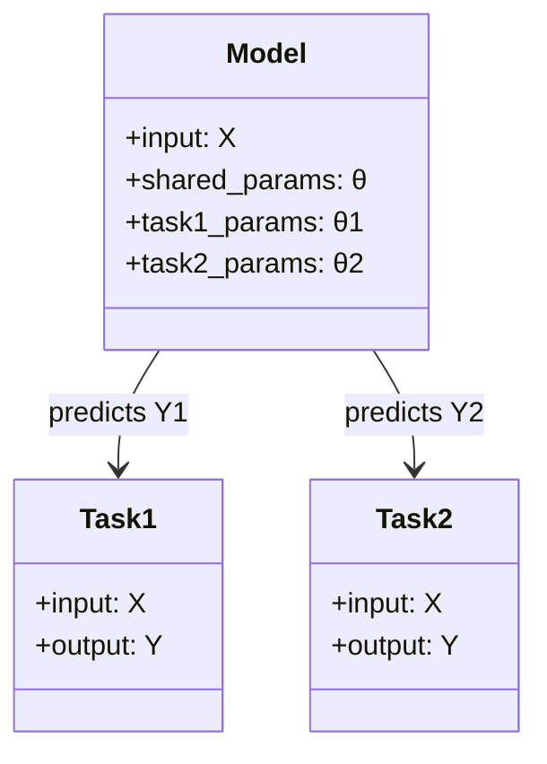
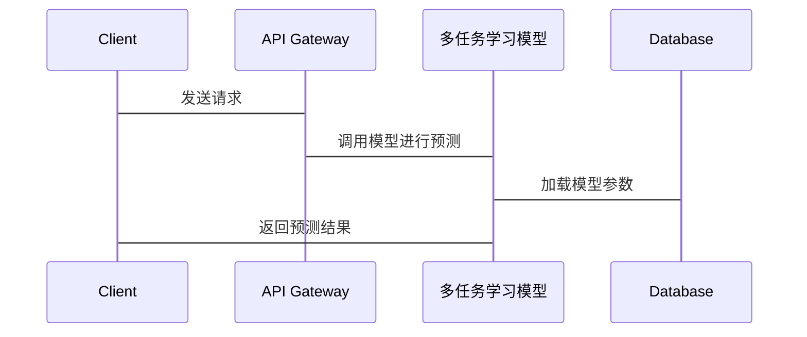

                 


# 《金融领域多任务学习的应用与挑战》

> 关键词：多任务学习, 金融应用, 深度学习, 人工智能, 任务关联性

> 摘要：  
本文深入探讨了多任务学习（Multi-Task Learning, MTL）在金融领域的应用与挑战。通过分析多任务学习的核心概念、算法原理及其在金融场景中的具体应用，本文揭示了多任务学习如何通过共享参数和模型结构来提升金融任务的效率与准确性。同时，本文还详细讨论了在金融领域应用多任务学习所面临的技术挑战，并提出了相应的解决方案与实践建议。本文内容涵盖背景介绍、核心概念、算法原理、系统架构、项目实战及最佳实践等多个方面，为读者提供了全面的视角和深入的分析。

---

# 第1章: 多任务学习的基本概念与背景

## 1.1 多任务学习的定义与特点
### 1.1.1 多任务学习的定义
多任务学习（Multi-Task Learning, MTL）是一种机器学习范式，旨在通过同时学习多个相关任务来提升模型的性能。与单任务学习不同，MTL允许模型在多个任务之间共享参数，从而捕捉任务间的共同特征，减少过拟合，并提高泛化能力。

### 1.1.2 多任务学习的核心特点
- **任务相关性**：多个任务之间存在某种关联性，可以通过共享参数或模型结构来提升性能。
- **参数共享**：任务之间共享部分参数，降低模型的复杂度和训练数据需求。
- **联合优化**：通过同时优化多个任务的损失函数，实现全局最优。

### 1.1.3 多任务学习与单任务学习的区别
| 特性 | 单任务学习 | 多任务学习 |
|------|------------|------------|
| 参数独立性 | 参数独立，每个任务独立优化 | 参数共享，任务间共享部分参数 |
| 模型复杂度 | 模型复杂度较高，需要更多数据 | 模型复杂度较低，数据需求减少 |
| 实际应用 | 适用于单一任务场景 | 适用于多个相关任务的复杂场景 |

---

## 1.2 金融领域的多任务学习应用背景
### 1.2.1 金融领域中的多任务问题场景
金融领域涉及多个复杂且相互关联的任务，例如：
- **风险评估与信用评分**：评估客户的信用风险。
- **股票价格预测**：预测股票价格走势。
- **欺诈检测**：识别金融交易中的欺诈行为。
- **资产配置与投资组合优化**：优化投资组合以实现收益最大化。

### 1.2.2 多任务学习在金融中的优势
- **数据效率**：通过共享参数，减少对每个任务单独训练所需的数据量。
- **任务关联性利用**：利用任务间的关联性，提升模型的整体性能。
- **实时决策支持**：多任务学习可以同时处理多个相关任务，为实时金融决策提供支持。

### 1.2.3 当前金融领域多任务学习的研究现状
目前，多任务学习在金融领域的研究主要集中在以下几个方面：
- 基于深度学习的多任务模型设计。
- 任务权重的动态调整方法。
- 任务间关系的建模与优化。

---

## 1.3 本章小结
本章主要介绍了多任务学习的基本概念、特点及其在金融领域的应用背景。通过对比单任务学习和多任务学习，我们理解了多任务学习在金融领域的重要性和优势。接下来的章节将深入探讨多任务学习的核心概念与原理。

---

# 第2章: 多任务学习的核心概念与原理

## 2.1 多任务学习的原理
### 2.1.1 联合学习的基本原理
联合学习通过共享参数的方式，将多个任务的损失函数联合起来优化。具体来说，多任务学习的损失函数可以表示为：

$$ L = \lambda_1 L_1 + \lambda_2 L_2 + \dots + \lambda_n L_n $$

其中，$\lambda_i$ 是任务 $i$ 的权重系数，$L_i$ 是任务 $i$ 的损失函数。

### 2.1.2 参数共享机制
参数共享是多任务学习的核心机制之一。通过共享参数，模型可以在多个任务之间建立联系，从而利用任务间的相似性来提升性能。例如，在股票价格预测和市场情绪分析任务中，可以共享部分卷积层或 LSTM 层的参数。

### 2.1.3 任务间关系的建模方法
任务间的关系可以通过以下几种方式建模：
1. **线性关系**：假设任务间的关系是线性的，可以通过共享权重矩阵来建模。
2. **非线性关系**：通过深度神经网络来捕捉任务间的非线性关系。
3. **层次化关系**：将任务分为不同的层次，共享不同层次的参数。

---

## 2.2 多任务学习的核心概念
### 2.2.1 任务相关性的度量
任务相关性可以通过以下几种方式度量：
1. **相关性系数**：如皮尔逊相关系数或斯皮尔曼相关系数。
2. **共享参数量**：任务间共享的参数越多，任务的相关性越高。

### 2.2.2 任务权重的分配策略
任务权重的分配策略直接影响模型的性能。常用的任务权重分配方法包括：
1. **均匀分配**：所有任务的权重相同。
2. **数据驱动分配**：根据任务的数据量或复杂度动态调整权重。
3. **任务重要性分配**：根据任务的业务重要性手动设置权重。

### 2.2.3 跨任务梯度的影响
在多任务学习中，任务间梯度的影响可以通过以下方式处理：
1. **梯度加权**：对每个任务的梯度进行加权，以平衡任务间的优化步长。
2. **梯度归一化**：对任务间的梯度进行归一化处理，避免某些任务的梯度过大。

---

## 2.3 多任务学习的数学模型
### 2.3.1 损失函数的构建
多任务学习的损失函数通常由多个任务的损失函数加权求和构成：

$$ L = \sum_{i=1}^n \lambda_i L_i $$

其中，$\lambda_i$ 是任务 $i$ 的权重系数，$L_i$ 是任务 $i$ 的损失函数。

### 2.3.2 参数共享的数学表达
假设我们有两个任务，任务1和任务2，共享部分参数 $\theta$，其余参数分别为 $\theta_1$ 和 $\theta_2$。则模型可以表示为：

$$ f_1(x; \theta, \theta_1) $$
$$ f_2(x; \theta, \theta_2) $$

损失函数为：

$$ L = \lambda_1 L_1 + \lambda_2 L_2 $$

### 2.3.3 跨任务梯度的整合方法
在反向传播过程中，任务间的梯度可以通过以下方式整合：

$$ \nabla_{\theta} L = \nabla_{\theta} (\lambda_1 L_1 + \lambda_2 L_2) $$
$$ = \lambda_1 \nabla_{\theta} L_1 + \lambda_2 \nabla_{\theta} L_2 $$

---

## 2.4 本章小结
本章详细介绍了多任务学习的核心概念与原理，包括联合学习的基本原理、参数共享机制、任务间关系的建模方法以及数学模型的构建。这些内容为后续章节在金融领域的应用奠定了理论基础。

---

# 第3章: 多任务学习在金融领域的核心应用

## 3.1 金融领域的多任务学习任务类型
### 3.1.1 风险评估与信用评分
通过多任务学习，可以同时预测客户违约概率和信用评分，从而提升风险评估的准确性。

### 3.1.2 股票价格预测
股票价格预测任务可以通过多任务学习同时考虑市场情绪、宏观经济指标等多个因素。

### 3.1.3 欺诈检测
多任务学习可以同时检测交易中的欺诈行为，并预测欺诈交易的概率。

### 3.1.4 资产配置与投资组合优化
通过多任务学习，可以同时优化不同资产的配置比例，以实现收益最大化。

---

## 3.2 多任务学习在金融中的具体应用场景
### 3.2.1 风险评估与欺诈检测的联合建模
通过共享客户特征和行为数据，可以同时进行风险评估和欺诈检测。

### 3.2.2 股票预测与市场情绪分析的多任务建模
通过多任务学习，可以同时预测股票价格走势并分析市场情绪。

### 3.2.3 资产配置与交易策略优化的多任务学习
通过多任务学习，可以同时优化资产配置和交易策略，以实现收益最大化。

---

## 3.3 本章小结
本章主要介绍了多任务学习在金融领域的核心应用，包括风险评估、股票价格预测、欺诈检测和资产配置等任务。通过多任务学习，可以同时优化多个相关任务，提升金融决策的效率和准确性。

---

# 第4章: 多任务学习的算法原理与数学模型

## 4.1 多任务学习的算法框架
### 4.1.1 基于神经网络的多任务学习框架
通过深度神经网络，可以同时处理多个任务，并共享网络中的某些层。

### 4.1.2 参数共享的实现方式
参数共享可以通过以下方式实现：
1. **共享全连接层**：共享多个任务的全连接层参数。
2. **共享卷积层**：共享多个任务的卷积层参数。

### 4.1.3 跨任务梯度的整合策略
在反向传播过程中，可以通过加权的方式整合任务间的梯度。

---

## 4.2 多任务学习的数学模型
### 4.2.1 损失函数的构建
多任务学习的损失函数通常由多个任务的损失函数加权求和构成。

### 4.2.2 参数共享的数学表达
假设我们有两个任务，任务1和任务2，共享部分参数 $\theta$，其余参数分别为 $\theta_1$ 和 $\theta_2$。则模型可以表示为：

$$ f_1(x; \theta, \theta_1) $$
$$ f_2(x; \theta, \theta_2) $$

损失函数为：

$$ L = \lambda_1 L_1 + \lambda_2 L_2 $$

### 4.2.3 跨任务梯度的整合方法
在反向传播过程中，任务间的梯度可以通过以下方式整合：

$$ \nabla_{\theta} L = \nabla_{\theta} (\lambda_1 L_1 + \lambda_2 L_2) $$
$$ = \lambda_1 \nabla_{\theta} L_1 + \lambda_2 \nabla_{\theta} L_2 $$

---

## 4.3 本章小结
本章详细介绍了多任务学习的算法原理与数学模型，为后续章节在金融领域的应用提供了理论支持。

---

# 第5章: 金融领域多任务学习的系统架构与实现

## 5.1 金融多任务学习系统的总体架构
### 5.1.1 系统功能模块划分
- **数据预处理模块**：对金融数据进行清洗、特征提取和数据增强。
- **模型训练模块**：基于多任务学习框架训练模型。
- **结果输出模块**：输出多个任务的预测结果。

### 5.1.2 数据流的处理流程
1. 数据预处理：清洗数据并提取特征。
2. 模型训练：基于多任务学习框架训练模型。
3. 结果输出：输出多个任务的预测结果。

### 5.1.3 模型训练与部署的流程
1. 数据预处理：清洗数据并提取特征。
2. 模型训练：基于多任务学习框架训练模型。
3. 模型部署：将训练好的模型部署到实际业务场景中。

---

## 5.2 系统功能设计
### 5.2.1 领域模型（Mermaid 类图）


### 5.2.2 系统架构设计（Mermaid 架构图）


---

## 5.3 系统接口设计
### 5.3.1 接口定义
- **输入接口**：接收多个任务的输入数据。
- **输出接口**：输出多个任务的预测结果。

### 5.3.2 系统交互流程图（Mermaid 序列图）


---

## 5.4 本章小结
本章详细介绍了金融多任务学习系统的总体架构、功能模块设计、系统架构设计以及接口设计。通过这些设计，我们可以构建一个高效的多任务学习系统，满足金融领域的复杂需求。

---

# 第6章: 项目实战——多任务学习在金融中的应用

## 6.1 项目背景与目标
### 6.1.1 项目背景
本项目旨在通过多任务学习技术，同时进行风险评估和欺诈检测。

### 6.1.2 项目目标
- 构建一个多任务学习模型，同时预测客户的违约概率和欺诈交易的概率。

---

## 6.2 环境配置
### 6.2.1 环境要求
- Python 3.6+
- TensorFlow或PyTorch框架
- 数据集：金融领域的客户数据和交易数据。

---

## 6.3 代码实现
### 6.3.1 数据预处理
```python
import pandas as pd
import numpy as np

# 加载数据
data = pd.read_csv('financial_data.csv')

# 数据清洗
data.dropna()
data = data.drop_duplicates()

# 特征提取
features = data[['age', 'income', 'credit_score', 'transaction_history']]
labels = data[['default_probability', 'fraud_probability']]
```

### 6.3.2 模型构建
```python
import tensorflow as tf
from tensorflow import keras

# 定义多任务学习模型
input_layer = keras.Input(shape=(4,))
shared_layer = keras.Dense(32, activation='relu')(input_layer)
task1_output = keras.Dense(1, name='task1_output')(shared_layer)
task2_output = keras.Dense(1, name='task2_output')(shared_layer)

model = keras.Model(inputs=input_layer, outputs=[task1_output, task2_output])

# 定义损失函数和优化器
loss_fn = {'task1_output': 'binary_crossentropy', 'task2_output': 'binary_crossentropy'}
loss_weights = {'task1_output': 1.0, 'task2_output': 1.0}
model.compile(optimizer='adam', loss=loss_fn, loss_weights=loss_weights)
```

### 6.3.3 模型训练
```python
# 数据准备
X = features.values
y = [labels['default_probability'].values, labels['fraud_probability'].values]

# 模型训练
model.fit(X, y, epochs=100, batch_size=32, validation_split=0.2)
```

---

## 6.4 实际案例分析
### 6.4.1 案例背景
假设我们有一个客户数据集，包含客户的年龄、收入、信用评分和交易历史等信息。目标是同时预测客户的违约概率和欺诈交易的概率。

### 6.4.2 模型结果分析
通过训练好的模型，我们可以得到客户的违约概率和欺诈交易的概率。例如：
- 客户A的违约概率为 0.2，欺诈交易概率为 0.1。
- 客户B的违约概率为 0.8，欺诈交易概率为 0.7。

---

## 6.5 项目小结
本章通过一个实际案例，展示了多任务学习在金融领域的应用。通过构建一个多任务学习模型，我们可以同时预测客户的违约概率和欺诈交易的概率，从而提升金融决策的效率和准确性。

---

# 第7章: 最佳实践与注意事项

## 7.1 多任务学习在金融中的优势
- **数据效率**：通过共享参数，减少对每个任务单独训练所需的数据量。
- **任务关联性利用**：利用任务间的关联性，提升模型的整体性能。
- **实时决策支持**：多任务学习可以同时处理多个相关任务，为实时金融决策提供支持。

## 7.2 应用多任务学习的注意事项
- **任务相关性**：确保任务之间存在足够的相关性，否则可能导致模型性能下降。
- **任务权重**：合理分配任务权重，避免某些任务对模型的主导作用过大。
- **过拟合风险**：多任务学习可能会导致模型过拟合，需要通过正则化等方法进行控制。

## 7.3 最佳实践 tips
- **任务选择**：选择相关性较高且互补的任务。
- **数据处理**：对数据进行充分的清洗和特征工程，确保数据质量。
- **模型调优**：通过交叉验证和超参数调优，提升模型性能。

---

## 7.4 本章小结
本章总结了多任务学习在金融中的优势和应用注意事项，并提供了最佳实践 tips。通过合理选择任务、优化模型和处理数据，可以充分发挥多任务学习在金融领域的潜力。

---

# 结语

多任务学习作为一种强大的机器学习范式，正在金融领域展现出巨大的潜力。通过共享参数和模型结构，多任务学习可以同时优化多个相关任务，提升金融决策的效率和准确性。然而，多任务学习在金融领域的应用也面临一些挑战，如任务相关性、任务权重分配和过拟合风险等。未来，随着深度学习技术的不断发展，多任务学习将在金融领域发挥更大的作用。

---

# 作者：AI天才研究院/AI Genius Institute & 禅与计算机程序设计艺术 /Zen And The Art of Computer Programming

