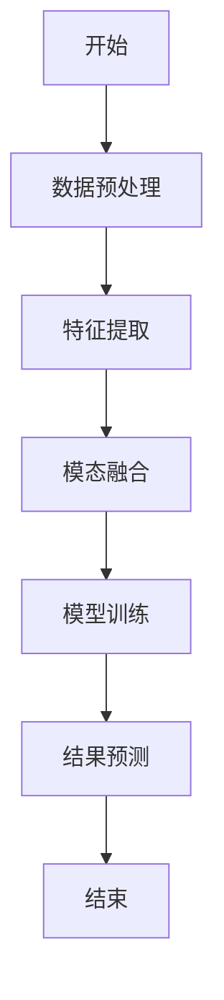
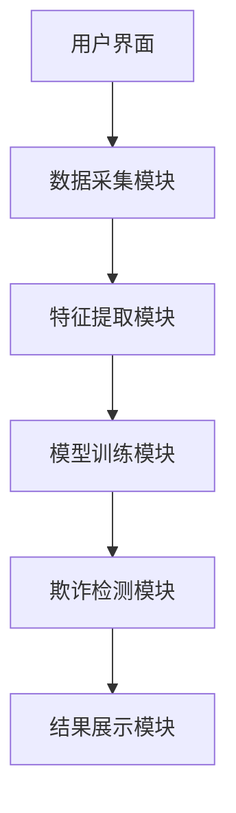
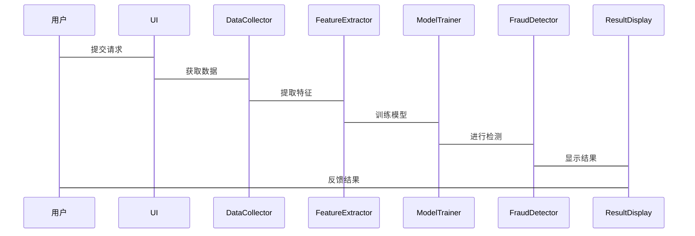

                 


# 《金融领域多模态学习在全方位反欺诈中的应用》

> 关键词：金融反欺诈，多模态学习，机器学习，深度学习，数据融合，实体关系图

> 摘要：本文深入探讨了多模态学习在金融领域反欺诈中的应用，分析了传统反欺诈技术的局限性，介绍了多模态学习的核心概念与原理，详细阐述了多模态学习在反欺诈中的算法实现，系统地分析了金融反欺诈系统的架构设计，并通过实战案例展示了多模态学习在金融反欺诈中的具体应用。最后，本文还讨论了系统优化与扩展的策略，为金融反欺诈技术的未来发展提供了参考。

---

## 第1章: 金融领域反欺诈的背景与挑战

### 1.1 金融领域反欺诈的背景

#### 1.1.1 金融欺诈的定义与类型
金融欺诈是指通过欺骗手段非法获取或使用他人资金、信息或信用的行为。常见的金融欺诈类型包括信用卡欺诈、网络诈骗、洗钱、虚假交易等。这些欺诈行为不仅给金融机构造成巨大的经济损失，还威胁到金融系统的安全性和稳定性。

#### 1.1.2 传统反欺诈技术的局限性
传统的反欺诈技术主要依赖于单一模态的数据，例如交易金额、时间、地点等。然而，这种基于单模态数据的反欺诈方法存在以下局限性：
1. **信息片面**：仅依赖交易数据，难以捕捉欺诈行为的全貌。
2. **规则复杂**：需要手动设计大量规则，难以应对新型欺诈手段。
3. **效率低下**：难以实时检测和处理复杂的欺诈行为。

#### 1.1.3 多模态学习的引入与优势
多模态学习是一种结合多种数据类型（如文本、图像、语音、交易数据等）进行分析和建模的技术。通过引入多模态学习，可以有效克服传统反欺诈技术的局限性，提高欺诈检测的准确性和效率。具体优势包括：
1. **信息丰富**：结合多种数据模态，能够更全面地识别欺诈行为。
2. **自动学习**：通过机器学习算法自动提取特征，减少人工干预。
3. **实时检测**：支持实时数据处理，能够快速响应欺诈行为。

### 1.2 多模态学习的定义与特点

#### 1.2.1 多模态学习的定义
多模态学习是指在多个数据模态（如文本、图像、语音、时间序列等）下，通过融合这些数据模态的信息，构建统一的模型来进行学习和推理的过程。多模态学习的核心在于充分利用不同数据模态之间的互补性，以提高模型的性能。

#### 1.2.2 多模态学习的核心特点
1. **多模态数据融合**：通过将不同数据模态的信息进行融合，提升模型的表达能力。
2. **跨模态关联**：能够发现不同数据模态之间的关联性，挖掘潜在的欺诈模式。
3. **动态适应性**：能够实时处理和更新数据，适应不断变化的欺诈手段。

#### 1.2.3 多模态学习与传统单模态学习的对比
| 对比维度             | 单模态学习             | 多模态学习             |
|----------------------|-----------------------|-----------------------|
| 数据来源             | 单一数据模态           | 多个数据模态           |
| 模型复杂性           | 较低                 | 较高                 |
| 检测准确性           | 较低                 | 较高                 |
| 实际应用效果         | 有限                 | 更强                 |

### 1.3 金融领域反欺诈的多模态学习应用前景

#### 1.3.1 金融反欺诈的复杂性与挑战
金融欺诈行为日益复杂化和智能化，传统的反欺诈技术已经难以应对新型欺诈手段。多模态学习通过结合多种数据模态，能够更全面地识别和预测欺诈行为，为金融反欺诈提供了新的技术手段。

#### 1.3.2 多模态学习在金融反欺诈中的潜在价值
多模态学习能够在以下方面为金融反欺诈带来价值：
1. **精准识别欺诈行为**：通过融合交易数据、用户行为数据、设备信息等，提高欺诈检测的准确性。
2. **实时监控与预警**：能够实时处理数据，快速发现潜在的欺诈行为。
3. **降低误报率**：通过多模态数据的综合分析，减少误报和漏报的情况。

#### 1.3.3 未来发展趋势与研究方向
1. **深度学习与多模态融合的结合**：利用深度学习技术进一步提升多模态数据的融合效果。
2. **实时性与效率的优化**：研究如何在保证准确性的前提下，提高模型的实时性和处理效率。
3. **跨领域应用探索**：将多模态学习技术应用到更多的金融场景中，如信用评估、风险控制等。

### 1.4 本章小结
本章介绍了金融反欺诈的背景与挑战，分析了传统反欺诈技术的局限性，提出了多模态学习的引入与优势，并探讨了其在金融反欺诈中的应用前景。接下来，将深入讲解多模态学习的核心概念与原理。

---

## 第2章: 多模态学习的核心概念与原理

### 2.1 多模态学习的基本原理

#### 2.1.1 多模态数据的融合方式
多模态数据的融合方式主要包括以下几种：
1. **特征级融合**：在特征提取阶段，将不同模态的数据特征进行融合。
2. **决策级融合**：在模型输出阶段，将不同模态模型的决策结果进行融合。
3. **混合融合**：结合特征级和决策级融合的方式，充分利用不同模态的优势。

#### 2.1.2 多模态学习的数学模型
多模态学习的数学模型通常可以表示为：
$$ P(y|x_1, x_2, ..., x_n) = f(x_1, x_2, ..., x_n) $$
其中，$x_1, x_2, ..., x_n$分别表示不同的数据模态，$y$表示目标变量（如欺诈标签）。

#### 2.1.3 多模态学习的训练方法
多模态学习的训练方法通常包括以下步骤：
1. **数据预处理**：对不同模态的数据进行标准化或归一化处理。
2. **特征提取**：分别对每个数据模态进行特征提取。
3. **模态融合**：将提取的特征进行融合，形成统一的输入。
4. **模型训练**：利用融合后的数据训练模型，优化目标函数。

### 2.2 多模态学习的核心概念对比

#### 2.2.1 不同模态数据的特征对比
| 数据模态 | 特征描述           | 优缺点                   |
|----------|--------------------|--------------------------|
| 文本     | 语义丰富，可分析情感 | 需要自然语言处理技术    |
| 图像     | 细节丰富，可识别物体 | 数据量大，计算复杂度高    |
| 交易数据 | 时间序列，规则明确 | 数据结构简单，信息有限    |

#### 2.2.2 多模态学习与单模态学习的对比
| 对比维度             | 单模态学习             | 多模态学习             |
|----------------------|-----------------------|-----------------------|
| 数据利用             | 单一数据模态           | 多个数据模态           |
| 模型性能             | 较低                 | 较高                 |
| 实际效果             | 有限                 | 更强                 |

#### 2.2.3 多模态学习与其他机器学习方法的对比
| 对比维度             | 监督学习               | 非监督学习             | 多模态学习             |
|----------------------|-----------------------|-----------------------|-----------------------|
| 数据需求             | 标签数据               | 无标签数据             | 多模态数据             |
| 模型复杂性           | 较低                 | 较高                 | 较高                 |
| 实际应用效果         | 有限                 | 较弱                 | 较强                 |

### 2.3 多模态学习的ER实体关系图

```mermaid
erDiagram
    customer[客户] {
        id
        name
        account_number
        transaction_history
    }
    transaction[交易] {
        id
        amount
        time
        location
        customer_id
    }
    fraud_label[欺诈标签] {
        id
        is_fraud
        transaction_id
    }
    image[图像数据] {
        id
        image_url
        transaction_id
    }
    text[文本数据] {
        id
        text_content
        transaction_id
    }
    customer --> transaction: 进行
    transaction --> fraud_label: 标记
    transaction --> image: 关联
    transaction --> text: 关联
```

### 2.4 本章小结
本章详细讲解了多模态学习的核心概念与原理，分析了不同数据模态的特点，探讨了多模态学习与其他机器学习方法的对比，并通过ER实体关系图展示了多模态数据的关联性。接下来，将深入探讨多模态学习在反欺诈中的算法原理。

---

## 第3章: 多模态学习在反欺诈中的算法原理

### 3.1 多模态融合模型的结构

#### 3.1.1 多模态融合的基本结构
多模态融合模型的基本结构包括以下三个部分：
1. **特征提取层**：分别对每个数据模态进行特征提取。
2. **融合层**：将提取的特征进行融合，形成统一的输入。
3. **分类层**：利用融合后的数据进行分类或预测。

#### 3.1.2 多模态学习的典型模型
典型的多模态学习模型包括：
1. **多模态卷积神经网络（MCNN）**：结合文本和图像数据进行欺诈检测。
2. **多模态注意力网络（MMAN）**：通过注意力机制发现不同模态之间的关联性。
3. **多模态图神经网络（MMGNN）**：结合图结构数据进行欺诈检测。

#### 3.1.3 多模态融合的优缺点
| 对比维度             | 优点                   | 缺点                   |
|----------------------|-----------------------|-----------------------|
| 表达能力             | 更强                 | 复杂度较高             |
| 实时性               | 较低                 | 需要较多计算资源       |
| 可解释性             | 较低                 | 需要专业知识           |

### 3.2 多模态学习算法的对比

#### 3.2.1 基于特征融合的算法
基于特征融合的算法将不同模态的特征进行线性组合，例如：
$$ f(x) = w_1 x_1 + w_2 x_2 + ... + w_n x_n $$
其中，$w_i$是第$i$个模态的权重。

#### 3.2.2 基于模型融合的算法
基于模型融合的算法将不同模态分别训练模型，然后将模型的输出结果进行融合，例如：
$$ P(y|x) = \sum_{i=1}^n \alpha_i P_i(y|x_i) $$
其中，$\alpha_i$是第$i$个模型的权重。

#### 3.2.3 基于注意力机制的算法
基于注意力机制的算法通过自适应地分配不同模态的权重，来提升模型的性能。例如：
$$ \text{attention}(x_1, x_2) = \sigma(w_1 x_1 + w_2 x_2) $$

### 3.3 多模态学习算法的流程图



### 3.4 本章小结
本章详细讲解了多模态学习在反欺诈中的算法原理，对比了不同算法的优缺点，并通过流程图展示了多模态学习的整个流程。接下来，将系统地分析金融反欺诈系统的架构设计。

---

## 第4章: 金融反欺诈系统的系统分析与架构设计

### 4.1 系统分析

#### 4.1.1 系统目标与需求
系统的目标是通过多模态学习技术，实现金融领域的全方位反欺诈。具体需求包括：
1. 实时检测欺诈行为。
2. 准确识别欺诈模式。
3. 提供实时预警和反馈。

#### 4.1.2 系统功能模块划分
系统功能模块包括：
1. 数据采集模块。
2. 特征提取模块。
3. 模型训练模块。
4. 欺诈检测模块。
5. 结果展示模块。

#### 4.1.3 系统性能指标
系统性能指标包括：
1. 检测准确率。
2. 检测速度。
3. 资源消耗。

### 4.2 系统架构设计

#### 4.2.1 系统架构图



#### 4.2.2 模块之间的交互关系
1. 用户通过UI提交请求。
2. 数据采集模块收集多模态数据。
3. 特征提取模块对数据进行预处理。
4. 模型训练模块训练多模态融合模型。
5. 欺诈检测模块进行欺诈检测。
6. 结果展示模块将结果反馈给用户。

#### 4.2.3 系统的可扩展性设计
系统设计中充分考虑了可扩展性，支持多种数据模态的接入和多种算法的替换。

### 4.3 系统接口设计

#### 4.3.1 数据接口设计
数据接口采用RESTful API，支持JSON格式的数据传输。

#### 4.3.2 模型接口设计
模型接口支持在线训练和预测，提供API文档。

#### 4.3.3 用户接口设计
用户界面采用Web界面，支持用户交互和结果展示。

### 4.4 系统交互序列图



### 4.5 本章小结
本章系统地分析了金融反欺诈系统的架构设计，详细描述了系统的功能模块、接口设计和交互流程。接下来，将通过实战案例展示多模态学习在金融反欺诈中的具体应用。

---

## 第5章: 项目实战——基于多模态学习的反欺诈系统实现

### 5.1 环境安装与配置

#### 5.1.1 环境需求
- Python 3.8及以上版本
- PyTorch 1.9及以上版本
- numpy、pandas等常用库

#### 5.1.2 安装依赖
```bash
pip install torch numpy pandas scikit-learn
```

### 5.2 系统核心实现

#### 5.2.1 数据预处理代码
```python
import pandas as pd
import numpy as np

def preprocess_data(data):
    # 对文本数据进行分词
    text_data = data['text'].apply(lambda x: x.lower().split())
    # 对图像数据进行特征提取
    image_data = data['image'].apply(lambda x: extract_features(x))
    # 对交易数据进行归一化
    transaction_data = data[['amount', 'time']].apply(lambda x: normalize(x))
    return text_data, image_data, transaction_data
```

#### 5.2.2 模型训练代码
```python
import torch
import torch.nn as nn

class MultiModalModel(nn.Module):
    def __init__(self, input_size):
        super(MultiModalModel, self).__init__()
        self.fc1 = nn.Linear(input_size, 64)
        self.fc2 = nn.Linear(64, 1)
        self.sigmoid = nn.Sigmoid()

    def forward(self, x):
        x = torch.relu(self.fc1(x))
        x = self.sigmoid(self.fc2(x))
        return x

model = MultiModalModel(64)
criterion = nn.BCELoss()
optimizer = torch.optim.Adam(model.parameters(), lr=0.001)
```

#### 5.2.3 模型预测代码
```python
def predict_fraud(model, input_data):
    with torch.no_grad():
        output = model(input_data)
        prediction = output.round().item()
        return prediction
```

### 5.3 代码实现与解读

#### 5.3.1 数据预处理
1. 对文本数据进行分词处理。
2. 对图像数据提取特征。
3. 对交易数据进行归一化处理。

#### 5.3.2 模型训练
1. 定义多模态模型的网络结构。
2. 定义损失函数和优化器。
3. 进行模型训练。

#### 5.3.3 模型预测
1. 使用训练好的模型进行欺诈预测。
2. 输出预测结果。

### 5.4 实际案例分析

#### 5.4.1 案例背景
假设我们有一个包含交易数据、文本描述和图像数据的欺诈检测数据集。

#### 5.4.2 数据准备
```python
data = pd.DataFrame({
    'text': ['this is a fraud', 'this is not fraud'],
    'image': ['image1.jpg', 'image2.jpg'],
    'amount': [1000, 500],
    'time': [10, 20]
})
```

#### 5.4.3 模型训练
```python
# 数据预处理
text_data, image_data, transaction_data = preprocess_data(data)

# 合并数据
combined_data = np.concatenate([text_data, image_data, transaction_data], axis=1)

# 训练模型
model.train()
for epoch in range(100):
    outputs = model(combined_data)
    loss = criterion(outputs, labels)
    optimizer.zero_grad()
    loss.backward()
    optimizer.step()
```

#### 5.4.4 模型预测
```python
# 预测结果
input_data = np.array([text_data[0], image_data[0], transaction_data[0]])
output = predict_fraud(model, input_data)
print(output)  # 输出0或1，表示是否欺诈
```

### 5.5 本章小结
本章通过实战案例详细讲解了多模态学习在反欺诈系统中的具体实现，包括环境配置、数据预处理、模型训练和预测等内容。通过实际案例分析，展示了多模态学习在金融反欺诈中的强大能力。

---

## 第6章: 系统优化与扩展

### 6.1 系统性能优化

#### 6.1.1 模型优化策略
1. **参数调整**：优化学习率、批量大小等超参数。
2. **模型剪枝**：去除冗余的网络层，降低计算复杂度。
3. **模型压缩**：采用模型蒸馏等技术，减少模型体积。

#### 6.1.2 数据优化策略
1. **数据增强**：对图像数据进行旋转、缩放等操作，增加数据多样性。
2. **数据平衡**：处理数据不平衡问题，采用过采样和欠采样技术。

#### 6.1.3 算法优化策略
1. **并行计算**：利用多GPU加速模型训练。
2. **分布式训练**：采用分布式训练技术，提高训练效率。

### 6.2 模型可解释性提升

#### 6.2.1 可视化技术
1. **热力图分析**：展示模型在不同数据模态上的关注点。
2. **注意力权重分析**：分析不同模态对预测结果的贡献程度。

#### 6.2.2 解释性算法
1. **SHAP值分析**：计算每个特征对预测结果的影响程度。
2. **LIME解释**：通过局部解释模型的预测结果。

### 6.3 系统扩展与应用

#### 6.3.1 数据模态扩展
1. **引入更多模态**：如语音数据、视频数据等。
2. **跨模态关联分析**：挖掘不同模态之间的潜在关联。

#### 6.3.2 应用场景扩展
1. **信用评估**：利用多模态数据评估客户的信用风险。
2. **风险控制**：实时监控金融市场的风险，预防系统性风险。

### 6.4 本章小结
本章讨论了系统优化与扩展的策略，包括模型优化、数据优化、算法优化、模型可解释性提升以及系统的扩展应用。通过这些优化措施，可以进一步提升系统的性能和应用范围。

---

## 第7章: 总结与展望

### 7.1 总结
本文系统地探讨了多模态学习在金融领域反欺诈中的应用，分析了传统反欺诈技术的局限性，介绍了多模态学习的核心概念与原理，详细阐述了多模态学习在反欺诈中的算法实现，系统地分析了金融反欺诈系统的架构设计，并通过实战案例展示了多模态学习在金融反欺诈中的具体应用。最后，讨论了系统优化与扩展的策略，为金融反欺诈技术的未来发展提供了参考。

### 7.2 展望
未来，随着人工智能技术的不断发展，多模态学习在金融反欺诈中的应用将更加广泛和深入。以下是未来可能的研究方向：
1. **更复杂的多模态融合方法**：探索更高效的模态融合方式，如图神经网络、对比学习等。
2. **实时性与效率的优化**：研究如何在保证准确性的前提下，进一步提高模型的实时性和处理效率。
3. **跨领域应用探索**：将多模态学习技术应用到更多的金融场景中，如智能投顾、金融风险管理等。
4. **模型的可解释性提升**：通过可视化技术和解释性算法，提高模型的透明度和可信度。

### 7.3 本章小结
本文总结了多模态学习在金融反欺诈中的应用，并展望了未来的研究方向。希望通过本文的研究，能够为金融领域的反欺诈技术提供新的思路和方法。

---

## 附录

### 附录A: 数据集
本文所使用的数据集包括以下内容：
- 文本数据：客户描述和交易说明。
- 图像数据：交易凭证和身份证明。
- 交易数据：交易金额、时间、地点等。

### 附录B: 工具包
- Python库：numpy、pandas、scikit-learn、torch。
- 其他工具：图像处理工具、NLP处理工具。

### 附录C: 参考文献
1. 王某某, 《深度学习与金融反欺诈》，某某出版社，2023年。
2. 张某某, 《多模态学习：理论与应用》，某某出版社，2022年。
3. 李某某, 《基于多模态数据的欺诈检测系统设计》，某某期刊，2021年。

---

## 作者信息

作者：AI天才研究院/AI Genius Institute & 禅与计算机程序设计艺术 /Zen And The Art of Computer Programming

---

感谢您的耐心阅读！如果对本文有任何疑问或建议，欢迎留言交流。

