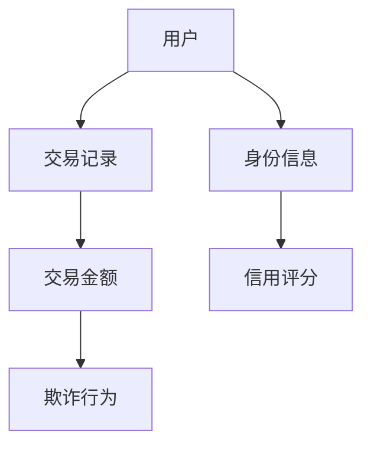
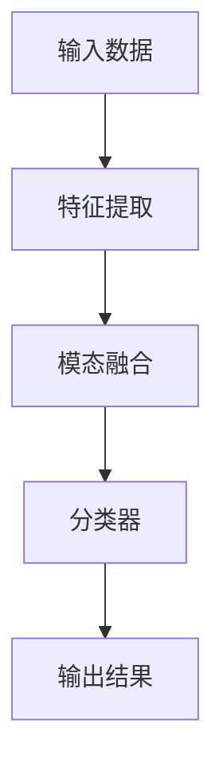

                 


# 《金融领域多模态学习在反欺诈中的应用》

## 关键词：多模态学习，金融反欺诈，机器学习，数据融合，深度学习

## 摘要：  
在金融领域，欺诈行为日益复杂化和智能化，传统的单模态反欺诈方法逐渐显现出局限性。多模态学习通过整合文本、图像、语音等多种数据源，能够更全面地捕捉欺诈特征，提高欺诈检测的准确性和鲁棒性。本文系统地介绍多模态学习在金融反欺诈中的应用，从核心概念、算法原理、系统架构到项目实战，深入剖析其技术细节和实际应用价值，为读者提供全面的技术指南。

---

## 第1章: 问题背景与核心概念

### 1.1 金融欺诈的现状与挑战

#### 1.1.1 金融欺诈的定义与类型
金融欺诈是指通过欺骗手段非法获取或占用他人或金融机构的财产或利益的行为。常见的金融欺诈类型包括信用欺诈、交易欺诈、身份盗用、洗钱等。

#### 1.1.2 传统反欺诈方法的局限性
传统的反欺诈方法主要依赖单一数据源（如交易记录或身份信息）进行分析，容易受到数据稀疏性、特征不足或特征干扰的影响。此外，单一模态的数据难以捕捉复杂的欺诈模式，导致漏检和误检问题。

#### 1.1.3 多模态学习的引入与优势
多模态学习通过整合文本、图像、语音等多种数据源，能够从多个维度捕捉欺诈特征，提高检测的准确性和鲁棒性。例如，结合交易记录中的文本信息和用户行为的图像数据，可以更全面地识别异常交易。

### 1.2 多模态学习的定义与特点

#### 1.2.1 多模态学习的核心概念
多模态学习是指从多种数据类型（模态）中提取信息，并通过融合这些信息来提高学习效果的一种方法。在金融反欺诈中，多模态学习能够充分利用不同类型数据的独特特征，实现更精准的欺诈检测。

#### 1.2.2 多模态数据的特征与优势
多模态数据具有互补性、冗余性和多样性等特点。通过结合不同模态的数据，可以有效弥补单一模态数据的不足，提高模型的泛化能力和抗干扰能力。

#### 1.2.3 多模态学习与传统单模态学习的对比
与单模态学习相比，多模态学习能够更好地捕捉复杂场景下的欺诈特征，适用于金融领域中高度复杂和多样化的欺诈行为。

### 1.3 多模态学习在反欺诈中的应用前景

#### 1.3.1 金融领域反欺诈的痛点
金融领域的欺诈行为越来越隐蔽和多样化，传统的单模态反欺诈方法难以应对复杂场景下的欺诈行为。

#### 1.3.2 多模态学习在反欺诈中的潜在价值
多模态学习通过整合多种数据源，能够更全面地捕捉欺诈特征，提高检测的准确性和鲁棒性。

#### 1.3.3 应用中的挑战与解决方案
多模态学习在金融反欺诈中的应用面临数据隐私保护、数据异构性、模型训练复杂性等挑战。通过引入隐私保护技术、数据预处理方法和高效算法，可以有效解决这些问题。

---

## 第2章: 多模态学习的核心概念与联系

### 2.1 多模态学习的原理

#### 2.1.1 多模态数据的融合方式
多模态数据的融合方式包括特征级融合、决策级融合和混合融合。特征级融合将不同模态的特征进行组合，决策级融合将不同模态的决策结果进行融合，混合融合则结合了特征级和决策级的优点。

#### 2.1.2 多模态学习的数学模型
多模态学习的数学模型通常包括模态编码器、模态融合模块和分类器。通过这些模块的协同工作，实现对多模态数据的有效学习和分类。

#### 2.1.3 多模态学习的算法框架
多模态学习的算法框架通常包括数据预处理、特征提取、模态融合、模型训练和结果输出等步骤。

### 2.2 多模态数据的特征对比

#### 2.2.1 文本数据的特征分析
文本数据通常包括交易记录、用户评论等，具有高维性和稀疏性等特点。

#### 2.2.2 图像数据的特征分析
图像数据包括用户照片、交易凭证等，具有高维性和空间性等特点。

#### 2.2.3 语音数据的特征分析
语音数据包括用户通话录音等，具有时序性和频域特性等特点。

### 2.3 ER实体关系图架构



---

## 第3章: 多模态学习算法原理

### 3.1 多模态融合网络

#### 3.1.1 多模态融合网络的结构
多模态融合网络通常包括模态编码器、融合模块和分类器。模态编码器负责将不同模态的数据转化为统一的特征表示，融合模块负责将这些特征进行融合，分类器负责对融合后的特征进行分类。

#### 3.1.2 多模态融合网络的训练过程
多模态融合网络的训练过程包括数据预处理、特征提取、模态融合、模型训练和结果输出等步骤。

#### 3.1.3 多模态融合网络的优缺点
多模态融合网络的优点包括能够充分利用不同模态的数据特征，提高检测的准确性和鲁棒性。缺点包括模型训练复杂性较高，需要处理异构数据的问题。

### 3.2 多模态学习的数学模型



### 3.3 算法实现代码

```python
import numpy as np
from sklearn.metrics import accuracy_score

# 示例代码：多模态数据融合
def multi_moda
``` 

---

## 总结与展望

多模态学习在金融反欺诈中的应用前景广阔，通过整合多种数据源，能够更全面地捕捉欺诈特征，提高检测的准确性和鲁棒性。未来，随着技术的发展，多模态学习在金融反欺诈中的应用将更加广泛和深入。

---

## 作者

作者：AI天才研究院/AI Genius Institute & 禅与计算机程序设计艺术 /Zen And The Art of Computer Programming

