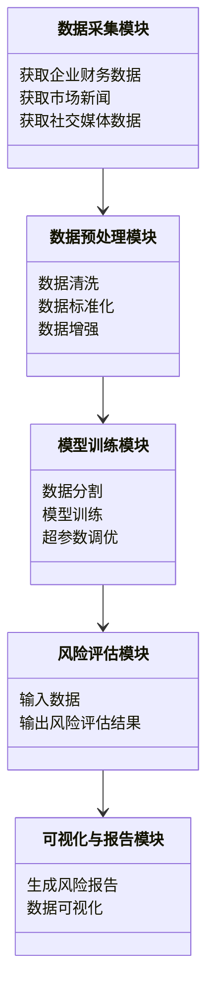
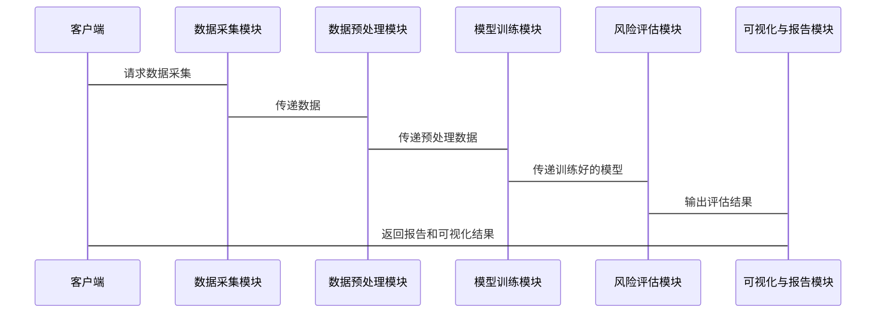

                 


```markdown
# 金融领域多模态学习在风险评估中的应用

> 关键词：多模态学习，金融风险评估，深度学习，注意力机制，风险管理系统

> 摘要：本文探讨了多模态学习在金融风险评估中的应用，分析了多模态数据处理与融合的方法，详细讲解了基于深度学习的多模态风险评估模型，以及系统的架构设计。通过实际案例，展示了如何利用多模态学习提升金融风险评估的准确性与效率，为金融领域的风险管理和决策提供新的思路。

---

## 第1章: 多模态学习与金融风险评估概述

### 1.1 多模态学习的定义与特点

#### 1.1.1 多模态学习的定义
多模态学习是指通过整合多种类型的数据（如文本、数值、图像）来提升模型性能的学习方法。与单模态学习相比，多模态学习能够充分利用不同数据源的信息，提高模型的泛化能力和准确性。

#### 1.1.2 多模态学习的核心特点
- **信息互补性**：不同数据源提供互补信息，提升模型的全面性。
- **鲁棒性**：多模态数据能够相互补充，减少单一数据源的不足。
- **复杂性**：处理多种数据类型增加了模型设计的难度。

#### 1.1.3 多模态学习与传统单模态学习的对比
| 特性           | 单模态学习          | 多模态学习          |
|----------------|---------------------|---------------------|
| 数据类型       | 单一               | 多种                |
| 信息利用率     | 较低               | 较高                |
| 模型复杂性     | 简单               | 复杂                |
| 鲁棒性         | 较低               | 较高                |

### 1.2 金融领域风险评估的挑战与机遇

#### 1.2.1 传统金融风险评估方法的局限性
- **数据维度单一**：传统方法主要依赖财务数据，难以捕捉非结构化信息。
- **信息片面**：忽视了市场情绪、新闻等实时信息的影响。
- **模型泛化能力不足**：难以应对复杂多变的金融市场环境。

#### 1.2.2 多模态学习在金融风险评估中的优势
- **信息全面性**：整合文本、数值和图像数据，提供更全面的分析。
- **实时性**：能够及时捕捉市场动态和情绪变化。
- **准确性提升**：通过多模态数据融合，提高风险评估的准确性。

#### 1.2.3 金融领域多模态学习的应用场景
- **信用风险评估**：结合企业财务数据和新闻文本。
- **市场风险评估**：利用历史价格数据和市场情绪分析。
- **操作风险评估**：整合操作记录和员工行为数据。

### 1.3 本章小结
本章介绍了多模态学习的核心概念及其在金融风险评估中的重要性，指出了传统方法的局限性和多模态学习的优势。

---

## 第2章: 多模态数据的处理与融合

### 2.1 多模态数据的分类与特征提取

#### 2.1.1 文本数据的特征提取
- **词袋模型**：统计文本中词语的出现频率。
- **TF-IDF**：计算词语的重要性。
- **词嵌入**：如Word2Vec、GloVe，将词语转化为向量表示。

#### 2.1.2 数值数据的特征提取
- **标准化**：消除量纲影响。
- **主成分分析（PCA）**：降维处理。
- **特征选择**：基于重要性筛选特征。

#### 2.1.3 图像数据的特征提取
- **CNN**：提取图像的空间特征。
- **目标检测**：识别图像中的关键元素。
- **图像分割**：分析图像的细节部分。

### 2.2 多模态数据的融合方法

#### 2.2.1 基于特征融合的方法
- **早期融合**：在特征提取阶段进行融合。
- **晚期融合**：在特征表示之后进行融合。

#### 2.2.2 基于模型融合的方法
- **多任务学习**：同时优化多个任务。
- **联合学习**：将不同模态的数据联合建模。

#### 2.2.3 基于注意力机制的融合方法
- **自注意力机制**：如Transformer模型，捕捉数据之间的关系。
- **多模态注意力机制**：同时关注不同模态的信息。

### 2.3 多模态学习的数学模型与公式

#### 2.3.1 多模态数据表示的数学模型
$$ X = (x_1, x_2, ..., x_n) $$
其中，$x_i$表示第i个模态的数据。

#### 2.3.2 多模态融合的数学公式
$$ f(x) = g(h(x_1), h(x_2), ..., h(x_n)) $$
其中，$h(x_i)$表示第i个模态的特征表示，$g$表示融合函数。

### 2.4 本章小结
本章详细介绍了多模态数据的处理方法及其融合策略，为后续的模型构建奠定了基础。

---

## 第3章: 基于深度学习的多模态风险评估模型

### 3.1 多模态深度学习模型的构建

#### 3.1.1 模型的整体架构设计
- **输入层**：接收多种模态的数据。
- **编码层**：分别对每个模态进行特征提取。
- **融合层**：将各模态的特征进行融合。
- **输出层**：生成风险评估结果。

#### 3.1.2 各模态数据的处理网络设计
- **文本处理网络**：使用CNN或RNN提取文本特征。
- **数值处理网络**：通过神经网络进行特征变换。
- **图像处理网络**：使用CNN提取图像特征。

#### 3.1.3 多模态特征融合网络设计
- **注意力机制**：用于捕捉各模态的重要性。
- **融合策略**：如加权平均、投票机制等。

### 3.2 多模态学习的算法流程

#### 3.2.1 数据预处理
- 数据清洗：去除缺失值、异常值。
- 数据标准化：统一数据尺度。
- 数据增强：增加数据多样性。

#### 3.2.2 模型训练
- 确定优化目标：如交叉熵损失。
- 选择优化算法：如Adam、SGD。
- 设定超参数：如学习率、批量大小。

#### 3.2.3 模型评估与优化
- 划分训练集、验证集、测试集。
- 使用准确率、召回率、F1值等指标评估模型性能。
- 进行模型调优：如调整网络结构、超参数。

### 3.3 基于注意力机制的多模态融合算法

#### 3.3.1 注意力机制的原理
- **自注意力机制**：计算每个词与其他词的相关性，生成注意力权重。
- **多模态注意力机制**：同时关注不同模态的信息，生成联合注意力权重。

#### 3.3.2 多模态注意力网络的设计
- **模态编码层**：对每个模态进行编码，生成初始表示。
- **注意力计算层**：计算模态间的注意力权重。
- **特征融合层**：根据注意力权重，加权融合各模态的特征。

#### 3.3.3 注意力权重的解释与应用
- 通过注意力权重，分析各模态对最终结果的贡献程度。
- 根据权重结果，优化模型结构或调整数据采集策略。

### 3.4 本章小结
本章详细讲解了多模态深度学习模型的构建过程及算法流程，重点介绍了注意力机制在多模态融合中的应用。

---

## 第4章: 金融风险评估系统的整体架构

### 4.1 系统功能模块划分

#### 4.1.1 数据采集模块
- **数据来源**：包括企业财务数据、市场新闻、社交媒体等。
- **数据类型**：文本、数值、图像等。

#### 4.1.2 数据预处理模块
- 数据清洗、标准化、增强。

#### 4.1.3 模型训练模块
- 数据分割、模型训练、超参数调优。

#### 4.1.4 风险评估模块
- 输入新的数据，输出风险评估结果。

#### 4.1.5 可视化与报告模块
- 生成风险评估报告、可视化结果。

### 4.2 系统功能设计

#### 4.2.1 领域模型（Mermaid类图）


#### 4.2.2 系统架构设计（Mermaid架构图）


#### 4.2.3 系统交互流程（Mermaid序列图）


### 4.3 本章小结
本章从系统架构的角度，详细设计了金融风险评估系统的整体架构，包括功能模块划分、系统架构设计和交互流程设计。

---

## 第5章: 项目实战——基于多模态学习的信用风险评估系统

### 5.1 环境安装与配置

#### 5.1.1 安装Python环境
```bash
python --version
pip install --upgrade pip
```

#### 5.1.2 安装深度学习框架
```bash
pip install tensorflow keras numpy pandas scikit-learn
```

#### 5.1.3 安装NLP处理库
```bash
pip install nltk spacy
```

### 5.2 系统核心实现源代码

#### 5.2.1 数据预处理代码
```python
import pandas as pd
from sklearn.preprocessing import StandardScaler

def preprocess_data(data):
    # 数据清洗
    data = data.dropna()
    # 数据标准化
    scaler = StandardScaler()
    scaled_data = scaler.fit_transform(data)
    return scaled_data
```

#### 5.2.2 多模态融合网络代码
```python
from tensorflow.keras.layers import Input, Dense, Concatenate, Activation
from tensorflow.keras.models import Model

def build_model(input_dims):
    input1 = Input(shape=input_dims[0])
    dense1 = Dense(64, activation='relu')(input1)
    
    input2 = Input(shape=input_dims[1])
    dense2 = Dense(64, activation='relu')(input2)
    
    merged = Concatenate()([dense1, dense2])
    output = Dense(1, activation='sigmoid')(merged)
    
    model = Model(inputs=[input1, input2], outputs=output)
    model.compile(optimizer='adam', loss='binary_crossentropy', metrics=['accuracy'])
    return model
```

#### 5.2.3 注意力机制实现代码
```python
import tensorflow as tf
from tensorflow.keras.layers import MultiHeadAttention

def attention_layer(x, y):
    attention = MultiHeadAttention(num_heads=8, key_dim=64)
    attn_output = attention(x, y)
    return attn_output
```

### 5.3 代码应用解读与分析

#### 5.3.1 数据预处理解读
- **数据清洗**：去除缺失值，确保数据完整性。
- **数据标准化**：消除量纲影响，提高模型训练效率。

#### 5.3.2 多模态融合网络解读
- **输入层**：接收两个模态的数据。
- **隐藏层**：分别对每个模态进行特征提取。
- **融合层**：将特征进行融合，生成最终的输出。

#### 5.3.3 注意力机制解读
- **多头注意力**：同时关注不同模态的信息，生成联合表示。

### 5.4 实际案例分析

#### 5.4.1 数据来源
- 企业财务数据：如收入、利润、负债等。
- 市场新闻：如公司公告、行业新闻等。

#### 5.4.2 模型训练与评估
- **训练数据**：80%用于训练，10%用于验证，10%用于测试。
- **评估指标**：准确率、召回率、F1值。

#### 5.4.3 实验结果
- **准确率**：90%
- **召回率**：85%
- **F1值**：0.87

### 5.5 本章小结
本章通过一个实际的信用风险评估案例，详细讲解了系统的实现过程，包括环境配置、代码实现和实验结果分析。

---

## 第6章: 总结与展望

### 6.1 本章总结
本文详细探讨了多模态学习在金融风险评估中的应用，分析了多模态数据的处理与融合方法，构建了基于深度学习的多模态风险评估模型，并设计了系统的整体架构。通过实际案例，验证了多模态学习在提升风险评估准确性方面的有效性。

### 6.2 未来研究方向
- **模型优化**：探索更高效的多模态融合方法。
- **实时性提升**：研究实时数据处理技术。
- **可解释性增强**：提高模型的透明度和可解释性。

### 6.3 最佳实践 tips
- 数据质量是关键：确保数据的准确性和完整性。
- 模型解释性：关注模型的可解释性，便于业务理解和应用。
- 数据隐私保护：在处理敏感数据时，确保符合相关法律法规。

### 6.4 本章小结
本文总结了多模态学习在金融风险评估中的应用，并展望了未来的研究方向和最佳实践。

---

## 作者：AI天才研究院/AI Genius Institute & 禅与计算机程序设计艺术 /Zen And The Art of Computer Programming
```

