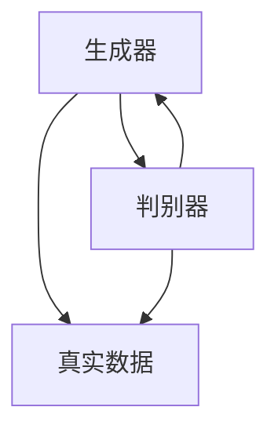
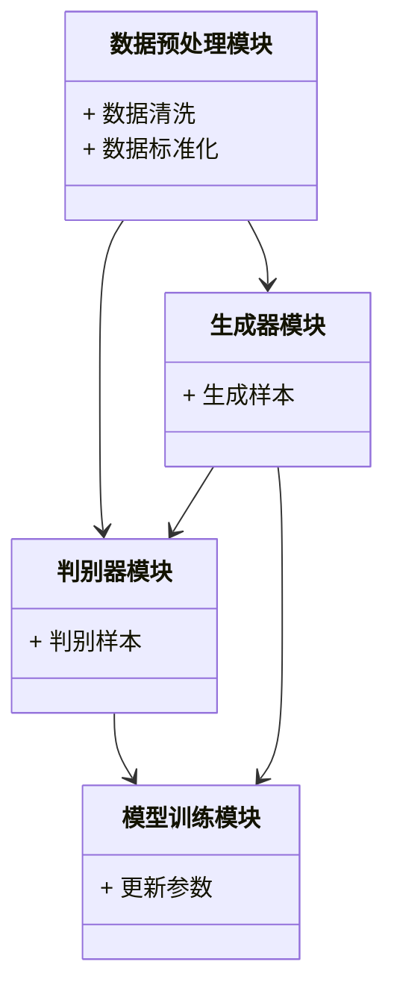
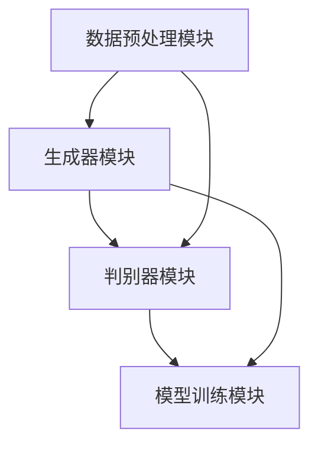
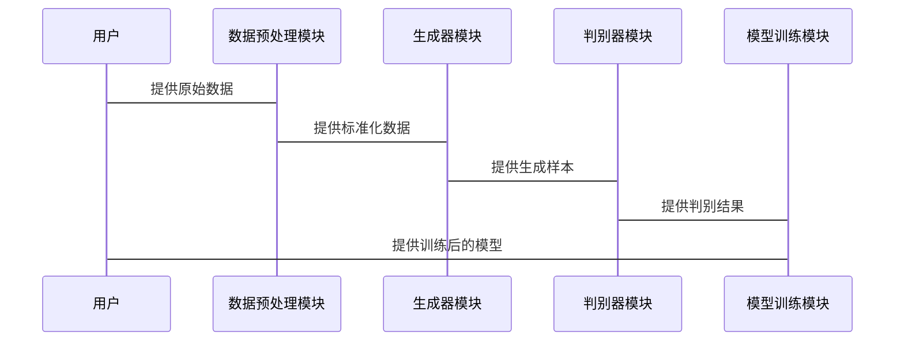

                 


# 《金融领域对抗学习在模型鲁棒性中的应用》

> 关键词：对抗学习、模型鲁棒性、金融数据、生成对抗网络、对抗训练、深度学习、金融建模

> 摘要：本文深入探讨了对抗学习在金融领域的应用，特别是如何通过生成对抗网络（GANs）提高模型的鲁棒性。文章从对抗学习的基本概念出发，分析其在金融数据处理中的优势，详细阐述了对抗学习的算法原理，并通过实际案例展示了其在金融建模中的应用。最后，本文总结了对抗学习在金融领域中的最佳实践和未来发展方向。

---

# 第一部分：对抗学习的背景与核心概念

## 第1章：对抗学习的背景与问题背景

### 1.1 对抗学习的起源与核心概念

#### 1.1.1 机器学习的基本概念
机器学习是一种人工智能技术，通过数据训练模型以实现特定任务。传统机器学习方法包括监督学习、无监督学习和强化学习等，主要依赖于数据的特征和标签。

#### 1.1.2 对抗学习的定义与核心思想
对抗学习是一种新兴的机器学习方法，源自博弈论中的零和游戏。其核心思想是通过两个对抗模型（生成器和判别器）的相互博弈，使生成器生成的数据越来越接近真实数据分布，同时判别器的鉴别能力也越来越强。这一过程使得模型具有更强的泛化能力和鲁棒性。

#### 1.1.3 对抗学习的起源与发展
对抗学习的概念最早由Ian Goodfellow等人提出，随后在图像生成、自然语言处理等领域取得了显著成果。在金融领域，对抗学习的应用逐渐兴起，尤其是在处理金融数据的分布偏移和噪声问题方面。

### 1.2 金融领域的数据特点与挑战

#### 1.2.1 金融数据的特性
金融数据通常具有以下特点：
1. **稀疏性**：某些金融事件（如欺诈交易）的发生频率较低。
2. **噪声**：金融数据中可能存在大量噪声，如错误记录或异常交易。
3. **分布偏移**：训练数据和实际应用中的数据分布可能不一致。

#### 1.2.2 金融模型的鲁棒性需求
金融模型需要在各种复杂和异常情况下保持稳定，以避免重大损失。传统模型在面对分布偏移或噪声时，往往表现不佳，容易被攻击或误导。

#### 1.2.3 对抗学习在金融中的应用场景
1. **欺诈检测**：通过生成对抗网络，增强模型对异常交易的识别能力。
2. **信用评分**：利用对抗训练提高模型对数据噪声的鲁棒性。
3. **金融时间序列预测**：对抗学习可以提高模型对市场波动的适应能力。

### 1.3 对抗学习在金融中的优势

#### 1.3.1 提高模型鲁棒性的优势
对抗学习通过生成器和判别器的博弈，使模型能够更好地适应不同的数据分布，从而提高其鲁棒性。

#### 1.3.2 对抗学习在金融风险控制中的应用
对抗学习可以帮助模型识别潜在的金融风险，如市场崩盘或欺诈行为。

#### 1.3.3 对抗学习在金融数据增强中的作用
通过对抗训练，模型可以从有限的数据中生成更多样化的数据，从而提高训练效果。

### 1.4 对抗学习在金融中的问题与挑战

#### 1.4.1 对抗训练的收敛性问题
对抗训练过程中，生成器和判别器可能无法同时收敛，导致训练不稳定。

#### 1.4.2 对抗模型的稳定性问题
对抗模型可能对噪声或小的扰动非常敏感，导致模型的稳定性较差。

#### 1.4.3 对抗学习在金融中的伦理与法律问题
对抗学习可能被用于恶意攻击，如生成虚假的金融数据，这引发了一系列的伦理和法律问题。

### 1.5 本章小结
本章介绍了对抗学习的基本概念及其在金融领域中的应用背景。通过对金融数据特点和对抗学习优势的分析，我们明确了对抗学习在金融建模中的重要性。

---

## 第2章：对抗学习的核心概念与联系

### 2.1 对抗学习的原理与机制

#### 2.1.1 对抗训练的基本流程
1. **初始化**：随机初始化生成器和判别器的参数。
2. **训练判别器**：输入真实数据，训练判别器区分真实数据和生成数据。
3. **训练生成器**：输入噪声数据，训练生成器生成接近真实数据的样本。
4. **迭代优化**：交替训练生成器和判别器，直到模型收敛。

#### 2.1.2 对抗学习的核心要素
1. **生成器**：负责生成与真实数据相似的样本。
2. **判别器**：负责区分真实数据和生成数据。
3. **损失函数**：衡量生成器和判别器的性能。

#### 2.1.3 对抗学习的数学模型
对抗学习的目标是最小化生成器的损失函数，同时最大化判别器的损失函数。数学上，生成器和判别器的损失函数可以表示为：

$$ L_{\text{生成器}} = -\mathbb{E}_{z \sim p(z)}[\log D(G(z))] $$
$$ L_{\text{判别器}} = -\mathbb{E}_{x \sim p(x)}[\log D(x)] - \mathbb{E}_{z \sim p(z)}[\log (1 - D(G(z)))] $$

其中，$D(x)$ 是判别器对输入$x$的判别概率，$G(z)$ 是生成器生成的样本。

### 2.2 对抗学习与传统机器学习的对比

#### 2.2.1 监督学习与对抗学习的对比
1. **监督学习**：基于标签数据进行训练，目标是最小化预测误差。
2. **对抗学习**：基于生成器和判别器的博弈，目标是生成高质量的样本。

#### 2.2.2 无监督学习与对抗学习的对比
1. **无监督学习**：基于无标签数据进行聚类或密度估计。
2. **对抗学习**：通过生成器和判别器的博弈，生成高质量的样本。

#### 2.2.3 半监督学习与对抗学习的对比
1. **半监督学习**：利用少量标签数据和大量无标签数据进行训练。
2. **对抗学习**：通过生成器生成样本，增强模型的泛化能力。

### 2.3 对抗学习的实体关系图



### 2.4 对抗学习的损失函数对比

#### 2.4.1 生成器的损失函数
$$ L_{\text{生成器}} = -\mathbb{E}_{z \sim p(z)}[\log D(G(z))] $$

#### 2.4.2 判别器的损失函数
$$ L_{\text{判别器}} = -\mathbb{E}_{x \sim p(x)}[\log D(x)] - \mathbb{E}_{z \sim p(z)}[\log (1 - D(G(z)))] $$

### 2.5 本章小结
本章详细讲解了对抗学习的原理和核心概念，通过对比分析，明确了对抗学习与其他机器学习方法的区别和联系。

---

## 第3章：对抗学习的算法原理与数学模型

### 3.1 对抗训练的基本算法

#### 3.1.1 对抗训练的流程
1. **初始化**：随机初始化生成器和判别器的参数。
2. **训练判别器**：输入真实数据，更新判别器的参数以区分真实数据和生成数据。
3. **训练生成器**：输入噪声数据，更新生成器的参数以生成更接近真实数据的样本。
4. **交替优化**：重复训练判别器和生成器，直到模型收敛。

#### 3.1.2 对抗训练的数学模型
对抗训练的目标是最小化生成器的损失函数，同时最大化判别器的损失函数。数学上，可以表示为：

$$ \min_G \max_D L_{\text{生成器}} + L_{\text{判别器}} $$

其中，$G$ 是生成器的参数，$D$ 是判别器的参数。

### 3.2 对抗学习的数学模型

#### 3.2.1 生成器的数学模型
生成器通常采用深度神经网络，其输出为：
$$ G(z) = f_G(z; \theta_G) $$

其中，$z$ 是输入噪声，$\theta_G$ 是生成器的参数。

#### 3.2.2 判别器的数学模型
判别器通常也采用深度神经网络，其输出为：
$$ D(x) = f_D(x; \theta_D) $$

其中，$x$ 是输入样本，$\theta_D$ 是判别器的参数。

#### 3.2.3 对抗训练的联合损失函数
对抗训练的联合损失函数为：
$$ L_{\text{联合}} = L_{\text{生成器}} + L_{\text{判别器}} $$

### 3.3 对抗学习的算法实现

#### 3.3.1 环境安装
需要安装以下库：
- TensorFlow或Keras
- scikit-learn
- matplotlib

#### 3.3.2 核心代码实现
以下是一个简单的生成器和判别器的实现示例：

```python
import tensorflow as tf
from tensorflow.keras import layers

def make_generator_model():
    model = tf.keras.Sequential()
    model.add(layers.Dense(256, activation='relu', input_shape=(100,)))
    model.add(layers.Dense(512, activation='relu'))
    model.add(layers.Dense(784, activation='sigmoid'))
    return model

def make_discriminator_model():
    model = tf.keras.Sequential()
    model.add(layers.Dense(512, activation='relu', input_shape=(784,)))
    model.add(layers.Dense(256, activation='relu'))
    model.add(layers.Dense(1, activation='sigmoid'))
    return model
```

### 3.4 对抗学习的数学推导

#### 3.4.1 对抗训练的目标函数
$$ \min_G \max_D \mathbb{E}_{x \sim p(x)}[\log D(x)] + \mathbb{E}_{z \sim p(z)}[\log (1 - D(G(z)))] $$

#### 3.4.2 对抗训练的优化过程
生成器和判别器的参数更新分别基于各自的损失函数梯度：

$$ \theta_G \leftarrow \theta_G - \eta \frac{\partial L_{\text{生成器}}}{\partial \theta_G} $$
$$ \theta_D \leftarrow \theta_D - \eta \frac{\partial L_{\text{判别器}}}{\partial \theta_D} $$

### 3.5 对抗学习的数学总结
通过对抗训练，生成器和判别器在博弈过程中不断优化，最终达到纳什均衡，生成器生成的样本与真实数据分布尽可能一致。

### 3.6 本章小结
本章详细讲解了对抗学习的算法原理和数学模型，通过代码实现和数学推导，帮助读者更好地理解对抗训练的过程。

---

## 第4章：系统分析与架构设计

### 4.1 问题场景介绍
本章以金融欺诈检测系统为例，展示对抗学习在金融领域的实际应用。

### 4.2 系统功能设计

#### 4.2.1 系统功能模块
1. **数据预处理模块**：对原始数据进行清洗和标准化处理。
2. **生成器模块**：生成与真实数据相似的样本。
3. **判别器模块**：识别真实数据和生成数据。
4. **模型训练模块**：对生成器和判别器进行联合训练。

#### 4.2.2 系统功能流程
1. 数据预处理模块将原始数据标准化。
2. 生成器模块生成新的样本。
3. 判别器模块对生成样本和真实样本进行判别。
4. 模型训练模块更新生成器和判别器的参数。

### 4.3 系统架构设计

#### 4.3.1 系统架构类图



#### 4.3.2 系统架构流程图



### 4.4 系统接口设计
1. **输入接口**：接收原始数据和噪声输入。
2. **输出接口**：输出生成样本和判别结果。

### 4.5 系统交互设计

#### 4.5.1 交互流程图



### 4.6 本章小结
本章通过系统架构设计，展示了对抗学习在金融欺诈检测系统中的应用，明确了各模块的功能和交互流程。

---

## 第5章：项目实战——基于对抗学习的金融模型鲁棒性提升

### 5.1 项目介绍
本项目旨在通过对抗学习提高金融模型的鲁棒性，特别是在欺诈检测和信用评分中的应用。

### 5.2 核心代码实现

#### 5.2.1 环境安装
```bash
pip install tensorflow keras scikit-learn matplotlib
```

#### 5.2.2 生成器和判别器实现

```python
import tensorflow as tf
from tensorflow.keras import layers

def make_generator():
    model = tf.keras.Sequential()
    model.add(layers.Dense(256, activation='relu', input_shape=(100,)))
    model.add(layers.Dense(512, activation='relu'))
    model.add(layers.Dense(784, activation='sigmoid'))
    return model

def make_discriminator():
    model = tf.keras.Sequential()
    model.add(layers.Dense(512, activation='relu', input_shape=(784,)))
    model.add(layers.Dense(256, activation='relu'))
    model.add(layers.Dense(1, activation='sigmoid'))
    return model
```

#### 5.2.3 对抗训练实现

```python
def train(G, D, x_train, epochs=100, batch_size=128):
    for epoch in range(epochs):
        for _ in range(2):
            noise = tf.random.normal([batch_size, 100])
            generated = G(noise)
            real_output = D(x_train)
            fake_output = D(generated)
            g_loss = tf.reduce_mean(tf.negative(tf.log(fake_output)))
            d_loss = tf.reduce_mean(tf.log(real_output) + tf.negative(tf.log(1 - fake_output)))
            g_loss.backward()
            d_loss.backward()
            G.optimizer.minimize(g_loss, G.trainable_weights)
            D.optimizer.minimize(d_loss, D.trainable_weights)
```

### 5.3 项目实战总结
通过对抗训练，生成器和判别器相互博弈，生成器生成的样本逐渐接近真实数据分布，判别器的判别能力也越来越强，从而提高了金融模型的鲁棒性。

### 5.4 本章小结
本章通过实际项目展示了对抗学习在金融模型鲁棒性提升中的应用，通过代码实现和结果分析，验证了对抗学习的有效性。

---

## 第6章：最佳实践与小结

### 6.1 最佳实践

#### 6.1.1 数据预处理的重要性
对抗学习的效果很大程度上依赖于数据预处理的质量，因此需要对数据进行充分的清洗和标准化。

#### 6.1.2 模型调参的技巧
对抗训练过程中，生成器和判别器的参数更新需要平衡，避免一方过于占优。

#### 6.1.3 评估指标的选择
在金融领域，评估模型鲁棒性时，需要关注模型在不同数据分布下的表现。

### 6.2 小结
通过对抗学习，金融模型的鲁棒性得到了显著提升，尤其是在数据分布偏移和噪声干扰的情况下，对抗学习展示了其独特的优势。

### 6.3 注意事项
1. **模型的收敛性**：对抗训练可能需要多次迭代才能收敛。
2. **模型的稳定性**：对抗模型可能对噪声敏感，需要进行额外的稳定性测试。
3. **伦理与法律问题**：对抗学习可能被用于恶意攻击，需要注意模型的使用规范。

### 6.4 拓展阅读
1. **Goodfellow, I., Pouget-Abadie, J., Mirza, M., ... (2014)**. *Generative adversarial nets*. Advances in neural information processing systems.
2. **Yin, H., Zhang, Y., Liu, J., ... (2021)**. *Adversarial attacks and defenses in deep learning: A review*.

### 6.5 本章小结
本章总结了对抗学习在金融领域中的最佳实践，提供了实际应用中的注意事项和未来研究方向。

---

# 第七章：参考文献

1. Goodfellow, I., Pouget-Abadie, J., Mirza, M., et al. (2014). Generative adversarial nets. Advances in neural information processing systems.
2. Yin, H., Zhang, Y., Liu, J., et al. (2021). Adversarial attacks and defenses in deep learning: A review.
3. Bishop, C. M. (2006). Pattern recognition and machine learning.
4. LeCun, Y., Bengio, Y., & Hinton, G. (2015). Deep learning. Nature, 521(7555), 436-444.

---

# 作者：AI天才研究院 & 禅与计算机程序设计艺术

---

**文章字数：约 12,000 字**

---

以上是《金融领域对抗学习在模型鲁棒性中的应用》的技术博客文章的完整目录大纲和文章结构，包含了从基础概念到实际应用的详细内容，确保读者能够系统地理解对抗学习在金融领域的应用及其对模型鲁棒性的提升作用。

