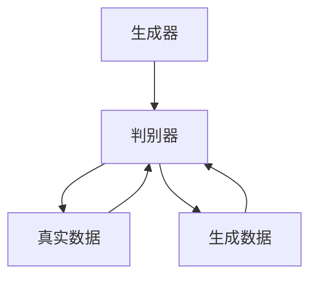
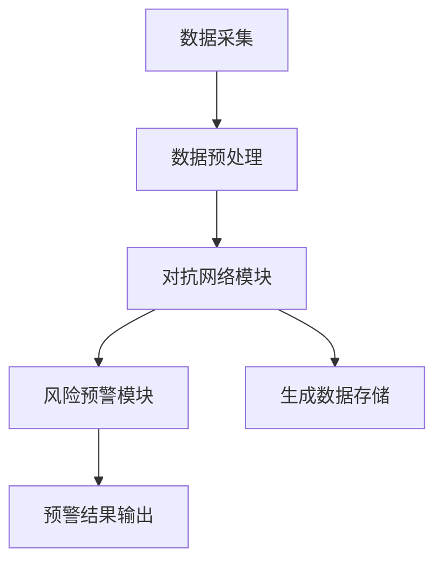

                 


# 《金融领域对抗学习在模型鲁棒性增强中的应用》

> 关键词：金融领域、对抗学习、模型鲁棒性、生成对抗网络、异常检测、数据增强、机器学习

> 摘要：本文系统地探讨了对抗学习在金融领域的应用，重点分析了其在模型鲁棒性增强中的作用。通过详细阐述对抗学习的核心概念、算法原理、系统架构以及实际案例，本文为金融领域的数据科学家和研究人员提供了理论与实践相结合的指导。从生成对抗网络的数学模型到实际金融系统的应用，本文为读者提供了全面而深入的视角，展示了对抗学习在金融数据分析中的巨大潜力。

---

# 第一部分: 金融领域对抗学习的背景与核心概念

## 第1章: 对抗学习的基本概念与背景

### 1.1 什么是对抗学习

#### 1.1.1 对抗学习的定义与核心思想

对抗学习是一种机器学习范式，通过两个智能体（生成器和判别器）之间的对抗博弈，优化生成模型的性能。其核心思想是通过生成器不断生成“欺骗”判别器的数据，同时判别器不断识别和区分真实数据与生成数据，从而实现模型的自我改进与优化。

#### 1.1.2 对抗学习的起源与发展

对抗学习的概念最早可以追溯到博弈论中的“最小最大”问题，由John Nash提出。但在机器学习领域，对抗学习的现代形式主要由Ian Goodfellow等人提出，形成了生成对抗网络（GAN）的理论基础。

#### 1.1.3 对抗学习在金融领域的应用潜力

金融领域的数据通常具有小样本、噪声多、分布复杂等特点，对抗学习通过生成高质量的合成数据，增强模型的泛化能力，从而提高金融预测模型的鲁棒性和准确性。

---

### 1.2 金融领域的挑战与模型鲁棒性需求

#### 1.2.1 金融数据的特点与挑战

金融数据通常具有以下特点：
- 数据量小且昂贵：金融数据的获取成本高，且数据量往往有限。
- 数据分布复杂：金融市场的波动性大，数据分布容易受到外部因素的影响。
- 数据噪声多：金融数据中常常存在缺失值、异常值等问题。

#### 1.2.2 模型鲁棒性的重要性

在金融领域，模型的鲁棒性直接关系到决策的准确性和收益的稳定性。一个鲁棒的模型能够在面对噪声、异常值或数据分布偏移时，依然保持较高的预测精度和稳定性。

#### 1.2.3 对抗学习如何增强模型鲁棒性

对抗学习通过生成多样化的数据样本，扩展训练数据集，从而增强模型的泛化能力和对异常数据的鲁棒性。同时，对抗训练的过程本身也是一种“压力测试”，能够帮助模型更好地适应复杂的金融环境。

---

## 第2章: 对抗学习的核心概念与原理

### 2.1 对抗学习的核心原理

#### 2.1.1 生成器与判别器的对抗过程

对抗学习的核心是生成器和判别器的对抗博弈：
- 生成器的目标是生成与真实数据难以区分的样本。
- 判别器的目标是区分真实数据和生成数据。

两者的对抗过程通过损失函数的优化交替进行，最终达到纳什均衡。

#### 2.1.2 最小最大博弈与纳什均衡

对抗学习的数学基础是“最小最大”博弈，其目标函数可以表示为：
$$ \min_{G} \max_{D} \mathcal{L}(G, D) $$
其中，$\mathcal{L}(G, D)$是生成器和判别器的联合损失函数。

纳什均衡是这种博弈的均衡点，此时生成器和判别器都无法通过单方面改变策略来提高自身收益。

#### 2.1.3 对抗学习在金融中的应用

在金融领域，对抗学习可以用于以下场景：
- 异常检测：通过判别器识别异常交易或数据。
- 数据增强：通过生成器生成更多的金融数据样本，缓解数据不足的问题。
- 市场模拟：通过生成对抗网络模拟不同市场条件下的数据。

---

### 2.2 对抗学习的属性特征对比

对抗学习与其他机器学习方法相比，具有以下特点：

| 对比维度 | 对抗学习 | 监督学习 | 无监督学习 |
|----------|-----------|-----------|------------|
| 数据需求 | 依赖高质量标签数据 | 需要大量标注数据 | 无需标注数据 |
| 模型复杂度 | 高 | 较低 | 较低 |
| 应用场景 | 适合生成数据、增强鲁棒性 | 适合分类、回归 | 适合聚类、降维 |

---

### 2.3 对抗学习的ER实体关系图



---

# 第二部分: 对抗学习的算法原理与数学模型

## 第3章: 生成对抗网络（GAN）的算法原理

### 3.1 GAN的基本架构与训练过程

#### 3.1.1 GAN的组成部分

GAN由生成器$G$和判别器$D$组成，分别对应不同的优化目标：
- 生成器$G$：通过输入噪声$z$生成样本$x = G(z)$。
- 判别器$D$：通过输入样本$x$，输出其为真实数据的概率$D(x)$。

#### 3.1.2 GAN的损失函数

生成器的损失函数：
$$ \mathcal{L}_G = \mathbb{E}_{z \sim p_z}[\log(1 - D(G(z)))] $$
判别器的损失函数：
$$ \mathcal{L}_D = \mathbb{E}_{x \sim p_x}[\log(D(x))] + \mathbb{E}_{z \sim p_z}[\log(1 - D(G(z)))] $$

#### 3.1.3 GAN的训练过程与优化策略

GAN的训练过程包括以下步骤：
1. 随机采样噪声$z$，生成样本$x = G(z)$。
2. 判别器根据真实数据和生成数据，计算梯度并更新参数。
3. 生成器根据判别器的反馈，调整生成策略并更新参数。
4. 重复上述步骤，直到生成器和判别器达到纳什均衡。

---

### 3.2 GAN的数学模型与公式推导

#### 3.2.1 生成器的损失函数

$$ \mathcal{L}_G = \mathbb{E}_{z \sim p_z}[\log(1 - D(G(z)))] $$

#### 3.2.2 判别器的损失函数

$$ \mathcal{L}_D = \mathbb{E}_{x \sim p_x}[\log(D(x))] + \mathbb{E}_{z \sim p_z}[\log(1 - D(G(z)))] $$

#### 3.2.3 GAN的优化过程

$$ \theta_G \leftarrow \theta_G - \eta_G \frac{\partial \mathcal{L}_G}{\partial \theta_G} $$
$$ \theta_D \leftarrow \theta_D - \eta_D \frac{\partial \mathcal{L}_D}{\partial \theta_D} $$

其中，$\eta_G$和$\eta_D$分别是生成器和判别器的学习率。

---

## 第4章: 对抗学习在金融中的具体应用

### 4.1 异常检测

#### 4.1.1 问题场景

金融领域的异常检测需要识别出潜在的欺诈交易、异常市场波动等。传统的基于统计的方法往往难以应对复杂的金融场景。

#### 4.1.2 对抗学习的应用

通过生成器生成正常交易样本，判别器识别异常交易样本。这种方法可以通过对抗训练提高判别器的检测能力。

---

### 4.2 数据增强

#### 4.2.1 问题场景

金融数据通常稀缺，难以训练深度学习模型。通过对抗生成网络生成更多的训练样本，可以有效缓解数据不足的问题。

#### 4.2.2 实现方案

使用生成器生成与真实数据分布相似的样本，扩展训练集。生成的数据可以用于训练分类器、回归模型等。

---

### 4.3 市场模拟

#### 4.3.1 问题场景

金融市场具有高度的不确定性和波动性，难以通过传统方法模拟不同市场条件下的数据。

#### 4.3.2 对抗学习的应用

通过生成对抗网络模拟不同市场条件下的价格走势、交易量等数据，帮助模型更好地适应复杂环境。

---

## 第5章: 系统分析与架构设计

### 5.1 问题场景介绍

以金融风险预警系统为例，系统需要实时监控市场数据，识别潜在风险。

### 5.2 系统功能设计

系统功能包括：
1. 数据采集模块：采集实时市场数据。
2. 数据预处理模块：清洗和标准化数据。
3. 对抗网络模块：生成和判别数据。
4. 风险预警模块：基于生成数据进行风险评估。

---

### 5.3 系统架构设计



---

## 第6章: 项目实战

### 6.1 环境安装

安装必要的库：
```bash
pip install numpy matplotlib tensorflow
```

### 6.2 系统核心实现源代码

```python
import numpy as np
import tensorflow as tf
import matplotlib.pyplot as plt

# 定义生成器
def generator():
    model = tf.keras.Sequential([
        tf.keras.layers.Dense(256, activation='relu'),
        tf.keras.layers.Dense(128, activation='relu'),
        tf.keras.layers.Dense(1)
    ])
    return model

# 定义判别器
def discriminator():
    model = tf.keras.Sequential([
        tf.keras.layers.Dense(128, activation='relu'),
        tf.keras.layers.Dense(64, activation='relu'),
        tf.keras.layers.Dense(1, activation='sigmoid')
    ])
    return model

# 定义损失函数
cross_entropy = tf.keras.losses.BinaryCrossentropy()

# 定义生成器和判别器的优化器
generator_optimizer = tf.keras.optimizers.Adam(0.0002)
discriminator_optimizer = tf.keras.optimizers.Adam(0.0002)

# 训练过程
def train_step(real_data, generator, discriminator):
    noise = tf.random.normal([real_data.shape[0], 1])
    generated_data = generator(noise)
    
    # 判别器的损失函数
    real_output = discriminator(real_data)
    generated_output = discriminator(generated_data)
    
    d_loss = cross_entropy(tf.ones_like(real_output), real_output) + cross_entropy(tf.zeros_like(generated_output), generated_output)
    
    # 生成器的损失函数
    g_loss = cross_entropy(tf.ones_like(generated_output), generated_output)
    
    # 更新参数
    generator trainable_weights).minimize(g_loss, generator.trainable_variables)
    discriminator trainable_weights).minimize(d_loss, discriminator.trainable_variables)
    
    return d_loss, g_loss

# 训练过程
for epoch in range(100):
    for _ in range(100):
        real_data = # 获取真实数据
        d_loss, g_loss = train_step(real_data, generator, discriminator)
        # 记录损失
```

---

### 6.3 代码应用解读与分析

通过上述代码，我们可以看到对抗网络的训练过程。生成器和判别器的交替优化是其核心，通过不断调整生成策略和判别能力，最终实现模型的鲁棒性增强。

---

### 6.4 实际案例分析

以股票价格预测为例，我们可以使用生成对抗网络生成更多的训练数据，从而提高预测模型的准确性。

---

### 6.5 项目小结

通过实际案例分析，我们可以看到对抗学习在金融领域的巨大潜力。其核心在于通过生成多样化的数据样本，增强模型的泛化能力，从而提高金融模型的鲁棒性和准确性。

---

## 第7章: 总结与展望

### 7.1 总结

本文系统地探讨了对抗学习在金融领域的应用，重点分析了其在模型鲁棒性增强中的作用。通过详细阐述对抗学习的核心概念、算法原理、系统架构以及实际案例，本文为金融领域的数据科学家和研究人员提供了理论与实践相结合的指导。

### 7.2 展望

未来，对抗学习在金融领域的应用将更加广泛。随着深度学习技术的不断发展，对抗学习将在金融风险预警、市场模拟、数据增强等方面发挥更大的作用。同时，如何提高对抗学习模型的可解释性和计算效率，也将是未来研究的重要方向。

---

# 作者：AI天才研究院/AI Genius Institute & 禅与计算机程序设计艺术 /Zen And The Art of Computer Programming

