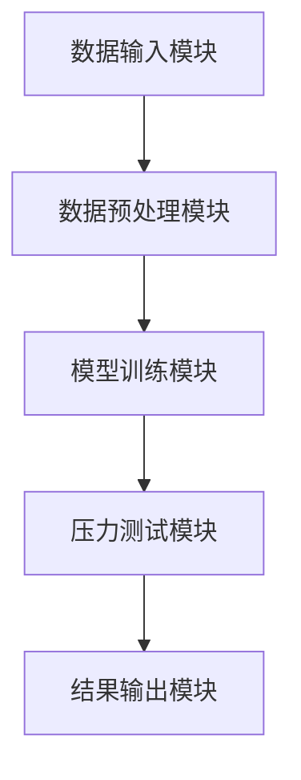
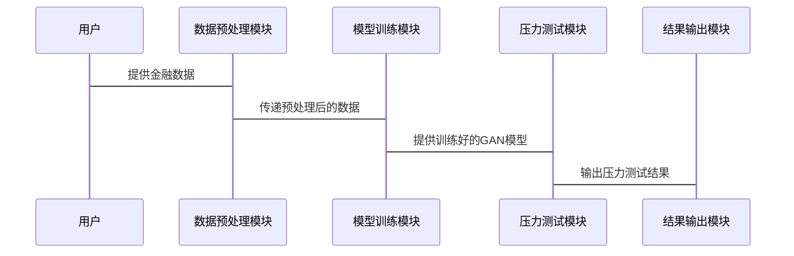

                 


# 《金融领域对抗学习在风险模型压力测试中的应用》

---

## 关键词

- 对抗学习
- 金融风险模型
- 压力测试
- GAN
- 生成器
- 判别器
- 金融数据分析

---

## 摘要

本文深入探讨了对抗学习在金融领域风险模型压力测试中的应用。通过分析对抗学习的核心原理，结合生成对抗网络（GAN）的优势，提出了一种基于对抗学习的压力测试方法。文章详细阐述了对抗学习的数学模型、算法实现、系统架构设计以及在金融领域的实际应用案例。通过对生成器和判别器的协同训练，本文展示了如何利用对抗学习生成极端市场条件下的金融数据，并评估风险模型的鲁棒性。此外，文章还探讨了对抗学习在压力测试中的优势、挑战及未来研究方向，为金融领域的风险管理提供了新的思路。

---

## 目录大纲

### 第1章：引言

#### 1.1 对抗学习的起源与发展
- 1.1.1 对抗学习的基本概念与核心思想
- 1.1.2 对抗学习的起源与学术发展
- 1.1.3 对抗学习在金融领域的潜在应用

#### 1.2 金融领域的应用背景
- 1.2.1 金融风险模型的基本概念与分类
- 1.2.2 压力测试的定义与重要性
- 1.2.3 对抗学习在金融压力测试中的优势

#### 1.3 压力测试的传统方法与局限性
- 1.3.1 压力测试的传统方法及其应用场景
- 1.3.2 传统压力测试方法的局限性
- 1.3.3 对抗学习如何弥补传统方法的不足

---

### 第2章：对抗学习的核心概念与原理

#### 2.1 对抗学习的基本原理
- 2.1.1 生成器与判别器的定义与角色
- 2.1.2 对抗学习的目标函数与优化过程
- 2.1.3 对抗学习的训练过程与收敛性分析

#### 2.2 对抗学习的数学模型
- 2.2.1 生成器的损失函数
- 2.2.2 判别器的损失函数
- 2.2.3 对抗学习的整体优化目标

#### 2.3 对抗学习的核心优势
- 2.3.1 自适应性与泛化能力
- 2.3.2 多模态数据的生成能力
- 2.3.3 对抗训练的稳定性与收敛性

---

### 第3章：对抗学习在金融数据中的应用

#### 3.1 金融数据的特点与挑战
- 3.1.1 金融数据的复杂性与波动性
- 3.1.2 数据分布的稀疏性与极端情况
- 3.1.3 金融数据的隐私性与安全性

#### 3.2 对抗学习在金融数据分析中的优势
- 3.2.1 数据生成的多样性与真实性
- 3.2.2 对极端情况的模拟能力
- 3.2.3 对模型鲁棒性的提升

#### 3.3 对抗学习在金融领域的具体应用场景
- 3.3.1 股票价格预测
- 3.3.2 信用风险评估
- 3.3.3 市场风险模拟

---

### 第4章：金融风险模型的压力测试方法

#### 4.1 压力测试的传统方法
- 4.1.1 情景分析法
- 4.1.2 方差-协方差法
- 4.1.3 历史模拟法

#### 4.2 基于对抗学习的压力测试方法
- 4.2.1 基于GAN的极端情景生成
- 4.2.2 对抗训练在压力测试中的应用
- 4.2.3 对抗学习生成的数据特点

#### 4.3 对抗学习压力测试的实现步骤
- 4.3.1 数据预处理与特征选择
- 4.3.2 模型训练与参数调优
- 4.3.3 压力测试结果的评估与分析

---

### 第5章：对抗学习算法的数学模型与公式

#### 5.1 GAN的数学模型
- 5.1.1 生成器的损失函数
  $$ \mathcal{L}_G = \mathbb{E}_{z}[\log D(G(z))] $$
- 5.1.2 判别器的损失函数
  $$ \mathcal{L}_D = -\mathbb{E}_{x}[\log D(x)] - \mathbb{E}_{z}[\log(1 - D(G(z)))] $$
- 5.1.3 对抗学习的整体损失函数
  $$ \mathcal{L} = \mathcal{L}_G + \mathcal{L}_D $$

#### 5.2 对抗学习的训练过程
- 5.2.1 网络参数的优化
- 5.2.2 梯度下降与Adam优化器
- 5.2.3 训练过程中的平衡性问题

#### 5.3 对抗学习的数学推导
- 5.3.1 稳定性与收敛性分析
- 5.3.2 对抗训练中的 Nash Equilibrium
- 5.3.3 损失函数的联合优化

---

### 第6章：系统架构设计与实现

#### 6.1 系统功能模块设计
- 6.1.1 数据输入模块
- 6.1.2 模型训练模块
- 6.1.3 压力测试模块
- 6.1.4 结果输出与可视化模块

#### 6.2 系统架构设计图


#### 6.3 系统交互流程


---

### 第7章：项目实战：对抗学习应用于压力测试

#### 7.1 环境配置与工具安装
- 7.1.1 Python环境与库的安装
  ```bash
  pip install tensorflow-gan matplotlib numpy pandas
  ```
- 7.1.2 硬件配置建议
- 7.1.3 开发环境的搭建

#### 7.2 数据预处理与特征工程
- 7.2.1 数据清洗与标准化
- 7.2.2 特征选择与降维
- 7.2.3 数据分训练集与测试集

#### 7.3 模型实现与训练
- 7.3.1 生成器网络的设计
- 7.3.2 判别器网络的设计
- 7.3.3 模型训练与超参数调优

#### 7.4 压力测试与结果分析
- 7.4.1 生成极端情景数据
- 7.4.2 模型在极端情景下的表现
- 7.4.3 结果可视化与解读

---

### 第8章：总结与展望

#### 8.1 对抗学习在压力测试中的优势
- 8.1.1 数据生成的多样性和真实性
- 8.1.2 模型鲁棒性的显著提升
- 8.1.3 对极端情景的有效模拟

#### 8.2 实施对抗学习的压力测试的注意事项
- 8.2.1 数据质量与模型收敛性
- 8.2.2 计算资源与训练时间
- 8.2.3 模型解释性与可解释性

#### 8.3 未来研究方向
- 8.3.1 更高效的对抗学习算法
- 8.3.2 对抗学习与其他技术的结合
- 8.3.3 更广泛的应用场景探索

---

## 作者：AI天才研究院/AI Genius Institute & 禅与计算机程序设计艺术/Zen And The Art of Computer Programming

