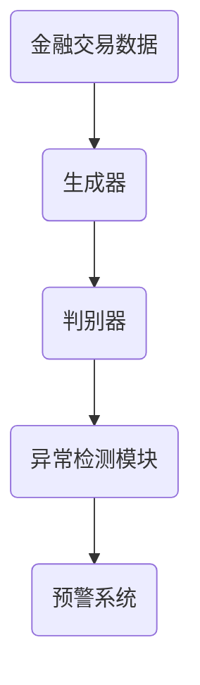

                 


# 《金融领域对抗学习的研究与应用》

> 关键词：对抗学习、金融、深度学习、机器学习、生成对抗网络（GAN）、金融欺诈检测

> 摘要：本文系统地探讨了对抗学习在金融领域的研究与应用，从基础概念到算法原理，再到实际项目案例，详细分析了对抗学习在金融数据处理、欺诈检测、信用评估等领域的应用价值与挑战。通过具体的技术实现与案例分析，本文旨在为读者提供全面的理论指导和实践参考，帮助他们在金融领域中有效应用对抗学习技术。

---

# 第一部分: 金融领域对抗学习的背景与概述

## 第1章: 对抗学习的基本概念与背景

### 1.1 对抗学习的定义与核心概念

对抗学习（Adversarial Learning）是一种基于博弈论的机器学习方法，通过两个或多个对抗模型之间的竞争与合作，提升模型的泛化能力和鲁棒性。其核心思想是通过生成器（Generator）和判别器（Discriminator）的对抗过程，生成逼真的数据或识别出异常数据。

#### 1.1.1 对抗学习的定义
对抗学习是一种通过两个模型互相竞争来提升性能的技术。生成器的目标是生成接近真实数据的样本，而判别器的目标是区分真实数据和生成数据。通过交替训练生成器和判别器，两者的能力不断提升，最终达到纳什均衡。

#### 1.1.2 对抗学习的核心概念
- **生成器（Generator）**：负责生成数据，通常使用深度神经网络结构。
- **判别器（Discriminator）**：负责区分真实数据和生成数据。
- **对抗过程**：生成器和判别器通过交替训练不断优化模型参数。

#### 1.1.3 对抗学习与传统机器学习的对比
| 对比维度 | 传统机器学习 | 对抗学习 |
|----------|--------------|----------|
| 数据需求 | 需要大量标注数据 | 可以利用未标注数据 |
| 模型结构 | 单一模型 | 双模型对抗 |
| 应用场景 | 分类、回归等 | 数据生成、异常检测等 |

### 1.2 金融领域的对抗学习背景

#### 1.2.1 金融领域的数据特点
- **数据稀疏性**：某些金融场景（如欺诈检测）中，正常数据远多于异常数据。
- **数据敏感性**：金融数据涉及用户隐私，获取和处理需严格遵守相关规定。
- **数据动态性**：金融市场数据波动频繁，模型需要具备良好的实时性。

#### 1.2.2 金融领域中的对抗性问题
- **金融欺诈检测**：欺诈行为往往伪装成正常交易，传统模型容易误判。
- **信用评估**：黑产通过伪造信息绕过信用评估，模型需要识别真实信用风险。
- **股票市场预测**：市场参与者的行为可能干扰价格预测。

#### 1.2.3 对抗学习在金融中的应用潜力
- **数据增强**：利用生成器生成更多样化的训练数据。
- **模型鲁棒性**：通过对抗训练提升模型对噪声和异常数据的鲁棒性。
- **异常检测**：判别器可以识别出异常交易或市场行为。

### 1.3 对抗学习在金融中的问题描述

#### 1.3.1 金融数据的挑战
- **数据不平衡**：欺诈交易占比较低，传统模型容易过拟合正常数据。
- **数据噪声**：金融数据中可能存在缺失值、异常值等干扰因素。
- **数据隐私**：金融数据涉及用户隐私，数据处理需符合GDPR等法规。

#### 1.3.2 对抗学习的解决方案
- **利用对抗网络提升模型鲁棒性**：通过生成器生成更多的异常数据，增强判别器的识别能力。
- **对抗学习在数据增强中的应用**：生成更多的样本，缓解数据不足的问题。
- **对抗学习在模型解释性中的应用**：通过对抗训练，提升模型的可解释性。

---

# 第二部分: 对抗学习的算法原理与数学模型

## 第4章: 对抗学习的数学模型与公式

### 4.1 对抗学习的基本数学模型

#### 生成器与判别器的结构
生成器和判别器通常使用深度神经网络结构，生成器的目标是最小化判别器的错误率，而判别器的目标是最大化区分真实数据和生成数据的能力。

#### 损失函数
- **判别器的损失函数**：最大化真实数据为真、生成数据为假的概率。
$$ L_D = -\mathbb{E}_{x \sim p_{data}}[\log D(x)] - \mathbb{E}_{z \sim p_z}[ \log (1 - D(G(z)))] $$
- **生成器的损失函数**：最小化判别器将生成数据误判为假的概率。
$$ L_G = -\mathbb{E}_{z \sim p_z}[ \log D(G(z))] $$

#### 对抗训练的优化过程
生成器和判别器通过交替优化，逐步提升模型性能。通常，生成器和判别器的参数更新是通过梯度下降方法完成的。

---

### 4.2 对抗学习的优化策略

#### 梯度下降过程
生成器和判别器的参数更新如下：
- 判别器更新：$$ D \leftarrow D - \eta_D \frac{\partial L_D}{\partial D} $$
- 生成器更新：$$ G \leftarrow G - \eta_G \frac{\partial L_G}{\partial G} $$

#### 损失函数平衡
为了防止生成器或判别器一方过于强大，通常会采用平衡策略，例如调整学习率、损失函数权重等。

#### 模型稳定性的挑战
对抗训练过程中，生成器和判别器可能陷入鞍点，导致训练不稳定。解决方案包括使用标签平滑、调整网络结构等。

---

## 第5章: 对抗学习的系统分析与架构设计

### 5.1 金融欺诈检测系统的介绍

#### 系统目标
检测异常交易，识别潜在的金融欺诈行为。

#### 系统功能需求
- 实时监控交易数据。
- 生成异常交易报告。
- 提供欺诈行为预测和预警。

#### 系统数据流
1. 交易数据输入。
2. 生成器生成异常交易样本。
3. 判别器识别真实交易与生成样本。
4. 输出异常交易预警。

---

### 5.2 金融欺诈检测系统的架构设计

#### 系统架构图


#### 模块功能说明
- **生成器（G）**：生成可能的异常交易样本。
- **判别器（D）**：判断输入数据是否为异常交易。
- **异常检测模块（A）**：综合生成器和判别器的结果，输出异常交易判断。
- **预警系统（W）**：根据检测结果发出预警信号。

---

## 第6章: 对抗学习的项目实战

### 6.1 环境配置与数据准备

#### 环境配置
- **Python 3.8+**
- **TensorFlow或Keras**
- **Scikit-learn**

#### 数据准备
使用公开的金融交易数据集，例如Kaggle上的信用卡欺诈检测数据集。

### 6.2 核心代码实现

#### 生成器和判别器的实现
```python
import tensorflow as tf
from tensorflow.keras import layers

def build_generator(input_dim, output_dim):
    model = tf.keras.Sequential()
    model.add(layers.Dense(256, activation='relu', input_dim=input_dim))
    model.add(layers.Dense(128, activation='relu'))
    model.add(layers.Dense(output_dim, activation='sigmoid'))
    return model

def build_discriminator(input_dim):
    model = tf.keras.Sequential()
    model.add(layers.Dense(128, activation='relu', input_dim=input_dim))
    model.add(layers.Dense(64, activation='relu'))
    model.add(layers.Dense(1, activation='sigmoid'))
    return model
```

#### 对抗训练的实现
```python
def train_gan(generator, discriminator, X_train, y_train, epochs=100, batch_size=32):
    discriminator.compile(loss='binary_crossentropy', optimizer='adam', metrics=['accuracy'])
    generator.compile(loss='binary_crossentropy', optimizer='adam')
    
    for epoch in range(epochs):
        # 训练判别器
        d_loss_real = discriminator.train_on_batch(X_train, y_train)
        # 生成假数据
        noise = np.random.normal(0, 1, (batch_size, 100))
        gen_X = generator.predict(noise)
        d_loss_fake = discriminator.train_on_batch(gen_X, np.zeros((batch_size, 1)))
        # 训练生成器
        noise = np.random.normal(0, 1, (batch_size, 100))
        gen_X = generator.predict(noise)
        g_loss = generator.train_on_batch(gen_X, np.ones((batch_size, 1)))
        
        print(f"Epoch {epoch}, D loss: {d_loss_real[0]}, G loss: {g_loss}")
```

### 6.3 案例分析与结果解读

#### 案例分析
使用信用卡欺诈检测数据集，训练生成器和判别器模型。生成器生成异常交易样本，判别器识别交易是否为异常。

#### 结果解读
- 判别器在训练过程中逐渐能够准确区分真实交易和生成的异常交易。
- 生成器生成的样本逐渐逼真，判别器的识别能力增强。

---

## 第7章: 对抗学习的总结与展望

### 7.1 总结
本文详细探讨了对抗学习在金融领域的研究与应用，从基础概念到算法实现，再到项目实战，全面分析了对抗学习在金融数据处理中的优势。通过对金融欺诈检测系统的案例分析，验证了对抗学习的有效性。

### 7.2 未来展望
对抗学习在金融领域的应用前景广阔，未来的研究方向包括：
1. **多目标对抗学习**：同时优化多个对抗模型，提升模型的泛化能力。
2. **对抗学习与强化学习结合**：探索在金融交易中的应用潜力。
3. **模型解释性提升**：解决对抗学习模型黑箱问题，提升可解释性。

### 7.3 最佳实践 tips
- **数据预处理**：对抗学习对数据质量要求较高，需进行充分的数据清洗和特征工程。
- **模型调参**：对抗学习的超参数较多，需进行多次实验调整。
- **模型评估**：采用多种评估指标，确保模型的稳定性和可靠性。

---

# 作者：AI天才研究院/AI Genius Institute & 禅与计算机程序设计艺术 /Zen And The Art of Computer Programming

---

这篇文章通过系统地分析对抗学习的理论基础、算法原理和实际应用，为读者提供了一个全面了解对抗学习在金融领域应用的视角。希望对读者在金融领域的技术研究和实践有所帮助。

