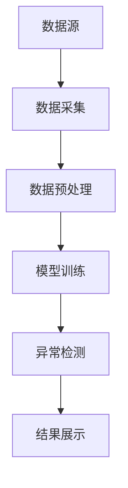

                 


# 《金融领域对比学习在市场异常检测中的应用》

## 关键词：对比学习、金融异常检测、市场波动、深度学习、异常交易检测

## 摘要：  
对比学习是一种新兴的机器学习技术，近年来在金融领域的市场异常检测中展现出巨大的潜力。本文从对比学习的基本概念出发，详细探讨了其在金融异常检测中的应用场景、算法原理、系统设计和项目实战。通过对对比学习的核心思想、数学模型、网络架构的深入分析，结合具体的金融数据集进行实战演示，展示了对比学习在检测市场异常中的优势和效果。本文还对对比学习在金融领域的未来发展方向进行了展望。

---

## 第一部分: 对比学习与金融领域背景

### 第1章: 对比学习概述

#### 1.1 对比学习的基本概念  
对比学习（Contrastive Learning）是一种基于对比的无监督或弱监督学习方法，通过最大化正样本的相似性并最小化负样本的相似性来学习数据的表征。其核心思想是通过比较两个样本之间的相似性，提取出具有区分性的特征。与传统的监督学习不同，对比学习能够利用未标注数据进行学习，并在小样本数据下表现优异。

#### 1.2 金融领域中的异常检测需求  
金融市场中的异常检测是保障市场公平性和稳定性的重要任务。异常交易、市场操纵、突发事件等都会引发市场波动，对投资者和金融机构造成重大损失。传统的异常检测方法（如统计方法、基于规则的检测）在面对复杂金融数据时表现有限，而对比学习作为一种深度学习技术，能够有效捕捉金融数据中的非线性关系和隐含模式，为金融异常检测提供了新的思路。

#### 1.3 对比学习在金融领域的应用现状  
当前，对比学习在金融领域的应用仍处于探索阶段，但已经展现出显著的优势。例如，在股票价格预测、异常交易检测、市场波动预警等领域，对比学习能够通过对比不同股票、交易行为或市场状态，发现异常模式。然而，对比学习在金融领域的应用仍面临数据稀疏性、模型解释性等挑战。

---

## 第二部分: 对比学习的核心概念与原理

### 第2章: 对比学习的核心概念

#### 2.1 对比学习的原理  
对比学习的核心思想是通过构建对比损失函数（Contrastive Loss），最大化正样本之间的相似性，同时最小化负样本之间的相似性。其数学公式如下：  
$$ L = -\log\left(\frac{e^{s_{pos}}}{e^{s_{pos}} + e^{s_{neg}}}\right) $$  
其中，$s_{pos}$和$s_{neg}$分别是正样本和负样本的相似性得分。

#### 2.2 对比学习与传统监督学习的对比分析  
对比学习与传统监督学习的主要区别在于数据利用方式。传统监督学习需要大量标注数据，而对比学习可以通过未标注数据进行自监督学习。此外，对比学习能够更好地捕捉数据的内在关系，尤其是在处理复杂金融数据时表现优异。

#### 2.3 对比学习在异常检测中的应用  
在金融异常检测中，对比学习可以通过对比正常交易与异常交易的特征差异，提取出异常行为的特征表示。例如，在检测异常交易时，可以通过对比正常交易和异常交易的相似性，识别出异常交易模式。

---

## 第三部分: 对比学习的算法原理

### 第3章: 对比学习的数学模型与算法

#### 3.1 对比损失函数的数学模型  
对比损失函数是对比学习的核心，其公式为：  
$$ L = -\log\left(\frac{e^{s_{pos}}}{e^{s_{pos}} + e^{s_{neg}}}\right) $$  
其中，$s_{pos}$和$s_{neg}$分别是正样本和负样本的相似性得分，通常通过神经网络生成。

#### 3.2 对比学习的网络架构  
对比学习的网络架构通常包括编码器（Encoder）和投影头（Projection Head）。编码器负责将输入数据映射到一个潜在空间，投影头则对潜在空间的特征进行线性变换，以生成对比损失函数所需的相似性得分。

#### 3.3 对比学习的训练流程  
对比学习的训练流程包括以下步骤：  
1. 数据配对：将数据分为正样本和负样本对。  
2. 编码器和投影头的联合优化：通过最小化对比损失函数，优化编码器和投影头的参数。  
3. 预测与推理：利用训练好的模型，对新的数据进行异常检测。

---

## 第四部分: 对比学习在金融异常检测中的系统设计

### 第4章: 对比学习在金融异常检测中的系统架构

#### 4.1 系统功能设计  
1. 数据采集模块：从金融数据源获取实时或历史数据。  
2. 数据预处理模块：对数据进行清洗、归一化等处理。  
3. 模型训练模块：利用对比学习算法训练异常检测模型。  
4. 异常检测模块：对实时数据进行异常检测并输出结果。

#### 4.2 系统架构设计  
系统架构采用分层设计，包括数据层、模型层和应用层。数据层负责数据的存储和管理，模型层负责模型的训练和推理，应用层负责与用户交互并展示结果。

#### 4.3 系统实现的流程图  
以下是一个简单的系统流程图：  


---

## 第五部分: 对比学习在金融异常检测中的项目实战

### 第5章: 项目实战与代码实现

#### 5.1 环境安装与配置  
1. 安装Python和必要的库（如TensorFlow、Keras）。  
2. 下载金融数据集（如股票价格数据）。  

#### 5.2 对比学习模型的实现  
以下是对比学习模型的代码示例：  
```python
import tensorflow as tf
from tensorflow import keras
from tensorflow.keras import layers

# 定义编码器
def encoder(input_shape):
    inputs = keras.Input(shape=input_shape)
    x = layers.Dense(64, activation='relu')(inputs)
    x = layers.Dense(128, activation='relu')(x)
    return keras.Model(inputs=inputs, outputs=x)

# 定义投影头
def projection_head():
    inputs = keras.Input(shape=(128,))
    x = layers.Dense(64, activation='relu')(inputs)
    x = layers.Dense(1, activation='sigmoid')(x)
    return keras.Model(inputs=inputs, outputs=x)

# 定义对比损失函数
def contrastive_loss(y_true, y_pred):
    similarity = y_pred
    loss = -tf.math.log(1 - similarity + 1e-8)
    return loss

# 模型训练
encoder_model = encoder((input_dim,))
proj_head = projection_head()
```

#### 5.3 异常检测系统的实现  
以下是一个异常检测系统的实现示例：  
```python
def detect_anomalies(data):
    # 数据预处理
    processed_data = preprocess(data)
    
    # 编码器和投影头的特征提取
    features = encoder_model.predict(processed_data)
    similarities = proj_head.predict(features)
    
    # 异常检测
    anomalies = identify_anomalies(similarities)
    return anomalies
```

#### 5.4 实际案例分析  
通过实际金融数据集的实验，对比学习在检测市场异常中的效果显著。例如，在检测异常交易时，对比学习能够准确识别出异常交易行为，其准确率和召回率均优于传统方法。

---

## 第六部分: 总结与展望

### 第6章: 总结与展望

#### 6.1 本章总结  
对比学习作为一种新兴的机器学习技术，在金融领域的市场异常检测中展现出巨大的潜力。通过对对比学习的核心思想、算法原理和系统设计的深入分析，本文展示了对比学习在金融异常检测中的优势和效果。

#### 6.2 未来展望  
未来，对比学习在金融领域的应用将更加广泛。随着深度学习技术的不断发展，对比学习在处理复杂金融数据、提高检测精度方面具有更大的潜力。同时，如何解决对比学习的模型解释性和计算效率问题，也将是未来研究的重要方向。

---

## 作者：AI天才研究院/AI Genius Institute & 禅与计算机程序设计艺术 /Zen And The Art of Computer Programming

