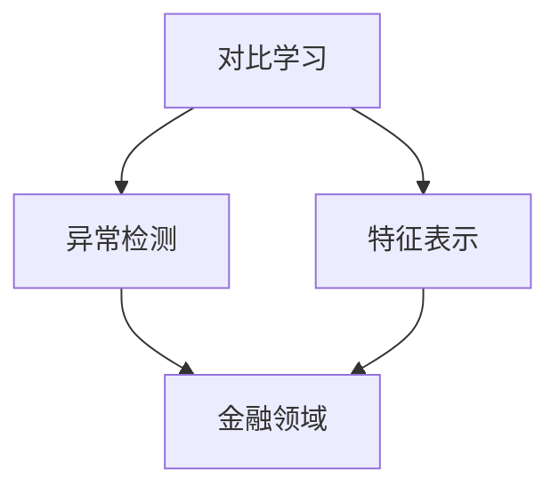
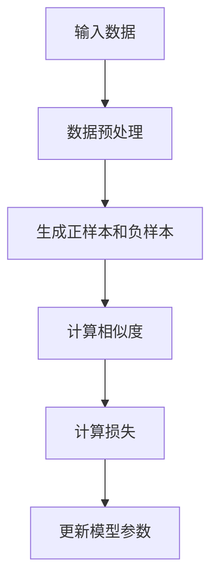
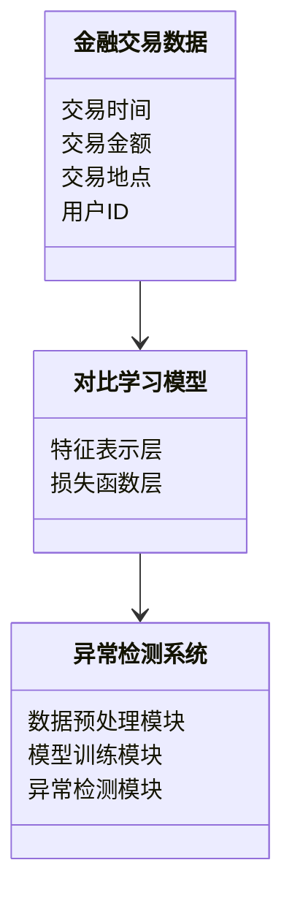
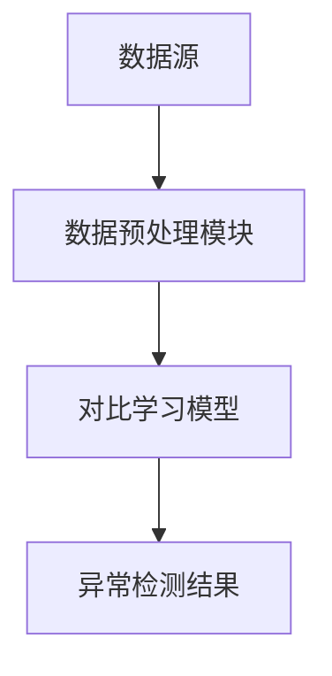
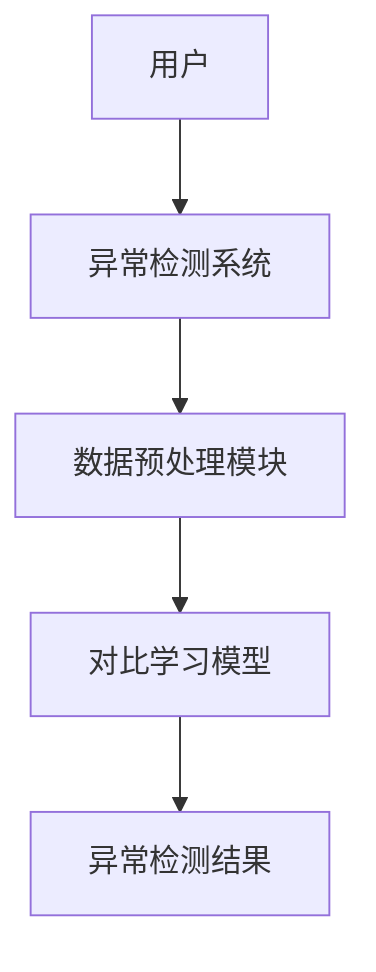

                 


# 《金融领域对比学习在异常检测中的应用》

## 关键词：
对比学习、异常检测、金融、深度学习、机器学习、数据挖掘

## 摘要：
本文深入探讨了对比学习在金融领域异常检测中的应用，详细介绍了对比学习的基本概念、核心原理以及在金融异常检测中的具体应用场景。通过分析对比学习与异常检测的结合，本文提出了基于对比学习的金融异常检测系统设计方案，并通过实际案例展示了该方案的有效性和优势。文章还总结了对比学习在金融异常检测中的优势与挑战，并展望了未来的研究方向。

---

# 第一部分: 金融领域对比学习与异常检测背景

## 第1章: 对比学习与异常检测概述

### 1.1 对比学习的基本概念
对比学习是一种通过比较两个或多个样本之间的相似性或差异性来学习特征表示的方法。其核心思想是通过最大化正样本之间的相似性，同时最小化负样本之间的相似性，从而实现对数据的高效表示。

#### 1.1.1 对比学习的定义
对比学习（Contrastive Learning）是一种监督学习方法，通过比较正样本和负样本之间的相似性来学习数据的特征表示。对比学习的核心在于构造正样本和负样本对，并通过优化损失函数来增强正样本之间的相似性和减少负样本之间的相似性。

#### 1.1.2 对比学习的核心原理
对比学习的核心原理包括以下几个方面：
1. **正样本对**：同一类别或相关样本之间的相似性。
2. **负样本对**：不同类别或不相关样本之间的差异性。
3. **损失函数**：通过优化损失函数来最大化正样本对的相似性和最小化负样本对的相似性。

#### 1.1.3 对比学习在金融领域的应用价值
对比学习在金融领域的应用价值主要体现在以下几个方面：
1. **金融数据的特征表示**：通过对比学习可以高效地提取金融数据的特征表示，为后续的异常检测提供有力支持。
2. **金融欺诈检测**：对比学习可以有效识别金融交易中的异常行为，帮助金融机构识别欺诈交易。
3. **风险评估**：通过对比学习可以对金融风险进行评估，帮助金融机构制定更加科学的风险管理策略。

### 1.2 异常检测的基本概念
异常检测是一种通过分析数据分布来识别异常样本的方法。异常检测的核心思想是识别与数据分布显著不同的样本。

#### 1.2.1 异常检测的定义
异常检测（Outlier Detection）是一种通过分析数据分布来识别异常样本的方法。异常检测的核心思想是识别与数据分布显著不同的样本。

#### 1.2.2 异常检测的主要方法
异常检测的主要方法包括以下几种：
1. **统计方法**：基于统计学原理，如Z-score、概率密度估计等。
2. **无监督学习方法**：如K-means、DBSCAN等聚类算法。
3. **有监督学习方法**：基于标签数据的分类方法，如支持向量机、随机森林等。
4. **深度学习方法**：如自编码器、生成对抗网络等。

#### 1.2.3 异常检测在金融领域的应用场景
异常检测在金融领域的应用场景包括以下几个方面：
1. **金融交易监控**：通过异常检测识别异常交易行为，防范金融欺诈。
2. **风险管理**：通过异常检测识别潜在的金融风险，帮助金融机构制定风险管理策略。
3. **信用评估**：通过异常检测评估客户的信用风险，帮助金融机构进行信用评估。

### 1.3 对比学习与异常检测的结合
对比学习与异常检测的结合可以有效提升异常检测的性能和效果。

#### 1.3.1 对比学习在异常检测中的优势
对比学习在异常检测中的优势主要体现在以下几个方面：
1. **特征表示能力强**：对比学习可以高效地提取数据的特征表示，为异常检测提供有力支持。
2. **鲁棒性高**：对比学习通过最大化正样本对的相似性和最小化负样本对的相似性，可以有效识别异常样本。
3. **可解释性好**：对比学习的特征表示具有较高的可解释性，可以帮助分析异常样本的原因。

#### 1.3.2 金融领域异常检测的挑战
金融领域异常检测的挑战主要体现在以下几个方面：
1. **数据稀疏性**：金融数据通常具有较高的稀疏性，异常样本的数量较少，难以通过传统的统计方法进行检测。
2. **数据噪声**：金融数据中通常存在较多的噪声，如缺失值、错误值等，这些噪声会影响异常检测的准确性。
3. **数据分布变化**：金融数据的分布通常会随着时间的推移而发生变化，传统的异常检测方法难以适应这种变化。

#### 1.3.3 对比学习如何解决金融异常检测的问题
对比学习可以通过以下方式解决金融异常检测的问题：
1. **高效特征表示**：对比学习可以高效地提取金融数据的特征表示，帮助识别异常样本。
2. **鲁棒性高**：对比学习通过最大化正样本对的相似性和最小化负样本对的相似性，可以有效识别异常样本。
3. **可解释性好**：对比学习的特征表示具有较高的可解释性，可以帮助分析异常样本的原因。

---

## 第2章: 金融领域异常检测的核心概念与联系

### 2.1 对比学习的核心概念原理
对比学习的核心概念原理包括以下几个方面：
1. **对比学习的数学模型**：对比学习的数学模型通常包括特征表示函数和损失函数。特征表示函数用于将输入数据映射到特征空间，损失函数用于优化正样本对的相似性和负样本对的相似性。
2. **对比学习的特征表示方法**：对比学习的特征表示方法通常包括线性变换、非线性变换等方法。
3. **对比学习的损失函数设计**：对比学习的损失函数通常包括对数似然损失、交叉熵损失等。

#### 2.1.1 对比学习的数学模型
对比学习的数学模型通常包括以下几个部分：
1. **输入数据**：输入数据可以是图像、文本、数值等多种形式。
2. **特征表示函数**：特征表示函数用于将输入数据映射到特征空间，通常可以使用深度学习模型，如卷积神经网络、循环神经网络等。
3. **损失函数**：损失函数用于优化正样本对的相似性和负样本对的相似性，通常可以使用对数似然损失、交叉熵损失等。

#### 2.1.2 对比学习的特征表示方法
对比学习的特征表示方法通常包括以下几个方面：
1. **线性变换**：通过线性变换将输入数据映射到特征空间。
2. **非线性变换**：通过非线性变换将输入数据映射到特征空间，如深度神经网络等。

#### 2.1.3 对比学习的损失函数设计
对比学习的损失函数设计通常包括以下几个方面：
1. **对数似然损失**：对数似然损失用于衡量正样本对和负样本对的相似性。
2. **交叉熵损失**：交叉熵损失用于衡量正样本对和负样本对的相似性。

### 2.2 异常检测的核心概念原理
异常检测的核心概念原理包括以下几个方面：
1. **异常检测的统计学方法**：异常检测的统计学方法通常包括Z-score、概率密度估计等。
2. **异常检测的深度学习方法**：异常检测的深度学习方法通常包括自编码器、生成对抗网络等。
3. **异常检测的评价指标**：异常检测的评价指标通常包括准确率、召回率、F1分数等。

#### 2.2.1 异常检测的统计学方法
异常检测的统计学方法通常包括以下几个方面：
1. **Z-score方法**：Z-score方法通过计算数据点与均值的偏差程度来识别异常样本。
2. **概率密度估计方法**：概率密度估计方法通过估计数据点的概率密度来识别异常样本。

#### 2.2.2 异常检测的深度学习方法
异常检测的深度学习方法通常包括以下几个方面：
1. **自编码器方法**：自编码器方法通过重构输入数据来识别异常样本。
2. **生成对抗网络方法**：生成对抗网络方法通过生成正常数据并识别异常数据来识别异常样本。

#### 2.2.3 异常检测的评价指标
异常检测的评价指标通常包括以下几个方面：
1. **准确率**：准确率用于衡量模型正确识别正常样本的比例。
2. **召回率**：召回率用于衡量模型正确识别异常样本的比例。
3. **F1分数**：F1分数用于衡量模型的综合性能，通常是对准确率和召回率的加权平均。

### 2.3 对比学习与异常检测的对比分析
对比学习与异常检测的对比分析可以通过以下方面进行：
1. **对比学习与异常检测的对比表格**：可以通过表格形式对比对比学习与异常检测的主要区别和联系。
2. **对比学习与异常检测的ER实体关系图**：可以通过ER实体关系图展示对比学习与异常检测的核心概念之间的关系。

#### 2.3.1 对比学习与异常检测的对比表格
以下是一个对比学习与异常检测的对比表格：

| 特性                | 对比学习                              | 异常检测                              |
|---------------------|-------------------------------------|--------------------------------------|
| 定义                | 通过比较正样本和负样本的相似性来学习特征表示 | 通过分析数据分布来识别异常样本        |
| 核心思想            | 最大化正样本对的相似性，最小化负样本对的相似性 | 识别与数据分布显著不同的样本          |
| 应用场景            | 金融领域异常检测、图像识别、自然语言处理等 | 金融交易监控、风险管理、信用评估等    |
| 优势                | 特征表示能力强，鲁棒性高，可解释性好 | 适用于多种数据类型，可解释性较好        |
| 挑战                | 对比学习需要构造正样本和负样本对      | 异常检测需要处理数据稀疏性和噪声问题    |

#### 2.3.2 对比学习与异常检测的ER实体关系图
以下是一个对比学习与异常检测的ER实体关系图：



---

## 第3章: 对比学习在金融异常检测中的算法原理

### 3.1 对比学习算法的数学模型
对比学习算法的数学模型通常包括特征表示函数和损失函数。

#### 3.1.1 对比学习的损失函数
对比学习的损失函数通常包括对数似然损失和交叉熵损失。

##### 对比学习的对数似然损失
$$L = \frac{1}{N}\sum_{i=1}^{N} \log(\text{sim}(x_i, y_i) + 1)$$

##### 对比学习的交叉熵损失
$$L = -\frac{1}{N}\sum_{i=1}^{N} [\log(\text{sim}(x_i, y_i))]$$

#### 3.1.2 对比学习的特征表示
对比学习的特征表示通常包括以下几个方面：
1. **线性变换**：通过线性变换将输入数据映射到特征空间。
2. **非线性变换**：通过非线性变换将输入数据映射到特征空间，如深度神经网络等。

#### 3.1.3 对比学习的数学公式
以下是一个对比学习的数学公式示例：

$$z_i = f(x_i; \theta)$$

其中，$z_i$ 是输入数据 $x_i$ 的特征表示，$f$ 是特征表示函数，$\theta$ 是模型参数。

### 3.2 对比学习算法的流程图
以下是一个对比学习算法的流程图：



### 3.3 对比学习算法的代码实现
以下是一个对比学习算法的代码实现示例：

#### 3.3.1 环境安装
```bash
pip install numpy matplotlib tensorflow
```

#### 3.3.2 核心代码实现
```python
import numpy as np
import tensorflow as tf

def contrastive_loss(y_true, y_pred):
    margin = 1.0
    loss = tf.reduce_mean(tf.square(y_true - y_pred))
    return loss

class ContrastiveModel(tf.keras.Model):
    def __init__(self):
        super(ContrastiveModel, self).__init__()
        self.encoder = tf.keras.layers.Dense(128, activation='relu')
        self.d Encoder = tf.keras.layers.Dense(1, activation='sigmoid')

    def call(self, inputs):
        x1, x2 = inputs
        z1 = self.encoder(x1)
        z2 = self.encoder(x2)
        return z1, z2

model = ContrastiveModel()
model.compile(optimizer=tf.keras.optimizers.Adam(0.001), loss=contrastive_loss)
model.fit([x_train, x_pos], y_train, epochs=10, batch_size=32)
```

---

## 第4章: 金融领域异常检测的系统架构设计

### 4.1 问题场景介绍
金融领域异常检测的系统架构设计需要考虑以下几个方面：
1. **数据输入**：金融数据的输入格式和数据预处理方法。
2. **模型训练**：对比学习模型的训练过程和参数设置。
3. **结果输出**：异常检测结果的输出格式和可视化方法。

### 4.2 项目介绍
金融领域异常检测的项目介绍包括以下几个方面：
1. **项目目标**：识别金融交易中的异常行为，防范金融欺诈。
2. **项目范围**：涵盖金融交易数据的收集、预处理、建模、训练和预测。
3. **项目计划**：包括数据收集、数据预处理、模型设计、模型训练、模型评估和模型部署。

### 4.3 系统功能设计
金融领域异常检测系统的功能设计包括以下几个方面：
1. **数据预处理模块**：包括数据清洗、特征提取、数据增强等。
2. **模型训练模块**：包括对比学习模型的训练、参数优化等。
3. **异常检测模块**：包括异常样本的识别、异常原因的分析等。

#### 4.3.1 领域模型
以下是一个金融领域异常检测的领域模型：



#### 4.3.2 系统架构图
以下是一个金融领域异常检测系统的架构图：



#### 4.3.3 系统接口设计
系统接口设计包括以下几个方面：
1. **数据输入接口**：用于接收金融交易数据。
2. **模型训练接口**：用于训练对比学习模型。
3. **异常检测接口**：用于识别异常样本。

#### 4.3.4 系统交互图
以下是一个系统交互图：



---

## 第5章: 项目实战

### 5.1 项目背景
项目背景包括以下几个方面：
1. **项目目标**：识别金融交易中的异常行为，防范金融欺诈。
2. **项目范围**：涵盖金融交易数据的收集、预处理、建模、训练和预测。
3. **项目计划**：包括数据收集、数据预处理、模型设计、模型训练、模型评估和模型部署。

### 5.2 核心代码实现
核心代码实现包括以下几个方面：
1. **数据预处理**：包括数据清洗、特征提取、数据增强等。
2. **模型训练**：包括对比学习模型的训练、参数优化等。
3. **异常检测**：包括异常样本的识别、异常原因的分析等。

#### 5.2.1 环境安装
```bash
pip install numpy matplotlib tensorflow
```

#### 5.2.2 核心代码实现
```python
import numpy as np
import tensorflow as tf

def contrastive_loss(y_true, y_pred):
    margin = 1.0
    loss = tf.reduce_mean(tf.square(y_true - y_pred))
    return loss

class ContrastiveModel(tf.keras.Model):
    def __init__(self):
        super(ContrastiveModel, self).__init__()
        self.encoder = tf.keras.layers.Dense(128, activation='relu')
        self.decoder = tf.keras.layers.Dense(1, activation='sigmoid')

    def call(self, inputs):
        x1, x2 = inputs
        z1 = self.encoder(x1)
        z2 = self.encoder(x2)
        return z1, z2

model = ContrastiveModel()
model.compile(optimizer=tf.keras.optimizers.Adam(0.001), loss=contrastive_loss)
model.fit([x_train, x_pos], y_train, epochs=10, batch_size=32)
```

### 5.3 项目小结
项目小结包括以下几个方面：
1. **项目目标实现情况**：项目目标是否实现，实现的效果如何。
2. **项目遇到的问题及解决方案**：项目实施过程中遇到的问题及解决方案。
3. **项目的改进方向**：项目存在的不足及未来改进的方向。

---

## 第6章: 总结与最佳实践

### 6.1 总结
总结包括以下几个方面：
1. **对比学习的优势**：对比学习在异常检测中的优势，如特征表示能力强、鲁棒性高、可解释性好等。
2. **异常检测的挑战**：异常检测在金融领域中的挑战，如数据稀疏性、数据噪声、数据分布变化等。
3. **对比学习与异常检测的结合**：对比学习与异常检测的结合可以有效提升异常检测的性能和效果。

### 6.2 最佳实践
最佳实践包括以下几个方面：
1. **数据预处理**：数据预处理是异常检测的关键步骤，需要仔细处理数据的噪声和缺失值。
2. **模型调参**：模型调参是对比学习的重要步骤，需要通过实验优化模型的参数。
3. **结果解释**：结果解释是对比学习的重要环节，需要对异常样本的原因进行深入分析。

### 6.3 小结
小结包括以下几个方面：
1. **对比学习与异常检测的结合**：对比学习与异常检测的结合可以有效提升异常检测的性能和效果。
2. **对比学习的优势**：对比学习在异常检测中的优势，如特征表示能力强、鲁棒性高、可解释性好等。
3. **异常检测的挑战**：异常检测在金融领域中的挑战，如数据稀疏性、数据噪声、数据分布变化等。

---

## 第7章: 注意事项与拓展阅读

### 7.1 注意事项
注意事项包括以下几个方面：
1. **数据预处理**：数据预处理是异常检测的关键步骤，需要仔细处理数据的噪声和缺失值。
2. **模型调参**：模型调参是对比学习的重要步骤，需要通过实验优化模型的参数。
3. **结果解释**：结果解释是对比学习的重要环节，需要对异常样本的原因进行深入分析。

### 7.2 拓展阅读
拓展阅读包括以下几个方面：
1. **对比学习的最新研究**：对比学习的最新研究进展，如基于自监督学习的对比学习方法。
2. **异常检测的最新研究**：异常检测的最新研究进展，如基于深度学习的异常检测方法。
3. **对比学习与异常检测的结合**：对比学习与异常检测的结合研究，如基于对比学习的异常检测方法。

---

## 作者：AI天才研究院/AI Genius Institute & 禅与计算机程序设计艺术 /Zen And The Art of Computer Programming

