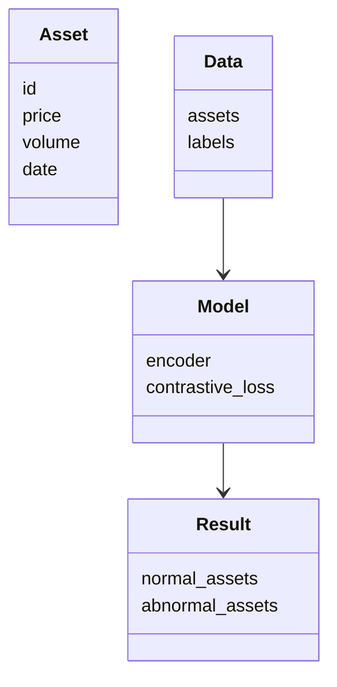
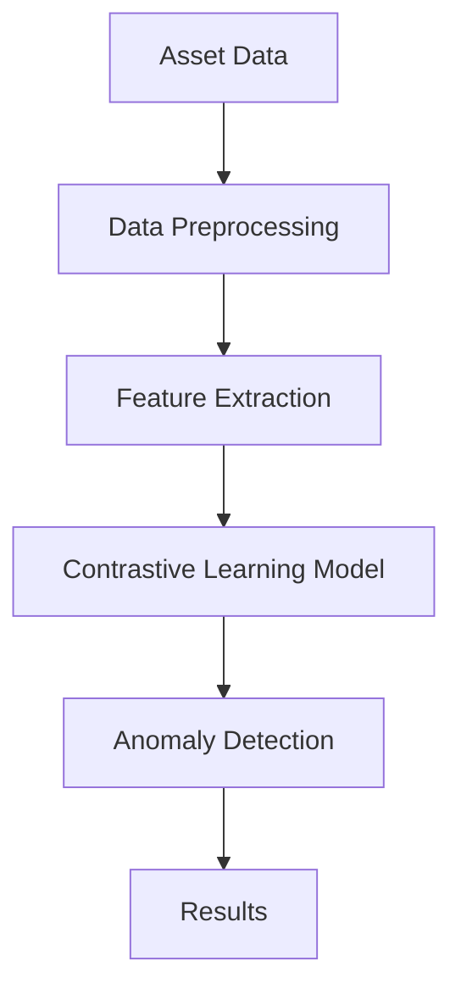
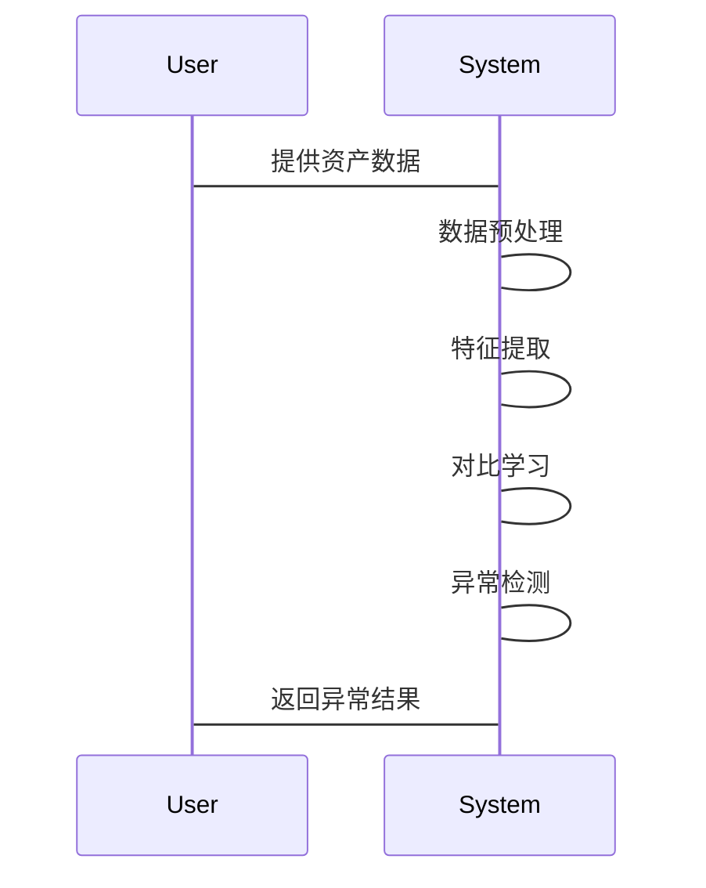

                 


# 《金融领域对比学习在资产定价异常检测中的应用》

> **关键词**: 对比学习，资产定价，异常检测，金融领域，深度学习

> **摘要**: 本文探讨了对比学习在金融领域资产定价异常检测中的应用。通过分析对比学习的核心原理和优势，结合资产定价的背景与挑战，本文详细介绍了对比学习在异常检测中的具体实现方法。同时，本文通过实际项目案例展示了对比学习在金融领域的实际应用价值，并展望了其未来的研究方向。

---

## 第1章 对比学习与资产定价概述

### 1.1 对比学习的基本概念

#### 1.1.1 对比学习的定义
对比学习（Contrastive Learning）是一种通过比较不同数据点之间的相似性或差异性来学习特征表示的方法。其核心思想是通过最大化正样本对的相似性，同时最小化负样本对的相似性，从而学习到具有区分性的特征表示。

#### 1.1.2 对比学习的核心原理
对比学习通过构建正样本对和负样本对，利用损失函数（如对比损失函数）来优化模型，使得正样本对的特征表示尽可能接近，而负样本对的特征表示尽可能远离。

#### 1.1.3 对比学习在金融领域的应用前景
在金融领域，对比学习可以应用于股票价格预测、风险评估、资产配置等领域。特别是在资产定价异常检测中，对比学习能够通过学习正常资产定价的特征表示，从而检测出异常的资产定价行为。

### 1.2 资产定价的基本概念

#### 1.2.1 资产定价的定义
资产定价是指通过对资产的风险、收益、流动性等因素进行评估，确定其市场价格的过程。常见的资产定价模型包括CAPM（资本资产定价模型）和APT（套利定价理论）。

#### 1.2.2 资产定价的主要方法
资产定价的方法主要包括基本面分析、技术分析和量化分析。基本面分析关注企业的财务数据和行业前景，技术分析关注价格和成交量的变化，量化分析则利用大数据和机器学习方法进行预测。

#### 1.2.3 资产定价异常检测的必要性
资产定价异常检测是指识别出资产定价过程中出现的异常行为，如市场操纵、虚假信息传播等。异常检测有助于维护市场的公平性和透明性，保护投资者的利益。

### 1.3 对比学习在资产定价中的应用背景

#### 1.3.1 传统资产定价模型的局限性
传统资产定价模型在处理复杂金融市场数据时存在以下问题：
- 数据维度高，计算复杂
- 难以捕捉非线性关系
- 对异常数据的鲁棒性较差

#### 1.3.2 对比学习的优势与适用场景
对比学习在资产定价中的优势包括：
- 能够有效捕捉数据的非线性关系
- 通过对比机制增强模型的鲁棒性
- 可以处理高维数据和复杂场景

对比学习适用于以下场景：
- 股票价格预测
- 风险评估
- 市场操纵检测

#### 1.3.3 资产定价异常检测的挑战
资产定价异常检测的主要挑战包括：
- 数据稀疏性
- 异常样本的稀少性
- 市场波动的不确定性

## 第2章 对比学习的核心概念与原理

### 2.1 对比学习的核心概念

#### 2.1.1 对比学习的特征表示
对比学习通过构建特征表示，使得正样本对的特征表示相似，而负样本对的特征表示差异。特征表示可以是文本、图像或数值型数据。

#### 2.1.2 对比学习的损失函数
对比损失函数（Contrastive Loss）是对比学习的核心，其公式为：
$$ L = -\log(\text{sim}^+(x_i, x_j) + \text{sim}^-(x_i, x_k)) $$
其中，$\text{sim}^+(x_i, x_j)$表示正样本对的相似度，$\text{sim}^-(x_i, x_k)$表示负样本对的相似度。

#### 2.1.3 对比学习的训练过程
对比学习的训练过程包括以下步骤：
1. 构建正样本对和负样本对
2. 计算相似度
3. 优化模型参数以最小化损失函数

### 2.2 对比学习的原理与优势

#### 2.2.1 对比学习的对比机制
对比学习通过对比正样本对和负样本对的相似度，使得模型能够学习到具有区分性的特征表示。对比机制可以通过以下步骤实现：
1. 对比损失函数优化
2. 特征表示的非线性变换
3. 模型的正则化

#### 2.2.2 对比学习的特征提取能力
对比学习能够有效地提取数据的特征，尤其适用于高维数据和复杂场景。通过对比机制，模型能够捕捉到数据中的关键特征，从而提高分类和预测的准确性。

#### 2.2.3 对比学习的鲁棒性与可解释性
对比学习具有较强的鲁棒性，能够适应数据噪声和分布偏移。此外，对比学习的特征表示具有一定的可解释性，可以通过可视化工具（如t-SNE）分析特征分布。

### 2.3 对比学习在金融领域的应用案例

#### 2.3.1 对比学习在股票价格预测中的应用
通过对比学习，可以对股票价格进行预测，识别出异常的价格波动。

#### 2.3.2 对比学习在风险评估中的应用
对比学习可以用于评估金融资产的风险，识别高风险资产。

#### 2.3.3 对比学习在资产配置中的应用
对比学习可以帮助投资者优化资产配置，降低投资风险。

## 第3章 资产定价异常检测的背景与挑战

### 3.1 资产定价异常检测的定义

#### 3.1.1 资产定价异常的定义
资产定价异常是指资产定价过程中出现的异常行为，如市场操纵、虚假信息传播等。

#### 3.1.2 资产定价异常的类型
资产定价异常的类型包括：
- 市场操纵
- 信息不对称
- 市场波动

#### 3.1.3 资产定价异常检测的必要性
资产定价异常检测有助于维护市场的公平性和透明性，保护投资者的利益。

### 3.2 资产定价异常检测的主要方法

#### 3.2.1 基于统计学的异常检测方法
统计学方法包括Z-score、均值-方差法等，适用于检测单变量异常。

#### 3.2.2 基于机器学习的异常检测方法
机器学习方法包括随机森林、支持向量机（SVM）等，适用于多变量异常检测。

#### 3.2.3 基于深度学习的异常检测方法
深度学习方法包括卷积神经网络（CNN）、循环神经网络（RNN）等，适用于处理复杂金融数据。

### 3.3 对比学习在资产定价异常检测中的优势

#### 3.3.1 对比学习的特征提取能力
对比学习能够有效地提取资产定价中的特征，识别出异常的定价行为。

#### 3.3.2 对比学习的对比机制在异常检测中的应用
对比学习的对比机制可以帮助识别出异常样本，通过对比正样本对和负样本对的相似度，识别出异常行为。

#### 3.3.3 对比学习的鲁棒性与可解释性
对比学习具有较强的鲁棒性，能够适应金融市场的波动和不确定性。此外，对比学习的特征表示具有一定的可解释性，便于分析异常行为的原因。

### 3.4 本章小结

---

## 第4章 对比学习算法的数学模型与实现

### 4.1 对比学习的数学模型

#### 4.1.1 对比学习的损失函数
对比损失函数（Contrastive Loss）是对比学习的核心，其公式为：
$$ L = -\log(\text{sim}^+(x_i, x_j) + \text{sim}^-(x_i, x_k)) $$

#### 4.1.2 对比学习的特征表示
特征表示可以通过神经网络模型（如ResNet、BERT）进行提取。

#### 4.1.3 对比学习的训练过程
对比学习的训练过程包括以下步骤：
1. 构建正样本对和负样本对
2. 计算相似度
3. 优化模型参数以最小化损失函数

### 4.2 对比学习算法的实现

#### 4.2.1 对比学习的网络结构
对比学习通常采用双任务网络（Siamese Network）结构，包括两个相同的子网络和一个对比损失函数。

#### 4.2.2 对比学习的训练流程
对比学习的训练流程包括以下步骤：
1. 数据预处理
2. 构建正样本对和负样本对
3. 训练模型
4. 评估模型性能

#### 4.2.3 对比学习的优化策略
对比学习的优化策略包括：
- 数据增强
- 模型正则化
- 学习率调整

### 4.3 对比学习算法的实现代码

#### 4.3.1 环境安装与依赖管理
需要安装以下依赖：
```bash
pip install numpy matplotlib tensorflow
```

#### 4.3.2 对比学习模型的实现代码
以下是对比学习模型的实现代码：
```python
import numpy as np
import tensorflow as tf

class ContrastiveModel:
    def __init__(self, embedding_dim=128, temperature=1.0):
        self.embedding_dim = embedding_dim
        self.temperature = temperature
        self.encoder = self.build_model()
    
    def build_model(self):
        inputs = tf.keras.Input(shape=(input_dim,))
        embeddings = tf.keras.layers.Dense(self.embedding_dim, activation='relu')(inputs)
        return tf.keras.Model(inputs=inputs, outputs=embeddings)
    
    def contrastive_loss(self, y_true, y_pred):
        similarity_matrix = tf.matmul(y_pred, y_pred, transpose_b=True)
        similarity_matrix = similarity_matrix / self.temperature
        similarity_matrix = tf.keras.activations.softmax(similarity_matrix)
        loss = tf.keras.losses.sparse_categorical_crossentropy(y_true, similarity_matrix)
        return loss
    
    def train(self, x, y, epochs=100, batch_size=32):
        self.model.compile(optimizer='adam', loss=self.contrastive_loss)
        self.model.fit(x, y, epochs=epochs, batch_size=batch_size)
```

#### 4.3.3 对比学习的代码解读与分析
- `ContrastiveModel`类初始化时，定义了嵌入维度和温度参数。
- `build_model`方法构建了编码器模型，用于提取特征表示。
- `contrastive_loss`方法定义了对比损失函数，计算相似度矩阵并进行软化。
- `train`方法训练模型，使用Adam优化器和对比损失函数。

---

## 第5章 对比学习在资产定价异常检测中的系统设计

### 5.1 系统功能设计

#### 5.1.1 问题场景介绍
资产定价异常检测的场景包括股票价格预测、市场操纵检测等。

#### 5.1.2 系统功能需求
- 数据获取与预处理
- 特征提取与对比学习
- 异常检测与结果分析

#### 5.1.3 领域模型设计
以下是领域模型的类图（Mermaid）：


### 5.2 系统架构设计

#### 5.2.1 系统架构图（Mermaid）
以下是系统架构图：


#### 5.2.2 系统接口设计
- 数据接口：数据获取和预处理
- 模型接口：特征提取和对比学习
- 结果接口：异常检测结果输出

### 5.3 系统交互设计

#### 5.3.1 系统交互流程图（Mermaid）
以下是系统交互流程图：


---

## 第6章 项目实战：基于对比学习的资产定价异常检测

### 6.1 项目背景

#### 6.1.1 项目介绍
本项目旨在通过对比学习方法，检测资产定价过程中的异常行为。

### 6.2 项目实现

#### 6.2.1 环境搭建
需要安装以下依赖：
```bash
pip install numpy pandas scikit-learn tensorflow
```

#### 6.2.2 核心实现代码
以下是对比学习模型的实现代码：
```python
import numpy as np
import pandas as pd
from sklearn.metrics import accuracy_score
from tensorflow.keras.models import Model
from tensorflow.keras.layers import Input, Dense

def contrastive_loss(y_true, y_pred, alpha=0.5):
    similarity = tf.matmul(y_pred, y_pred, transpose_b=True)
    similarity = similarity / tf.keras.activations.relu(similarity)
    loss = tf.keras.losses.sparse_categorical_crossentropy(y_true, similarity)
    return loss

input_dim = 128
embedding_dim = 64
alpha = 0.5

inputs = Input(shape=(input_dim,))
embeddings = Dense(embedding_dim, activation='relu')(inputs)
model = Model(inputs=inputs, outputs=embeddings)

model.compile(optimizer='adam', loss=lambda y_true, y_pred: contrastive_loss(y_true, y_pred, alpha))
model.fit(x_train, y_train, epochs=100, batch_size=32)
```

#### 6.2.3 代码解读与分析
- `contrastive_loss`函数定义了对比损失函数，计算正样本对和负样本对的相似度。
- `input_dim`和`embedding_dim`分别定义了输入维度和嵌入维度。
- `model`是对比学习模型，使用Adam优化器和自定义损失函数进行训练。

### 6.3 实际案例分析

#### 6.3.1 数据准备
假设我们有一个包含资产价格和交易量的数据集，可以通过以下代码进行数据预处理：
```python
data = pd.read_csv('assets.csv')
x = data[['price', 'volume']].values
y = data['label'].values
```

#### 6.3.2 模型训练
使用训练数据对模型进行训练：
```python
model.fit(x_train, y_train, epochs=100, batch_size=32)
```

#### 6.3.3 结果分析
通过对比学习模型，可以识别出异常的资产定价行为：
```python
y_pred = model.predict(x_test)
accuracy = accuracy_score(y_test, np.argmax(y_pred, axis=1))
print(f'Accuracy: {accuracy}')
```

### 6.4 项目小结

---

## 第7章 总结与展望

### 7.1 总结
本文详细介绍了对比学习在金融领域资产定价异常检测中的应用，包括对比学习的核心原理、优势以及具体实现方法。通过实际项目案例，展示了对比学习在资产定价异常检测中的实际应用价值。

### 7.2 展望
未来的研究方向包括：
- 对比学习在多模态数据中的应用
- 对比学习在实时资产定价异常检测中的应用
- 对比学习与其他机器学习方法的结合

---

**作者：AI天才研究院/AI Genius Institute & 禅与计算机程序设计艺术 /Zen And The Art of Computer Programming**

