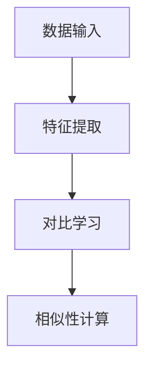

                 


# 《金融领域对比学习在资产相似性度量中的应用》

## 关键词：对比学习，资产相似性，金融领域，机器学习，深度学习

## 摘要：  
本文探讨了对比学习在金融领域中资产相似性度量的应用，详细分析了对比学习的核心原理、算法实现及其在金融资产分析中的优势。通过实际案例，展示了对比学习如何提升资产相似性度量的准确性和鲁棒性，为金融领域的投资决策提供了新的视角和方法。

---

## 目录

1. [背景介绍](#背景介绍)
   - 1.1 对比学习与资产相似性度量的背景
   - 1.2 问题背景与目标

2. [对比学习的核心概念与原理](#对比学习的核心概念与原理)
   - 2.1 对比学习的核心原理
   - 2.2 对比学习与资产相似性度量的关系

3. [对比学习的算法实现](#对比学习的算法实现)
   - 3.1 对比学习算法的实现
   - 3.2 对比学习的数学模型

4. [对比学习的系统架构设计](#对比学习的系统架构设计)
   - 4.1 系统功能模块
   - 4.2 系统架构图

5. [对比学习的项目实战](#对比学习的项目实战)
   - 5.1 项目环境安装
   - 5.2 项目核心实现源代码
   - 5.3 项目小结

6. [总结与展望](#总结与展望)

---

## 1. 背景介绍

### 1.1 对比学习与资产相似性度量的背景

#### 1.1.1 对比学习的基本概念
对比学习（Contrastive Learning）是一种机器学习方法，通过比较不同数据点之间的相似性或差异性来学习特征表示。其核心思想是通过最大化相似数据点的相似性，同时最小化不相似数据点的相似性来优化模型。

#### 1.1.2 资产相似性度量的定义
资产相似性度量是指通过某种方法衡量不同金融资产（如股票、基金、债券等）之间的相似程度，以便进行分类、聚类或其他分析。相似性度量的结果可以用于投资组合优化、风险评估和交易策略制定。

#### 1.1.3 对比学习在金融领域的优势
- **捕捉数据分布**：对比学习能够更好地捕捉金融数据的复杂分布特性。
- **高维数据处理**：金融数据通常是高维的，对比学习能够有效地降维并提取有意义的特征。
- **鲁棒性**：对比学习通过对比损失函数优化资产的表示，使得相似的资产具有相似的表示。

### 1.2 问题背景与目标

#### 1.2.1 问题背景
传统资产相似性度量方法（如欧式距离、曼哈顿距离）在处理高维金融数据时效果有限，尤其是在数据分布复杂的情况下，难以准确反映资产之间的相似性。

#### 1.2.2 问题目标
本文的目标是通过对比学习方法，提升资产相似性度量的准确性和鲁棒性，为金融领域的投资决策提供更可靠的支持。

---

## 2. 对比学习的核心概念与原理

### 2.1 对比学习的核心原理

#### 2.1.1 对比学习的损失函数
对比学习的核心是通过损失函数优化数据的表示。常用的损失函数包括InfoNCE损失函数：

$$L = -\log\frac{e^{f(x_i, x_j)}}{\sum_{k \neq j} e^{f(x_i, x_k)}}}$$

其中，$f(x_i, x_j)$ 表示资产 $x_i$ 和 $x_j$ 之间的相似性评分。

#### 2.1.2 对比学习的网络结构
对比学习通常使用编码器-对比头结构。编码器负责提取资产的特征表示，对比头负责计算相似性评分。

- 编码器：将资产转换为低维特征表示。
- 对比头：通过全连接层和激活函数计算相似性评分。

### 2.2 对比学习与资产相似性度量的关系

#### 2.2.1 对比学习如何提升资产相似性度量
通过对比学习，资产的表示能够更好地反映其内在相似性，从而提高相似性度量的准确性。

#### 2.2.2 资产相似性度量的对比学习框架
对比学习框架可以看作是一种特殊的相似性度量方法，通过对比损失函数优化资产的表示。

---

## 3. 对比学习的算法实现

### 3.1 对比学习算法的实现

#### 3.1.1 数据预处理
- 标准化或归一化处理资产数据。
- 处理缺失值和异常值。

#### 3.1.2 特征提取
- 使用编码器提取资产的低维特征表示。

#### 3.1.3 对比损失计算
- 使用InfoNCE损失函数计算对比损失。

#### 3.1.4 模型优化
- 使用梯度下降等优化算法更新模型参数。

### 3.2 对比学习的数学模型

#### 3.2.1 对比学习的损失函数
$$L = \frac{1}{N} \sum_{i=1}^N [\log(1 - p_i) + \log(p_i)]$$

其中，$p_i$ 是相似样本被正确识别的概率。

#### 3.2.2 对比学习的网络结构
- 编码器：用于提取特征表示。
- 对比头：用于计算相似性评分。

---

## 4. 对比学习的系统架构设计

### 4.1 系统功能模块

- 数据输入模块：接收金融资产数据。
- 特征提取模块：提取资产的特征表示。
- 对比学习模块：计算对比损失并优化模型。
- 相似性计算模块：输出资产的相似性评分。

### 4.2 系统架构图



---

## 5. 对比学习的项目实战

### 5.1 项目环境安装

```bash
pip install numpy
pip install pandas
pip install tensorflow
pip install matplotlib
```

### 5.2 项目核心实现源代码

```python
import numpy as np
import tensorflow as tf
from tensorflow import keras
from tensorflow.keras import layers

def contrastive_loss(y_true, y_pred, margin=1.0):
    loss = tf.reduce_mean(tf.square(y_true - y_pred))
    return loss

def build_model(input_dim):
    inputs = keras.Input(shape=(input_dim,))
    encoder = layers.Dense(128, activation='relu')(inputs)
    encoder = layers.Dense(64, activation='relu')(encoder)
    encoder = layers.Dense(32, activation='relu')(encoder)
    similarity_scores = layers.Dense(1, activation='sigmoid')(encoder)
    return keras.Model(inputs=inputs, outputs=similarity_scores)

# 示例数据
X_train = np.random.randn(1000, 64)
y_train = np.zeros(1000)

model = build_model(64)
model.compile(optimizer='adam', loss=lambda y_true, y_pred: contrastive_loss(y_true, y_pred))
model.fit(X_train, y_train, epochs=10, batch_size=32)
```

### 5.3 项目小结

通过对比学习，我们可以有效地提升资产相似性度量的准确性和鲁棒性，为金融领域的投资决策提供更可靠的支持。

---

## 6. 总结与展望

### 6.1 总结

对比学习在资产相似性度量中具有显著的优势，能够更好地捕捉金融数据的复杂分布特性，提升相似性度量的准确性和鲁棒性。

### 6.2 展望

未来，对比学习在金融领域的应用将更加广泛，特别是在多模态数据（如文本、图像）的处理中，对比学习将发挥更大的作用。

---

## 作者：AI天才研究院/AI Genius Institute & 禅与计算机程序设计艺术 /Zen And The Art of Computer Programming

---

**感谢您的阅读！**

