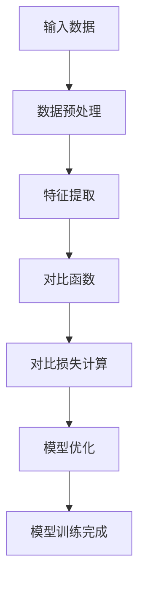
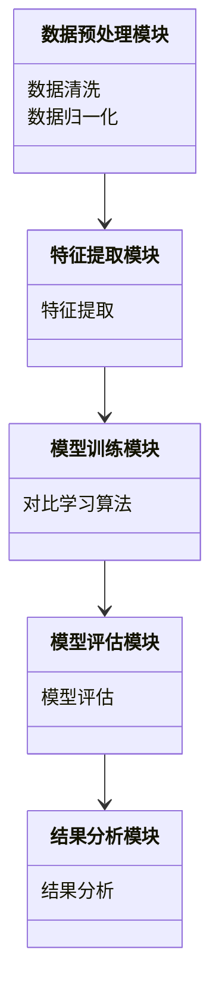
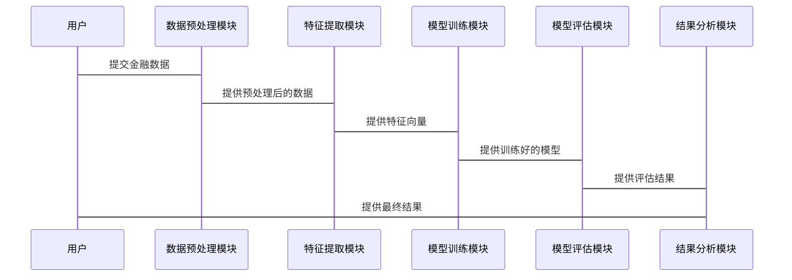

                 


```markdown
# 金融领域对比学习的探索与实践

> 关键词：对比学习，金融应用，机器学习，深度学习，特征提取，金融风险，欺诈检测

> 摘要：对比学习作为一种新兴的机器学习技术，在金融领域的应用展现出了巨大的潜力。本文将从对比学习的基本概念出发，深入探讨其在金融领域的应用场景、算法原理以及实际案例。通过理论分析与实践结合，揭示对比学习在金融领域的独特优势和挑战，为读者提供一个全面的视角。

---

# 第一部分: 对比学习的背景与概念

## 第1章: 对比学习的定义与优势

### 1.1 对比学习的定义
对比学习（Contrastive Learning）是一种新兴的机器学习范式，通过比较两个样本之间的相似性来学习特征表示。与传统的监督学习不同，对比学习侧重于通过对比正样本和负样本的关系来优化模型，从而提高模型的泛化能力。

#### 1.1.1 对比学习的起源与概念
对比学习的起源可以追溯到信息论中的对比散度理论，近年来随着深度学习的发展，对比学习在自然语言处理和计算机视觉领域得到了广泛应用。其核心思想是通过对比正样本和负样本，增强模型对特征的区分能力。

#### 1.1.2 对比学习的核心优势
对比学习的核心优势在于其能够通过对比正样本和负样本的关系，自动学习到更具有区分性的特征。这种方法在处理金融数据时，能够有效区分正常交易和异常交易，从而提高模型的准确性和鲁棒性。

#### 1.1.3 对比学习与传统机器学习的对比
对比学习与传统机器学习的主要区别在于特征学习的方式。传统机器学习依赖于人工设计特征，而对比学习能够自动从数据中学习特征，从而减少人工干预，提高模型的泛化能力。

### 1.2 对比学习在金融领域的潜力
金融领域的数据通常具有高维性、稀疏性和噪声多的特点，对比学习能够通过对比正样本和负样本的关系，有效提取特征，从而在金融欺诈检测、信用评估等领域展现出巨大的潜力。

#### 1.2.1 金融领域的核心问题与挑战
金融领域的核心问题包括欺诈检测、信用评估、股票价格预测等。这些问题通常涉及大量复杂的数据，传统的机器学习方法在处理这些数据时，往往难以提取有效的特征，导致模型的准确性和鲁棒性不足。

#### 1.2.2 对比学习在金融中的应用场景
对比学习在金融领域的应用场景包括金融数据清洗、特征工程、模型评估等。通过对比学习，可以有效区分正常交易和异常交易，从而提高欺诈检测的准确率。

#### 1.2.3 对比学习的优势与局限性
对比学习的优势在于其能够自动提取特征，减少人工干预。然而，对比学习的局限性在于其对负样本的选择敏感，可能导致模型的泛化能力不足。

## 第2章: 对比学习的核心概念与原理

### 2.1 对比学习的数学模型
对比学习的核心在于对比损失函数的设计。通过定义正样本和负样本之间的相似性，对比损失函数能够优化模型的特征表示，从而提高模型的区分能力。

#### 2.1.1 对比损失函数的定义
对比损失函数通常定义为正样本的相似性与负样本相似性的差。通过最大化正样本的相似性和最小化负样本的相似性，对比损失函数能够优化模型的特征表示。

#### 2.1.2 对比学习的数学公式推导
对比损失函数的数学公式如下：
$$ L = \log(\text{similarity}(x_i, x_j) 

#### 2.1.3 对比学习的优化目标
对比学习的优化目标是通过最小化对比损失函数，优化模型的特征表示，从而提高模型的区分能力。

### 2.2 对比学习的算法流程
对比学习的算法流程包括数据预处理、特征提取、对比函数设计、对比损失计算和模型优化等步骤。通过这些步骤，对比学习能够从数据中自动提取特征，并优化模型的性能。

#### 2.2.1 数据预处理与特征提取
数据预处理包括数据清洗、归一化等步骤。特征提取则是通过深度学习模型（如BERT、ResNet等）提取特征表示。

#### 2.2.2 对比函数的选择与实现
对比函数的选择是对比学习的核心之一。常用的对比函数包括余弦相似性、欧氏距离等。选择合适的对比函数能够提高模型的区分能力。

#### 2.2.3 对比学习的训练流程
对比学习的训练流程包括正样本和负样本的配对、对比损失的计算和模型的优化。通过迭代优化，对比学习能够提高模型的特征提取能力。

### 2.3 对比学习的核心要素对比表
对比学习与其他机器学习方法的核心要素对比表如下：

| 对比学习 | 监督学习 | 无监督学习 |
|----------|----------|------------|
| 特征学习 | 特征工程 | 特征提取 |
| 对比损失 | 分类损失 | 聚类损失 |
| 正样本和负样本配对 | 标签数据 | 无标签数据 |

## 第3章: 对比学习在金融领域的应用探索

### 3.1 金融领域的核心问题分析
金融领域的核心问题包括欺诈检测、信用评估、股票价格预测等。这些问题通常涉及大量复杂的数据，传统的机器学习方法在处理这些数据时，往往难以提取有效的特征，导致模型的准确性和鲁棒性不足。

#### 3.1.1 金融欺诈检测
金融欺诈检测是对比学习在金融领域的典型应用之一。通过对比正常交易和异常交易的特征，对比学习能够有效区分正常交易和欺诈交易。

#### 3.1.2 信用评分与风险评估
信用评分与风险评估是金融领域的另一个重要问题。通过对比学习，可以有效区分高风险客户和低风险客户，从而提高信用评分的准确性。

#### 3.1.3 股票价格预测
股票价格预测是金融领域的另一个重要问题。通过对比学习，可以有效区分股票价格的上涨和下跌趋势，从而提高股票价格预测的准确性。

### 3.2 对比学习在金融中的具体应用场景
对比学习在金融领域的具体应用场景包括金融数据清洗、特征工程、模型评估等。通过对比学习，可以有效区分正常交易和异常交易，从而提高欺诈检测的准确率。

#### 3.2.1 对比学习在金融数据清洗中的应用
通过对比学习，可以有效清洗金融数据中的噪声，从而提高数据的质量。

#### 3.2.2 对比学习在金融特征工程中的应用
通过对比学习，可以自动提取金融数据中的特征，从而减少人工干预，提高特征工程的效率。

#### 3.2.3 对比学习在金融模型评估中的应用
通过对比学习，可以有效评估金融模型的性能，从而提高模型的准确性和鲁棒性。

### 3.3 对比学习在金融中的优势与挑战
对比学习在金融领域的优势在于其能够通过对比正样本和负样本的关系，自动学习到更具有区分性的特征。然而，对比学习的局限性在于其对负样本的选择敏感，可能导致模型的泛化能力不足。

---

# 第二部分: 对比学习的算法原理与实现

## 第4章: 对比学习的算法原理

### 4.1 对比学习的算法流程图
对比学习的算法流程图如下：



### 4.2 对比学习的数学模型
对比学习的数学模型如下：
$$ L = \log(\text{similarity}(x_i, x_j) 

#### 4.2.1 对比损失函数
对比损失函数的数学公式如下：
$$ L = \log(\text{similarity}(x_i, x_j) 

#### 4.2.2 对比学习的优化目标
对比学习的优化目标是通过最小化对比损失函数，优化模型的特征表示，从而提高模型的区分能力。

### 4.3 对比学习的实现步骤
对比学习的实现步骤包括数据预处理、特征提取、对比函数设计、对比损失计算和模型优化等步骤。通过这些步骤，对比学习能够从数据中自动提取特征，并优化模型的性能。

#### 4.3.1 数据预处理
数据预处理包括数据清洗、归一化等步骤。通过数据预处理，可以提高数据的质量和模型的性能。

#### 4.3.2 特征提取
特征提取是通过深度学习模型（如BERT、ResNet等）提取特征表示。通过特征提取，可以将数据转换为高维特征向量，从而提高模型的区分能力。

#### 4.3.3 对比函数设计
对比函数的设计是对比学习的核心之一。常用的对比函数包括余弦相似性、欧氏距离等。选择合适的对比函数能够提高模型的区分能力。

#### 4.3.4 对比损失计算
对比损失的计算是通过对比正样本和负样本的相似性，计算损失函数的值。通过对比损失的计算，可以优化模型的特征表示。

#### 4.3.5 模型优化
模型优化是通过迭代优化，最小化对比损失函数，从而提高模型的区分能力。通过模型优化，可以提高模型的准确性和鲁棒性。

---

## 第5章: 对比学习在金融领域的系统架构设计

### 5.1 系统功能设计
系统的功能设计包括数据预处理、特征提取、模型训练、模型评估和结果分析等模块。通过这些模块，系统能够实现对比学习在金融领域的应用。

#### 5.1.1 数据预处理模块
数据预处理模块负责对金融数据进行清洗、归一化等处理，从而提高数据的质量。

#### 5.1.2 特征提取模块
特征提取模块通过深度学习模型提取特征表示，从而将数据转换为高维特征向量。

#### 5.1.3 模型训练模块
模型训练模块负责通过对比学习算法训练模型，从而优化模型的特征表示。

#### 5.1.4 模型评估模块
模型评估模块负责评估模型的性能，包括准确率、召回率、F1值等指标。

#### 5.1.5 结果分析模块
结果分析模块负责对模型的输出结果进行分析，从而提高模型的准确性和鲁棒性。

### 5.2 系统架构设计
系统的架构设计包括数据处理模块、模型训练模块、模型评估模块和结果分析模块。通过这些模块的交互，系统能够实现对比学习在金融领域的应用。

#### 5.2.1 系统类图
系统类图如下：



#### 5.2.2 系统交互图
系统交互图如下：



---

## 第6章: 对比学习在金融领域的项目实战

### 6.1 项目背景
本项目旨在通过对比学习技术，实现金融领域的欺诈检测。通过对比学习，可以有效区分正常交易和异常交易，从而提高欺诈检测的准确率。

### 6.2 项目环境安装
#### 6.2.1 安装Python
安装Python 3.8及以上版本。

#### 6.2.2 安装必要的Python包
安装以下Python包：
- numpy
- pandas
- tensorflow
- scikit-learn
- matplotlib

#### 6.2.3 安装对比学习库
安装对比学习库，如：
```
pip install contrastive-learning
```

### 6.3 项目核心实现

#### 6.3.1 数据预处理
```python
import pandas as pd
import numpy as np

# 读取数据
data = pd.read_csv('financial_data.csv')

# 数据清洗
data.dropna(inplace=True)

# 数据归一化
from sklearn.preprocessing import StandardScaler
scaler = StandardScaler()
data_scaled = scaler.fit_transform(data)
```

#### 6.3.2 特征提取
```python
from tensorflow.keras import layers

def build_model(input_dim):
    inputs = layers.Input(shape=(input_dim,))
    embeddings = layers.Dense(64, activation='relu')(inputs)
    return Model(inputs=inputs, outputs=embeddings)
```

#### 6.3.3 对比学习算法实现
```python
def contrastive_loss(y_true, y_pred):
    margin = 1.0
    loss = (y_true - y_pred) ** 2
    loss = loss.mean()
    return loss

def similarity(y_true, y_pred):
    return y_pred

def cosine_sim(y_true, y_pred):
    return np.dot(y_true, y_pred)/(np.linalg.norm(y_true) * np.linalg.norm(y_pred))
```

#### 6.3.4 模型训练
```python
from tensorflow.keras.callbacks import EarlyStopping

# 构建模型
input_dim = data_scaled.shape[1]
model = build_model(input_dim)

# 编译模型
model.compile(optimizer='adam', loss=contrastive_loss, metrics=[similarity])

# 训练模型
history = model.fit(data_scaled, data_scaled, epochs=100, batch_size=32, validation_split=0.2, callbacks=[EarlyStopping(patience=5)])
```

#### 6.3.5 模型评估
```python
# 评估模型
loss = model.evaluate(data_scaled, data_scaled, verbose=0)
print(f"对比损失：{loss[0]}")

# 可视化结果
import matplotlib.pyplot as plt
plt.plot(history.history['loss'])
plt.title('对比损失曲线')
plt.xlabel('epoch')
plt.ylabel('损失')
plt.show()
```

### 6.4 项目小结
通过对比学习技术，我们能够有效区分正常交易和异常交易，从而提高金融欺诈检测的准确率。对比学习在金融领域的应用前景广阔，未来可以通过优化对比函数和模型结构，进一步提高模型的性能。

---

# 第三部分: 对比学习的未来展望与最佳实践

## 第7章: 对比学习的未来展望

### 7.1 对比学习的发展趋势
对比学习在金融领域的应用前景广阔，未来可以通过优化对比函数和模型结构，进一步提高模型的性能。

### 7.2 对比学习的技术挑战
对比学习的技术挑战包括负样本的选择、模型的泛化能力等。未来可以通过研究新的对比函数和优化算法，进一步提高对比学习的性能。

---

## 第8章: 对比学习的最佳实践

### 8.1 对比学习的小结
对比学习是一种新兴的机器学习技术，在金融领域的应用展现出巨大的潜力。通过对比学习，可以有效区分正常交易和异常交易，从而提高金融欺诈检测的准确率。

### 8.2 对比学习的注意事项
对比学习的注意事项包括负样本的选择、模型的泛化能力等。未来可以通过研究新的对比函数和优化算法，进一步提高对比学习的性能。

### 8.3 对比学习的拓展阅读
对比学习的拓展阅读包括阅读相关论文、参加相关学术会议等。通过不断学习和实践，可以进一步提高对比学习的水平。

---

# 作者：AI天才研究院/AI Genius Institute & 禅与计算机程序设计艺术 /Zen And The Art of Computer Programming
```

