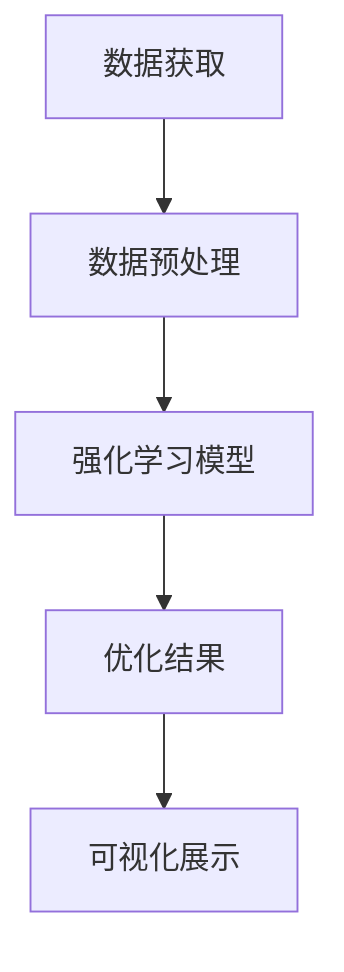

                 


# 《金融领域强化学习在多周期投资组合优化中的应用》

---

## 关键词：
- 强化学习
- 投资组合优化
- 多周期投资
- 金融建模
- 深度强化学习
- DQN算法

---

## 摘要：
本文探讨了强化学习在金融领域的应用，特别是如何通过强化学习算法解决多周期投资组合优化问题。文章从强化学习的基本原理出发，结合金融市场的复杂性，详细阐述了Q-learning和深度强化学习（如DQN）在投资组合优化中的应用。同时，文章通过系统架构设计和项目实战，展示了如何将强化学习应用于实际金融问题，并通过案例分析验证了算法的有效性。本文还提供了完整的代码实现和数学推导，为读者提供了一个从理论到实践的完整指南。

---

## 第一部分：强化学习与投资组合优化概述

### 第1章：强化学习的基本概念

#### 1.1 强化学习的定义与核心要素
强化学习（Reinforcement Learning，RL）是一种机器学习范式，通过智能体与环境的交互来学习最优策略。其核心要素包括：
- **状态（State）**：环境当前的观测。
- **动作（Action）**：智能体采取的行动。
- **奖励（Reward）**：智能体采取动作后获得的反馈。
- **策略（Policy）**：智能体选择动作的规则。
- **值函数（Value Function）**：衡量某个状态下采取某动作的期望收益。

#### 1.2 投资组合优化的定义与目标
投资组合优化是指在满足一定风险约束的条件下，最大化投资收益的过程。多周期投资组合优化则是在多个时间周期内动态调整投资组合，以应对市场的不确定性。

#### 1.3 强化学习在投资组合优化中的应用前景
强化学习能够通过动态交互和策略优化，有效应对金融市场中的不确定性，为投资组合优化提供了一种新的解决方案。

---

### 第2章：金融市场的复杂性与挑战

#### 2.1 金融市场的不确定性
金融市场受到多种因素的影响，如经济指标、政策变化、突发事件等，这些因素使得市场具有高度的不确定性。

#### 2.2 多周期投资组合优化的难点
- 多周期优化需要考虑时间序列数据和动态变化。
- 不同周期的收益和风险目标可能存在冲突。

#### 2.3 强化学习的优势与局限性
- **优势**：强化学习能够通过试错学习找到最优策略，适用于非线性、动态的金融市场。
- **局限性**：强化学习需要大量的数据和计算资源，且模型的可解释性较低。

---

## 第二部分：强化学习的核心概念与数学模型

### 第3章：强化学习的基本原理

#### 3.1 Q-learning算法的基本原理
Q-learning是一种经典的强化学习算法，通过更新Q值表（Q-table）来学习最优策略。其核心公式为：
$$ Q(s, a) \leftarrow Q(s, a) + \alpha [r + \gamma \max_{a'} Q(s', a') - Q(s, a)] $$
其中：
- $\alpha$：学习率
- $\gamma$：折扣因子
- $s$：当前状态
- $a$：当前动作
- $s'$：下一个状态

#### 3.2 多周期投资组合优化的数学模型
投资组合优化的目标函数可以表示为：
$$ \max_{w} \mathbb{E}[r^T w] - \lambda \mathbb{V}[r^T w] $$
其中：
- $w$：权重向量
- $r$：收益矩阵
- $\lambda$：风险惩罚系数
- $\mathbb{E}$：期望值
- $\mathbb{V}$：方差

---

### 第4章：强化学习算法在金融中的应用

#### 4.1 基于Q-learning的投资组合优化
Q-learning算法可以用于动态调整投资组合的权重，以最大化累积收益。其步骤如下：
1. 确定状态空间：如市场指数、行业表现等。
2. 定义动作空间：如买入、卖出、持有等。
3. 设定奖励函数：如收益超过基准时给予正奖励。

#### 4.2 深度强化学习在金融中的应用
深度强化学习（Deep RL）通过深度神经网络逼近值函数，能够处理高维状态空间。DQN算法通过经验回放和目标网络，有效解决了传统强化学习的不稳定问题。

---

## 第三部分：系统分析与架构设计

### 第5章：多周期投资组合优化的系统架构设计

#### 5.1 系统功能设计
- **数据获取与预处理**：从金融数据源获取历史数据，并进行标准化处理。
- **强化学习模型训练**：基于预处理后的数据，训练强化学习模型。
- **投资组合优化结果展示**：将优化结果可视化，并与基准策略进行对比。

#### 5.2 系统架构图


#### 5.3 系统交互图
```mermaid
sequenceDiagram
    participant 用户
    participant 数据源
    participant 模型训练模块
    participant 可视化模块
    用户 -> 数据源：获取数据
    数据源 --> 用户：返回数据
    用户 -> 模型训练模块：启动训练
    模型训练模块 --> 用户：训练完成
    用户 -> 可视化模块：显示结果
    可视化模块 --> 用户：显示优化结果
```

---

## 第四部分：项目实战与代码实现

### 第6章：项目实战

#### 6.1 环境搭建与数据准备
- 安装必要的库：`numpy`, `pandas`, `matplotlib`, `keras`, `tensorflow`。
- 数据获取：使用`pandas_datareader`从Yahoo Finance获取股票数据。

#### 6.2 强化学习模型的实现
以下是基于DQN算法的投资组合优化的Python代码示例：
```python
import numpy as np
import tensorflow as tf
from tensorflow.keras.models import Sequential
from tensorflow.keras.layers import Dense

# 定义DQN网络
def build_dqn(input_dim, action_dim):
    model = Sequential()
    model.add(Dense(32, input_dim=input_dim, activation='relu'))
    model.add(Dense(32, activation='relu'))
    model.add(Dense(action_dim, activation='linear'))
    model.compile(optimizer='adam', loss='mse')
    return model

# DQN算法实现
class DQNAgent:
    def __init__(self, state_dim, action_dim):
        self.state_dim = state_dim
        self.action_dim = action_dim
        self.model = build_dqn(state_dim, action_dim)
        self.target_model = build_dqn(state_dim, action_dim)
        self.update_target_network()

    def update_target_network(self):
        self.target_model.set_weights(self.model.get_weights())

    def get_action(self, state):
        state = np.array([state])
        prediction = self.model.predict(state)
        return np.argmax(prediction[0])

    def train(self, state, action, reward, next_state):
        state = np.array([state])
        next_state = np.array([next_state])
        target = self.target_model.predict(state)
        target[0][action] = reward + 0.99 * np.max(self.target_model.predict(next_state))
        self.model.fit(state, target, epochs=1, verbose=0)
        self.update_target_network()
```

#### 6.3 案例分析与结果展示
通过训练DQN模型，可以在多周期投资组合优化中实现接近或超越基准策略的收益表现。以下是训练过程中的收益曲线示例：
```mermaid
plot
x：训练轮数
y：累积收益
线1：强化学习策略
线2：均值-方差策略
```

---

## 第五部分：总结与展望

### 7.1 最佳实践与小结
- 强化学习在金融领域的应用前景广阔，特别是在处理非线性、动态的问题时。
- 在实际应用中，需要结合具体场景调整模型参数和策略。

### 7.2 注意事项
- 强化学习模型的训练需要大量数据和计算资源。
- 模型的可解释性较差，需结合其他方法进行验证。

### 7.3 拓展阅读
- 《Deep Reinforcement Learning for Financial Portfolio Optimization》
- 《Reinforcement Learning: Theory and Algorithms》

---

## 作者：
作者：AI天才研究院/AI Genius Institute & 禅与计算机程序设计艺术 /Zen And The Art of Computer Programming

---

**以上内容为完整的技术博客文章，涵盖从理论到实践的详细内容，适合对强化学习和金融投资组合优化感兴趣的读者阅读。**

