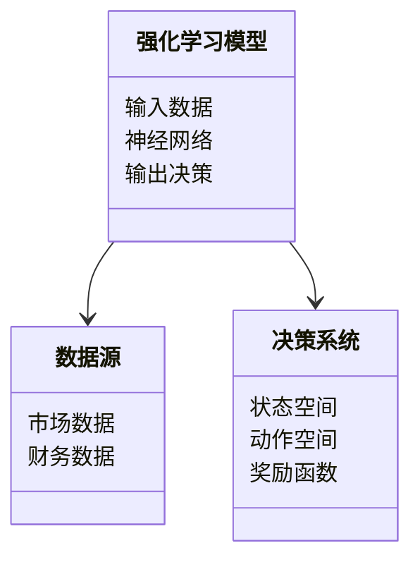

                 


# 《金融领域强化学习在多周期资产负债管理中的应用》

> 关键词：强化学习，多周期资产负债管理，金融市场，人工智能，风险管理，数学建模

> 摘要：本文系统性地探讨了强化学习在金融领域多周期资产负债管理中的应用，从基本概念、核心原理到实际案例，全面分析了强化学习在动态优化决策中的优势与挑战，旨在为金融从业者和研究人员提供理论与实践相结合的参考。

---

# 第一部分: 强化学习与金融领域的结合

## 第1章: 强化学习与金融领域概述

### 1.1 强化学习的基本概念

#### 1.1.1 强化学习的定义与特点
强化学习（Reinforcement Learning, RL）是一种机器学习范式，通过智能体与环境的交互，学习最优决策策略。其核心特点包括：
- **自主性**：智能体根据经验自主选择动作。
- **延迟反馈**：奖励信号通常延迟，且不直接指示正确动作。
- **策略优化**：通过最大化累计奖励来优化决策策略。

#### 1.1.2 强化学习的核心要素：状态、动作、奖励
- **状态（State）**：智能体所处环境的信息，如市场数据、资产配置等。
- **动作（Action）**：智能体在给定状态下采取的决策，如买入股票、卖出债券等。
- **奖励（Reward）**：智能体动作后获得的反馈，通常表示行为的优劣，如利润或损失。

#### 1.1.3 强化学习与监督学习、无监督学习的区别
| 方式       | 数据类型               | 目标                     | 是否需要标签 |
|------------|------------------------|--------------------------|--------------|
| 监督学习     | 结构化数据             | 预测或分类               | 需要         |
| 无监督学习   | 结构化、非结构化数据   | 聚类、降维               | 不需要        |
| 强化学习     | 状态空间、动作空间     | 最大化累计奖励           | 需要（奖励信号） |

---

### 1.2 金融领域的复杂性与挑战

#### 1.2.1 金融市场的不确定性
- **市场波动**：股票、债券等资产价格受多种因素影响，具有高度不确定性。
- **信息不对称**：市场参与者获取信息的不均衡性增加了决策难度。

#### 1.2.2 资产负债管理的核心问题
- **资产配置**：如何在不同资产之间分配资金，以实现风险和收益的平衡。
- **负债管理**：如何合理匹配负债的期限和成本，确保资金链的稳定性。

#### 1.2.3 多周期资产负债管理的复杂性
- **时间维度**：需要考虑多个时间周期的动态变化。
- **多目标优化**：在风险、收益、流动性等多个目标之间寻求平衡。

---

### 1.3 强化学习在金融领域的应用前景

#### 1.3.1 强化学习在金融中的潜在应用场景
- **交易决策**：优化买卖时机，提高投资收益。
- **风险控制**：实时监控和调整资产配置，降低风险敞口。
- **信用评分**：通过历史数据预测客户违约概率。

#### 1.3.2 强化学习在多周期资产负债管理中的优势
- **动态优化**：能够实时适应市场变化，做出最优决策。
- **复杂决策模拟**：在多目标优化场景下，强化学习能够模拟各种可能的决策组合。

#### 1.3.3 当前研究与实践中的挑战
- **高维状态空间**：金融市场涉及多个变量，导致状态空间维度高。
- **计算资源需求**：强化学习需要大量计算资源进行训练。
- **模型解释性**：黑箱模型的解释性较差，影响实际应用。

---

## 第2章: 多周期资产负债管理的强化学习建模

### 2.1 资产负债管理的核心问题

#### 2.1.1 资产负债管理的基本概念
- **资产**：企业持有的资源，如现金、股票、债券等。
- **负债**：企业欠他人的债务，如贷款、应付账款等。
- **资产负债管理**：通过优化资产和负债的结构和期限，实现企业财务目标。

#### 2.1.2 多周期资产负债管理的动态优化目标
- **收益最大化**：在风险可控的前提下，实现投资收益的最大化。
- **风险最小化**：通过合理配置资产，降低市场波动带来的风险。
- **流动性管理**：确保企业在需要时能够快速变现资产，满足资金需求。

#### 2.1.3 资产负债管理中的约束条件
- **资本充足率**：企业资本必须满足监管要求。
- **期限匹配**：资产和负债的期限需合理匹配，避免流动性风险。
- **风险承受能力**：根据企业风险偏好设定收益与风险的平衡点。

---

### 2.2 强化学习在多周期管理中的建模框架

#### 2.2.1 状态空间的定义与设计
- **状态定义**：包括市场指数、资产价格、企业财务指标等。
- **状态空间维度**：高维状态空间增加了建模的复杂性。

#### 2.2.2 动作空间的构建与优化
- **动作定义**：包括买入、卖出、持有等资产操作。
- **动作空间设计**：需要考虑动作的可行性及其对收益的影响。

#### 2.2.3 奖励函数的设计与实现
- **奖励定义**：通常为投资收益减去风险成本。
- **奖励信号强度**：需要平衡短期收益与长期目标。

---

### 2.3 多周期资产负债管理的强化学习模型

#### 2.3.1 基于价值函数的强化学习模型
- **Q-learning算法**：通过Q值表记录状态-动作对的期望收益，逐步逼近最优策略。
- **Deep Q-Networks (DQN)**：使用神经网络近似Q值函数，解决高维状态空间问题。

#### 2.3.2 基于策略梯度的强化学习模型
- **Policy Gradient方法**：直接优化策略，通过梯度上升方法寻找最优策略。
- ** Advantage Actor-Critic (A3C) 算法**：结合_actor_（策略）和 _critic_（价值函数），实现更稳定的训练过程。

#### 2.3.3 多智能体强化学习在多周期管理中的应用
- **多智能体系统**：多个智能体协同工作，分别负责不同资产的管理。
- **纳什均衡**：通过博弈论概念，寻找各智能体策略的最优均衡点。

---

## 第3章: 强化学习算法的数学模型与公式

### 3.1 基于价值函数的算法

#### 3.1.1 Q-learning算法的数学模型
$$ Q(s, a) = r + \gamma \max Q(s', a') $$
其中：
- $Q(s, a)$ 表示状态$s$和动作$a$的Q值。
- $r$ 是当前动作获得的奖励。
- $\gamma$ 是折扣因子，介于0和1之间。

#### 3.1.2 Deep Q-Networks (DQN) 的网络结构与训练过程
DQN使用两个神经网络，一个作为主网络，一个作为目标网络，通过经验回放和目标网络更新来稳定训练过程。

---

### 3.2 基于策略梯度的算法

#### 3.2.1 Policy Gradient方法的基本原理
$$ \nabla \theta \leftarrow \mathbb{E}[ \nabla \log \pi_\theta(a|s) Q(s,a) ] $$
其中：
- $\pi_\theta(a|s)$ 是策略函数，表示在状态$s$下选择动作$a$的概率。
- $Q(s,a)$ 是价值函数，表示从状态$s$采取动作$a$后的期望收益。

---

### 3.3 多智能体强化学习的数学模型

#### 3.3.1 多智能体系统的状态与动作空间
- **状态空间**：多个智能体共享或独立的状态信息。
- **动作空间**：每个智能体可执行的动作集合。

#### 3.3.2 基于中心化与去中心化价值函数的对比
- **中心化价值函数**：考虑所有智能体的联合状态。
- **去中心化价值函数**：每个智能体仅考虑自身状态。

---

## 第4章: 系统分析与架构设计方案

### 4.1 问题场景介绍

#### 4.1.1 多周期资产负债管理的业务流程
- **数据采集**：获取市场数据、企业财务数据等。
- **模型训练**：基于历史数据训练强化学习模型。
- **策略执行**：根据模型生成决策，调整资产配置。

#### 4.1.2 项目介绍
- **项目目标**：优化企业多周期资产负债管理，提升投资收益，降低风险敞口。
- **项目范围**：涵盖股票、债券、基金等多种资产类型。

---

### 4.2 系统功能设计

#### 4.2.1 领域模型（ER实体关系图）
```mermaid
erd
    股票
    债券
    现金
    企业
    市场
    风险
    资产
    负债
```

---

#### 4.2.2 系统架构设计（类图）


---

## 第5章: 项目实战

### 5.1 环境安装

#### 5.1.1 安装Python和相关库
```bash
pip install numpy
pip install matplotlib
pip install tensorflow
pip install gym
```

---

### 5.2 系统核心实现源代码

#### 5.2.1 Q-learning算法实现
```python
import numpy as np

class QLearning:
    def __init__(self, state_space_size, action_space_size, gamma=0.99):
        self.gamma = gamma
        self.q_table = np.zeros((state_space_size, action_space_size))
    
    def choose_action(self, state, epsilon=0.1):
        if np.random.random() < epsilon:
            return np.random.randint(0, action_space_size)
        return np.argmax(self.q_table[state, :])
    
    def update_q_table(self, current_state, action, reward, next_state):
        self.q_table[current_state, action] = reward + self.gamma * np.max(self.q_table[next_state, :])
```

---

### 5.3 实际案例分析与详细解读

#### 5.3.1 案例分析
假设我们管理一个简单的资产组合，包括股票和债券。通过Q-learning算法，优化资产配置策略，实现收益最大化。

---

## 第6章: 最佳实践与总结

### 6.1 最佳实践 tips
- **数据质量**：确保数据的完整性和准确性。
- **模型调优**：根据实际情况调整超参数，如学习率、折扣因子等。
- **风险控制**：设置止损点，避免过度风险暴露。

---

### 6.2 小结
本文详细探讨了强化学习在金融领域多周期资产负债管理中的应用，从基本概念到实际案例，系统性地分析了其优势与挑战。通过数学建模和算法实现，展示了强化学习在复杂金融问题中的巨大潜力。

---

### 6.3 注意事项
- **计算资源**：强化学习需要大量的计算资源，建议使用GPU加速。
- **模型解释性**：在实际应用中，需关注模型的可解释性，以便更好地理解和优化决策过程。

---

### 6.4 拓展阅读
- **书籍推荐**：《Reinforcement Learning: Theory and Algorithms》
- **论文推荐**：Nature的《Mastering the game of Go with deep neural networks and tree search》

---

# 作者：AI天才研究院/AI Genius Institute & 禅与计算机程序设计艺术 /Zen And The Art of Computer Programming

---

以上是《金融领域强化学习在多周期资产负债管理中的应用》的文章正文部分。通过系统性地分析和讲解，本文为读者提供了从理论到实践的完整指导，帮助他们在金融领域更好地理解和应用强化学习技术。

