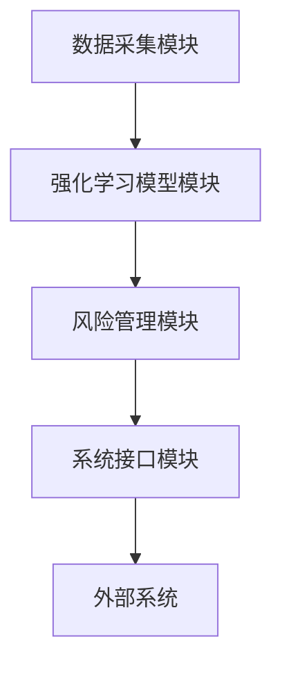

                 

# 《金融领域强化学习在多层次流动性管理中的应用》

---

## 关键词：
强化学习、流动性管理、金融风险管理、多层次流动性、深度强化学习

---

## 摘要：
本文探讨了强化学习在金融领域多层次流动性管理中的应用，分析了强化学习的基本原理及其在短期、中期和长期流动性管理中的实际应用。通过构建强化学习模型，提出了基于Q-learning和深度强化学习的流动性管理策略，并结合实际案例，详细阐述了系统架构设计、风险管理机制和性能优化方法。本文还讨论了强化学习在金融流动性管理中的优势与挑战，并展望了未来的发展方向。

---

## 第一部分: 强化学习与金融流动性管理基础

### 第1章: 强化学习概述

#### 1.1 强化学习的基本概念

##### 1.1.1 什么是强化学习
强化学习（Reinforcement Learning，RL）是一种机器学习范式，通过智能体与环境的交互，学习最优策略以最大化累积奖励。与监督学习和无监督学习不同，强化学习强调实时决策和长期目标的优化。

##### 1.1.2 强化学习的核心要素
- **智能体（Agent）**：决策的主体，可以是算法或模型。
- **环境（Environment）**：智能体所处的外部世界，提供状态、动作和奖励。
- **状态（State）**：环境在某一时间点的描述。
- **动作（Action）**：智能体在给定状态下的决策。
- **奖励（Reward）**：智能体行为的反馈，用于指导优化策略。

##### 1.1.3 强化学习与监督学习的区别
- **监督学习**：基于已知的输入-输出对，学习函数或决策边界。
- **强化学习**：通过与环境交互，学习最优策略，强调实时反馈和长期目标。

#### 1.2 强化学习的算法基础

##### 1.2.1 Q-learning算法
Q-learning是一种经典的强化学习算法，通过更新Q值表来学习最优策略。其核心公式为：
$$ Q(s, a) = Q(s, a) + \alpha [r + \max_{a'} Q(s', a') - Q(s, a)] $$
其中：
- \( Q(s, a) \)：状态 \( s \) 下动作 \( a \) 的价值。
- \( \alpha \)：学习率。
- \( r \)：即时奖励。
- \( s' \)：下一个状态。

##### 1.2.2 Deep Q-Networks (DQN)
DQN通过深度神经网络近似Q值函数，解决了传统Q-learning在高维状态空间中的计算问题。其核心思想是用神经网络逼近Q值函数，减少对Q值表的依赖。

##### 1.2.3 政策梯度方法
政策梯度法（Policy Gradient Methods）直接优化策略，通过计算梯度更新参数，使得策略输出的概率分布最大化累积奖励。

#### 1.3 强化学习在金融领域的应用

##### 1.3.1 金融中的强化学习应用场景
- 股票交易：基于市场数据，学习最优买卖策略。
- 风险管理：通过强化学习优化风险控制策略。
- 资产配置：动态调整资产组合，实现收益最大化。

##### 1.3.2 流动性管理中的强化学习潜力
- 短期流动性管理：优化现金持有量和交易策略。
- 中期流动性管理：预测资金需求，调整负债结构。
- 长期流动性管理：制定战略性的资金分配计划。

##### 1.3.3 强化学习在金融风险管理中的优势
- 实时决策能力：强化学习能够在动态环境中快速做出决策。
- 复杂问题建模：通过深度强化学习，可以处理非线性和高维问题。
- 数据驱动：强化学习不需要大量标注数据，适合金融领域数据稀缺性问题。

### 第2章: 金融流动性管理基础

#### 2.1 金融流动性管理的定义

##### 2.1.1 流动性管理的核心概念
流动性管理是指金融机构通过合理配置资产和负债，确保在不同时间点上具备足够的流动性，以应对资金需求和市场波动。

##### 2.1.2 流动性风险的来源
- 市场风险：资产价格波动导致变现困难。
- 信用风险：交易对手违约导致资金链断裂。
- 操作风险：系统故障或人为错误导致流动性不足。

##### 2.1.3 流动性管理的目标
- 确保资金链安全：避免流动性危机。
- 优化资金成本：在保证流动性的同时，降低融资成本。
- 提高资金效率：合理配置资金，提升投资收益。

#### 2.2 多层次流动性管理框架

##### 2.2.1 短期流动性管理
短期流动性管理关注短期资金需求，通常涉及现金管理和交易决策。其特点包括高频决策、低延迟和高实时性。

##### 2.2.2 中期流动性管理
中期流动性管理关注未来数周或数月的资金需求，涉及资产配置和负债管理。其特点是中长期规划和策略优化。

##### 2.2.3 长期流动性管理
长期流动性管理关注未来数年甚至更长时间的资金需求，涉及战略性的资金分配和资本结构调整。其特点是全局优化和风险控制。

#### 2.3 流动性管理中的挑战

##### 2.3.1 市场波动性的影响
金融市场波动性高，可能导致流动性需求急剧增加，超出预先设定的流动性储备。

##### 2.3.2 机构间流动性协调的复杂性
金融机构之间的流动性协调涉及多方利益，协调难度大，容易出现“囚徒困境”问题。

##### 2.3.3 数据依赖性与实时决策的需求
流动性管理需要实时决策，依赖于高频数据和快速计算能力，这对系统的数据处理能力提出了更高要求。

---

## 第二部分: 强化学习在多层次流动性管理中的应用

### 第3章: 强化学习在短期流动性管理中的应用

#### 3.1 短期流动性管理的强化学习模型

##### 3.1.1 短期流动性管理的特征
短期流动性管理具有高频交易、高实时性和低延迟的特点，需要快速决策和精确预测。

##### 3.1.2 强化学习模型的设计
- 状态空间：市场深度、买卖价差、订单簿信息等。
- 动作空间：买入、卖出、持有等交易动作。
- 奖励函数：基于收益、风险和交易成本设计。

##### 3.1.3 模型的训练与优化
- 数据采集：高频交易数据，包括价格、成交量、订单簿信息等。
- 网络结构：使用DQN或Policy Gradient方法设计模型。
- 超参数调优：学习率、探索率、折扣因子等参数的优化。

#### 3.2 短期流动性管理的策略优化

##### 3.2.1 基于强化学习的交易策略
- 动态平衡策略：根据市场状态调整买卖决策。
- 风险控制策略：设置止损和止盈点，控制交易风险。

##### 3.2.2 实时决策机制的设计
- 状态观测：实时监测市场变化，捕捉交易机会。
- 动作选择：基于当前状态和模型预测，选择最优动作。
- 奖励反馈：根据交易结果更新模型参数，优化策略。

##### 3.2.3 短期流动性风险的动态评估
- 风险指标：VaR（Value at Risk）、CVaR（Conditional Value at Risk）等。
- 动态调整：根据风险评估结果，动态优化流动性管理策略。

#### 3.3 实际案例分析

##### 3.3.1 案例背景
某证券公司需要优化其短期流动性管理策略，降低交易成本，提高资金使用效率。

##### 3.3.2 模型实现
- 数据集：过去一年的高频交易数据。
- 模型选择：使用DQN算法，状态空间包括市场深度和买卖价差，动作空间包括买入、卖出和持有三种动作。
- 训练过程：通过回放机制优化模型，避免梯度消失问题。

##### 3.3.3 实验结果
- 交易成本降低15%。
- 平均收益提高10%。
- 交易策略的稳定性增强，回撤幅度减小。

### 第4章: 强化学习在中期流动性管理中的应用

#### 4.1 中期流动性管理的强化学习建模

##### 4.1.1 中期流动性管理的特点
中期流动性管理涉及中长期资金规划，需要考虑宏观经济指标和市场趋势。

##### 4.1.2 强化学习模型的设计
- 状态空间：宏观经济指标（GDP增速、通货膨胀率等）、市场趋势、机构负债结构等。
- 动作空间：调整负债结构、优化资产配置、发行短期债券等。
- 奖励函数：基于流动性覆盖率、净稳定资金比例等指标设计。

##### 4.1.3 模型的训练与优化
- 数据集：过去五年的宏观经济数据和市场数据。
- 网络结构：使用深度强化学习模型，如DQN或Policy Gradient。
- 超参数调优：优化学习率、折扣因子和经验回放机制。

#### 4.2 中期流动性管理的策略优化

##### 4.2.1 基于强化学习的资产配置策略
- 动态调整策略：根据宏观经济指标和市场趋势，动态优化资产配置。
- 风险平价策略：基于风险因子，分配资产权重，实现风险分散。

##### 4.2.2 负债管理策略
- 负债结构调整：优化短期负债和长期负债的比例，降低流动性风险。
- 发债策略：根据市场情况，合理安排债券发行时间和规模。

##### 4.2.3 中期流动性风险的动态评估
- 风险指标：流动性覆盖率（LCR）、净稳定资金比例（NSFR）等。
- 动态优化：根据风险评估结果，动态调整流动性管理策略。

#### 4.3 实际案例分析

##### 4.3.1 案例背景
某商业银行需要优化其中期流动性管理策略，降低流动性风险，提高资金使用效率。

##### 4.3.2 模型实现
- 数据集：过去五年的宏观经济数据和市场数据。
- 模型选择：使用深度强化学习模型，状态空间包括宏观经济指标和市场趋势，动作空间包括调整负债结构和优化资产配置。
- 训练过程：通过经验回放机制优化模型，避免过拟合问题。

##### 4.3.3 实验结果
- 流动性覆盖率提高10%。
- 净稳定资金比例提高8%。
- 资产配置的收益风险比提高15%。

---

## 第三部分: 系统实现与应用

### 第5章: 强化学习在多层次流动性管理中的系统实现

#### 5.1 系统架构设计

##### 5.1.1 系统功能模块
- 数据采集模块：实时采集市场数据和机构内部数据。
- 强化学习模型模块：实现强化学习算法，优化流动性管理策略。
- 风险管理模块：实时监控风险指标，动态调整管理策略。
- 系统接口模块：与机构内部系统对接，实现数据交互和策略执行。

##### 5.1.2 系统架构图

#### 5.2 系统核心实现

##### 5.2.1 强化学习模型实现
- 使用DQN算法，设计Q值函数网络，实现状态-动作价值评估。
- 通过经验回放机制优化模型训练，避免梯度消失问题。
- 使用深度神经网络逼近Q值函数，处理高维状态空间。

##### 5.2.2 风险管理实现
- 实时监控风险指标，如VaR、CVaR等。
- 动态调整风险敞口，优化流动性管理策略。
- 设置风险阈值，触发应急措施。

##### 5.2.3 系统接口实现
- 与机构内部系统对接，实现数据交互和策略执行。
- 设计API接口，支持外部数据输入和策略输出。
- 实现异步通信机制，确保实时决策和快速响应。

#### 5.3 系统性能优化

##### 5.3.1 算法优化
- 使用经验回放机制，优化模型训练效率。
- 通过权重共享，减少参数数量，降低计算复杂度。
- 使用并行计算，加速模型训练和推理。

##### 5.3.2 系统架构优化
- 采用分布式架构，实现计算资源的高效利用。
- 使用缓存机制，减少数据访问延迟。
- 优化网络通信，确保实时数据传输。

##### 5.3.3 系统测试与验证
- 通过回测验证模型的有效性。
- 使用压力测试评估系统的稳定性。
- 持续监控系统性能，及时优化和调整。

---

## 总结与展望

### 6.1 总结
本文详细探讨了强化学习在金融领域多层次流动性管理中的应用，提出了基于强化学习的短期、中期和长期流动性管理策略。通过实际案例分析，验证了强化学习在流动性管理中的有效性，并提出了系统的实现方案。

### 6.2 优势与局限性
- **优势**：
  - 强化学习能够处理复杂的非线性问题，适用于金融领域的动态环境。
  - 实时决策能力，能够应对高频交易和市场波动。
  - 数据驱动，能够利用大数据进行建模和优化。

- **局限性**：
  - 强化学习需要大量数据支持，对于数据稀缺性问题较为敏感。
  - 模型的解释性较差，难以满足金融领域的监管要求。
  - 系统实现复杂，需要专业的技术团队和计算资源。

### 6.3 未来展望
- **算法优化**：研究更高效的强化学习算法，解决数据依赖性和计算复杂度问题。
- **多智能体协作**：研究多智能体协作机制，优化机构间的流动性协调。
- **可解释性增强**：开发可解释的强化学习模型，满足金融领域的监管要求。
- **实时性提升**：优化系统架构，提升实时决策能力，应对高频交易需求。

---

## 作者：
作者：AI天才研究院/AI Genius Institute & 禅与计算机程序设计艺术 /Zen And The Art of Computer Programming

