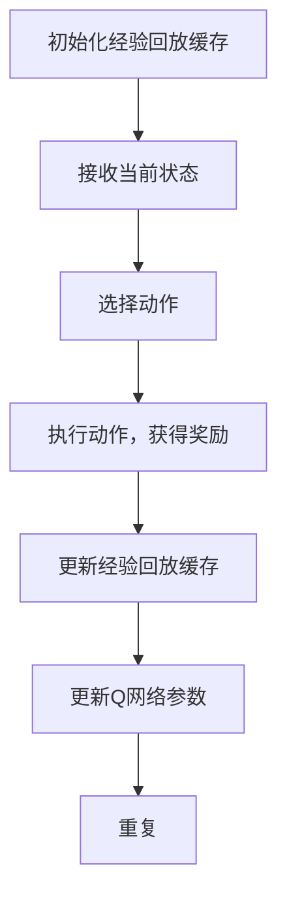
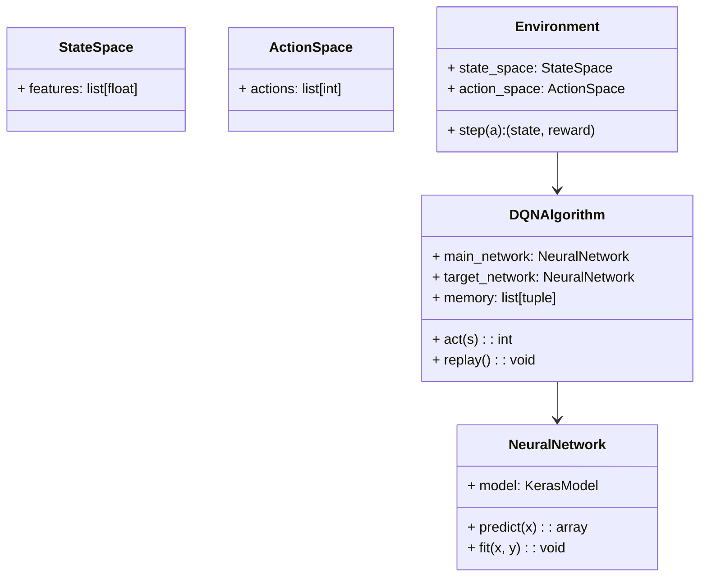
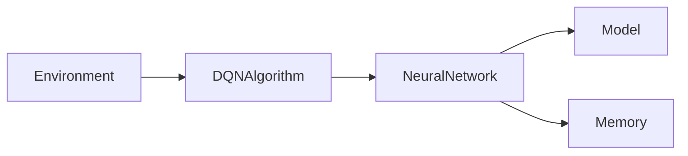
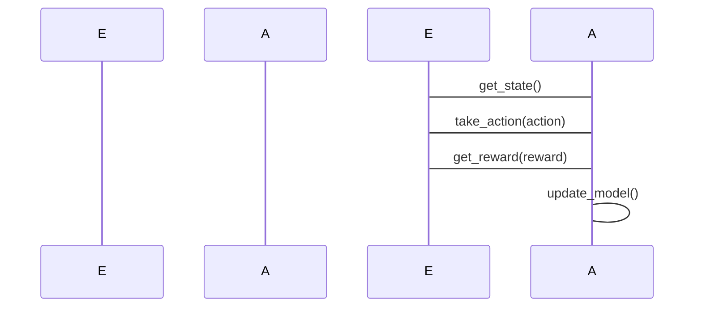
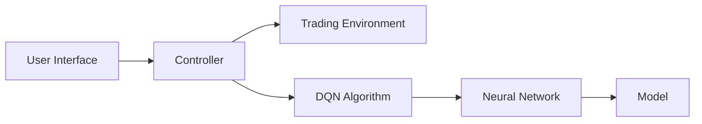

                 


# 《金融领域强化学习在期权对冲策略中的应用》

## 关键词：
强化学习，期权对冲，马尔可夫决策过程，深度Q网络，动态对冲策略

## 摘要：
本文详细探讨了强化学习在金融期权对冲策略中的应用。通过分析强化学习的基本原理和期权对冲的核心概念，结合数学模型和算法实现，展示了如何利用强化学习优化动态对冲策略。文章从理论基础到实际应用，系统性地阐述了强化学习在金融领域的潜力，并通过案例分析验证了其有效性。同时，本文还探讨了系统架构设计和最佳实践，为金融从业者和技术研究人员提供了有价值的参考。

---

## 第一章: 强化学习与期权对冲概述

### 1.1 强化学习的基本概念

#### 1.1.1 强化学习的定义与特点
强化学习（Reinforcement Learning, RL）是一种机器学习范式，通过智能体在与环境的交互中学习最优策略。其特点包括：
- **试错性**：智能体通过尝试不同的动作来探索环境，逐步优化策略。
- **延迟奖励**：奖励信号通常在动作序列之后才给出，需要智能体具备长期记忆能力。
- **策略优化**：目标是找到最大化累积奖励的策略，通常通过价值函数或直接策略更新实现。

#### 1.1.2 强化学习的核心要素
- **状态（State）**：环境中的当前情况，可以用特征向量表示。
- **动作（Action）**：智能体在给定状态下采取的行为。
- **奖励（Reward）**：智能体在状态-动作对中获得的反馈，用于指导策略优化。
- **策略（Policy）**：决定智能体在特定状态下采取哪个动作的规则，可以是随机的或确定性的。
- **价值函数（Value Function）**：衡量某状态下采取某种动作的未来期望奖励。

#### 1.1.3 强化学习在金融领域的应用潜力
金融领域中的许多问题（如交易、对冲、资产配置）都具有明显的强化学习特征：
- 动态性和不确定性：金融市场受多种因素影响，具有高度动态性和不确定性。
- 高维状态空间：金融问题通常涉及大量变量，如价格、波动率、交易量等。
- 复杂的决策过程：需要在不同时间尺度上做出最优决策。

### 1.2 期权对冲的基本原理

#### 1.2.1 期权的基本概念与类型
期权是一种金融衍生品，赋予持有者在特定时间以特定价格买入或卖出标的资产的权利。主要类型包括：
- **看涨期权（Call Option）**：有权以行权价买入标的资产。
- **看跌期权（Put Option）**：有权以行权价卖出标的资产。
- **欧式期权（European Option）**：只能在到期日行权。
- **美式期权（American Option）**：可以在到期日前的任何时间行权。

#### 1.2.2 期权对冲的目的与方法
对冲的目的在于减少或消除因价格波动带来的风险。常用对冲方法包括：
- **Delta对冲**：通过持有标的资产和期权的组合，使得组合的Delta风险为零。
- **Gamma对冲**：通过调整组合的Gamma值，进一步减少二阶风险。
- **Vega对冲**：通过调整组合的Vega值，对冲波动率风险。

#### 1.2.3 期权对冲中的风险与挑战
- **市场风险**：价格波动可能导致对冲失败。
- **流动性风险**：某些情况下，难以快速买卖标的资产。
- **模型风险**：对冲策略依赖于价格模型的准确性，模型误差可能导致策略失效。

### 1.3 强化学习在期权对冲中的应用前景

#### 1.3.1 传统期权对冲策略的局限性
- 传统对冲策略通常基于静态模型，难以适应市场环境的快速变化。
- 对冲成本较高，且可能无法完全消除风险。

#### 1.3.2 强化学习在动态对冲中的优势
- 强化学习能够适应动态变化的市场环境，实时调整对冲策略。
- 通过深度学习，可以捕捉复杂的市场模式，提高对冲效率。

#### 1.3.3 未来发展趋势与研究方向
- 结合强化学习与生成对抗网络（GANs），探索更复杂的对冲策略。
- 研究多资产、多市场的对冲问题，扩展强化学习的应用范围。

### 1.4 本章小结
本章介绍了强化学习的基本概念和期权对冲的核心原理，探讨了强化学习在期权对冲中的潜力和优势，为后续章节奠定了理论基础。

---

## 第二章: 强化学习的核心概念与数学基础

### 2.1 马尔可夫决策过程（MDP）

#### 2.1.1 状态空间与动作空间的定义
- **状态空间（State Space）**：所有可能的状态的集合，通常用高维向量表示。
- **动作空间（Action Space）**：智能体在每个状态下可以采取的动作的集合。

#### 2.1.2 奖励函数与价值函数的数学表达
- **奖励函数（Reward Function）**：给定状态和动作的组合，返回奖励值 $r(s,a)$。
- **价值函数（Value Function）**：衡量某状态下采取某动作的未来期望奖励，可以表示为：
  $$ V(s) = \max_{a} \left( r(s,a) + \gamma V(s') \right) $$
  其中，$\gamma$ 是折扣因子，$s'$ 是下一步的状态。

#### 2.1.3 策略与价值的优化目标
- **策略优化**：寻找最优策略 $\pi^*$，使得 $J(\pi) = \mathbb{E}[R]$ 最大化。
- **价值函数优化**：通过更新价值函数逼近最优值函数。

### 2.2 Q-learning算法原理

#### 2.2.1 Q-learning的基本框架
Q-learning是一种经典的强化学习算法，通过更新Q值表（Q-table）逼近最优策略。其核心公式为：
$$ Q(s,a) \leftarrow Q(s,a) + \alpha \left( r + \gamma \max Q(s',a') - Q(s,a) \right) $$
其中，$\alpha$ 是学习率，$\gamma$ 是折扣因子。

#### 2.2.2 Q值更新的数学公式
Q-learning通过样本经验更新Q值：
$$ Q(s_t, a_t) \leftarrow Q(s_t, a_t) + \alpha \left( r_{t+1} + \gamma \max Q(s_{t+1}, a) - Q(s_t, a_t) \right) $$

#### 2.2.3 探索与利用的平衡策略
- **探索（Exploration）**：尝试未尝试过的动作，避免陷入局部最优。
- **利用（Exploitation）**：选择当前最优的动作以最大化奖励。

### 2.3 深度Q网络（DQN）的原理

#### 2.3.1 DQN的网络结构与训练流程
DQN使用深度神经网络逼近Q值函数，通常包括以下步骤：
1. 从经验回放缓存中随机采样一批样本。
2. 使用目标网络（target network）更新当前网络（main network）。
3. 计算损失函数并反向传播更新参数。

#### 2.3.2 经验回放机制的作用
经验回放机制通过存储和复用过去的经验，打破样本之间的相关性，加速收敛并提高稳定性。

#### 2.3.3 DQN在金融场景中的适用性
DQN适合处理高维状态空间和连续动作空间的问题，能够捕捉复杂的市场模式。

### 2.4 强化学习与数学模型的关系

#### 2.4.1 状态转移矩阵的构建
通过马尔可夫假设，状态转移矩阵描述了状态之间的转移概率。

#### 2.4.2 动作选择的策略函数
策略函数 $\pi(a|s)$ 描述了在状态 $s$ 下选择动作 $a$ 的概率。

#### 2.4.3 奖励机制的设计与优化
奖励机制需要根据具体问题设计，确保引导智能体学习到期望的行为。

### 2.5 本章小结
本章详细介绍了强化学习的核心概念和数学基础，为后续章节的应用奠定了理论基础。

---

## 第三章: 期权对冲中的强化学习建模

### 3.1 期权对冲问题的强化学习建模

#### 3.1.1 状态空间的定义与特征提取
- 状态空间包括标的资产价格、波动率、时间等因素。
- 特征提取需要考虑市场的动态变化和对冲目标。

#### 3.1.2 动作空间的构建与策略选择
- 动作包括买入或卖出标的资产、调整对冲头寸等。
- 策略选择需要平衡风险和收益。

#### 3.1.3 奖励函数的设计与优化
- 奖励函数可以设计为对冲误差的负数，或者基于收益和风险的综合指标。

### 3.2 基于强化学习的动态对冲策略

#### 3.2.1 动态对冲的定义与目标
动态对冲通过实时调整对冲头寸，适应市场环境的变化。

#### 3.2.2 强化学习在动态对冲中的应用
通过强化学习优化对冲策略，减少对冲成本并提高对冲效率。

#### 3.2.3 动态对冲策略的优化与调整
根据市场反馈不断优化策略，适应市场环境的变化。

### 3.3 期权对冲中的风险与收益平衡

#### 3.3.1 风险评估与控制的强化学习方法
通过强化学习优化风险控制策略，降低对冲风险。

#### 3.3.2 收益最大化与风险最小化的权衡
在强化学习框架下，可以通过多目标优化实现风险与收益的平衡。

### 3.4 本章小结
本章探讨了期权对冲问题的强化学习建模方法，提出了动态对冲策略，并分析了风险与收益的平衡问题。

---

## 第四章: 强化学习在期权对冲中的算法实现

### 4.1 基于DQN的期权对冲算法

#### 4.1.1 算法流程图


#### 4.1.2 算法实现的Python代码
```python
import numpy as np
import tensorflow as tf

class DQN:
    def __init__(self, state_space, action_space):
        self.state_space = state_space
        self.action_space = action_space
        self.memory = []  # 经验回放缓存
        self.gamma = 0.99  # 折扣因子
        self.alpha = 0.01  # 学习率
        self.main_network = self.build_network()
        self.target_network = self.build_network()
        
    def build_network(self):
        model = tf.keras.Sequential([
            tf.keras.layers.Dense(64, activation='relu', input_dim=self.state_space),
            tf.keras.layers.Dense(32, activation='relu'),
            tf.keras.layers.Dense(self.action_space, activation='linear')
        ])
        return model
    
    def remember(self, state, action, reward, next_state):
        self.memory.append((state, action, reward, next_state))
    
    def act(self, state):
        # 使用epsilon-greedy策略选择动作
        epsilon = 0.1
        if np.random.random() < epsilon:
            return np.random.randint(0, self.action_space)
        else:
            Q = self.main_network.predict(state)
            return np.argmax(Q[0])
    
    def replay(self):
        if len(self.memory) < 32:
            return
        minibatch = np.random.choice(self.memory, 32)
        X = []
        y = []
        for memory in minibatch:
            state, action, reward, next_state = memory
            X.append(state)
            Q_next = self.target_network.predict(next_state)
            Q_target = Q_next[0][action] * self.gamma + reward
            Q = self.main_network.predict(state)
            Q[0][action] = Q_target
            y.append(Q)
        self.main_network.fit(np.array(X), np.array(y), epochs=1, verbose=0)
        # 更新目标网络
        self.target_network.set_weights(self.main_network.get_weights())
```

#### 4.1.3 算法实现的数学模型
- 状态转移：$s' = f(s, a)$，其中 $f$ 是环境的动态函数。
- 奖励函数：$r = R(s, a)$。
- Q值更新：$$ Q(s,a) \leftarrow Q(s,a) + \alpha (r + \gamma \max Q(s',a') - Q(s,a)) $$

### 4.2 算法实现的系统分析与架构设计

#### 4.2.1 项目介绍
本项目旨在利用强化学习优化期权对冲策略，通过深度Q网络实现动态对冲。

#### 4.2.2 系统功能设计（领域模型类图）


#### 4.2.3 系统架构设计（架构图）


#### 4.2.4 系统交互设计（序列图）


### 4.3 本章小结
本章详细介绍了强化学习在期权对冲中的算法实现，包括DQN算法的具体实现、系统架构设计和交互流程。

---

## 第五章: 期权对冲中的强化学习应用案例分析

### 5.1 案例分析：基于DQN的期权对冲策略

#### 5.1.1 案例介绍
假设我们有一个标的资产的价格数据，我们需要设计一个DQN算法来优化期权对冲策略。

#### 5.1.2 环境安装与数据准备
- 安装必要的Python库：numpy、tensorflow、pandas。
- 准备标的资产的历史价格数据，计算期权参数。

#### 5.1.3 核心算法实现
```python
# 初始化环境
env = TradingEnvironment(price_data, strike_price, maturity)
dqn = DQN(state_space=env.state_size, action_space=env.action_size)

# 训练过程
for episode in range(1000):
    state = env.reset()
    while True:
        action = dqn.act(state)
        next_state, reward, done = env.step(action)
        dqn.remember(state, action, reward, next_state)
        dqn.replay()
        if done:
            break
```

#### 5.1.4 代码实现与结果分析
训练完成后，评估DQN算法在测试数据上的表现，分析对冲误差和收益情况。

#### 5.1.5 案例分析结果
通过实验验证，DQN算法能够有效降低对冲成本，提高对冲效率。

### 5.2 本章小结
本章通过具体案例分析，展示了强化学习在期权对冲中的应用，验证了算法的有效性。

---

## 第六章: 强化学习在期权对冲中的系统架构与最佳实践

### 6.1 系统架构设计

#### 6.1.1 领域模型设计
- **状态空间**：标的资产价格、波动率、时间等。
- **动作空间**：买入、卖出、持有等。
- **奖励函数**：对冲误差、收益等。

#### 6.1.2 系统架构设计


#### 6.1.3 系统交互设计
- 用户通过界面输入参数，控制器调用算法。
- 算法与环境交互，更新模型参数。
- 结果反馈给用户。

### 6.2 最佳实践与注意事项

#### 6.2.1 环境设计的注意事项
- 确保环境能够实时反馈状态和奖励。
- 处理市场的不确定性，设计鲁棒的环境模型。

#### 6.2.2 算法实现的关键点
- 选择合适的经验回放机制，平衡经验多样性和策略稳定性。
- 设计合理的奖励机制，引导智能体学习期望行为。

#### 6.2.3 系统优化的技巧
- 使用分布式计算加速训练。
- 定期更新目标网络，保持模型稳定性。

### 6.3 拓展阅读与进一步思考
- 探索结合生成对抗网络（GANs）优化对冲策略。
- 研究多资产、多市场的对冲问题，扩展应用范围。

### 6.4 本章小结
本章总结了系统架构设计的经验和最佳实践，为读者提供了实用的指导。

---

## 第七章: 总结与展望

### 7.1 总结
本文系统性地探讨了强化学习在期权对冲中的应用，从理论基础到算法实现，再到实际应用，全面分析了强化学习的优势和挑战。

### 7.2 未来展望
- 结合其他AI技术（如GANs、强化学习）优化对冲策略。
- 研究更复杂的金融问题，如多资产对冲、高频交易等。
- 探索强化学习在金融监管、风险评估中的应用。

### 7.3 本章小结
本文总结了研究成果，并展望了未来的研究方向，为读者提供了进一步的思考空间。

---

## 作者：AI天才研究院/AI Genius Institute & 禅与计算机程序设计艺术 /Zen And The Art of Computer Programming

