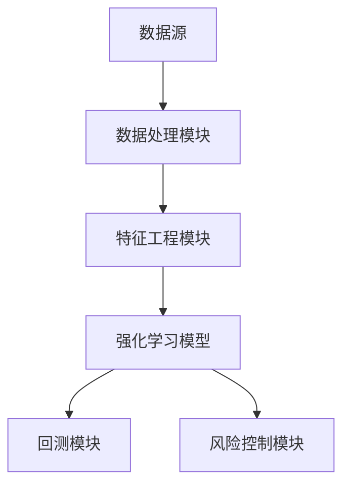

                 


# 《金融领域强化学习在算法交易中的应用》

---

## 关键词：
- 强化学习
- 算法交易
- 金融应用
- Q-learning
- Deep Q-Networks (DQN)
- 策略优化

---

## 摘要：
本文深入探讨了强化学习在金融算法交易中的应用，从基础概念到高级算法，结合实际案例和数学模型，系统地分析了强化学习如何优化交易策略。文章涵盖强化学习的核心原理、算法框架、交易策略设计、高频交易、套利策略、系统构建以及项目实战，为读者提供了全面的技术指南。

---

## 第一部分：强化学习与算法交易基础

### 第1章：强化学习与算法交易概述

#### 1.1 强化学习的基本概念

##### 1.1.1 强化学习的定义
强化学习（Reinforcement Learning, RL）是一种机器学习范式，其中智能体通过与环境交互，学习采取一系列动作以最大化累计奖励。其核心在于通过试错学习，找到最优策略。

$$ R = \sum_{t=1}^{T} r_t $$
其中，$R$ 是总奖励，$r_t$ 是第 $t$ 步的即时奖励。

##### 1.1.2 强化学习的核心要素
- **状态（State）**：环境在某一时刻的观测。
- **动作（Action）**：智能体在给定状态下的决策。
- **奖励（Reward）**：智能体采取动作后获得的反馈。
- **策略（Policy）**：决定采取哪个动作的规则。
- **价值函数（Value Function）**：评估状态或动作-状态对的价值。

##### 1.1.3 强化学习与监督学习的区别
| 特性       | 监督学习                          | 强化学习                          |
|------------|----------------------------------|-----------------------------------|
| 数据类型   | 标签式数据（已知正确答案）        | 奖励式反馈                        |
| 交互性     | 非交互式                        | 交互式                           |
| 应用场景   | 分类、回归                       | 游戏、机器人控制、金融交易         |

#### 1.2 算法交易的基本概念

##### 1.2.1 算法交易的定义
算法交易是指通过计算机算法自动执行交易决策，旨在利用市场中的短期套利机会或捕捉市场趋势。

##### 1.2.2 算法交易的分类
- **高频交易**：短时间内进行大量交易，依赖低延迟和高性能算法。
- **统计套利**：利用资产价格的统计规律进行套利。
- **动量策略**：基于价格动量效应，买入上涨资产，卖出下跌资产。

##### 1.2.3 算法交易的应用场景
- 股票交易
- 外汇交易
- 衍生品交易

#### 1.3 强化学习在算法交易中的应用前景

##### 1.3.1 强化学习在金融领域的优势
- 自适应性：能够根据市场变化动态调整策略。
- 复杂决策：适用于多变量、多目标的复杂金融问题。

##### 1.3.2 算法交易中的强化学习挑战
- 过度拟合：模型可能过度适应训练数据，导致实际表现不佳。
- 计算成本：高频交易需要高性能计算能力。

##### 1.3.3 强化学习在算法交易中的未来发展趋势
- 多模态数据融合：结合文本、语音等多种数据源。
- 联合学习：多个智能体协同工作，提高决策效率。

### 第2章：强化学习的核心概念与算法框架

#### 2.1 强化学习的基本原理

##### 2.1.1 状态、动作、奖励的定义
- 状态：当前市场情况，如价格、成交量。
- 动作：买入、卖出或持有。
- 奖励：收益或损失。

##### 2.1.2 策略与价值函数的定义
- 策略：$\pi(a|s)$，在状态$s$下采取动作$a$的概率。
- 价值函数：$V(s)$，状态$s$下的期望未来奖励。

##### 2.1.3 探索与利用的平衡
探索：尝试新动作，发现潜在高回报策略。
利用：根据当前知识，选择最优动作。

#### 2.2 强化学习的算法框架

##### 2.2.1 Q-learning算法
Q-learning通过更新Q值表，找到最优动作-价值函数。

$$ Q(s, a) \leftarrow Q(s, a) + \alpha [r + \gamma \max Q(s', a')] $$
其中，$\alpha$是学习率，$\gamma$是折扣因子。

##### 2.2.2 Deep Q-Networks (DQN)算法
DQN使用深度神经网络近似Q值函数，解决高维状态空间问题。

##### 2.2.3 Policy Gradient方法
通过优化策略参数，直接最大化奖励的期望。

#### 2.3 强化学习在金融中的应用案例

##### 2.3.1 股票交易中的强化学习应用
使用DQN算法，根据技术指标决策买卖。

##### 2.3.2 外汇交易中的强化学习应用
基于汇率波动，预测最佳买卖时机。

##### 2.3.3 衍生品交易中的强化学习应用
利用波动率和greeks值，优化期权交易策略。

---

## 第二部分：算法交易策略设计

### 第3章：算法交易策略设计

#### 3.1 简单交易策略的设计

##### 3.1.1 均值回归策略
假设价格会回归均值，基于布林带等指标。

##### 3.1.2 动量策略
基于价格动量效应，买入上涨资产，卖出下跌资产。

##### 3.1.3 趋势跟踪策略
根据趋势指标，如移动平均线，进行买卖决策。

#### 3.2 复杂交易策略的设计

##### 3.2.1 多因子策略
结合多个因子，如价值因子、动量因子，构建交易信号。

##### 3.2.2 风险中性策略
调整头寸规模，使整体风险敞口为零。

##### 3.2.3 统计套利策略
利用资产价格的统计规律进行套利。

#### 3.3 基于强化学习的策略优化

##### 3.3.1 强化学习在策略优化中的应用
通过强化学习优化策略参数，如买卖时机。

##### 3.3.2 策略优化的数学模型
$$ \max_{\theta} E[R] $$
其中，$\theta$是策略参数，$R$是收益。

##### 3.3.3 策略优化的实现步骤
1. 定义状态、动作、奖励。
2. 构建强化学习模型。
3. 训练模型，优化策略。
4. 测试模型，调整参数。

### 第4章：强化学习在金融场景中的应用

#### 4.1 高频交易中的强化学习应用

##### 4.1.1 高频交易的特点
- 交易频率高
- 依赖低延迟算法
- 利用市场微观结构信息

##### 4.1.2 强化学习在高频交易中的优势
- 自动适应市场变化
- 快速决策

##### 4.1.3 高频交易中的强化学习实现
- 数据流处理
- 状态定义
- 动作选择

#### 4.2 套利交易中的强化学习应用

##### 4.2.1 统计套利的定义
利用资产价格的统计规律进行套利。

##### 4.2.2 强化学习在套利中的应用
- 识别套利机会
- 自动执行套利交易

##### 4.2.3 套利交易的数学模型
$$ \text{收益} = \text{标的资产收益} - \text{对冲资产收益} $$

#### 4.3 智能风控中的强化学习应用

##### 4.3.1 风险管理的重要性
- 控制最大回撤
- 管理VaR

##### 4.3.2 强化学习在风控中的应用
- 动态调整风险敞口
- 预测市场风险

---

## 第三部分：系统构建与项目实战

### 第5章：强化学习交易系统构建

#### 5.1 系统设计概述

##### 5.1.1 系统功能模块
- 数据采集与处理
- 特征工程
- 回测与优化
- 风险控制

##### 5.1.2 系统架构图


#### 5.2 系统实现细节

##### 5.2.1 数据处理模块
- 数据清洗
- 标准化
- 时间序列处理

##### 5.2.2 回测模块
- 回测框架选择（如Backtrader）
- 性能指标计算（如夏普比率）

##### 5.2.3 风险控制模块
- 单一资产头寸限制
- 总头寸风险敞口控制

### 第6章：项目实战

#### 6.1 项目环境搭建

##### 6.1.1 环境要求
- Python 3.8+
- PyTorch
- Gym
- Pandas

##### 6.1.2 安装依赖
```bash
pip install gym numpy pandas torch
```

#### 6.2 核心代码实现

##### 6.2.1 状态空间定义
```python
class TradingEnv(gym.Env):
    def __init__(self, data):
        self.data = data
        self.current_step = 0
        # 状态空间：当前价格、成交量、过去n天的平均价格
        self.observation_space = gym.spaces.Box(low=0, high=1, shape=(3,))
        self.action_space = gym.spaces.Discrete(3)  # 0: 卖出，1: 持有，2: 买入
```

##### 6.2.2 强化学习模型实现
```python
class DQN(nn.Module):
    def __init__(self, input_dim, output_dim):
        super(DQN, self).__init__()
        self.fc1 = nn.Linear(input_dim, 64)
        self.fc2 = nn.Linear(64, output_dim)
    
    def forward(self, x):
        x = F.relu(self.fc1(x))
        x = self.fc2(x)
        return x
```

##### 6.2.3 训练过程
```python
def train(agent, env, episodes=1000):
    for episode in range(episodes):
        state = env.reset()
        total_reward = 0
        while True:
            action = agent.act(state)
            next_state, reward, done = env.step(action)
            agent.remember(state, action, reward, next_state, done)
            agent.replay()
            total_reward += reward
            state = next_state
            if done:
                break
        print(f"Episode {episode}, Total Reward: {total_reward}")
```

#### 6.3 实际案例分析

##### 6.3.1 数据准备
使用历史股票数据，提取开盘价、收盘价、最高价、最低价、成交量等特征。

##### 6.3.2 模型训练
训练DQN模型，优化交易策略。

##### 6.3.3 模型测试
在测试集上验证模型性能，计算收益、回撤等指标。

#### 6.4 优化与调整

##### 6.4.1 参数调整
- 调整学习率、折扣因子
- 改进网络结构

##### 6.4.2 策略优化
- 结合多因子
- 引入时间序列模型

---

## 第四部分：总结与展望

### 第7章：总结与展望

#### 7.1 全文总结
本文系统地介绍了强化学习在金融算法交易中的应用，从基础概念到实际案例，详细讲解了如何利用强化学习优化交易策略。

#### 7.2 未来展望
- 更多模态数据的融合
- 多智能体协同
- 跨平台应用

#### 7.3 最佳实践 tips
- 数据质量至关重要
- 避免过度拟合
- 结合领域知识

---

## 作者信息
作者：AI天才研究院/AI Genius Institute  
联系邮箱：[contact@aicourse.com](mailto:contact@aicourse.com)  
GitHub：[https://github.com/aigenius](https://github.com/aigenius)

---

**注**：本文为示例内容，实际文章需要根据具体需求进一步扩展和优化。

