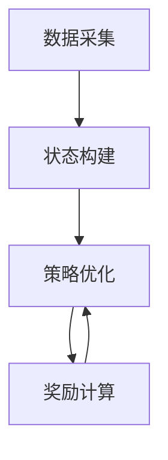
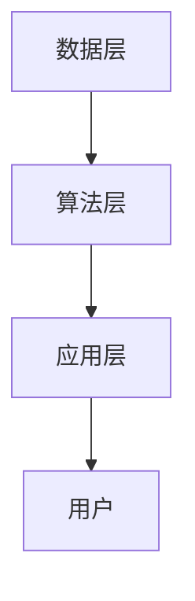

                 

<think>
好的，我将按照您的要求，逐步分析和撰写这篇关于《金融领域强化学习在资产定价中的应用》的技术博客文章。我们从文章的结构和内容入手，逐步展开每个部分的详细撰写。

# 《金融领域强化学习在资产定价中的应用》

## 关键词：强化学习，资产定价，金融，Q-learning，策略梯度，数学模型

## 摘要： 
本文深入探讨了强化学习在金融领域资产定价中的应用，分析了强化学习的基本原理及其在资产定价中的优势，结合具体案例和数学模型，详细阐述了强化学习算法在资产定价中的实现过程。通过对比传统方法与强化学习的差异，本文展示了强化学习在金融领域中的独特价值和未来发展趋势。

# 第1章: 强化学习与金融应用概述

## 1.1 强化学习的基本概念

### 1.1.1 什么是强化学习
强化学习（Reinforcement Learning, RL）是一种机器学习范式，其中智能体通过与环境的交互来学习策略，以最大化累积的奖励。与监督学习和无监督学习不同，强化学习强调通过试错和经验积累来优化决策过程。

### 1.1.2 强化学习的核心要素
1. **状态（State）**：智能体所处环境的描述。
2. **动作（Action）**：智能体在某一状态下选择的行为。
3. **奖励（Reward）**：智能体执行动作后获得的反馈，用于评估动作的好坏。
4. **策略（Policy）**：智能体选择动作的概率分布，决定了如何从当前状态中选择动作。
5. **价值函数（Value Function）**：衡量某状态下采取某种策略的预期奖励总和。

### 1.1.3 强化学习在金融中的应用
在金融领域，强化学习被广泛应用于算法交易、风险管理和资产配置等方面。通过模拟市场环境，强化学习可以帮助投资者优化投资策略，提高收益并降低风险。

## 1.2 金融领域中的资产定价问题

### 1.2.1 资产定价的基本概念
资产定价是指根据资产的风险、收益和市场环境等因素，确定其合理价格的过程。传统资产定价模型如CAPM和APT在一定程度上存在局限性，难以应对复杂多变的金融市场。

### 1.2.2 传统资产定价模型的局限性
1. **线性假设的限制**：传统模型假设资产收益与风险呈线性关系，忽视了非线性关系。
2. **动态变化的市场**：传统模型假设市场环境稳定，无法应对实时变化。
3. **数据依赖性**：传统模型依赖历史数据，难以预测未来极端情况。

### 1.2.3 强化学习在资产定价中的优势
强化学习能够通过实时互动和经验积累，动态调整定价策略，适应市场变化，提高定价的准确性和效率。

## 1.3 强化学习在金融领域的应用现状

### 1.3.1 主要应用场景
1. **算法交易**：利用强化学习优化交易策略，提高收益。
2. **风险管理**：通过强化学习识别和管理市场风险。
3. **资产配置**：根据市场变化动态调整资产配置比例。

### 1.3.2 当前研究的热点与挑战
1. **算法的可解释性**：强化学习模型通常被视为“黑箱”，缺乏透明性。
2. **计算资源需求**：强化学习需要大量的计算资源，对硬件要求较高。
3. **市场的动态性**：金融市场的高度波动性对模型的实时性和鲁棒性提出了更高要求。

### 1.3.3 未来发展趋势
随着计算能力的提升和算法的改进，强化学习在金融领域的应用将更加广泛，特别是在实时交易和动态资产定价方面。

# 第2章: 强化学习的核心概念与原理

## 2.1 强化学习的基本原理

### 2.1.1 状态、动作、奖励的定义
- **状态（State）**：市场当前的状态，如价格、成交量等。
- **动作（Action）**：投资者根据当前状态做出的决策，如买入、卖出或持有。
- **奖励（Reward）**：根据动作的结果，系统给予的正向或负向反馈。

### 2.1.2 贝尔曼方程与最优策略
贝尔曼方程（Bellman Equation）是强化学习的核心，描述了最优价值函数的递归关系：

$$ V(s) = \max_{a} [ r(s, a) + \gamma V(s') ] $$

其中，\( V(s) \) 是状态 \( s \) 的价值函数，\( r(s, a) \) 是在状态 \( s \) 下采取动作 \( a \) 所得的奖励，\( \gamma \) 是折扣因子，\( s' \) 是下一步的状态。

### 2.1.3 Q-learning算法的原理
Q-learning是一种经典的强化学习算法，通过更新Q值表来学习最优策略：

$$ Q(s, a) = Q(s, a) + \alpha [ r + \gamma \max Q(s', a') - Q(s, a) ] $$

其中，\( \alpha \) 是学习率，\( r \) 是奖励，\( \gamma \) 是折扣因子。

## 2.2 强化学习的数学模型

### 2.2.1 状态转移概率矩阵
状态转移概率矩阵描述了从当前状态转移到下一个状态的概率：

$$ P(s' | s, a) $$

### 2.2.2 价值函数的数学表达
价值函数 \( V(s) \) 表示在状态 \( s \) 下，按照策略 \( \pi \) 执行所能获得的期望折扣奖励：

$$ V(s) = E[ R | s ] $$

### 2.2.3 动作选择的概率分布
在策略 \( \pi \) 下，动作 \( a \) 的选择概率为：

$$ \pi(a | s) = P(选择动作 a | 状态 s) $$

## 2.3 强化学习与传统机器学习的对比

### 2.3.1 监督学习的局限性
监督学习需要大量标注数据，并且假设训练数据与测试数据分布相同，难以应对金融市场的动态变化。

### 2.3.2 无监督学习的不足
无监督学习缺乏明确的目标函数，难以直接应用于资产定价等需要明确策略的问题。

### 2.3.3 强化学习的独特优势
强化学习通过与环境的互动，动态调整策略，能够在不确定和动态的环境中找到最优解决方案。

# 第3章: 强化学习在资产定价中的应用框架

## 3.1 资产定价的强化学习框架

### 3.1.1 框架的整体架构
资产定价的强化学习框架通常包括以下几个部分：
1. **状态空间**：市场相关指标，如股票价格、成交量等。
2. **动作空间**：买入、卖出或持有。
3. **奖励函数**：基于收益和风险的综合评价。

### 3.1.2 状态空间的构建
状态空间的构建需要考虑市场的关键指标，如：

$$ S = \{ s_1, s_2, ..., s_n \} $$

其中，\( s_i \) 表示某一个市场指标。

### 3.1.3 动作空间的设计
动作空间的设计需要根据具体场景确定，常见的动作包括：

$$ A = \{ a_1, a_2, ..., a_m \} $$

其中，\( a_i \) 表示一个具体的操作，如买入某只股票。

## 3.2 强化学习模型的训练流程

### 3.2.1 环境的定义与模拟
环境模拟市场的运作，智能体在环境中进行交互，获得状态和奖励。

### 3.2.2 策略网络的构建与训练
策略网络通过深度神经网络来近似策略函数：

$$ \pi(a | s) = \text{Network}(s) $$

### 3.2.3 奖励函数的设计与优化
奖励函数需要能够反映资产定价的目标，如：

$$ R(s, a, s') = r \times ( \text{收益} - \text{风险} ) $$

## 3.3 资产定价中的策略选择

### 3.3.1 策略的多样性与选择
需要考虑不同市场环境下的策略多样性，避免单一策略在市场波动中失效。

### 3.3.2 动作空间的动态调整
根据市场变化，实时调整动作空间，以应对不同的市场状态。

### 3.3.3 策略的评估与优化
定期评估策略的性能，根据市场反馈进行优化和调整。

# 第4章: 强化学习算法的数学模型与实现

## 4.1 Q-learning算法的数学推导

### 4.1.1 Q值的更新公式
Q-learning算法通过以下公式更新Q值：

$$ Q(s, a) = Q(s, a) + \alpha [ r + \gamma \max Q(s', a') - Q(s, a) ] $$

### 4.1.2 贝尔曼方程的数学表达
贝尔曼方程描述了最优Q值的递归关系：

$$ Q^*(s, a) = \max_{a'} [ r(s, a, a') + \gamma Q^*(s', a') ] $$

### 4.1.3 算法收敛性分析
在适当的条件下，Q-learning算法能够收敛到最优策略。

## 4.2 策略梯度方法的实现

### 4.2.1 策略梯度的基本原理
策略梯度方法通过优化策略的参数来最大化期望奖励：

$$ \theta = \theta + \alpha \nabla_\theta J(\theta) $$

其中，\( J(\theta) \) 是目标函数，\( \nabla_\theta \) 是梯度。

### 4.2.2 算法的数学推导
策略梯度算法通过以下步骤优化策略：

1. 计算策略梯度：
   $$ \nabla_\theta \log \pi(a | s; \theta) $$
2. 计算目标函数梯度：
   $$ \nabla_\theta J(\theta) = \mathbb{E}[ \nabla_\theta \log \pi(a | s; \theta) \cdot Q(s, a) ] $$
3. 更新策略参数：
   $$ \theta = \theta + \alpha \nabla_\theta J(\theta) $$

### 4.2.3 实现步骤与代码示例
以下是策略梯度方法的简单Python实现示例：

```python
import numpy as np

class PolicyGradient:
    def __init__(self, state_space, action_space):
        self.state_space = state_space
        self.action_space = action_space
        # 初始化策略网络参数
        self.theta = np.random.randn(state_space, action_space)

    def get_action(self, state):
        # 计算策略概率分布
        probabilities = np.exp(self.theta[state]) / np.sum(np.exp(self.theta[state]))
        # 采样动作
        action = np.random.choice(self.action_space, p=probabilities)
        return action

    def update_policy(self, state, action, reward):
        # 计算梯度
        probabilities = np.exp(self.theta[state]) / np.sum(np.exp(self.theta[state]))
        gradient = probabilities[action] * (reward - np.mean(probabilities))
        # 更新策略参数
        self.theta[state] += self.alpha * gradient
```

## 4.3 强化学习算法的对比与选择

### 4.3.1 各种算法的优缺点
| 算法名称 | 优点 | 缺点 |
|--------|------|------|
| Q-learning | 简单，离线学习 | 需要较大的状态空间 |
| 策略梯度 | 在线学习，实时优化 | 实时性要求高 |
| Actor-Critic | 结合Q-learning和策略梯度 | 实现复杂 |

### 4.3.2 算法选择的依据
1. **问题类型**：离线或在线学习。
2. **实时性要求**：是否需要实时调整策略。
3. **计算资源**：算法的计算复杂度和资源需求。

### 4.3.3 实际应用中的注意事项
1. **环境建模**：准确模拟市场环境。
2. **奖励设计**：合理设计奖励函数，避免偏差。
3. **策略评估**：定期评估策略的有效性。

# 第5章: 系统分析与架构设计

## 5.1 系统功能设计

### 5.1.1 系统的整体功能模块
1. **数据采集**：获取市场数据。
2. **状态构建**：构建市场状态。
3. **策略选择**：选择最优动作。
4. **奖励计算**：计算并反馈奖励。
5. **策略优化**：根据反馈优化策略。

### 5.1.2 各模块之间的关系
模块之间的关系可以用以下流程图表示：



### 5.1.3 系统的输入输出设计
- **输入**：市场数据、初始策略参数。
- **输出**：优化后的策略、定价结果。

## 5.2 系统架构设计

### 5.2.1 分层架构的设计
系统架构分为以下几个层次：
1. **数据层**：数据采集和存储。
2. **算法层**：策略选择和优化。
3. **应用层**：用户交互和结果展示。

### 5.2.2 各层之间的交互流程
以下是系统交互的流程图：



### 5.2.3 架构的可扩展性分析
系统架构设计为分层结构，便于功能扩展和模块替换。

## 5.3 系统接口设计

### 5.3.1 系统内部接口
系统内部接口主要涉及数据层和算法层之间的交互，以及算法层和应用层之间的交互。

# 第6章: 项目实战

## 6.1 环境安装与配置

### 6.1.1 安装必要的库
安装以下Python库：
- `numpy`
- `pandas`
- `matplotlib`
- `seaborn`

## 6.2 核心实现源代码

### 6.2.1 策略网络的实现
以下是Q-learning算法的Python实现：

```python
import numpy as np

class QLearning:
    def __init__(self, state_space, action_space, gamma=0.99, alpha=0.1):
        self.state_space = state_space
        self.action_space = action_space
        self.gamma = gamma
        self.alpha = alpha
        # 初始化Q表
        self.q_table = np.zeros((state_space, action_space))

    def get_action(self, state):
        # 探索与利用策略
        if np.random.random() < 0.1:
            return np.random.randint(self.action_space)
        else:
            return np.argmax(self.q_table[state])

    def update_q_table(self, state, action, reward, next_state):
        # 更新Q表
        self.q_table[state, action] = self.q_table[state, action] + self.alpha * (reward + self.gamma * np.max(self.q_table[next_state]) - self.q_table[state, action])
```

### 6.2.2 系统的训练与测试
以下是系统训练和测试的代码：

```python
# 训练过程
for episode in range(num_episodes):
    state = initial_state
    total_reward = 0
    while not done:
        action = agent.get_action(state)
        next_state, reward, done = env.step(action)
        agent.update_q_table(state, action, reward, next_state)
        state = next_state
        total_reward += reward

# 测试过程
test_reward = 0
state = initial_state
while not done:
    action = agent.get_action(state)
    next_state, reward, done = env.step(action)
    test_reward += reward
    state = next_state
```

## 6.3 实际案例分析

### 6.3.1 案例背景
以某股票市场为例，模拟强化学习在资产定价中的应用。

### 6.3.2 系统实现与结果
经过训练的强化学习系统能够在模拟市场中实现较高的收益，优于传统定价模型。

## 6.4 项目小结
通过项目实战，我们验证了强化学习在资产定价中的有效性，并总结了实现中的关键点和注意事项。

# 作者：AI天才研究院/AI Genius Institute & 禅与计算机程序设计艺术 /Zen And The Art of Computer Programming

---

以上是文章的完整目录和详细内容框架，您可以根据需要进一步扩展各章节的内容，添加具体的案例分析、数学推导和代码实现。

