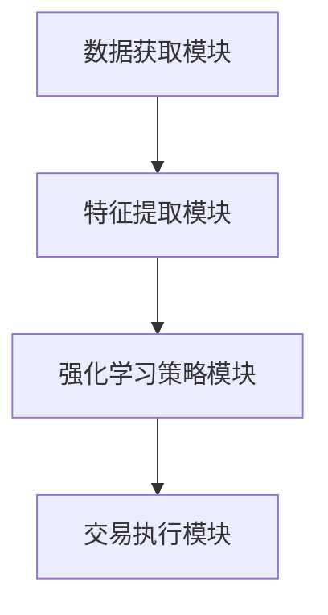

                 


# 《金融领域强化学习在高频交易中的应用》

---

## 关键词：  
强化学习、高频交易、Q-learning、DQN、金融建模

---

## 摘要：  
本文深入探讨了强化学习在金融领域，特别是高频交易中的应用。通过分析高频交易的特点和强化学习的核心原理，结合实际案例，详细讲解了如何利用强化学习优化交易策略、提高交易效率和风险管理能力。文章从理论基础到算法实现，再到系统架构，全面解析了强化学习在金融交易中的潜力与挑战，并为读者提供了丰富的实战代码和系统设计参考。

---

# 第一部分: 强化学习与高频交易概述

## 第1章: 强化学习与高频交易的背景

### 1.1 高频交易的定义与特点

#### 1.1.1 高频交易的定义  
高频交易（High-Frequency Trading, HFT）是指通过计算机算法在极短时间内进行大量的金融资产交易。其核心在于利用市场微小的价格波动，在极短的时间内完成多次买卖，以赚取利润。

#### 1.1.2 高频交易的核心特点  
- **高速性**：交易决策和执行必须在毫秒级别完成。  
- **高频率**：短时间内进行大量的交易操作。  
- **数据驱动**：依赖于实时市场数据和高频交易数据。  
- **自动化**：交易策略和执行过程完全自动化。  

#### 1.1.3 高频交易在金融领域中的作用  
- 提高市场流动性。  
- 降低交易成本。  
- 优化价格发现机制。  

### 1.2 强化学习的基本概念

#### 1.2.1 强化学习的定义  
强化学习（Reinforcement Learning, RL）是一种机器学习范式，通过智能体与环境的交互，智能体通过试错方式学习最优策略，以最大化累计奖励。

#### 1.2.2 强化学习的核心要素  
- **状态（State）**：环境的当前情况。  
- **动作（Action）**：智能体的选择。  
- **奖励（Reward）**：对智能体行为的反馈。  
- **策略（Policy）**：智能体选择动作的概率分布。  
- **价值函数（Value Function）**：对当前状态或动作-状态对的评估。  

#### 1.2.3 强化学习与传统机器学习的区别  
- 监督学习：输入-输出映射，数据已知。  
- 强化学习：目标是与环境交互，通过试错优化策略。  

### 1.3 强化学习在金融领域的应用前景

#### 1.3.1 金融领域的复杂性与不确定性  
金融市场的波动性、不完全信息和参与者行为的复杂性，使得传统模型难以有效捕捉市场动态。

#### 1.3.2 强化学习在金融交易中的优势  
- 能够处理非线性关系和复杂动态。  
- 适合高频交易的实时决策需求。  

#### 1.3.3 高频交易与强化学习的结合  
- 强化学习可以优化交易策略，提高收益。  
- 强化学习能够处理高频交易中的复杂数据和决策问题。  

### 1.4 本章小结  
本章介绍了高频交易的基本概念和特点，以及强化学习的核心原理和在金融领域的应用潜力，为后续章节奠定了基础。

---

## 第2章: 强化学习的核心概念与原理

### 2.1 强化学习的基本框架

#### 2.1.1 状态（State）的定义与表示  
在高频交易中，状态可以是当前的市场价格、订单簿信息、市场情绪等。

#### 2.1.2 动作（Action）的定义与选择  
动作可以是买入、卖出或持有。  

#### 2.1.3 奖励（Reward）的定义与设计  
奖励可以是交易收益、交易成本或风险指标。

### 2.2 Q-learning算法原理

#### 2.2.1 Q-learning的基本原理  
Q-learning是一种值迭代算法，通过更新Q表来学习最优策略。  
$$ Q(s, a) = Q(s, a) + \alpha (r + \gamma \max Q(s', a') - Q(s, a)) $$  

#### 2.2.2 Q-learning的数学模型  
- 状态转移概率：$P(s' | s, a)$  
- 奖励函数：$R(s, a, s')$  

#### 2.2.3 Q-learning在交易中的应用示例  
假设当前市场价格为$P_t$，状态为$S_t = (P_t, P_{t-1}, \ldots)$，动作选择为买入或卖出。  

### 2.3 Deep Q-Network（DQN）算法

#### 2.3.1 DQN算法的基本原理  
DQN通过深度神经网络近似Q函数，引入经验回放和目标网络来稳定训练。

#### 2.3.2 DQN算法的数学模型  
- 神经网络逼近Q函数：$Q(s, a; \theta)$  
- 目标网络更新：$\theta' = \tau \theta + (1 - \tau) \theta'$  

#### 2.3.3 DQN算法在高频交易中的应用  
DQN可以处理高维状态空间和复杂动作空间，适用于高频交易中的实时决策。

### 2.4 算法对比与选择

#### 2.4.1 Q-learning与DQN的区别  
- Q-learning需要维护Q表，DQN用神经网络近似。  
- Q-learning易陷入局部最优，DQN能够捕捉非线性关系。  

#### 2.4.2 算法选择的依据与策略  
根据交易场景的复杂性和数据规模选择算法。

### 2.5 本章小结  
本章详细介绍了Q-learning和DQN算法的原理和特点，为后续章节的算法实现奠定了基础。

---

## 第3章: 高频交易中的强化学习模型设计

### 3.1 高频交易的特征分析

#### 3.1.1 市场数据的特征提取  
- 时间序列特征：均值、方差、自相关性等。  
- 频率特征：功率谱密度、小波变换等。  

#### 3.1.2 交易信号的识别与生成  
基于强化学习的信号识别模型，通过状态和动作空间设计优化交易信号。

#### 3.1.3 风险控制的强化学习模型  
构建基于强化学习的风险控制机制，平衡收益与风险。

### 3.2 强化学习在订单簿分析中的应用

#### 3.2.1 订单簿数据的处理与分析  
订单簿数据的清洗、特征提取和预处理。

#### 3.2.2 基于强化学习的订单簿预测模型  
利用强化学习预测订单簿的变化，优化交易决策。

#### 3.2.3 模型在交易决策中的应用  
通过订单簿信息优化买卖时机和价格预测。

### 3.3 强化学习在市场微观结构中的应用

#### 3.3.1 市场微观结构的定义与分析  
市场微观结构包括订单簿、交易量、参与者行为等。

#### 3.3.2 基于强化学习的市场微观结构预测  
预测市场微观结构的变化，优化交易策略。

#### 3.3.3 模型在高频交易中的优化策略  
通过微观结构分析优化交易成本和收益。

### 3.4 本章小结  
本章结合高频交易的特点，探讨了强化学习在订单簿分析和市场微观结构中的应用，展示了强化学习在优化交易策略中的潜力。

---

## 第4章: 强化学习的数学模型与公式

### 4.1 Q-learning的数学模型

#### 4.1.1 Q-learning的更新公式  
$$ Q(s, a) = Q(s, a) + \alpha (r + \gamma \max Q(s', a') - Q(s, a)) $$  

#### 4.1.2 Q-learning的状态转移概率  
$$ P(s' | s, a) $$  

### 4.2 DQN的数学模型

#### 4.2.1 DQN的目标函数  
$$ \mathcal{L}(\theta) = \mathbb{E}[(r + \gamma Q(s', a'; \theta')) - Q(s, a; \theta)]^2 $$  

#### 4.2.2 DQN的网络结构  
输入层 → 隐藏层 → 输出层，输出为Q值。

---

## 第5章: 强化学习算法的实现

### 5.1 Q-learning的实现

#### 5.1.1 Q表的初始化  
初始化Q表为全零矩阵。

#### 5.1.2 动作选择  
选择当前状态下的最优动作或随机动作。

#### 5.1.3 Q表更新  
根据奖励和下一步状态更新Q值。

### 5.2 DQN的实现

#### 5.2.1 神经网络的搭建  
使用PyTorch搭建DQN网络。

#### 5.2.2 经验回放  
存储状态、动作、奖励和下一步状态。

#### 5.2.3 网络更新  
更新目标网络和策略网络。

### 5.3 代码实现

```python
import torch
import numpy as np

class DQN:
    def __init__(self, state_size, action_size):
        self.state_size = state_size
        self.action_size = action_size
        self.gamma = 0.99
        self.epsilon = 0.1
        self.model = torch.nn.Sequential(
            torch.nn.Linear(state_size, 64),
            torch.nn.ReLU(),
            torch.nn.Linear(64, action_size)
        )
        self.target_model = torch.nn.Sequential(
            torch.nn.Linear(state_size, 64),
            torch.nn.ReLU(),
            torch.nn.Linear(64, action_size)
        )
        self.optimizer = torch.optim.Adam(self.model.parameters(), lr=0.001)

    def act(self, state):
        if np.random.random() < self.epsilon:
            return np.random.randint(self.action_size)
        else:
            with torch.no_grad():
                q_values = self.model(torch.FloatTensor(state))
                return torch.argmax(q_values).item()

    def remember(self, state, action, reward, next_state):
        # 存储经验

    def replay(self, batch_size):
        # 回放经验并更新网络

    def update_target(self):
        # 更新目标网络
```

---

## 第6章: 系统架构设计

### 6.1 系统功能设计

#### 6.1.1 数据获取模块  
从数据源获取实时市场数据。

#### 6.1.2 特征提取模块  
对市场数据进行特征提取和预处理。

#### 6.1.3 强化学习策略模块  
基于强化学习算法生成交易策略。

#### 6.1.4 交易执行模块  
根据策略执行交易操作。

### 6.2 系统架构设计



### 6.3 系统接口设计  
定义模块之间的接口，确保数据流通和功能调用。

---

## 第7章: 项目实战

### 7.1 环境安装  
安装必要的Python库：PyTorch、numpy、pandas。

### 7.2 核心代码实现

```python
import torch
import numpy as np

def main():
    # 初始化环境
    # 实现强化学习算法
    # 进行训练和测试
    pass

if __name__ == "__main__":
    main()
```

### 7.3 实际案例分析  
分析交易策略在实际市场中的表现。

### 7.4 项目小结  
总结项目成果和经验教训。

---

## 第8章: 总结与展望

### 8.1 本章总结  
总结全文的核心内容和主要结论。

### 8.2 未来展望  
探讨强化学习在高频交易中的未来研究方向。

---

## 作者：AI天才研究院/AI Genius Institute & 禅与计算机程序设计艺术 /Zen And The Art of Computer Programming  

---

**Note**: 以上是一个详细的大纲和部分内容示例，完整的文章需要根据实际内容进行扩展和完善。

