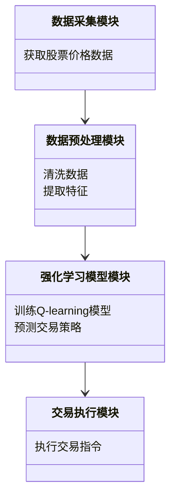

                 


# 《金融领域强化学习的探索与实践》

> **关键词**：强化学习，金融，量化交易，风险管理，深度强化学习，马尔可夫决策过程，Q-learning，投资组合优化

> **摘要**：  
本文系统地探讨了强化学习在金融领域的应用，从理论基础到实际案例，深入分析了强化学习在量化交易、风险管理、投资组合优化等领域的潜力与挑战。通过详细讲解强化学习的核心概念、算法原理、系统设计和项目实战，本文旨在为读者提供一个全面的视角，理解如何将强化学习技术应用于金融领域，并通过实际案例展示其价值与实现路径。本文适合对人工智能和金融领域感兴趣的读者阅读，尤其适合希望将强化学习技术应用于金融实践的研究者和从业者。

---

## 第1章 强化学习与金融的背景介绍

### 1.1 强化学习的定义与核心概念

#### 1.1.1 强化学习的基本概念  
强化学习（Reinforcement Learning, RL）是一种机器学习范式，通过智能体（Agent）与环境的交互，学习如何采取最优动作以最大化累积奖励。与监督学习和无监督学习不同，强化学习强调实时决策和长期目标的优化。

#### 1.1.2 强化学习的核心要素  
- **状态（State）**：环境当前的观察信息，如金融市场的价格、波动率等。  
- **动作（Action）**：智能体在给定状态下采取的行为，如买入、卖出或持有股票。  
- **奖励（Reward）**：智能体采取动作后获得的反馈，通常以数值形式表示，如利润或损失。  
- **策略（Policy）**：智能体选择动作的规则，可以是确定性的或概率性的。  
- **值函数（Value Function）**：衡量某个状态下采取某种动作的长期收益。

#### 1.1.3 强化学习与金融领域的结合点  
金融市场的核心特征是不确定性和复杂性，而强化学习擅长在动态环境中做出最优决策。例如，在量化交易中，智能体可以根据市场状态实时调整交易策略，从而在复杂多变的市场中获利。

---

### 1.2 金融领域的强化学习背景

#### 1.2.1 金融领域的复杂性与不确定性  
金融市场受到多种因素的影响，如经济指标、政策变化、市场情绪等，这些因素使得市场具有高度的不确定性和复杂性。传统的统计方法在处理这些问题时往往力不从心。

#### 1.2.2 强化学习在金融中的潜在价值  
强化学习能够通过模拟市场环境，学习最优的交易策略，并在实际交易中不断优化。它可以帮助投资者在复杂市场中做出更明智的决策，提高收益并降低风险。

#### 1.2.3 当前金融领域的技术挑战  
- 数据噪声大，市场行为难以建模。  
- 强化学习模型的训练需要大量计算资源。  
- 模型的可解释性不足，难以满足金融监管要求。

---

## 第2章 强化学习的核心概念与数学模型

### 2.1 马尔可夫决策过程（MDP）

#### 2.1.1 MDP的定义与组成部分  
马尔可夫决策过程是一个用于描述强化学习问题的数学模型，由以下几个部分组成：  
- **状态空间（State Space）**：所有可能的状态集合。  
- **动作空间（Action Space）**：所有可能的动作集合。  
- **转移概率（Transition Probability）**：从当前状态采取某个动作后转移到下一个状态的概率。  
- **奖励函数（Reward Function）**：智能体在某个状态下采取某个动作后获得的奖励。

#### 2.1.2 状态、动作、奖励的定义  
- 状态：当前市场的情况，如股票价格、成交量等。  
- 动作：买入、卖出或持有股票。  
- 奖励：交易后的收益或损失。

#### 2.1.3 策略与价值函数的数学表达  
- 策略 π：一个函数，表示在状态 s 下采取动作 a 的概率。  
  $$ \pi(a|s) = P(\text{采取动作 }a \mid \text{状态 }s) $$
- 值函数 V：衡量某个状态下采取某个动作的长期收益。  
  $$ V(s) = \max_a Q(s,a) $$  
- Q 值函数：衡量某个状态下采取某个动作的期望未来奖励。  
  $$ Q(s,a) = r + \gamma \max_{a'} Q(s',a') $$  
  其中，r 是即时奖励，γ 是折扣因子，s' 是下一个状态。

---

### 2.2 Q-learning算法原理

#### 2.2.1 Q-learning的基本原理  
Q-learning是一种经典的强化学习算法，通过不断更新 Q 值函数，学习最优策略。其核心思想是：  
$$ Q(s,a) = Q(s,a) + \alpha [r + \gamma \max Q(s',a') - Q(s,a)] $$  
其中，α 是学习率，γ 是折扣因子。

#### 2.2.2 Q值更新的数学公式  
- 即时奖励 r：根据交易结果确定。  
- 下一状态 s'：根据当前状态 s 和动作 a 确定。  
- Q 值更新公式：  
  $$ Q(s,a) = Q(s,a) + \alpha (r + \gamma \max Q(s',a') - Q(s,a)) $$  

#### 2.2.3 探索与利用的平衡策略  
为了在探索新策略和利用已知策略之间找到平衡，Q-learning通常采用 ε-greedy 策略：  
- 以概率 ε 随机选择动作（探索）；  
- 以概率 1-ε 选择当前最优动作（利用）。

---

### 2.3 强化学习的数学模型

#### 2.3.1 动态规划与值函数  
- 动态规划（Dynamic Programming）：通过递归方法优化值函数。  
- 值函数迭代：  
  $$ V_{k+1}(s) = \max_a [r + \gamma V_k(s')] $$  

#### 2.3.2 贝叶斯强化学习  
贝叶斯强化学习通过概率模型表示不确定性，利用贝叶斯推理更新模型参数。  
- 优势：能够处理环境的不确定性，适合金融市场的动态变化。  
- 动态过程：  
  $$ P(s' \mid s,a) $$  

#### 2.3.3 多智能体强化学习  
多智能体强化学习（Multi-Agent RL）研究多个智能体之间的协作与竞争。  
- 在金融领域，可以应用于高频交易、市场微观结构分析等场景。

---

## 第3章 金融领域的强化学习应用分析

### 3.1 量化交易中的强化学习

#### 3.1.1 量化交易的基本概念  
量化交易通过算法和模型进行交易决策，具有高频、自动化的特点。  
- 优点：减少人为情绪干扰，提高交易效率。  
- 缺点：对模型的依赖性强，需要处理大量数据。

#### 3.1.2 强化学习在交易策略中的应用  
- 短线交易：根据技术指标（如移动平均线、RSI）制定交易策略。  
- 跨期套利：利用不同市场或资产之间的价格差异获利。

#### 3.1.3 市场微观结构对强化学习的挑战  
- 市场深度：订单簿的复杂性影响交易策略的执行。  
- 市场参与者行为：高频交易者、做市商等行为的多样性增加了模型的复杂性。

---

### 3.2 风险管理与投资组合优化

#### 3.2.1 风险管理的基本原理  
风险管理的目标是降低投资组合的潜在损失，通常采用 VaR（在险价值）或 CVaR（条件在险价值）等指标衡量风险。

#### 3.2.2 强化学习在投资组合优化中的应用  
- 动态调整资产配置：根据市场变化实时优化投资组合。  
- 多目标优化：在收益与风险之间寻找平衡点。

#### 3.2.3 动态风险评估的强化学习模型  
- 状态空间：市场风险指标（如波动率、相关性等）。  
- 动作空间：调整资产权重。  
- 奖励函数：收益减去风险惩罚项。

---

### 3.3 信用评分与贷款决策

#### 3.3.1 信用评分的基本概念  
信用评分通过模型评估借款人的还款能力，通常采用 FICO 评分等指标。

#### 3.3.2 强化学习在信用评分中的应用  
- 利用强化学习模型分析借款人的还款行为，预测违约风险。

#### 3.3.3 贷款决策的强化学习模型设计  
- 状态：借款人的信用历史、收入水平等。  
- 动作：批准或拒绝贷款申请。  
- 奖励：贷款违约率或回收率。

---

## 第4章 金融强化学习的系统分析与架构设计

### 4.1 项目背景与需求分析

#### 4.1.1 项目目标  
设计一个基于强化学习的量化交易系统，能够在实际市场中实现盈利。

#### 4.1.2 项目范围  
- 数据获取与处理：从金融数据源获取股票价格、交易量等数据。  
- 模型训练：基于历史数据训练强化学习模型。  
- 系统实现：开发一个实时交易系统。

#### 4.1.3 项目需求  
- 实时交易能力：能够根据市场变化快速做出决策。  
- 系统稳定性：确保在高负载情况下稳定运行。  
- 可扩展性：能够支持多个交易品种。

---

### 4.2 系统功能设计

#### 4.2.1 系统功能模块划分  
- 数据采集模块：从数据源获取金融数据。  
- 数据预处理模块：清洗和特征提取。  
- 强化学习模型模块：训练并部署模型。  
- 交易执行模块：根据模型输出执行交易指令。

#### 4.2.2 功能模块之间的关系  
- 数据采集模块提供输入数据，数据预处理模块生成特征向量，强化学习模型模块进行训练和预测，交易执行模块根据预测结果执行交易。

#### 4.2.3 系统功能设计的 Mermaid 类图  


---

### 4.3 系统架构设计

#### 4.3.1 系统架构的选择  
采用微服务架构，各个功能模块独立运行，便于扩展和维护。

#### 4.3.2 系统架构的 Mermaid 架构图  
```mermaid
client
    client --> 数据采集模块
    client --> 数据预处理模块
    client --> 强化学习模型模块
    client --> 交易执行模块
```

---

## 第5章 项目实战：基于强化学习的量化交易系统

### 5.1 环境安装与配置

#### 5.1.1 安装依赖  
- Python 3.8+  
- TensorFlow、Keras、OpenAI Gym 等库。

#### 5.1.2 数据获取  
使用Yahoo Finance API 获取股票价格数据。

---

### 5.2 系统核心实现源代码

#### 5.2.1 数据预处理  
```python
import pandas as pd
import numpy as np

# 获取数据
data = pd.read_csv("stock.csv")

# 数据清洗
data.dropna(inplace=True)
data = data.iloc[-100:]  # 取最后100天数据

# 特征提取
data['SMA_20'] = data['Close'].rolling(20).mean()
data['SMA_50'] = data['Close'].rolling(50).mean()
```

#### 5.2.2 强化学习模型实现  
```python
import gym
import numpy as np

class TradingEnv(gym.Env):
    def __init__(self, data):
        self.data = data
        self.current_step = 0
        self.observation_space = gym.spaces.Box(low=0, high=1, shape=(2,))
        self.action_space = gym.spaces.Discrete(3)  # 0: 卖出，1: 持有，2: 买入

    def _get_state(self):
        return np.array([self.data['SMA_20'][self.current_step], 
                          self.data['SMA_50'][self.current_step]])

    def _take_action(self, action):
        # 根据动作执行交易
        if action == 0:
            return -self.data['Close'][self.current_step]
        elif action == 1:
            return 0
        else:
            return self.data['Close'][self.current_step]

    def step(self, action):
        state = self._get_state()
        reward = self._take_action(action)
        self.current_step += 1
        done = self.current_step >= len(self.data) - 1
        next_state = self._get_state() if not done else None
        return state, reward, done, {}

    def reset(self):
        self.current_step = 0
        return self._get_state()
```

#### 5.2.3 策略回测  
```python
import gym
from gym import make

env = make('TradingEnv', data=data)
model = DQN(env.observation_space, env.action_space)
model.train(episodes=1000)
```

---

### 5.3 实际案例分析

#### 5.3.1 数据回测  
- 训练模型在历史数据上的表现。  
- 计算策略的回测结果，如最大回撤、夏普比率等。

#### 5.3.2 模型优化  
- 调整超参数，如学习率 α 和折扣因子 γ。  
- 优化网络结构，如使用更深的神经网络。

---

## 第6章 总结与展望

### 6.1 本章小结  
本文详细探讨了强化学习在金融领域的应用，从理论基础到实际案例，系统地分析了强化学习在量化交易、风险管理、投资组合优化等领域的潜力与挑战。

### 6.2 注意事项  
- 强化学习模型的泛化能力有限，需要大量数据支持。  
- 模型的可解释性不足，需要结合其他方法进行解释。

### 6.3 拓展阅读  
- 《Deep Reinforcement Learning in Finance》  
- 《Reinforcement Learning and Game Theory in Quantitative Finance》

---

**作者：AI天才研究院/AI Genius Institute & 禅与计算机程序设计艺术/Zen And The Art of Computer Programming**

