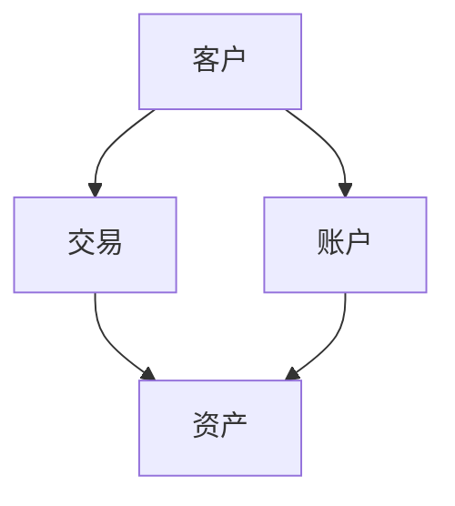
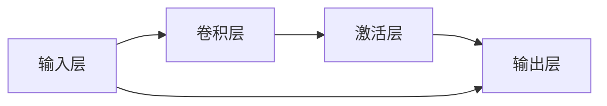
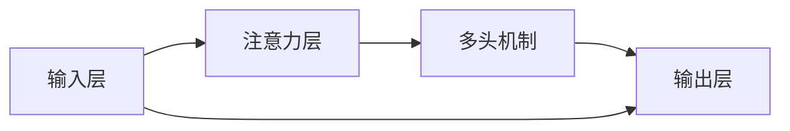
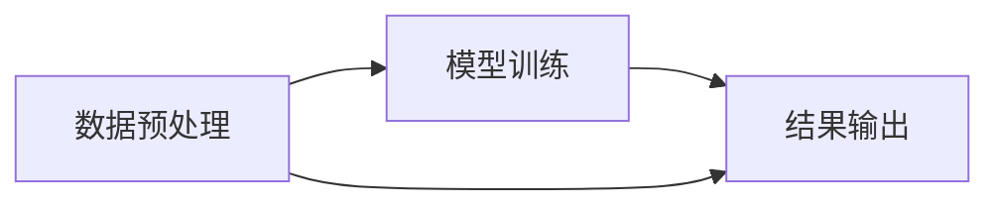

                 


# 《金融领域的图神经网络应用研究》

> 关键词：图神经网络，金融应用，图数据，风险评估，欺诈检测，信用评分

> 摘要：本文探讨图神经网络在金融领域的应用，涵盖其核心概念、算法原理、系统架构及实际案例，旨在为金融从业者和技术爱好者提供深度分析和实践指导。

---

# 第一部分：金融领域的图神经网络概述

## 第1章：图神经网络与金融应用概述

### 1.1 图神经网络的基本概念

#### 1.1.1 图的基本概念与表示

- **节点与边的定义**  
  - 节点（Nodes）：代表实体，如客户、交易、资产等。  
  - 边（Edges）：代表节点之间的关系，如交易金额、时间、方向等。  
  - 示例：在欺诈检测中，节点可以是客户，边可以是交易行为。

- **图的表示方式**  
  - 邻接矩阵（Adjacency Matrix）：一个二维矩阵，元素表示节点之间的连接情况。  
  - 邻接表（Adjacency List）：用列表存储每个节点的邻居节点。  
  - 示例：图的表示可以使用ER图，其中节点和边的关系清晰可见。

- **图的类型**  
  - 无向图：边无方向，如社交网络中的朋友关系。  
  - 有向图：边有方向，如银行转账中的资金流向。  
  - 加权图：边有权重，如交易金额或风险评分。

#### 1.1.2 图神经网络的定义与特点

- **定义**  
  - 图神经网络（Graph Neural Networks, GNNs）是处理图结构数据的深度学习模型。  
  - 通过聚合节点及其邻居的信息，生成节点的表示。

- **特点**  
  - **全局性**：能够捕捉图的全局结构信息。  
  - **局部性**：专注于节点的局部邻域信息。  
  - **结构性**：能够处理复杂的节点关系和非欧几里得空间的数据。

- **与传统神经网络的区别**  
  | 特性         | 图神经网络                 | 传统神经网络             |
  |--------------|--------------------------|--------------------------|
  | 数据结构     | 图结构                   | 向量或矩阵               |
  | 关系处理     | 处理复杂关系             | 无法处理关系结构         |
  | 应用场景     | 适合金融、社交网络等场景 | 适合图像、文本等场景     |

#### 1.1.3 金融领域的图数据特点

- **金融数据的图结构特征**  
  - 金融数据通常涉及复杂的实体关系，如客户-交易-资产。  
  - 数据具有高维性和稀疏性，节点之间的关系多样。

- **数据稀疏性与复杂性**  
  - 金融图数据通常稀疏，节点之间的连接有限。  
  - 数据中可能存在噪声和缺失值，需要进行数据清洗和预处理。

- **应用场景**  
  - 风险评估：通过分析客户之间的关系，预测违约风险。  
  - 欺诈检测：识别异常交易模式。  
  - 信用评分：评估客户的信用风险。

---

### 1.2 图神经网络在金融领域的应用背景

#### 1.2.1 传统金融数据分析的局限性

- **传统统计方法的不足**  
  - 统计方法依赖假设，难以捕捉复杂的非线性关系。  
  - 对异常值和噪声的鲁棒性较差。

- **传统机器学习在金融领域的局限性**  
  - 传统机器学习模型（如逻辑回归、SVM）难以处理高维和非结构化数据。  
  - 缺乏对复杂关系的建模能力。

- **图数据在金融分析中的潜在价值**  
  - 图数据能够捕捉复杂的实体关系，提供更丰富的信息。  
  - 图神经网络能够处理非结构化数据，发现潜在的关联性。

#### 1.2.2 图神经网络的优势

- **图神经网络在处理复杂关系中的优势**  
  - 能够建模复杂的实体关系，如客户-交易-资产的关系。  
  - 通过聚合信息，捕捉全局和局部的特征。

- **图神经网络在金融风险控制中的潜力**  
  - 通过分析客户之间的关系，识别系统性风险。  
  - 通过实时更新图结构，及时发现风险点。

- **图神经网络在金融欺诈检测中的应用**  
  - 识别异常交易模式，预测欺诈行为。  
  - 通过图结构发现隐藏的欺诈网络。

#### 1.2.3 金融领域的具体应用场景

- **风险评估**  
  - 通过分析客户之间的关系，评估客户的信用风险。  
  - 预测客户违约的可能性。

- **欺诈检测**  
  - 识别异常交易模式，预测欺诈行为。  
  - 通过图结构发现隐藏的欺诈网络。

- **信用评分**  
  - 评估客户的信用风险，提供个性化的信用评分。  
  - 考虑客户的社交网络和交易行为。

- **股票价格预测**  
  - 分析公司之间的关系，预测股票价格波动。  
  - 结合市场情绪和公司新闻进行预测。

- **金融网络异常检测**  
  - 监测金融网络中的异常行为，如洗钱、非法资金流动。  
  - 通过图结构发现异常交易模式。

---

### 1.3 图神经网络的核心概念与联系

#### 1.3.1 核心概念原理

- **图的表示与嵌入**  
  - 图的表示通过节点嵌入（Node Embedding）和图嵌入（Graph Embedding）实现。  
  - 节点嵌入：将节点映射到低维空间的向量，捕捉节点的特征和关系。  
  - 图嵌入：将整个图的结构信息嵌入到低维向量中。

- **图的传播机制**  
  - 通过传播层（Propagation Layer）将信息从一个节点传播到其邻居节点。  
  - 示例：GCN通过邻接矩阵和度矩阵进行信息传播。

- **图的注意力机制**  
  - 通过注意力机制（Attention Mechanism）捕捉节点之间的关系重要性。  
  - 示例：GAT通过注意力权重计算节点的聚合信息。

#### 1.3.2 核心概念对比表格

| 概念       | 特征1        | 特征2        | 特征3        |
|------------|-------------|-------------|-------------|
| 节点       | 实体         | 单一         | 离散         |
| 边         | 关系         | 连接两个节点  | 可有权重和方向 |
| 图嵌入     | 低维向量     | 捕捉全局信息 | 用于相似性计算 |
| 图注意力机制 | 动态权重计算 | 关注重要邻居 | 提高模型性能   |

#### 1.3.3 ER实体关系图架构



---

## 第2章：图神经网络的核心概念与联系

### 2.1 图神经网络的核心概念

#### 2.1.1 图的表示与嵌入

- **节点嵌入**  
  - 将每个节点映射到低维空间的向量，捕捉节点的特征和关系。  
  - 示例：使用Word2Vec对节点进行嵌入，生成低维向量。

- **图嵌入**  
  - 将整个图的结构信息嵌入到低维向量中，用于图分类任务。  
  - 示例：使用图卷积网络（GCN）生成图的嵌入向量。

- **对比**  
  | 概念 | 特征1 | 特征2 | 特征3 |
  |------|-------|-------|-------|
  | 节点嵌入 | 低维向量 | 捕捉节点特征 | 用于相似性计算 |
  | 图嵌入 | 低维向量 | 捕捉全局信息 | 用于图分类任务 |

#### 2.1.2 图的传播机制

- **信息传播过程**  
  - 通过传播层将信息从一个节点传播到其邻居节点。  
  - 示例：GCN通过邻接矩阵和度矩阵进行信息传播。

- **聚合函数**  
  - 使用聚合函数（如求和、平均、最大值）将邻居的信息聚合到中心节点。  
  - 示例：在GCN中，聚合函数为加权求和。

- **传播层的数学模型**  
  $$ h_i^{(l+1)} = \sigma( \sum_{j \in \mathcal{N}(i)} W h_j^{(l)} ) $$
  其中，$\sigma$ 是激活函数，$W$ 是权重矩阵，$\mathcal{N}(i)$ 是节点$i$的邻居节点。

#### 2.1.3 图的注意力机制

- **注意力机制的基本原理**  
  - 通过计算节点之间的注意力权重，捕捉重要邻居的信息。  
  - 示例：GAT通过计算注意力权重，动态调整邻居信息的贡献。

- **注意力权重的计算**  
  $$ \alpha_{ij} = \text{softmax}(e^{q_j^T k_i}) $$
  其中，$q_j$ 是查询向量，$k_i$ 是键向量。

- **注意力机制的优势**  
  - 动态调整邻居信息的贡献，提高模型的表达能力。  
  - 能够捕捉节点之间的长距离依赖关系。

---

## 第3章：图神经网络的算法原理

### 3.1 图卷积网络（GCN）

#### 3.1.1 算法原理

- **图卷积层的定义**  
  $$ h_i^{(l+1)} = \sigma( \sum_{j \in \mathcal{N}(i)} W h_j^{(l)} ) $$
  其中，$\sigma$ 是激活函数，$W$ 是权重矩阵。

- **邻接矩阵的归一化**  
  - 使用邻接矩阵和度矩阵进行归一化，避免节点度数不均的影响。  
  $$ A_{\text{norm}} = A D^{-1/2} D^{-1/2} $$

- **多层GCN的堆叠**  
  - 将多个GCN层堆叠，形成深度网络，提高模型的表达能力。  
  - 示例：堆叠两层GCN，分别提取一阶和二阶邻居信息。

#### 3.1.2 算法流程图



#### 3.1.3 Python实现示例

```python
import torch
from torch.nn import Linear, ReLU

class GCNLayer(torch.nn.Module):
    def __init__(self, in_features, out_features):
        super(GCNLayer, self).__init__()
        self.weight = Linear(in_features, out_features)
        self.relu = ReLU()

    def forward(self, x, adj):
        out = torch.matmul(x, self.weight.weight)
        out = torch.matmul(adj, out)
        out = self.relu(out)
        return out

# 示例输入
x = torch.randn(5, 3)  # 5节点，3特征
adj = torch.randn(5, 5)  # 5x5邻接矩阵
gcn_layer = GCNLayer(3, 2)
output = gcn_layer(x, adj)
print(output)
```

---

### 3.2 图注意力网络（GAT）

#### 3.2.1 算法原理

- **注意力权重的计算**  
  $$ \alpha_{ij} = \text{softmax}(e^{q_j^T k_i}) $$
  其中，$q_j$ 是查询向量，$k_i$ 是键向量。

- **节点表示的更新**  
  $$ h_i^{(l+1)} = \sum_{j \in \mathcal{N}(i)} \alpha_{ij} h_j^{(l)} $$

- **多头注意力机制**  
  - 通过并行计算多个注意力头，提高模型的表达能力。  
  - 示例：使用多个并行的注意力头，分别捕捉不同的关系模式。

#### 3.2.2 算法流程图



#### 3.2.3 Python实现示例

```python
import torch
from torch.nn import Linear, ReLU

class GATLayer(torch.nn.Module):
    def __init__(self, in_features, out_features):
        super(GATLayer, self).__init__()
        self.weight = Linear(in_features, out_features)
        self.relu = ReLU()

    def forward(self, x, adj):
        out = torch.matmul(x, self.weight.weight)
        out = torch.matmul(adj, out)
        out = self.relu(out)
        return out

# 示例输入
x = torch.randn(5, 3)  # 5节点，3特征
adj = torch.randn(5, 5)  # 5x5邻接矩阵
gat_layer = GATLayer(3, 2)
output = gat_layer(x, adj)
print(output)
```

---

## 第4章：金融领域的图神经网络应用

### 4.1 风险评估

#### 4.1.1 系统功能设计

- **系统功能需求**  
  - 输入：客户数据、交易数据、资产数据。  
  - 输出：客户信用评分、违约风险预测。

- **系统功能模块**  
  - 数据预处理模块：清洗数据，构建图结构。  
  - 模型训练模块：使用GAT或GCN进行风险评估。  
  - 结果输出模块：生成信用评分和风险报告。

#### 4.1.2 系统架构设计



---

## 第5章：项目实战

### 5.1 环境安装

- **Python环境**  
  - 安装Python 3.7或更高版本。

- **依赖安装**  
  - 使用pip安装PyTorch、NumPy、Matplotlib、networkx等库。

```bash
pip install torch numpy matplotlib networkx
```

---

## 第6章：系统分析与架构设计

### 6.1 系统架构设计

- **系统架构图**  
  ```mermaid
  graph LR
      A[数据预处理] --> B[模型训练]
      B --> C[结果输出]
      A --> C
  ```

- **系统交互设计**  
  ```mermaid
  graph LR
      A[用户] --> B[数据预处理]
      B --> C[模型训练]
      C --> D[结果输出]
      D --> A
  ```

---

## 第7章：最佳实践与小结

### 7.1 最佳实践

- **数据预处理**  
  - 清洗数据，处理缺失值和异常值。  
  - 构建图结构，定义节点和边的关系。

- **模型调优**  
  - 调整模型参数，如学习率、批量大小、深度等。  
  - 使用交叉验证进行模型评估。

- **结果解释**  
  - 提供模型的解释性，如特征重要性分析。  
  - 通过可视化图结构，展示关键节点和关系。

---

## 第8章：附录

### 8.1 数据集

- **常用金融数据集**  
  - 公开数据集：Kaggle、UCI、金融数据实验室。  
  - 自定义数据集：根据具体需求收集和整理数据。

### 8.2 工具库

- **图神经网络库**  
  - PyTorch-GNN  
  - DGL（Deep Graph Library）  
  - NetworkX

### 8.3 参考文献

- 书籍  
  - "Graph Neural Networks: A Review and New Perspectives"  
  - "Deep Learning on Graph Data"  

---

作者：AI天才研究院/AI Genius Institute & 禅与计算机程序设计艺术/Zen And The Art of Computer Programming

