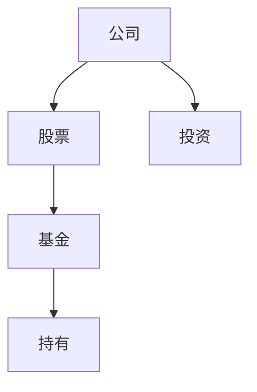
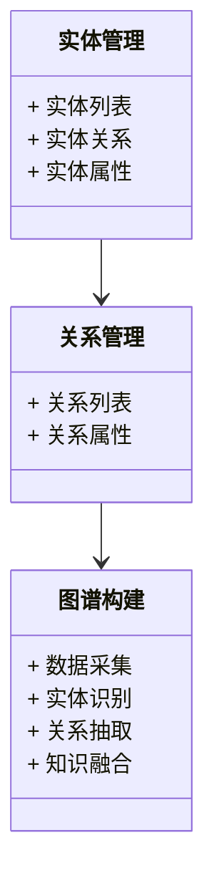
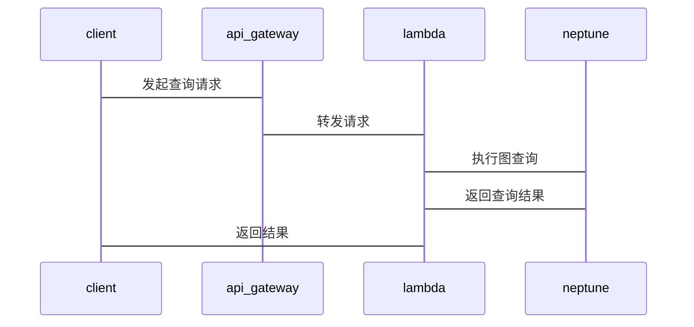

                 


# 《金融领域知识图谱的构建与应用》

---

## 关键词：
- 知识图谱
- 金融领域
- 实体识别
- 关系抽取
- 知识融合
- 图谱应用

---

## 摘要：
金融领域的知识图谱构建与应用是一个复杂的系统工程，涉及数据采集、实体识别、关系抽取、知识融合等多个技术环节。本文从基础知识入手，详细讲解了知识图谱在金融领域的核心概念、构建方法及应用场景，并结合实际案例，探讨了图神经网络和知识图谱安全等高级主题。最后，通过项目实战和最佳实践，为读者提供了一份完整的知识图谱构建与应用指南。

---

## 引言：知识图谱与金融领域的碰撞

### 问题背景

在金融领域，数据的复杂性和多样性使得传统的数据分析方法难以满足日益增长的业务需求。知识图谱作为一种新兴的技术，通过构建金融领域的语义网络，能够有效整合异构数据，挖掘隐含关系，为金融分析、风险控制和智能投顾等场景提供了强大的支持。

### 问题描述

金融领域的知识图谱构建面临数据来源多样、实体关系复杂、知识表示难度高等挑战。如何高效地从金融数据中提取实体和关系，构建高质量的知识图谱，并将其应用于实际业务场景，是当前研究的热点问题。

### 问题解决

通过引入自然语言处理、机器学习和图数据库等技术，结合金融领域的业务知识，可以构建一个高效、准确的金融知识图谱，实现金融数据的深度分析和智能应用。

### 边界与外延

本文主要聚焦于金融领域的知识图谱构建与应用，涵盖数据处理、知识抽取、图谱构建和应用场景分析等方面。文章将重点讨论知识图谱在金融风险评估、智能投顾和 fraud detection 等场景中的应用。

### 核心要素与组成结构

知识图谱的核心要素包括实体（Entity）、关系（Relation）、属性（Attribute）和概念（Concept）。在金融领域，实体可以是公司、股票、基金等，关系可以是“投资”、“持有”、“交易”等，属性可以是金额、时间、地点等。

---

## 第1章: 知识图谱与金融领域的概述

### 1.1 知识图谱的基本概念

#### 1.1.1 知识图谱的定义与特点

知识图谱是一种以图结构形式表示知识的技术，其核心是通过实体和关系构建语义网络。知识图谱具有以下特点：
- **语义丰富性**：能够表示实体之间的复杂关系。
- **可扩展性**：支持大规模数据的整合和扩展。
- **动态更新**：能够实时更新以反映数据的变化。

#### 1.1.2 知识图谱的核心要素与组成结构

知识图谱的核心要素包括：
- **实体（Entity）**：现实世界中的具体事物，如公司、股票、基金等。
- **关系（Relation）**：实体之间的关联，如“投资”、“持有”等。
- **属性（Attribute）**：实体的描述性信息，如金额、时间等。

知识图谱的组成结构通常包括节点（Node）和边（Edge），节点表示实体或概念，边表示实体之间的关系。

#### 1.1.3 知识图谱与传统数据库的区别

传统数据库主要关注数据的存储和查询，而知识图谱更注重数据之间的关系和语义。知识图谱能够处理异构数据，支持复杂的语义查询，而传统数据库在处理复杂关系时往往力不从心。

### 1.2 金融领域的知识图谱特点

#### 1.2.1 金融领域的数据特点与知识需求

金融领域的数据具有以下特点：
- **异构性**：数据来源多样，包括文本、结构化数据和非结构化数据。
- **动态性**：金融数据不断变化，需要实时更新。
- **复杂性**：金融关系复杂，涉及多个实体和多层次关系。

#### 1.2.2 金融知识图谱的构建挑战

构建金融知识图谱的挑战包括：
- **数据质量**：金融数据可能存在噪声和不一致性。
- **实体识别**：金融领域的实体种类繁多，识别难度大。
- **关系抽取**：金融关系复杂，抽取算法需要高精度。

#### 1.2.3 金融知识图谱的应用场景

金融知识图谱的主要应用场景包括：
- **风险评估**：通过分析实体之间的关系，识别潜在风险。
- **智能投顾**：基于知识图谱提供个性化的投资建议。
- **fraud detection**：通过图结构发现异常交易行为。

### 1.3 本章小结

本章介绍了知识图谱的基本概念和金融领域的知识图谱特点，为后续章节的深入分析奠定了基础。

---

## 第2章: 金融知识图谱的核心概念与联系

### 2.1 知识图谱的核心概念原理

#### 2.1.1 实体与关系的定义

实体是金融知识图谱的基本单元，可以是公司、股票、基金等。关系是实体之间的关联，如“投资”、“持有”等。

#### 2.1.2 知识图谱的属性与类型

属性是对实体的描述，可以是金额、时间等。属性的类型包括文本型、数值型等。

#### 2.1.3 知识图谱的语义网络结构

知识图谱通过节点和边构建语义网络，能够表示复杂的金融关系。

### 2.2 核心概念属性特征对比表

| 概念 | 属性 | 特征 |
|------|------|------|
| 实体 | 类型 | 具体领域 |
| 关系 | 方向性 | 单向/双向 |
| 属性 | 数据类型 | 文本/数值 |

### 2.3 ER实体关系图架构（Mermaid流程图）



### 2.4 本章小结

本章通过对比和图表分析，详细讲解了金融知识图谱的核心概念及其联系。

---

## 第3章: 知识图谱的构建方法

### 3.1 知识图谱的构建流程

#### 3.1.1 数据采集与预处理

数据采集需要从多种来源获取金融数据，包括文本、结构化数据和非结构化数据。预处理包括数据清洗、分词和实体标注。

#### 3.1.2 实体识别与关系抽取

实体识别可以通过基于规则的方法或深度学习模型（如BERT）进行。关系抽取需要从文本中识别实体之间的关系。

#### 3.1.3 知识融合与推理

知识融合需要将不同数据源的信息整合到一个统一的知识图谱中，推理可以通过规则或图神经网络进行。

### 3.2 知识图谱的存储与管理

#### 3.2.1 数据库选择与设计

推荐使用图数据库（如Neo4j）或关系型数据库（如PostgreSQL）进行存储。设计时需要考虑数据的查询效率和扩展性。

#### 3.2.2 知识图谱的存储结构

知识图谱的存储结构包括节点和边，节点存储实体信息，边存储实体之间的关系。

#### 3.2.3 知识图谱的查询与检索

使用SPARQL或Cypher进行图查询，可以通过图数据库提供的API进行检索。

### 3.3 知识图谱的可视化

#### 3.3.1 可视化工具的选择

推荐使用Gephi、Cytoscape或Tableau等工具进行知识图谱的可视化。

#### 3.3.2 知识图谱的布局与展示

布局包括树状图、网络图等，展示时需要考虑节点之间的关系和权重。

#### 3.3.3 可视化分析与探索

通过可视化工具进行图谱分析，发现隐藏的关系和模式。

### 3.4 本章小结

本章详细讲解了知识图谱的构建流程，包括数据采集、实体识别、知识融合和可视化等步骤。

---

## 第4章: 金融领域知识图谱的构建算法

### 4.1 实体识别算法原理

#### 4.1.1 基于规则的实体识别

通过正则表达式或关键词匹配进行实体识别。

#### 4.1.2 基于机器学习的实体识别

使用CRF或SVM等机器学习模型进行实体识别。

#### 4.1.3 基于深度学习的实体识别

使用BERT、LSTM等深度学习模型进行实体识别。

### 4.2 关系抽取算法原理

#### 4.2.1 基于规则的关系抽取

通过设定规则或模板进行关系抽取。

#### 4.2.2 基于统计的关系抽取

使用统计模型（如马尔可夫链）进行关系抽取。

#### 4.2.3 基于深度学习的关系抽取

使用卷积神经网络（CNN）、循环神经网络（RNN）或图神经网络（GNN）进行关系抽取。

### 4.3 知识融合与推理算法

#### 4.3.1 知识融合方法

知识融合包括实体对齐和属性合并，可以通过基于规则或基于学习的方法进行。

#### 4.3.2 知识推理方法

知识推理可以通过基于规则的推理或基于学习的推理（如图神经网络）进行。

### 4.4 本章小结

本章详细讲解了金融领域知识图谱的构建算法，包括实体识别、关系抽取和知识融合等技术。

---

## 第5章: 金融领域知识图谱的应用场景

### 5.1 金融风险评估

#### 5.1.1 风险评估的定义与方法

风险评估是通过分析实体之间的关系和属性，预测潜在风险。

#### 5.1.2 基于知识图谱的金融风险评估案例

通过构建公司、股票、基金之间的关系图，识别潜在的关联风险。

### 5.2 智能投顾

#### 5.2.1 智能投顾的定义与技术

智能投顾是通过知识图谱提供个性化的投资建议。

#### 5.2.2 基于知识图谱的智能投顾案例

通过分析用户的财务状况和市场趋势，提供个性化的投资组合建议。

### 5.3 金融知识图谱的其他应用

#### 5.3.1 金融 fraud detection

通过知识图谱发现异常交易行为。

#### 5.3.2 金融知识图谱在监管合规中的应用

通过知识图谱进行监管合规分析，识别潜在的违规行为。

### 5.4 本章小结

本章探讨了知识图谱在金融领域的多种应用场景，展示了知识图谱的强大应用价值。

---

## 第6章: 金融知识图谱的系统架构与设计

### 6.1 项目介绍

本项目旨在构建一个金融领域的知识图谱，用于风险评估和智能投顾。

### 6.2 系统功能设计

#### 6.2.1 领域模型设计（Mermaid类图）



#### 6.2.2 系统架构设计（Mermaid架构图）

```mermaid
aws
    architecture
    title 金融知识图谱系统架构
    client -> api_gateway: API 请求
    api_gateway -> lambda: API 请求转发
    lambda -> dynamodb: 数据查询
    lambda -> neptune: 图查询
    dynamodb --> neptune: 数据同步
    neptune --> lambda: 图数据返回
    lambda -> client: 返回结果
```

#### 6.2.3 系统接口设计

- 数据采集接口：用于获取金融数据。
- 实体识别接口：用于识别文本中的实体。
- 关系抽取接口：用于抽取实体之间的关系。
- 图查询接口：用于查询图谱中的关系。

#### 6.2.4 系统交互设计（Mermaid序列图）



### 6.3 本章小结

本章详细讲解了金融知识图谱的系统架构与设计，包括领域模型、系统架构和接口设计。

---

## 第7章: 金融知识图谱的项目实战

### 7.1 环境安装与配置

#### 7.1.1 安装Python环境

```bash
python --version
pip install --upgrade pip
```

#### 7.1.2 安装知识图谱相关库

```bash
pip install networkx
pip install neo4j
pip install spacy
```

#### 7.1.3 安装机器学习库

```bash
pip install scikit-learn
pip install tensorflow
pip install transformers
```

### 7.2 核心实现代码

#### 7.2.1 实体识别代码

```python
import spacy

nlp = spacy.load("en_core_web_sm")

def extract_entities(text):
    doc = nlp(text)
    entities = []
    for ent in doc.ents:
        entities.append((ent.text, ent.label_))
    return entities

text = "Apple invests in Google."
print(extract_entities(text))
```

#### 7.2.2 关系抽取代码

```python
from spacy import displacy

def extract_relations(text):
    doc = nlp(text)
    relations = []
    for i, token in enumerate(doc):
        if token.lemma_ == "invest":
            if i > 0 and i < len(doc)-1:
                relations.append((doc[i-1].text, "invest", doc[i+1].text))
    return relations

text = "Apple invests in Google."
print(extract_relations(text))
```

#### 7.2.3 知识图谱存储与查询代码

```python
from neo4j import GraphDatabase

def query_graph(query):
    driver = GraphDatabase.driver("bolt://localhost:7687", auth=("neo4j", "password"))
    with driver.session() as session:
        result = session.run(query)
        return result

query = "MATCH (a)-[r]->(b) RETURN a, r, b;"
print(query_graph(query))
```

### 7.3 案例分析与代码解读

#### 7.3.1 案例分析

以构建一个简单的金融知识图谱为例，分析公司之间的投资关系。

#### 7.3.2 代码解读

通过上述代码，读者可以实现基本的实体识别、关系抽取和图谱查询功能。

### 7.4 本章小结

本章通过实际案例，详细讲解了金融知识图谱的构建过程，包括环境配置、代码实现和案例分析。

---

## 第8章: 金融知识图谱的安全与优化

### 8.1 知识图谱的安全性

#### 8.1.1 数据隐私保护

通过加密和匿名化技术保护数据隐私。

#### 8.1.2 知识图谱的安全威胁

包括数据泄露、攻击和滥用等。

### 8.2 知识图谱的优化

#### 8.2.1 图谱压缩与优化

通过节点合并和边简化优化图谱的存储和查询效率。

#### 8.2.2 图谱更新与维护

定期更新图谱数据，保持图谱的准确性和及时性。

### 8.3 本章小结

本章探讨了金融知识图谱的安全性和优化方法，为实际应用提供了保障。

---

## 第9章: 金融知识图谱的最佳实践

### 9.1 小结与回顾

本文详细讲解了金融知识图谱的构建与应用，涵盖了从基础概念到实际应用的全过程。

### 9.2 最佳实践 tips

- 数据质量是知识图谱构建的基础。
- 选择合适的工具和算法，提高构建效率。
- 注重图谱的动态更新和维护。

### 9.3 注意事项

- 数据隐私和安全是图谱应用的重要考虑因素。
- 在实际应用中，需要结合具体的业务需求进行图谱设计。

### 9.4 拓展阅读

推荐读者阅读以下资料：
- 知识图谱相关书籍：《Knowledge Graphs: Principles, Techniques, and Applications》
- 图神经网络相关论文：《Graph Neural Networks: A Comprehensive Survey》

---

## 作者：AI天才研究院/AI Genius Institute & 禅与计算机程序设计艺术 /Zen And The Art of Computer Programming

---

### 总结

通过本文的详细讲解，读者可以全面了解金融领域知识图谱的构建与应用，掌握从数据采集、实体识别、关系抽取到知识融合的全过程，并能够在实际项目中灵活运用这些技术。希望本文能为金融领域的知识图谱研究和应用提供有价值的参考。

