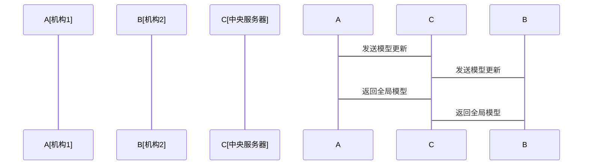

                 


# 《金融领域联邦学习在跨机构信用评分与风险管理中的应用》

---

## 关键词：
联邦学习, 信用评分, 风险管理, 数据隐私, 金融机构, 跨机构合作

---

## 摘要：
本文探讨了联邦学习在金融领域的应用，特别是在信用评分和风险管理中的跨机构协作。通过分析联邦学习的核心原理、系统架构及实际案例，本文展示了如何在保护数据隐私的前提下，提升信用评分模型的准确性和风险管理的效率。文章还详细介绍了联邦学习的数学模型、算法流程图以及系统设计，为读者提供全面的技术解读。

---

## 第一部分：联邦学习与金融领域的结合

### 第1章：联邦学习与金融领域概述

#### 1.1 联邦学习的定义与核心概念
##### 1.1.1 联邦学习的定义
联邦学习（Federated Learning）是一种分布式机器学习技术，允许多个机构在不共享原始数据的情况下，共同训练模型。通过加密通信和数据隐私保护机制，联邦学习能够在保证数据安全的前提下，实现跨机构协作。

##### 1.1.2 联邦学习的核心概念
- **数据隐私**：联邦学习通过加密和匿名化技术，确保数据在传输和处理过程中的安全性。
- **模型训练**：多个机构分别在本地数据上训练模型，然后将模型更新同步到中央服务器，最终形成一个全局模型。
- **跨机构协作**：联邦学习允许不同机构在不共享数据的情况下，共同优化模型性能。

##### 1.1.3 联邦学习与传统数据共享的区别
传统的数据共享方式需要机构之间交换原始数据，存在数据泄露和隐私风险。而联邦学习通过局部建模和模型聚合的方式，避免了数据的直接共享，同时实现了模型的优化。

#### 1.2 金融领域的信用评分与风险管理
##### 1.2.1 信用评分的定义与重要性
信用评分是金融机构评估客户信用风险的重要工具，能够帮助机构决定是否批准贷款或信用卡等金融服务。传统的信用评分模型依赖于单一机构的数据，难以充分利用跨机构的数据资源。

##### 1.2.2 风险管理的核心目标
风险管理的目标是通过识别、评估和控制风险，降低金融机构的损失。在金融领域，信用风险、市场风险和操作风险是主要关注点。

##### 1.2.3 金融领域数据隐私的挑战
金融数据通常包含敏感信息，如客户的信用记录、交易历史等。如何在保护数据隐私的前提下，充分利用跨机构数据，是金融领域面临的重要挑战。

#### 1.3 联邦学习在金融领域的应用前景
##### 1.3.1 联邦学习在信用评分中的潜力
通过联邦学习，金融机构可以在不共享数据的情况下，共同优化信用评分模型，提高模型的准确性和泛化能力。

##### 1.3.2 联邦学习在风险管理中的优势
联邦学习可以实现跨机构的风险数据共享，帮助金融机构更全面地评估风险，提升风险管理的效率和准确性。

##### 1.3.3 联邦学习在金融领域的未来发展趋势
随着技术的成熟，联邦学习将在金融领域得到更广泛的应用，特别是在信用评分、欺诈检测和市场风险评估等方面。

#### 1.4 本章小结
本章介绍了联邦学习的基本概念和核心原理，分析了金融领域信用评分和风险管理的挑战，并探讨了联邦学习在金融领域的应用前景。

---

## 第二部分：联邦学习的核心原理与技术

### 第2章：联邦学习的核心原理与技术

#### 2.1 联邦学习的基本原理
##### 2.1.1 联邦学习的通信机制
联邦学习通过加密通信协议，确保数据在传输过程中的安全性。通信机制包括数据加密、模型更新同步等步骤。

##### 2.1.2 联邦学习的数据隐私保护
通过差分隐私（Differential Privacy）和同态加密（Homomorphic Encryption）等技术，联邦学习可以保护数据的隐私性。

##### 2.1.3 联邦学习的模型更新策略
联邦学习采用局部模型训练和全局模型聚合的方式，确保模型的更新既准确又高效。

#### 2.2 联邦学习的核心技术
##### 2.2.1 加密计算与隐私保护
- **差分隐私**：通过在数据中添加噪声，保护个体数据的隐私。
- **同态加密**：允许在加密数据上进行计算，确保数据的安全性。

##### 2.2.2 联邦学习的通信协议
- **安全多方计算（SMC）**：允许多个机构在不共享数据的情况下，共同完成计算任务。
- **联邦同步协议**：通过同步模型更新，实现全局模型的优化。

##### 2.2.3 联邦学习的模型融合方法
- **加权平均**：根据各机构的贡献程度，对模型参数进行加权平均。
- **联邦平均**：采用投票机制，选择最优的模型参数。

#### 2.3 联邦学习的算法流程图
以下是联邦学习的算法流程图，展示了从数据准备到模型训练和优化的完整流程：

```mermaid
graph TD
    A[开始] -> B[数据准备]
    B -> C[初始化模型参数]
    C -> D[局部模型训练]
    D -> E[模型更新]
    E -> F[模型聚合]
    F -> G[模型优化]
    G -> H[结束]
```

#### 2.4 联邦学习的数学模型与公式
以下是联邦学习中的损失函数示例：

$$
\text{损失函数} = \sum_{i=1}^{n} (y_i - \hat{y}_i)^2
$$

其中，$y_i$ 是真实标签，$\hat{y}_i$ 是模型预测值。

#### 2.5 本章小结
本章详细介绍了联邦学习的核心原理和关键技术，包括通信机制、数据隐私保护和模型更新策略。通过流程图和数学公式的展示，读者可以更好地理解联邦学习的工作原理。

---

## 第三部分：联邦学习在信用评分与风险管理中的应用

### 第3章：联邦学习在信用评分中的应用

#### 3.1 信用评分的定义与挑战
##### 3.1.1 信用评分的核心目标
信用评分旨在评估客户的信用风险，帮助金融机构决定是否批准贷款或信用卡等金融服务。

##### 3.1.2 传统信用评分的局限性
传统信用评分模型通常基于单一机构的数据，难以充分利用跨机构的数据资源，导致模型的准确性和泛化能力有限。

##### 3.1.3 联邦学习在信用评分中的优势
通过联邦学习，金融机构可以在不共享数据的情况下，共同优化信用评分模型，提高模型的准确性和泛化能力。

#### 3.2 联邦学习在信用评分中的实现
##### 3.2.1 数据特征的选取与处理
选择与信用评分相关的特征，如收入、信用历史、消费行为等，并进行数据清洗和特征工程。

##### 3.2.2 联邦学习模型的训练与优化
通过局部模型训练和全局模型聚合，优化信用评分模型的性能。

##### 3.2.3 模型性能的评估与对比
评估模型的准确率、召回率、F1分数等指标，并与传统模型进行对比，验证联邦学习的优势。

#### 3.3 实际案例分析
##### 案例分析：某银行的信用评分系统
通过联邦学习技术，某银行成功实现了跨机构的信用评分模型优化，提高了模型的准确性和泛化能力。

#### 3.4 本章小结
本章探讨了联邦学习在信用评分中的应用，分析了其优势和实现过程，并通过实际案例验证了联邦学习的有效性。

### 第4章：联邦学习在风险管理中的应用

#### 4.1 风险管理的核心目标
##### 4.1.1 风险管理的定义与重要性
风险管理旨在通过识别、评估和控制风险，降低金融机构的损失。

##### 4.1.2 传统风险管理的挑战
传统风险管理模型通常基于单一机构的数据，难以全面评估跨机构的风险。

##### 4.1.3 联邦学习在风险管理中的应用潜力
通过联邦学习，金融机构可以在不共享数据的情况下，共同优化风险管理模型，提升风险评估的准确性和效率。

#### 4.2 联邦学习在风险管理中的实现
##### 4.2.1 风险评估模型的构建
基于联邦学习技术，构建跨机构的风险评估模型，实现风险的全面评估。

##### 4.2.2 联邦学习在风险预警中的应用
通过实时数据的联邦学习，实现风险预警的快速响应和精准定位。

##### 4.2.3 模型的可解释性与鲁棒性
分析模型的可解释性，确保风险管理决策的透明性和可信赖性。

#### 4.3 实际案例分析
##### 案例分析：某金融机构的风险管理系统
通过联邦学习技术，某金融机构成功实现了跨机构的风险管理模型优化，提升了风险评估的准确性和效率。

#### 4.4 本章小结
本章探讨了联邦学习在风险管理中的应用，分析了其优势和实现过程，并通过实际案例验证了联邦学习的有效性。

---

## 第四部分：系统架构与设计

### 第5章：联邦学习的系统架构与设计

#### 5.1 系统架构设计
##### 5.1.1 系统架构的核心组件与功能
- **数据准备模块**：负责数据的清洗、特征工程和数据分割。
- **局部建模模块**：在每个机构的本地数据上训练模型。
- **模型聚合模块**：将各机构的模型更新同步到中央服务器，形成全局模型。
- **模型优化模块**：对全局模型进行优化，提升模型的准确性和效率。

##### 5.1.2 系统架构的通信机制
- **数据加密**：通过加密技术保护数据的安全性。
- **模型同步**：通过加密通信协议，同步模型更新。

#### 5.2 系统功能设计
##### 5.2.1 系统功能的模块划分与交互
- **数据准备模块**：与局部建模模块交互，提供训练数据。
- **局部建模模块**：与模型聚合模块交互，同步模型更新。
- **模型聚合模块**：与各机构交互，形成全局模型。

##### 5.2.2 使用 mermaid 绘制的系统功能流程图
以下是系统功能流程图：

```mermaid
graph TD
    A[数据准备模块] -> B[局部建模模块]
    B -> C[模型聚合模块]
    C -> D[全局模型]
    D -> E[模型优化模块]
    E -> F[结束]
```

#### 5.3 系统接口设计
##### 5.3.1 系统接口的定义与规范
- **API 接口**：定义数据接口、模型接口和通信接口。
- **数据格式**：规定数据的格式和传输方式。

##### 5.3.2 接口的交互流程与数据格式
- 数据接口：接收数据并进行预处理。
- 模型接口：接收模型参数并进行更新。
- 通信接口：接收模型更新并同步到全局模型。

#### 5.4 系统交互设计
##### 5.4.1 使用 mermaid 绘制的系统交互序列图
以下是系统交互序列图：



#### 5.5 本章小结
本章详细介绍了联邦学习系统的架构设计，包括核心组件、功能模块和接口设计。通过流程图和序列图的展示，读者可以清晰理解系统的交互过程。

---

## 第五部分：项目实战

### 第6章：联邦学习的项目实战

#### 6.1 环境安装与配置
##### 6.1.1 安装 Python 和必要的库
- **Python**：安装 Python 3.8 或更高版本。
- **库**：安装 TensorFlow、Flask、加密库等。

##### 6.1.2 安装 federated学习框架
- **TensorFlow Federated**：安装 TensorFlow 和 TensorFlow Federated 框架。

#### 6.2 系统核心实现源代码
##### 6.2.1 数据准备代码
```python
import pandas as pd

# 加载数据
data = pd.read_csv('credit.csv')

# 数据清洗
data = data.dropna()

# 特征工程
data['age'] = data['age'].astype(int)
data['income'] = data['income'].astype(float)
```

##### 6.2.2 局部建模代码
```python
import tensorflow as tf
from tensorflow_federated import ClientModel

class CreditModel(ClientModel):
    def __init__(self, model):
        self.model = model

    def forward_pass(self, x, y):
        loss = self.model.compute_loss(x, y)
        return loss

    def get_weights(self):
        return self.model.trainable_weights

    def set_weights(self, weights):
        self.model.trainable_weights = weights

# 定义模型
model = tf.keras.Sequential([
    tf.keras.layers.Dense(64, activation='relu'),
    tf.keras.layers.Dense(1, activation='sigmoid')
])

# 初始化模型
model.compile(optimizer='adam', loss='binary_crossentropy')
```

##### 6.2.3 模型聚合代码
```python
from tensorflow_federated import FederatedAggregator

aggregator = FederatedAggregator()

# 同步模型更新
aggregator.sync_models(models)
```

##### 6.2.4 模型优化代码
```python
from tensorflow_federated import ModelOptimizer

optimizer = ModelOptimizer()
optimized_model = optimizer.optimize(model)
```

#### 6.3 代码应用解读与分析
##### 6.3.1 数据准备的解读
数据准备阶段包括数据的加载、清洗和特征工程，确保数据的准确性和完整性。

##### 6.3.2 模型训练的解读
局部建模模块在每个机构的本地数据上训练模型，确保数据的隐私性和安全性。

##### 6.3.3 模型优化的解读
模型优化模块对全局模型进行优化，提升模型的准确性和效率。

#### 6.4 实际案例分析
##### 6.4.1 案例分析：信用评分系统的实现
通过联邦学习技术，实现了跨机构的信用评分系统，提高了模型的准确性和泛化能力。

##### 6.4.2 案例分析：风险管理系统的实现
通过联邦学习技术，实现了跨机构的风险管理系统，提升了风险评估的准确性和效率。

#### 6.5 本章小结
本章通过实际案例分析，展示了联邦学习在信用评分和风险管理中的应用，详细解读了系统的核心实现代码，帮助读者更好地理解联邦学习的实现过程。

---

## 第六部分：总结与展望

### 第7章：总结与展望

#### 7.1 总结
联邦学习作为一种分布式机器学习技术，能够在保护数据隐私的前提下，实现跨机构的数据协作和模型优化。本文详细探讨了联邦学习在金融领域的应用，特别是在信用评分和风险管理中的优势和实现过程。

#### 7.2 展望
随着技术的不断发展，联邦学习将在金融领域得到更广泛的应用。未来的研究方向包括提高模型的可解释性、优化通信协议、增强数据隐私保护等。

---

## 作者信息

作者：AI天才研究院/AI Genius Institute & 禅与计算机程序设计艺术/Zen And The Art of Computer Programming

---

**摘要**：
本文探讨了联邦学习在金融领域的应用，特别是在信用评分和风险管理中的跨机构协作。通过分析联邦学习的核心原理、系统架构及实际案例，本文展示了如何在保护数据隐私的前提下，提升信用评分模型的准确性和风险管理的效率。文章还详细介绍了联邦学习的数学模型、算法流程图以及系统设计，为读者提供全面的技术解读。

---

**关键词**：
联邦学习, 信用评分, 风险管理, 数据隐私, 金融机构, 跨机构合作

