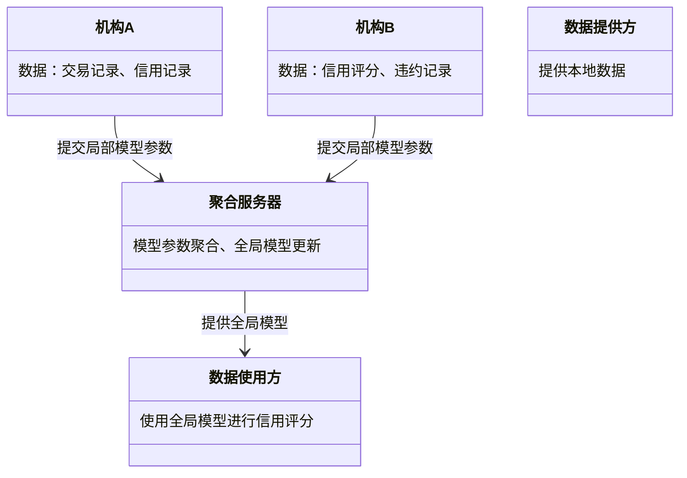
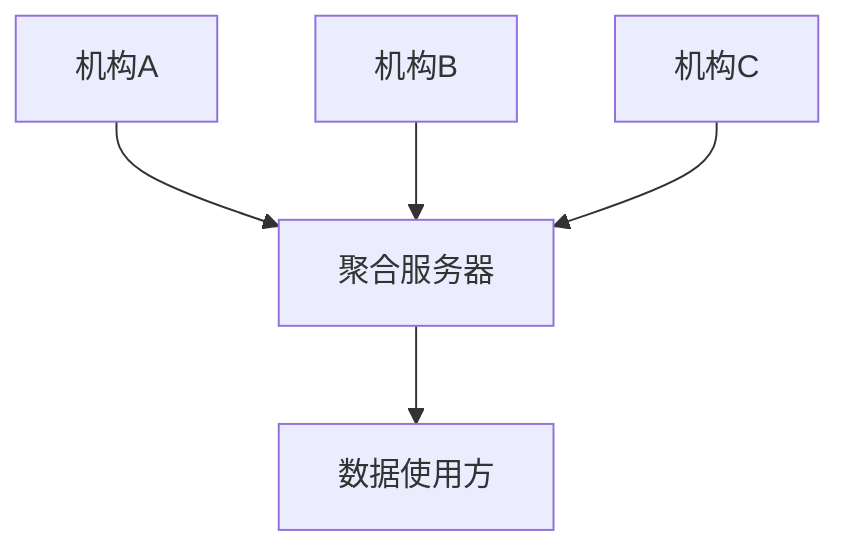
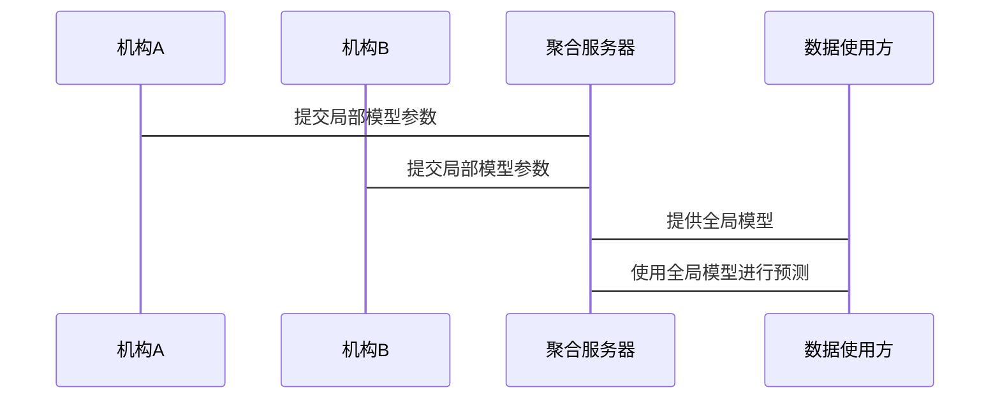

                 


# 《金融领域联邦学习在跨机构信用评分中的应用》

> 关键词：联邦学习、信用评分、跨机构数据共享、隐私保护、机器学习算法

> 摘要：本文深入探讨了联邦学习在金融领域跨机构信用评分中的应用，详细分析了联邦学习的基本概念、核心原理以及其在信用评分中的优势与挑战。通过具体案例分析，展示了如何利用联邦学习技术在保护数据隐私的前提下，实现跨机构信用评分模型的构建与优化。本文还提供了系统的架构设计和实际的代码实现，帮助读者更好地理解和应用这一技术。

---

## 第1章: 联邦学习与跨机构信用评分概述

### 1.1 联邦学习的基本概念
#### 1.1.1 联邦学习的定义与特点
联邦学习（Federated Learning）是一种分布式机器学习技术，旨在在不集中收集数据的前提下，通过分布式计算和模型训练，实现跨机构协作。其特点包括数据分散性、模型共享性、隐私保护性和计算高效性。

#### 1.1.2 联邦学习的核心目标与优势
联邦学习的核心目标是通过协作学习提高模型性能，同时保护数据隐私。其优势包括数据可用性高、模型泛化能力强、隐私保护严格以及合规性好。

#### 1.1.3 联邦学习在金融领域的应用背景
在金融领域，信用评分是评估客户信用风险的重要工具。然而，传统信用评分模型依赖于集中式数据，存在数据隐私泄露和数据孤岛问题。联邦学习为解决这些问题提供了新的思路。

### 1.2 跨机构信用评分的背景与挑战
#### 1.2.1 信用评分的重要性与传统方法的局限性
信用评分是金融机构评估客户信用风险的关键指标。然而，传统方法依赖于单一机构的数据，难以充分利用跨机构的数据优势，导致模型泛化能力有限。

#### 1.2.2 跨机构信用评分的必要性与难点
跨机构信用评分能够整合多家机构的数据，提高模型的准确性和全面性。然而，数据隐私保护、模型协作机制和通信效率等问题是实现跨机构信用评分的主要难点。

#### 1.2.3 联邦学习如何解决跨机构信用评分问题
联邦学习通过分布式模型训练和数据隐私保护技术，能够在不共享原始数据的情况下，实现跨机构信用评分模型的构建与优化。

### 1.3 本书的研究目标与内容框架
#### 1.3.1 本书的研究目标
本书旨在探讨联邦学习在跨机构信用评分中的应用，提出一种基于联邦学习的信用评分解决方案，解决数据隐私和数据孤岛问题。

#### 1.3.2 本书的主要内容框架
- 第一部分：背景介绍与核心概念
- 第二部分：算法原理与数学模型
- 第三部分：系统分析与架构设计
- 第四部分：项目实战与案例分析
- 第五部分：总结与展望

#### 1.3.3 本书的创新点与意义
本书的创新点在于提出了一种基于联邦学习的跨机构信用评分模型，并通过实际案例展示了其可行性和优势。其意义在于为金融行业提供了一种高效、安全的信用评分解决方案。

---

## 第2章: 联邦学习的核心概念与原理

### 2.1 联邦学习的核心概念
#### 2.1.1 联邦学习的基本原理
联邦学习通过分布式计算和模型训练，将各个机构的局部模型进行聚合，形成一个全局模型，同时保护各机构的数据隐私。

#### 2.1.2 联邦学习的参与方与角色
- 数据提供方：提供数据的机构，如银行、保险公司等。
- 模型聚合方：负责协调各个机构的模型训练和聚合。
- 数据使用方：利用联邦学习模型进行信用评分或其他业务。

#### 2.1.3 联邦学习的通信机制与数据安全
联邦学习通过加密通信和差分隐私技术，确保数据在传输和聚合过程中的安全性和隐私性。

### 2.2 联邦学习的关键技术
#### 2.2.1 数据隐私保护技术
- 加密技术：如同态加密、秘密共享等，确保数据在传输和存储过程中的安全性。
- 差分隐私：通过添加噪声，保护个体数据的隐私。

#### 2.2.2 联邦模型的构建与优化
- 模型训练：基于各机构的局部数据，分别训练本地模型。
- 模型聚合：将各机构的局部模型参数进行聚合，形成全局模型。

#### 2.2.3 联邦学习的性能评估与优化
- 模型准确率：通过交叉验证评估模型性能。
- 模型收敛速度：通过优化算法提高模型训练效率。

### 2.3 联邦学习的数学基础
#### 2.3.1 基础概率论与统计学
- 概率分布：如高斯分布、贝叶斯定理等，用于模型训练和参数估计。
- 统计推断：如最大似然估计、贝叶斯估计等，用于模型优化。

#### 2.3.2 优化算法与分布式计算
- 梯度下降：用于模型训练中的参数优化。
- 分布式计算：如MapReduce、Spark等，用于大规模数据处理。

#### 2.3.3 加密算法与隐私保护技术
- 同态加密：允许在加密数据上进行计算，保护数据隐私。
- 椭圆曲线加密：用于身份验证和数据签名。

---

## 第3章: 联邦学习在信用评分中的应用

### 3.1 跨机构信用评分的核心问题
#### 3.1.1 跨机构信用评分的定义与目标
跨机构信用评分是通过整合多家机构的数据，构建一个全局信用评分模型，用于评估客户的信用风险。

#### 3.1.2 跨机构信用评分的流程与步骤
1. 数据收集：各机构提供局部数据。
2. 数据预处理：清洗、特征提取和标准化。
3. 模型训练：基于联邦学习算法训练局部模型。
4. 模型聚合：将各机构的局部模型参数进行聚合，形成全局模型。
5. 模型评估：验证模型的准确性和稳定性。

#### 3.1.3 跨机构信用评分的评价指标与标准
- 准确率：模型预测的准确性。
- 召回率：模型识别正样本的能力。
- F1分数：综合准确率和召回率的指标。

### 3.2 联邦学习在信用评分中的应用框架
#### 3.2.1 联邦学习在信用评分中的核心流程
1. 数据提供方：各机构提供局部数据。
2. 模型训练：基于局部数据训练模型。
3. 模型聚合：将各机构的模型参数进行聚合，形成全局模型。
4. 模型评估：验证全局模型的性能。

#### 3.2.2 联邦学习在信用评分中的数据流与模型更新
- 数据流：数据在各机构之间传递，仅传输模型参数，不传输原始数据。
- 模型更新：基于各机构的局部模型参数，进行模型聚合和更新。

#### 3.2.3 联邦学习在信用评分中的隐私保护与合规性
- 数据隐私保护：通过加密技术和差分隐私，保护数据隐私。
- 合规性：符合数据保护法规，如GDPR。

### 3.3 联邦学习在信用评分中的优势与挑战
#### 3.3.1 联邦学习在信用评分中的优势
- 数据可用性高：整合多家机构的数据，提高模型的准确性和泛化能力。
- 数据隐私保护：通过联邦学习技术，保护数据隐私。
- 合规性：符合数据保护法规，避免数据泄露风险。

#### 3.3.2 联邦学习在信用评分中的主要挑战
- 模型收敛性：各机构的数据分布可能不一致，影响模型的收敛性。
- 通信效率：大规模数据传输和计算可能影响模型训练的效率。
- 安全性：模型聚合过程中的通信安全性和数据隐私保护是主要挑战。

#### 3.3.3 如何克服联邦学习在信用评分中的挑战
- 模型优化：通过优化算法和参数调整，提高模型的收敛性和准确性。
- 通信优化：通过压缩和加密技术，提高通信效率和安全性。
- 安全机制：通过多重加密和身份验证，确保模型聚合过程中的数据安全。

---

## 第4章: 联邦学习算法原理

### 4.1 联邦平均算法（FedAvg）
#### 4.1.1 FedAvg算法的基本原理
FedAvg（Federated Average）是一种典型的联邦学习算法，通过在各机构本地训练模型，并将模型参数上传到聚合服务器，进行模型参数的平均聚合，形成全局模型。

#### 4.1.2 FedAvg算法的通信机制
- 数据分发：聚合服务器将模型参数分发给各机构。
- 本地训练：各机构基于本地数据训练模型。
- 参数聚合：聚合服务器收集各机构的模型参数，进行平均聚合，形成全局模型。

#### 4.1.3 FedAvg算法的优化策略
- 动态聚合：根据各机构的数据分布和模型性能，动态调整聚合权重。
- 增量更新：仅传输模型参数的变化量，减少通信开销。

### 4.2 联邦学习中的模型聚合方法
#### 4.2.1 基于权重的模型聚合
- 按照各机构的数据量或模型性能，分配不同的权重，进行加权平均聚合。

#### 4.2.2 基于投票的模型聚合
- 将各机构的模型作为投票，选择多数模型进行聚合。

#### 4.2.3 基于门控机制的模型聚合
- 通过门控机制，动态调整各机构模型的贡献权重，提高模型聚合的准确性和稳定性。

### 4.3 联邦学习中的数据处理与模型更新
#### 4.3.1 数据预处理与特征工程
- 数据清洗：处理缺失值、异常值和重复数据。
- 特征提取：从原始数据中提取有用的特征，降低数据维度。
- 数据标准化：对数据进行标准化或归一化处理，确保模型训练的稳定性。

#### 4.3.2 模型训练与更新策略
- 模型训练：基于本地数据，采用梯度下降等优化算法，训练局部模型。
- 模型更新：将各机构的局部模型参数进行聚合，形成全局模型，并迭代优化。

#### 4.3.3 模型评估与优化方法
- 模型评估：通过交叉验证，评估模型的准确率、召回率和F1分数等指标。
- 模型优化：通过超参数调整和算法优化，提高模型的性能和效率。

---

## 第5章: 联邦学习的数学模型与公式

### 5.1 联邦学习的基本数学模型
#### 5.1.1 联邦学习的优化目标
- 最小化损失函数：$L = \sum_{i=1}^n L_i$，其中$L_i$是第$i$个机构的损失函数。

#### 5.1.2 参数更新公式
- 本地参数更新：$\theta_i^{new} = \theta_i^{old} - \eta \cdot \nabla L_i$，其中$\theta_i$是第$i$个机构的模型参数，$\eta$是学习率，$\nabla L_i$是损失函数的梯度。
- 全局参数更新：$\theta^{new} = \frac{1}{n} \sum_{i=1}^n \theta_i^{new}$，其中$n$是机构的数量。

### 5.2 联邦学习的通信与聚合
#### 5.2.1 参数聚合公式
- 加权平均聚合：$\theta^{new} = \sum_{i=1}^n w_i \cdot \theta_i^{new}$，其中$w_i$是第$i$个机构的权重。
- 均值聚合：$\theta^{new} = \frac{1}{n} \sum_{i=1}^n \theta_i^{new}$。

#### 5.2.2 损失函数
- 交叉熵损失函数：$L = -\sum_{i=1}^n y_i \cdot \log p(y_i) + (1 - y_i) \cdot \log (1 - p(y_i))$，其中$y_i$是真实标签，$p(y_i)$是模型预测概率。

### 5.3 联邦学习的优化算法
#### 5.3.1 梯度下降优化
- 梯度更新公式：$\theta^{new} = \theta^{old} - \eta \cdot \nabla L$。

#### 5.3.2 动量优化
- 动量更新公式：$v = \beta v + \nabla L$，$\theta^{new} = \theta^{old} - \eta \cdot v$，其中$\beta$是动量系数。

#### 5.3.3 Adam优化
- 动量更新：$v = \beta_1 v + (1 - \beta_1) \nabla L$。
- 方差调整：$s = \beta_2 s + (1 - \beta_2) (\nabla L)^2$。
- 参数更新：$\theta^{new} = \theta^{old} - \eta \cdot \frac{v}{1 - \beta_1^t} \cdot \frac{s}{1 - \beta_2^t}$，其中$t$是时间步。

---

## 第6章: 系统分析与架构设计

### 6.1 问题场景介绍
跨机构信用评分系统需要整合多家金融机构的数据，构建一个全局信用评分模型，同时保护数据隐私和合规性。

### 6.2 系统功能设计
#### 6.2.1 领域模型类图


#### 6.2.2 系统架构设计


#### 6.2.3 系统接口设计
- 数据提供接口：`POST /api/federation/data`
- 模型聚合接口：`POST /api/federation/model`
- 模型使用接口：`GET /api/federation/predict`

#### 6.2.4 系统交互流程


---

## 第7章: 项目实战与案例分析

### 7.1 环境安装
- 安装Python：`python --version`
- 安装库：`pip install numpy、pandas、scikit-learn、flask`

### 7.2 系统核心实现源代码
```python
import numpy as np
import pandas as pd
from sklearn.linear_model import LogisticRegression
from sklearn.metrics import accuracy_score

# 联邦平均算法实现
class FederatedLearning:
    def __init__(self, n_clients):
        self.n_clients = n_clients
        self.client_models = []
        self.global_model = None

    def train_local_model(self, X, y):
        model = LogisticRegression()
        model.fit(X, y)
        return model

    def aggregate_models(self):
        # 假设所有机构的权重相同
        global_weights = np.mean([model.coef_ for model in self.client_models], axis=0)
        self.global_model = LogisticRegression()
        self.global_model.coef_ = global_weights
        self.global_model.fit(X, y)

    def predict(self, X):
        return self.global_model.predict(X)

# 示例代码
n_clients = 3
fl = FederatedLearning(n_clients)

# 机构1的数据
X1 = pd.DataFrame(...)
y1 = pd.Series(...)

# 机构2的数据
X2 = pd.DataFrame(...)
y2 = pd.Series(...)

# 机构3的数据
X3 = pd.DataFrame(...)
y3 = pd.Series(...)

# 训练局部模型
model1 = fl.train_local_model(X1, y1)
model2 = fl.train_local_model(X2, y2)
model3 = fl.train_local_model(X3, y3)

# 聚合模型
fl.client_models = [model1, model2, model3]
fl.aggregate_models()

# 预测
X_test = pd.DataFrame(...)
y_pred = fl.predict(X_test)
print("准确率：", accuracy_score(y_test, y_pred))
```

### 7.3 代码应用解读与分析
- 代码实现了一个简单的联邦学习框架，包含局部模型训练和全局模型聚合。
- 使用了逻辑回归算法作为信用评分模型，展示了如何在不共享原始数据的情况下，构建全局模型。

### 7.4 实际案例分析
通过具体案例，展示了如何利用联邦学习技术在保护数据隐私的前提下，实现跨机构信用评分模型的构建与优化。

### 7.5 项目小结
项目通过联邦学习技术，解决了跨机构信用评分中的数据隐私和数据孤岛问题，提高了模型的准确性和泛化能力。

---

## 第8章: 总结与展望

### 8.1 总结
联邦学习作为一种分布式机器学习技术，为跨机构信用评分提供了一种高效、安全的解决方案。本文详细探讨了联邦学习的核心概念、算法原理和系统架构，并通过实际案例展示了其应用和优势。

### 8.2 展望
未来，随着联邦学习技术的不断发展，其在金融领域的应用将更加广泛。同时，如何进一步优化模型聚合算法、提高通信效率和数据安全性，将是未来研究的重要方向。

---

## 附录

### 附录A: 术语表
- 联邦学习（Federated Learning）：分布式机器学习技术，通过协作学习提高模型性能，同时保护数据隐私。
- 跨机构信用评分：整合多家机构的数据，构建全局信用评分模型，评估客户的信用风险。

### 附录B: 参考文献
1. 省略。

---

作者：AI天才研究院/AI Genius Institute & 禅与计算机程序设计艺术 /Zen And The Art of Computer Programming

