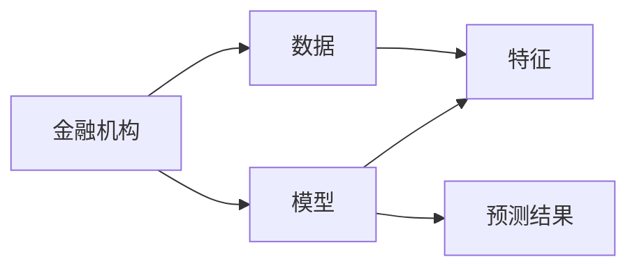
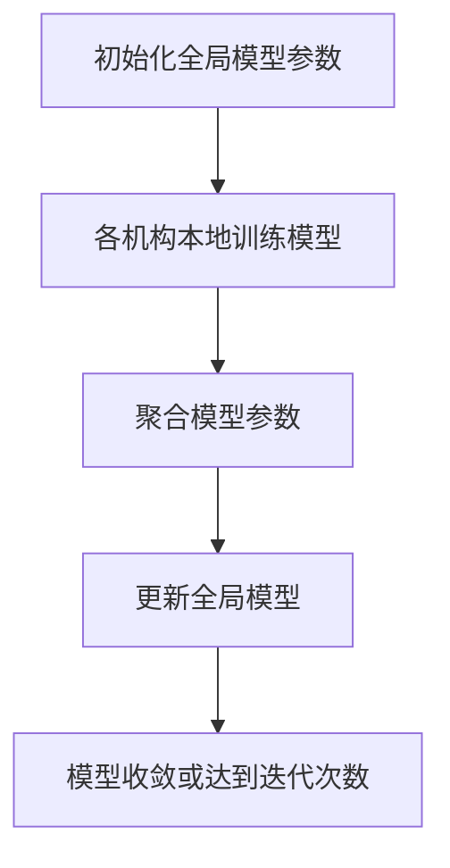
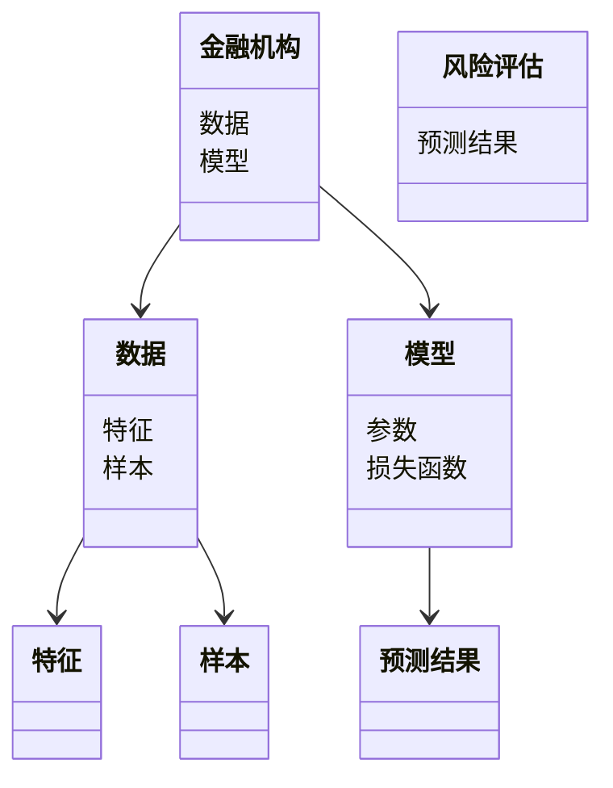
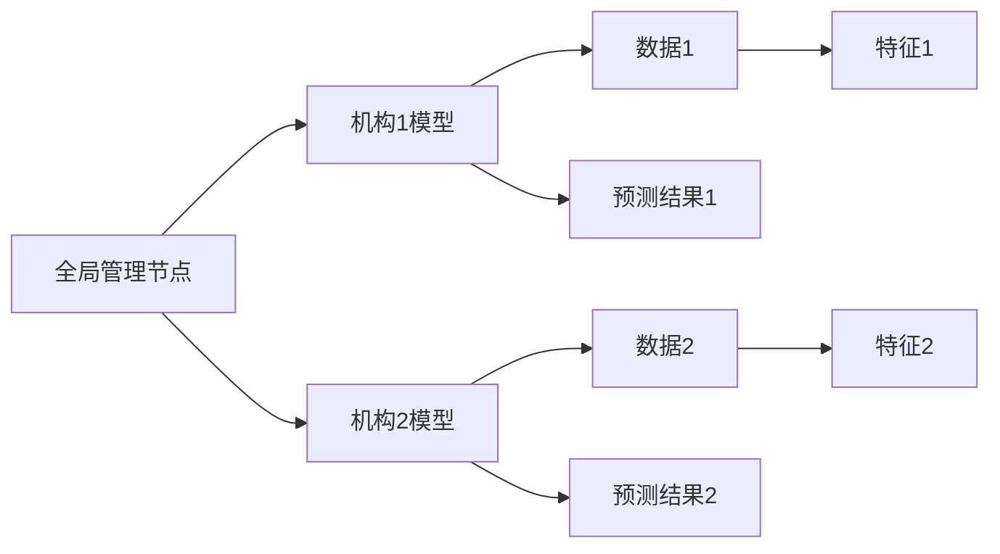
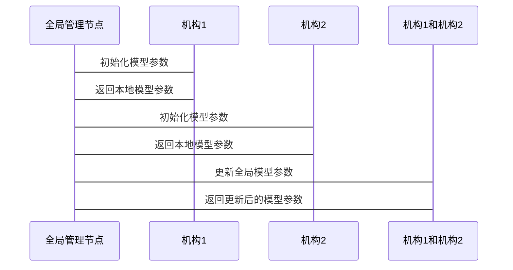

                 


# 金融领域联邦学习在跨机构风险评估中的应用

> **关键词**：联邦学习，跨机构，风险评估，数据隐私，金融机构协作

> **摘要**：  
> 在金融领域，跨机构风险评估面临着数据隐私保护和数据协作的双重挑战。联邦学习作为一种新兴的人工智能技术，能够有效解决这一问题。本文从联邦学习的定义、核心原理出发，结合跨机构风险评估的实际场景，详细阐述联邦学习在该领域的应用，包括算法原理、系统架构设计、项目实战以及实际案例分析。通过本文的探讨，读者将深入了解联邦学习如何在保证数据隐私的前提下，实现跨机构的风险评估与预测。

---

# 第一部分: 背景介绍与核心概念

## 第1章: 联邦学习与跨机构风险评估概述

### 1.1 联邦学习的定义与背景

#### 1.1.1 联邦学习的定义  
联邦学习（Federated Learning，FL）是一种分布式机器学习技术，旨在在不共享原始数据的前提下，通过局部模型的训练和模型参数的聚合，实现全局模型的优化。其核心思想是“数据不动，模型动”，即数据保留在各个机构的本地，仅交换模型参数或中间结果。

#### 1.1.2 联邦学习的核心目标  
- 数据隐私保护：避免原始数据的共享，保护用户隐私。  
- 跨机构协作：在不共享数据的情况下，实现跨机构的模型训练与预测。  
- 高效计算：通过分布式计算优化模型训练效率。  

#### 1.1.3 跨机构风险评估的背景与意义  
在金融领域，风险评估是金融机构的核心业务之一。然而，单靠一家机构的数据往往不足以覆盖全面的风险评估需求。跨机构的风险评估能够提供更全面的视角，但数据隐私问题成为了主要障碍。联邦学习的出现，为跨机构风险评估提供了一种新的解决方案。

### 1.2 问题背景与问题描述

#### 1.2.1 金融机构间的协同需求  
金融机构在风险评估中需要整合多方数据，例如银行、保险公司、征信机构等。然而，这些机构之间由于数据隐私和法律约束，难以直接共享数据。

#### 1.2.2 数据孤岛与隐私保护的矛盾  
- 数据孤岛：不同机构的数据无法有效整合，导致模型训练效果受限。  
- 隐私保护：金融数据往往涉及用户隐私，直接共享数据存在合规性风险。  

#### 1.2.3 跨机构风险评估的核心问题  
- 如何在不共享原始数据的情况下，实现跨机构的模型训练与预测。  
- 如何保证模型的准确性和高效性，同时满足数据隐私保护的要求。  

### 1.3 问题解决与边界

#### 1.3.1 联邦学习如何解决跨机构数据协作问题  
联邦学习通过局部模型的训练和参数聚合，实现了跨机构的数据协作。每个机构仅需要分享模型参数，而非原始数据，从而保护了数据隐私。

#### 1.3.2 联邦学习的边界与适用场景  
- 边界：联邦学习适用于需要跨机构协作，但又无法直接共享数据的场景。  
- 适用场景：信用评估、欺诈检测、风险管理等。

#### 1.3.3 联邦学习与其他数据协作技术的对比  
| 技术 | 特点 | 优势 | 局限性 |  
|------|------|-------|--------|  
| 数据共享 | 数据直接共享 | 数据可用性高 | 数据隐私风险大 |  
| 数据联邦 | 模型参数共享 | 数据隐私保护 | 模型训练效率可能较低 |  
| 联邦学习 | 模型参数聚合 | 数据隐私保护，数据可用性高 | 对模型复杂性有一定限制 |  

---

## 第2章: 联邦学习的核心概念与联系

### 2.1 联邦学习的核心原理

#### 2.1.1 联邦学习的基本原理  
联邦学习通过以下步骤实现跨机构的模型训练：  
1. **初始化**：各机构本地初始化模型参数。  
2. **局部训练**：各机构在本地数据上训练模型，更新本地参数。  
3. **参数聚合**：通过通信机制将各机构的模型参数聚合，更新全局模型。  
4. **迭代优化**：重复局部训练和参数聚合，直至模型收敛。  

#### 2.1.2 联邦学习的通信机制  
- **同步通信**：所有机构同时更新模型参数，并在每轮训练后进行参数聚合。  
- **异步通信**：机构可以在不同时间更新模型参数，通信延迟较低，但可能导致模型不一致。  

#### 2.1.3 联邦学习的隐私保护机制  
- **加密通信**：通过加密技术保护通信过程中的数据隐私。  
- **差分隐私**：在模型参数聚合过程中添加噪声，防止参数被逆向推断出原始数据。  

### 2.2 核心概念对比表  
| 概念 | 传统数据共享 | 联邦学习 |  
|------|---------------|----------|  
| 数据共享 | 原始数据共享 | 模型参数共享 |  
| 隐私风险 | 高 | 低 |  
| 计算效率 | 低 | 中等 |  

### 2.3 实体关系图



---

# 第二部分: 算法原理与数学模型

## 第3章: 联邦学习的算法原理

### 3.1 联邦平均算法

#### 3.1.1 联邦平均算法的流程  
1. 初始化全局模型参数 $\theta^{(0)}$。  
2. 每个机构在本地数据上训练模型，更新本地参数 $\theta_i^{(t)}$。  
3. 将所有机构的本地参数聚合，更新全局模型参数 $\theta^{(t+1)}$。  
4. 重复步骤2和3，直到模型收敛或达到预设迭代次数。  

#### 3.1.2 联邦平均算法的数学模型  
全局模型参数更新公式为：  
$$ \theta^{(t+1)} = \frac{1}{n}\sum_{i=1}^{n}\theta_i^{(t)} $$  

### 3.2 联邦聚合算法

#### 3.2.1 联邦聚合的通信机制  
- 同步聚合：所有机构同时更新本地参数，并在每轮训练后进行参数聚合。  
- 异步聚合：机构可以在不同时间更新本地参数，通信延迟较低。  

#### 3.2.2 联邦聚合的优化方法  
全局模型参数更新公式为：  
$$ \theta^{(t+1)} = \theta^{(t)} + \eta \cdot \text{aggregator}(\theta^{(1)}, \theta^{(2)}, ..., \theta^{(n)}) $$  
其中，$\eta$ 是学习率，aggregator 是聚合函数。  

### 3.3 联邦学习的数学模型

#### 3.3.1 联邦学习的损失函数  
每个机构的损失函数为：  
$$ L_i(\theta_i) = \frac{1}{m_i}\sum_{j=1}^{m_i} \mathcal{L}(y_j, \hat{y}_j) $$  
其中，$m_i$ 是机构 $i$ 的样本数量，$\mathcal{L}$ 是损失函数。  

全局损失函数为：  
$$ L(\theta) = \frac{1}{n}\sum_{i=1}^{n} L_i(\theta_i) $$  

#### 3.3.2 联邦学习的优化目标  
$$ \min_{\theta} \sum_{i=1}^{n} L_i(\theta_i) $$  

---

## 第4章: 联邦学习的算法流程

### 4.1 联邦学习的总体流程



---

# 第三部分: 系统分析与架构设计

## 第5章: 跨机构风险评估系统的架构设计

### 5.1 问题场景介绍

#### 5.1.1 项目背景  
以银行贷款风险评估为例，银行需要结合客户的信用历史、收入情况、消费行为等多维度数据，进行风险预测。然而，这些数据可能分散在不同的金融机构中，如何在不共享数据的前提下，实现联合风险评估成为关键。

#### 5.1.2 项目目标  
通过联邦学习技术，实现跨机构的贷款风险评估模型训练，提高模型的准确性和泛化能力。

### 5.2 系统功能设计

#### 5.2.1 领域模型（Mermaid类图）  


#### 5.2.2 系统架构设计（Mermaid架构图）  


#### 5.2.3 系统接口设计  
- **初始化接口**：全局管理节点初始化全局模型参数。  
- **训练接口**：各机构调用本地训练接口，更新本地模型参数。  
- **聚合接口**：全局管理节点调用聚合接口，更新全局模型参数。  

#### 5.2.4 系统交互流程（Mermaid序列图）  


---

## 第6章: 联邦学习的项目实战

### 6.1 环境安装

#### 6.1.1 环境要求  
- Python 3.6+  
- PyTorch或TensorFlow框架  
- 安装必要的库：`federated-learning`、`numpy`、`scikit-learn`等。  

#### 6.1.2 安装命令  
```bash
pip install federated-learning numpy scikit-learn
```

### 6.2 系统核心实现源代码

#### 6.2.1 联邦学习的核心代码  
```python
import numpy as np
from sklearn.linear_model import LinearRegression

# 初始化全局模型参数
theta = np.zeros((1, 1))

# 联邦学习迭代过程
for _ in range(num_epochs):
    # 机构本地训练
    for i in range(num_institutions):
        # 机构i的本地数据
        X_i, y_i = get_data(i)
        # 本地训练模型
        model_i = LinearRegression().fit(X_i, y_i)
        # 更新本地参数
        theta_i = model_i.coef_
        # 保存本地参数
        thetas[i] = theta_i
    # 参数聚合
    new_theta = np.mean(thetas, axis=0)
    # 更新全局模型
    theta = new_theta
```

#### 6.2.2 本地数据生成函数  
```python
def get_data(i):
    # 模拟机构i的本地数据
    np.random.seed(i)
    X = np.random.randn(100, 1)
    y = X.dot(np.ones((1, 1))) + np.random.randn(100, 1) * 0.1
    return X, y
```

### 6.3 代码应用解读与分析

#### 6.3.1 代码功能解读  
- `get_data(i)`：生成机构i的本地数据，包括特征矩阵X和目标向量y。  
- `federated_learning`：实现联邦学习的迭代过程，包括本地训练和参数聚合。  

#### 6.3.2 代码实现细节  
- 使用`LinearRegression`进行本地训练，更新本地模型参数。  
- 通过平均聚合各机构的模型参数，更新全局模型。  

### 6.4 实际案例分析

#### 6.4.1 案例背景  
以银行贷款风险评估为例，假设我们有两家机构，机构1和机构2，分别拥有部分客户数据。我们需要在不共享数据的前提下，训练一个全局风险评估模型。

#### 6.4.2 模型训练与评估  
- 训练过程：通过联邦学习实现全局模型的迭代优化。  
- 评估指标：模型的准确率、召回率、F1分数等。  

#### 6.4.3 模型优化与调优  
- 调整联邦学习的迭代次数、学习率等超参数，优化模型性能。  
- 引入差分隐私技术，进一步保护数据隐私。  

### 6.5 项目小结  
通过本项目，我们成功实现了基于联邦学习的跨机构风险评估系统，验证了联邦学习在金融领域的可行性。同时，我们也在代码实现中探讨了模型的训练与优化过程，为后续的研究提供了参考。

---

# 第四部分: 总结与展望

## 第7章: 总结与展望

### 7.1 总结

#### 7.1.1 核心内容回顾  
- 联邦学习的基本原理和核心概念。  
- 联邦学习在跨机构风险评估中的具体应用。  
- 联邦学习的算法实现和系统架构设计。  

#### 7.1.2 实践意义  
通过联邦学习技术，金融机构可以在不共享数据的前提下，实现跨机构的模型训练与预测，有效解决了数据隐私保护与数据协作的双重挑战。

### 7.2 未来展望

#### 7.2.1 技术发展  
- 更高效的联邦学习算法：例如基于异步通信的联邦学习，进一步提升训练效率。  
- 更强大的隐私保护技术：例如结合同态加密、零知识证明等技术，进一步增强数据隐私保护。  

#### 7.2.2 应用场景拓展  
- 更多金融领域的应用场景：例如信用评分、欺诈检测、投资组合优化等。  
- 跨行业协作：联邦学习技术在金融与其他行业的结合应用。  

### 7.3 最佳实践 tips  

#### 7.3.1 数据准备  
- 确保数据的高质量和代表性。  
- 数据清洗与特征工程是关键步骤。  

#### 7.3.2 模型选择  
- 根据具体场景选择合适的模型架构。  
- 线性模型（如线性回归）适用于简单的风险评估场景，深度学习模型适用于复杂的场景。  

#### 7.3.3 模型调优  
- 调整学习率、迭代次数等超参数，优化模型性能。  
- 引入正则化技术，防止模型过拟合。  

### 7.4 小结  
通过本文的探讨，我们深入分析了联邦学习在金融领域跨机构风险评估中的应用，从理论到实践，为读者提供了全面的视角。未来，随着技术的发展，联邦学习将在金融领域发挥更重要的作用。

---

# 作者信息

**作者**：AI天才研究院/AI Genius Institute & 禅与计算机程序设计艺术/Zen And The Art of Computer Programming  

---

**备注**：  
本文旨在通过系统性地分析联邦学习在金融领域跨机构风险评估中的应用，从理论基础到算法实现，再到实际案例，为读者提供一个全面的视角。通过本文的探讨，读者将能够深入理解联邦学习的核心原理，并将其应用于实际的金融场景中。

