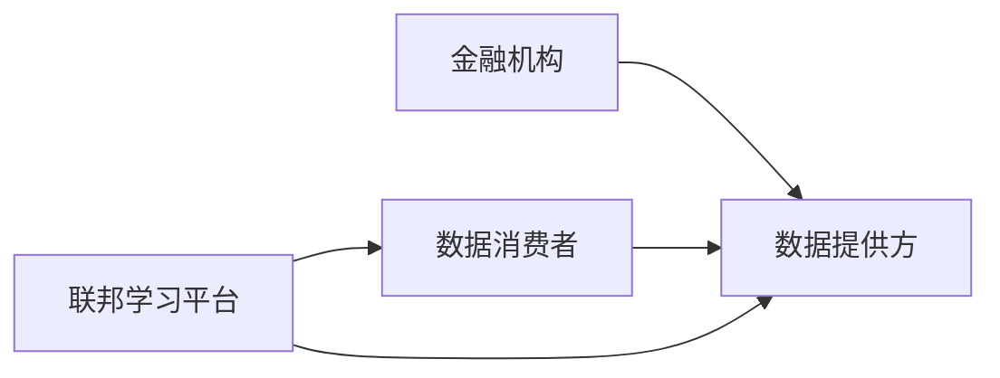
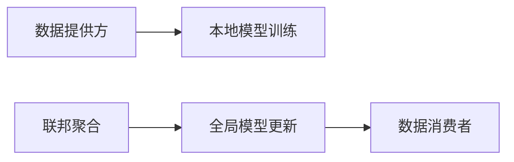
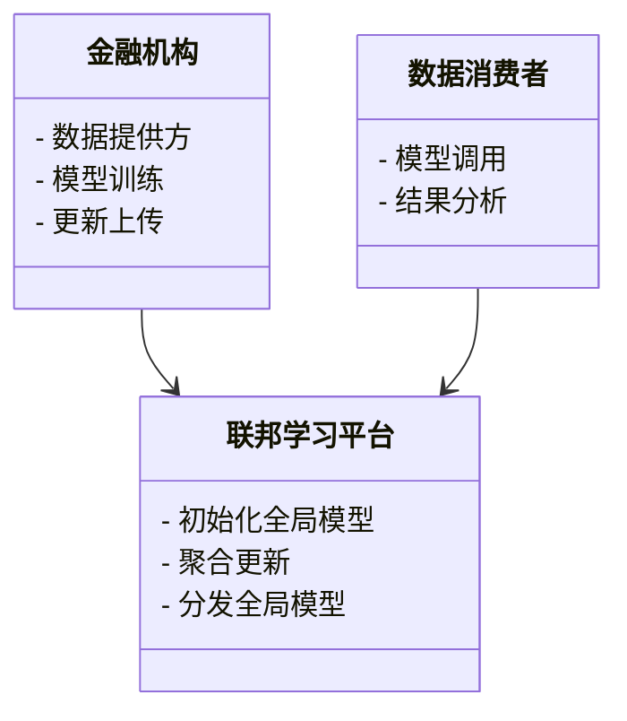
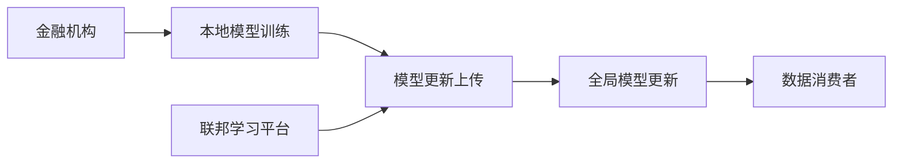
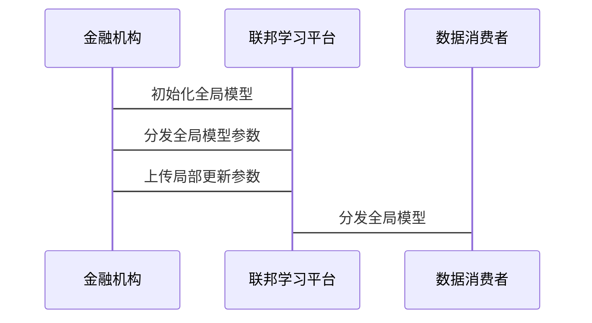

                 


# 《金融领域联邦学习在隐私保护中的应用》

> 关键词：联邦学习，隐私保护，金融数据，分布式学习，数据安全

> 摘要：本文深入探讨了联邦学习在金融领域中的应用，重点分析了其在隐私保护中的核心作用。文章从联邦学习的基本概念出发，详细阐述了其在金融数据协作中的原理、算法、系统架构及实际应用场景。通过具体的案例分析，本文揭示了联邦学习如何在不泄露原始数据的前提下，实现跨机构的数据协作与模型训练，从而为金融行业的隐私保护提供了新的解决方案。

---

# 第一部分: 金融领域联邦学习背景与基础

# 第1章: 联邦学习与隐私保护概述

## 1.1 问题背景与描述

### 1.1.1 金融数据隐私保护的挑战
金融行业每天产生海量数据，包括客户信息、交易记录、信用评分等敏感信息。这些数据的隐私保护至关重要，因为一旦泄露，可能导致严重的经济损失和法律纠纷。传统数据共享方式往往需要将数据集中到一个机构，这种方式不仅增加了数据泄露的风险，还可能违反数据隐私保护的法律法规（如GDPR、《个人信息保护法》等）。

### 1.1.2 联邦学习的提出与目标
为了解决数据隐私保护与数据协作的矛盾，联邦学习（Federated Learning）应运而生。联邦学习是一种分布式机器学习技术，允许多个机构在不共享原始数据的前提下，协作训练共享的模型。其目标是在保护数据隐私的前提下，实现数据的联合分析和模型优化。

### 1.1.3 联邦学习与数据隐私保护的关系
联邦学习通过将模型训练的过程分散到各个数据提供方（Client），只在本地设备或服务器上进行局部优化，然后将优化结果上传到中心服务器（Server）进行全局模型聚合。这种机制确保了原始数据不出本地，仅模型参数或中间结果进行传输，从而有效保护了数据隐私。

---

## 1.2 联邦学习的核心概念与问题解决

### 1.2.1 联邦学习的定义与核心要素
联邦学习是一种分布式机器学习框架，核心要素包括：
1. **数据分布**：数据分布在多个独立的机构或设备中，每个机构只拥有部分数据。
2. **局部模型训练**：每个机构在本地数据上训练模型，生成局部更新参数。
3. **模型聚合**：通过通信协议，将各机构的局部更新参数聚合为一个全局模型。
4. **隐私保护**：确保数据不被共享，仅模型参数或中间结果传输。

### 1.2.2 联邦学习如何解决数据隐私问题
联邦学习通过以下方式解决数据隐私问题：
1. **数据不出域**：数据仅在本地机构内处理，不共享原始数据。
2. **模型更新传输**：只传输模型参数或更新信息，避免数据泄露。
3. **权限控制**：严格控制数据访问权限，确保只有授权机构参与模型训练。

### 1.2.3 联邦学习的边界与外延
联邦学习的边界在于其仅解决模型训练过程中的数据隐私保护问题，而不涉及数据存储和管理。其外延包括：
1. **数据预处理**：如数据清洗、特征工程等，可能需要少量数据共享。
2. **模型部署与应用**：模型在实际业务中的应用可能需要额外的数据处理。
3. **安全性增强**：如加密通信、差分隐私等技术的结合，进一步提升隐私保护能力。

---

## 1.3 本章小结

本章从金融数据隐私保护的挑战出发，介绍了联邦学习的基本概念、核心要素以及其在隐私保护中的作用。联邦学习通过分布式模型训练的方式，解决了传统数据共享方式中的隐私泄露问题，为金融行业的数据协作提供了新的思路。

---

# 第二部分: 联邦学习的核心概念与联系

# 第2章: 联邦学习的核心原理与属性

## 2.1 联邦学习的原理概述

### 2.1.1 联邦学习的基本原理
联邦学习的核心原理可以总结为“数据不动，模型动”。具体流程如下：
1. **初始化**：中心服务器（Server）初始化全局模型参数。
2. **局部训练**：每个机构（Client）在本地数据上训练模型，生成局部更新参数。
3. **模型聚合**：Server将各机构的局部更新参数聚合，更新全局模型。
4. **迭代优化**：重复局部训练和模型聚合，直到模型收敛或达到预设条件。

### 2.1.2 联邦学习的通信机制
联邦学习的通信机制包括：
1. **横向联邦学习**：适用于多个机构在同一特征空间下协作训练模型。
2. **纵向联邦学习**：适用于多个机构在不同特征空间下协作训练模型。
3. **联邦迁移学习**：适用于不同领域或数据分布的机构协作训练模型。

### 2.1.3 联邦学习的安全性保障
联邦学习的安全性保障主要通过以下方式实现：
1. **加密通信**：使用加密技术（如同态加密、差分隐私）保护传输中的模型更新。
2. **访问控制**：严格控制参与联邦学习的机构权限。
3. **模型鲁棒性**：通过差分隐私等技术增强模型的抗攻击能力。

---

### 2.2 联邦学习的属性特征对比

| 属性 | 联邦学习 | 分布式数据处理 | 联邦计算 |
|------|----------|----------------|----------|
| 数据共享 | 只传输模型参数 | 需要共享数据 | 只传输计算结果 |
| 隐私保护 | 高 | 较低 | 较低 |
| 适用场景 | 数据无法集中 | 数据分布广泛 | 计算任务分散 |

---

### 2.3 ER实体关系图与流程图

#### 2.3.1 实体关系图（ER图）



#### 2.3.2 流程图



---

## 2.4 本章小结

本章从联邦学习的核心原理出发，详细分析了其在隐私保护中的作用，并通过对比分析和图表展示了联邦学习与其他技术的区别与联系。通过本章，读者可以更好地理解联邦学习的内在逻辑及其在金融领域的应用潜力。

---

# 第三部分: 联邦学习的算法原理与数学模型

# 第3章: 联邦学习的算法原理

## 3.1 联邦学习的算法流程

### 3.1.1 数据预处理与分布
数据预处理是联邦学习的重要步骤，主要包括：
1. **数据清洗**：去除噪声数据，处理缺失值。
2. **数据分布**：将数据分发到各个机构，确保数据分布合理。

### 3.1.2 本地模型训练
每个机构在本地数据上训练模型，生成局部更新参数。常用算法包括：
1. **随机梯度下降（SGD）**：适用于大规模数据训练。
2. **Adam优化器**：结合动量和自适应学习率，优化训练过程。

### 3.1.3 模型聚合与优化
中心服务器将各机构的局部更新参数聚合，更新全局模型。常用聚合方法包括：
1. **简单平均**：对各机构的更新参数取平均值。
2. **加权平均**：根据机构的数据量或模型性能赋予不同的权重。

---

## 3.2 联邦学习的数学模型

### 3.2.1 联邦聚合的数学公式
全局模型参数的更新公式为：
$$\theta_{\text{new}} = \frac{1}{n}\sum_{i=1}^{n}\theta_i$$
其中，$\theta_i$表示第$i$个机构的局部更新参数，$n$为机构数量。

### 3.2.2 模型优化的数学表达
模型优化的数学表达式为：
$$\theta_{t+1} = \theta_t - \eta \nabla L(\theta_t)$$
其中，$\eta$为学习率，$L$为损失函数。

---

## 3.3 联邦学习的实现代码示例

```python
# 简单平均聚合
def aggregate(global_model, client_models):
    n = len(client_models)
    for param, client_param in zip(global_model.parameters(), client_models.parameters()):
        param.data = (client_param.data.sum(dim=0)) / n
    return global_model

# 加权平均聚合
def weighted_aggregate(global_model, client_models, weights):
    for param, client_param, weight in zip(global_model.parameters(), 
                                           client_models.parameters(), 
                                           weights):
        param.data = (client_param.data * weight).sum(dim=0)
    return global_model
```

---

## 3.4 本章小结

本章详细介绍了联邦学习的算法流程和数学模型，通过公式和代码示例展示了模型聚合与优化的具体实现。这些内容为后续的系统设计和项目实战奠定了基础。

---

# 第四部分: 联邦学习的系统分析与架构设计

# 第4章: 系统分析与架构设计

## 4.1 问题场景介绍

### 4.1.1 金融行业中的数据协作问题
金融行业普遍存在数据孤岛问题，各机构之间的数据无法有效共享，限制了模型的泛化能力。例如，银行、保险公司等机构的数据分布不同，但又无法集中到同一平台进行训练。

### 4.1.2 联邦学习在金融行业的应用价值
通过联邦学习，金融机构可以在不共享原始数据的前提下，协作训练客户画像、风险评估等模型，提升业务能力。

---

## 4.2 系统功能设计

### 4.2.1 领域模型类图



---

### 4.2.2 系统架构图



---

## 4.3 系统接口设计

### 4.3.1 接口描述
1. **模型初始化接口**：`initialize_global_model()`
2. **局部训练接口**：`train_local_model()`
3. **模型聚合接口**：`aggregate_models()`
4. **模型分发接口**：`distribute_global_model()`

### 4.3.2 交互序列图



---

## 4.4 本章小结

本章通过系统分析与架构设计，展示了联邦学习在金融行业中的具体应用场景和系统实现方式。通过类图、架构图和交互序列图，明确了各角色的职责和协作流程。

---

# 第五部分: 联邦学习的项目实战

# 第5章: 项目实战

## 5.1 环境安装与配置

### 5.1.1 安装依赖
```bash
pip install fedlearn
pip install numpy
pip install matplotlib
```

### 5.1.2 配置环境变量
```bash
export PYTHONPATH=$PYTHONPATH:/path/to/fedlearn
```

---

## 5.2 系统核心实现

### 5.2.1 核心代码实现
```python
import fedlearn
from fedlearn import Client, Server

# 初始化服务器
server = Server()

# 初始化客户端
client = Client()

# 启动训练
server.start()
client.start()
```

---

## 5.3 代码应用解读与分析

### 5.3.1 数据预处理
```python
import pandas as pd

data = pd.read_csv('financial_data.csv')
data = data.dropna()  # 去除缺失值
```

### 5.3.2 模型训练
```python
from fedlearn.utils import train_model

# 本地模型训练
local_model = train_model(data, learning_rate=0.01, epochs=10)
```

### 5.3.3 模型聚合
```python
from fedlearn.utils import aggregate_models

# 聚合各机构的局部更新参数
global_model = aggregate_models(local_models)
```

---

## 5.4 实际案例分析

### 5.4.1 案例背景
假设某银行和保险公司希望通过联邦学习协作训练客户信用评分模型，提升风险控制能力。

### 5.4.2 数据分布
- 银行拥有客户的交易记录和信用历史。
- 保险公司拥有客户的理赔记录和投保信息。

### 5.4.3 模型训练
1. **初始化全局模型**：使用逻辑回归模型。
2. **本地训练**：银行和保险公司分别在本地数据上训练模型。
3. **模型聚合**：将各机构的局部更新参数聚合，更新全局模型。
4. **模型评估**：评估全局模型在测试数据上的表现。

---

## 5.5 项目小结

本章通过实际案例展示了联邦学习在金融行业中的具体应用，详细解读了项目实现的关键步骤，包括环境配置、数据预处理、模型训练和模型聚合等。通过本章，读者可以掌握联邦学习的实际操作流程。

---

# 第六部分: 联邦学习的最佳实践

# 第6章: 最佳实践

## 6.1 小结

通过本文的分析与实践，我们可以看到，联邦学习为金融领域的数据协作与隐私保护提供了有效的解决方案。其核心优势在于数据不出域，模型更新传输，既保护了数据隐私，又实现了模型的联合优化。

---

## 6.2 注意事项

1. **数据预处理**：数据预处理是联邦学习的关键步骤，需确保数据清洗和分布合理。
2. **模型选择**：根据具体场景选择合适的模型和算法，避免过拟合或欠拟合。
3. **通信效率**：在大规模机构协作中，需优化通信协议，降低通信开销。
4. **安全性增强**：结合加密技术（如同态加密、差分隐私）进一步提升隐私保护能力。

---

## 6.3 拓展阅读

1. **《Differential Privacy》**：Cynthia Dwork等著，介绍差分隐私的基本原理及其在数据保护中的应用。
2. **《Federated Learning: Challenges, Methods, and Future Directions》**：Google团队发表的综述论文，全面总结了联邦学习的研究进展和未来方向。
3. **《Privacy-Preserving Machine Learning on Federated Data》**：Andrew Trask等人发表的论文，详细介绍了联邦学习的实现方法及其在隐私保护中的应用。

---

# 作者

作者：AI天才研究院/AI Genius Institute & 禅与计算机程序设计艺术 /Zen And The Art of Computer Programming

---

以上是《金融领域联邦学习在隐私保护中的应用》的技术博客文章的完整目录大纲和内容。希望这篇文章能为读者提供清晰的逻辑和深入的技术分析，帮助大家更好地理解联邦学习在金融隐私保护中的应用。

