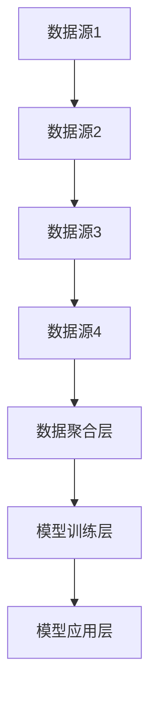
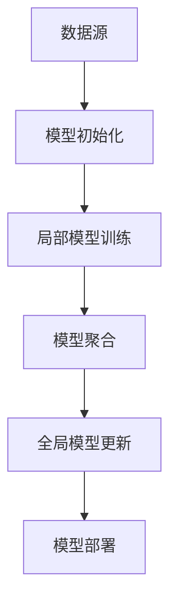
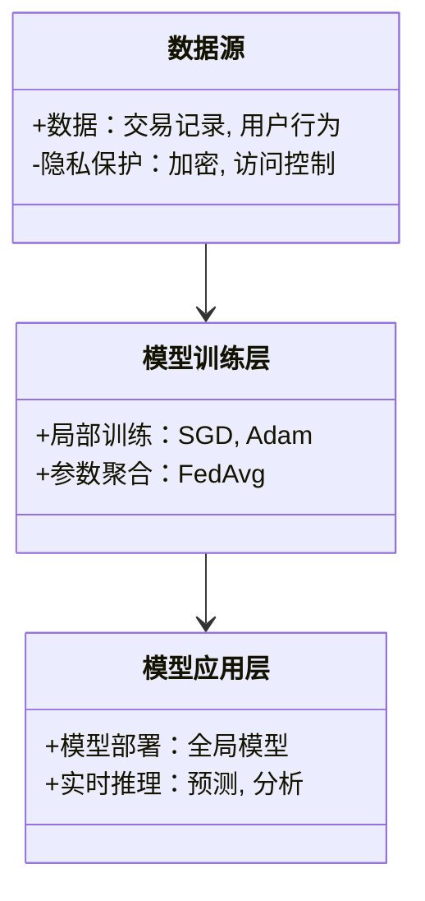
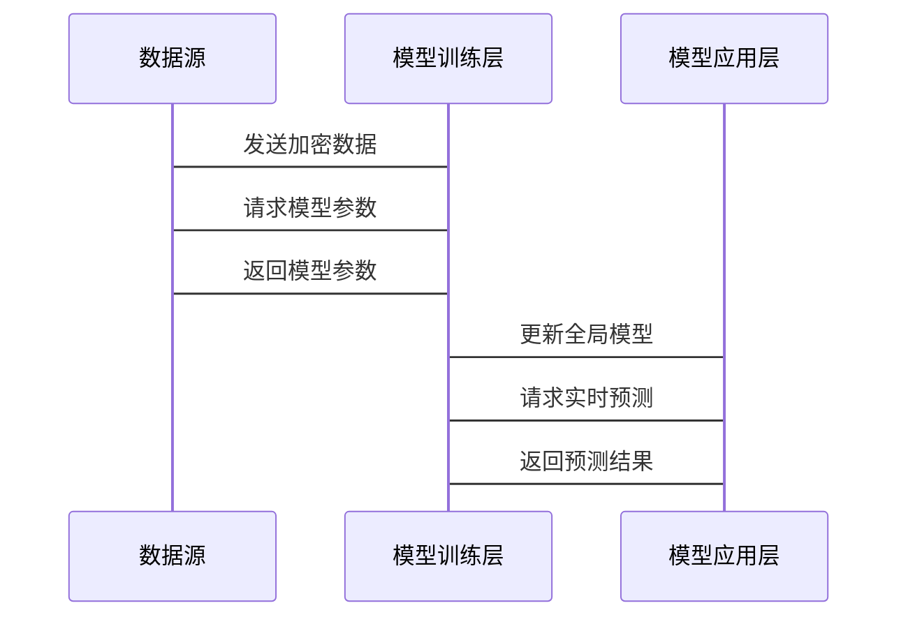

                 


# 《金融领域联邦学习的探索与实践》

## 关键词：联邦学习、金融数据、隐私保护、分布式学习、机器学习

## 摘要：  
本文深入探讨了联邦学习（Federated Learning）在金融领域的应用与实践。联邦学习作为一种分布式机器学习技术，能够在保护数据隐私的前提下，联合多个数据源进行模型训练，解决金融行业数据孤岛和隐私泄露的问题。文章从联邦学习的基本概念、算法原理、系统架构到实际项目案例，进行了全面而系统的分析，为读者提供了一条从理论到实践的完整路径。

---

## 第1章: 联邦学习的定义与背景

### 1.1 联邦学习的定义

#### 1.1.1 联邦学习的基本概念
联邦学习（Federated Learning，FL）是一种分布式机器学习技术，允许多个数据源在不共享原始数据的情况下，协作训练一个全局模型。其核心思想是“数据不动，模型动”，即数据保留在原始设备或服务器上，仅交换模型参数或中间结果。

#### 1.1.2 联邦学习的核心特点
- **数据隐私性**：数据无需集中，保护用户隐私。
- **分布式协作**：多个数据源协作训练，避免数据孤岛。
- **模型可解释性**：全局模型能够反映各数据源的特征。

#### 1.1.3 联邦学习的背景与意义
金融行业数据高度敏感，传统集中式模型训练方式存在数据泄露风险。联邦学习通过分布式训练，解决了数据隐私与共享的矛盾，为金融领域的风险控制、客户画像等场景提供了新的技术解决方案。

---

### 1.2 金融领域的数据挑战

#### 1.2.1 金融数据的特点与隐私问题
- **多样性**：金融数据涵盖交易记录、用户行为、市场数据等。
- **敏感性**：涉及个人隐私和商业机密。
- **稀疏性**：某些金融场景数据量小，难以单独训练有效模型。

#### 1.2.2 传统数据分析的局限性
- **数据孤岛**：各金融机构数据独立，难以形成统一的分析能力。
- **计算成本高**：集中式训练需要大量计算资源和时间。
- **隐私风险**：数据共享过程中存在泄露风险。

#### 1.2.3 联邦学习在金融领域的应用前景
- **风险评估**：联合多个机构数据，提高信用评估准确性。
- **欺诈检测**：通过分布式模型识别跨机构的欺诈行为。
- **客户画像**：构建统一的用户画像，提升金融服务精准度。

---

## 第2章: 联邦学习的核心概念与联系

### 2.1 联邦学习的原理

#### 2.1.1 联邦学习的通信机制
- **横向联邦学习**：适用于数据特征相同但样本不重叠的场景，如多个机构分别拥有客户数据。
- **纵向联邦学习**：适用于数据特征部分重叠的场景，如联合信用评估。
- **多任务联邦学习**：适用于需要同时解决多个相关任务的场景，如 fraud detection 和 credit scoring。

#### 2.1.2 联邦学习的安全与隐私保护
- **数据加密**：通过加密技术保护数据传输过程中的隐私。
- **差分隐私**：在模型更新过程中添加噪声，防止数据泄露。
- **访问控制**：限制参与联邦学习的机构权限，确保数据仅用于授权场景。

#### 2.1.3 联邦学习的激励机制
- **贡献激励**：通过激励机制鼓励数据源积极参与模型训练。
- **权益分配**：根据数据源的贡献度分配模型使用权或收益。

### 2.2 联邦学习与相关技术的对比

#### 2.2.1 联邦学习与分布式学习的对比
| 特性                | 联邦学习                     | 分布式学习                   |
|---------------------|-----------------------------|------------------------------|
| 数据共享方式        | 不共享原始数据，仅交换模型参数 | 数据分割或共享               |
| 隐私保护            | 强调隐私保护                 | 数据可能共享，隐私风险较高   |
| 适用场景            | 数据孤岛场景                 | 分布式计算环境               |

#### 2.2.2 联邦学习与迁移学习的对比
| 特性                | 联邦学习                     | 迁移学习                     |
|---------------------|-----------------------------|------------------------------|
| 数据使用方式        | 联合多个数据源进行训练         | 利用已有数据在新场景中迁移    |
| 数据共享            | 不共享原始数据               | 可能共享部分数据             |
| 适用场景            | 数据分布不均的场景           | 数据分布相似的场景           |

#### 2.2.3 联邦学习与数据孤岛的对比
| 特性                | 联邦学习                     | 数据孤岛                     |
|---------------------|-----------------------------|------------------------------|
| 数据可用性          | 数据可用，但不共享           | 数据无法有效利用             |
| 解决方案            | 通过联邦学习构建全局模型     | 无法有效整合数据             |
| 隐私保护            | 强调隐私保护                 | 隐私保护不足                 |

---

### 2.3 联邦学习的实体关系图



---

## 第3章: 联邦学习的算法原理

### 3.1 联邦学习的算法框架

#### 3.1.1 联邦平均算法（FedAvg）

##### 算法流程
1. **初始化**：每个数据源初始化本地模型参数。
2. **局部训练**：每个数据源在本地数据上训练模型。
3. **参数聚合**：将各数据源的模型参数聚合，更新全局模型。
4. **参数分发**：将全局模型参数分发给各数据源，更新本地模型。

##### 数学模型
全局模型更新公式：
$$ \theta_{new} = \frac{1}{n} \sum_{i=1}^{n} \theta_i $$

其中，$\theta_i$ 表示第 $i$ 个数据源的模型参数，$n$ 是数据源的数量。

---

### 3.2 联邦学习的数学模型

#### 3.2.1 联邦学习的优化目标
全局模型的优化目标为：
$$ \min_{\theta} \sum_{i=1}^{n} f_i(\theta) $$

其中，$f_i(\theta)$ 是第 $i$ 个数据源的损失函数。

#### 3.2.2 联邦平均算法的数学表达
$$ \theta_{new} = \frac{1}{n} \sum_{i=1}^{n} \theta_i $$

---

### 3.3 联邦学习的流程图



---

## 第4章: 联邦学习的系统架构设计

### 4.1 系统功能设计

#### 4.1.1 数据采集与预处理
- **数据采集**：从多个数据源采集金融数据，如交易记录、用户行为等。
- **数据清洗**：去除噪声数据，确保数据质量。
- **数据加密**：对敏感数据进行加密处理，保护隐私。

#### 4.1.2 模型训练与优化
- **局部训练**：每个数据源在本地进行模型训练。
- **参数聚合**：将各数据源的模型参数聚合，更新全局模型。
- **模型优化**：通过迭代优化算法（如 SGD、Adam）提升模型性能。

#### 4.1.3 模型部署与应用
- **模型部署**：将全局模型部署到实际应用场景中。
- **实时推理**：利用全局模型进行实时预测，如欺诈检测、信用评分等。

---

### 4.2 系统架构设计

#### 4.2.1 系统功能模块


---

### 4.3 系统接口设计

#### 4.3.1 数据接口
- **数据获取接口**：从数据源获取加密数据。
- **模型参数接口**：接收和发送模型参数。

#### 4.3.2 模型接口
- **训练接口**：执行局部训练和参数聚合。
- **推理接口**：进行实时预测和分析。

---

### 4.4 系统交互流程

#### 4.4.1 交互流程
1. 数据源通过数据接口向模型训练层发送加密数据。
2. 模型训练层在本地进行训练，更新模型参数。
3. 模型训练层将参数聚合，更新全局模型。
4. 模型应用层通过推理接口进行实时预测。



---

## 第5章: 项目实战

### 5.1 项目背景

#### 5.1.1 项目目标
- 实现一个简单的联邦学习系统，用于金融领域的信用评分。

#### 5.1.2 项目需求
- 数据源：模拟多个金融机构的数据。
- 模型训练：使用 FedAvg 算法训练全局模型。
- 模型应用：基于全局模型进行信用评分。

---

### 5.2 核心代码实现

#### 5.2.1 环境搭建
```python
# 环境要求
import sys
import numpy as np
import tensorflow as tf
from tensorflow_federated import TensorFlowModel
from tensorflow_federated import distribute
```

#### 5.2.2 数据生成
```python
# 生成模拟数据
def generate_data(num_clients=10, num_samples=100):
    X = []
    y = []
    for _ in range(num_clients):
        x = np.random.rand(num_samples, 10)  # 特征维度为10
        y_client = np.random.randint(2, size=(num_samples, 1))
        X.append(x)
        y.append(y_client)
    return X, y
```

#### 5.2.3 模型定义
```python
# 定义局部模型
class LocalModel(TensorFlowModel):
    def __init__(self):
        super().__init__()
        self.model = tf.keras.Sequential([
            tf.keras.layers.Dense(10, activation='relu'),
            tf.keras.layers.Dense(1, activation='sigmoid')
        ])
        self.model.compile(optimizer='sgd', loss='binary_crossentropy')
```

#### 5.2.4 联邦学习训练
```python
# 初始化数据和模型
X, y = generate_data()
models = [LocalModel() for _ in range(len(X))]
client_weights = distribute.weights.create(models)

# 联邦平均算法
def fed_avg(models, weights):
    total_weights = []
    for i in range(len(models)):
        with distribute.weights.replicate_model(models[i], weights[i]):
            models[i].fit(X[i], y[i], epochs=1, batch_size=32)
        total_weights.append(models[i].get_weights())
    return distribute.weights.fed_avg(total_weights)

# 更新全局模型
global_weights = fed_avg(models, client_weights)
```

---

### 5.3 案例分析与项目总结

#### 5.3.1 案例分析
- 项目实现了横向联邦学习，联合多个金融机构的数据进行信用评分模型的训练。
- 模型在保护隐私的前提下，提高了信用评估的准确性。

#### 5.3.2 项目总结
- 联邦学习能够有效解决金融领域的数据隐私和数据孤岛问题。
- 通过联邦学习，金融机构可以在不共享数据的情况下，共同提升模型性能。

---

## 第6章: 联邦学习的系统优化与实践

### 6.1 系统优化

#### 6.1.1 数据预处理优化
- **特征选择**：选择与目标相关的特征，降低计算复杂度。
- **数据增强**：通过数据增强技术，提高模型的泛化能力。

#### 6.1.2 模型优化
- **模型压缩**：通过剪枝、量化等技术，减少模型大小。
- **分布式优化**：使用更高效的优化算法，如 FedAdam。

---

### 6.2 实践中的注意事项

#### 6.2.1 数据隐私风险
- 确保数据传输过程中的安全性，防止数据泄露。
- 使用差分隐私等技术，保护模型训练过程中的数据隐私。

#### 6.2.2 计算资源分配
- 合理分配计算资源，确保各数据源的训练效率。
- 优化通信机制，减少数据传输的延迟。

#### 6.2.3 模型收敛速度
- 通过调整训练轮数和批次大小，优化模型收敛速度。
- 使用更高效的聚合算法，加快模型更新速度。

---

## 第7章: 未来展望与总结

### 7.1 未来展望

#### 7.1.1 联邦学习的未来发展
- **技术进步**：随着AI技术的发展，联邦学习将更加智能化、自动化。
- **行业应用**：联邦学习将在更多行业得到广泛应用，如医疗、教育、交通等。

#### 7.1.2 联邦学习的挑战与机遇
- **挑战**：数据隐私保护、计算资源分配、模型性能优化。
- **机遇**：通过技术创新，解决数据孤岛问题，推动行业智能化发展。

---

## 总结

联邦学习作为一种分布式机器学习技术，为金融领域的数据隐私保护和数据协作提供了新的解决方案。本文从理论到实践，详细探讨了联邦学习在金融领域的应用，为读者提供了一个从背景到实现的完整路径。未来，随着技术的不断发展，联邦学习将在更多领域发挥重要作用。

---

## 作者：AI天才研究院/AI Genius Institute & 禅与计算机程序设计艺术 /Zen And The Art of Computer Programming

---

### END

