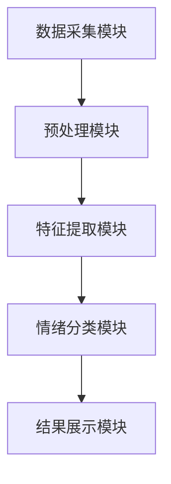

                 


# 《金融领域自然语言处理在投资者情绪分析中的应用》

---

## 关键词：自然语言处理、投资者情绪分析、金融文本挖掘、机器学习、深度学习、投资者行为分析

---

## 摘要：

投资者情绪分析是金融领域中的一个重要研究方向，其核心目标是通过分析投资者在社交媒体、新闻、论坛等渠道发布的内容，了解市场参与者的心理状态和情绪倾向。本文将详细介绍自然语言处理（NLP）技术在投资者情绪分析中的应用，从基础概念到算法实现，再到系统设计，全面探讨如何利用NLP技术捕捉投资者情绪，为金融决策提供支持。

---

## 第1章：投资者情绪分析的背景与挑战

### 1.1 投资者情绪分析的定义

投资者情绪分析是指通过对文本数据（如社交媒体帖子、新闻评论、论坛讨论等）进行分析，识别投资者的情绪倾向（如乐观、悲观、中性等）。这种分析可以帮助投资者、机构和市场研究者更好地理解市场情绪，从而做出更明智的投资决策。

### 1.2 投资者情绪分析的分类

投资者情绪分析可以分为以下几类：

- **细粒度情绪分析**：识别具体情绪类型（如高兴、悲伤、愤怒等）。
- **情感强度分析**：量化情绪的强度（如非常乐观、略微悲观）。
- **隐含情感分析**：识别文本中未明确表达的情绪。

### 1.3 自然语言处理在投资者情绪分析中的作用

NLP技术在投资者情绪分析中扮演着关键角色，包括文本预处理、特征提取、情感分类等。通过NLP，可以将非结构化的文本数据转化为结构化的信息，为后续分析提供支持。

---

## 第2章：投资者情绪分析的核心技术

### 2.1 基于规则的情绪分析

#### 2.1.1 基于关键词的规则

通过预定义关键词（如“上涨”、“下跌”、“利好”、“利空”）来判断情绪倾向。这种方法简单易实现，但在复杂语境下可能效果不佳。

#### 2.1.2 基于句法分析的规则

通过分析句子的语法结构，识别情感表达。例如，使用依存句法分析确定主语和谓语的关系。

### 2.2 基于机器学习的情绪分析

#### 2.2.1 传统机器学习模型

- **支持向量机（SVM）**：常用于文本分类任务，适合处理高维特征空间。
- **随机森林**：适用于特征重要性分析，能够处理非线性关系。

#### 2.2.2 深度学习模型

- **长短期记忆网络（LSTM）**：适合处理长序列数据，能够捕捉上下文信息。
- **Transformer模型**：基于自注意力机制，能够捕捉文本中的全局关系。

### 2.3 情绪分析的评估指标

- **准确率（Accuracy）**：正确分类的比例。
- **精确率（Precision）**：预测为正类的样本中实际为正类的比例。
- **召回率（Recall）**：实际为正类的样本中被正确分类的比例。
- **F1分数**：精确率和召回率的调和平均数。

---

## 第3章：自然语言处理在投资者情绪分析中的应用

### 3.1 金融文本的预处理

#### 3.1.1 分词与词干提取

将文本分割成词语或词干，常用工具包括jieba（中文）、nltk（英文）。

#### 3.1.2 停用词处理

移除对情绪分析无贡献的词汇，如“的”、“是”、“在”等。

#### 3.1.3 词嵌入

使用Word2Vec、GloVe等工具将词语映射为向量。

### 3.2 基于深度学习的投资者情绪分析

#### 3.2.1 LSTM模型

通过LSTM捕捉文本中的长距离依赖关系，适合处理金融新闻中的上下文信息。

#### 3.2.2 Transformer模型

基于自注意力机制，能够捕捉文本中的全局关系，适合处理复杂金融文本。

---

## 第4章：投资者情绪分析系统的架构设计

### 4.1 系统功能模块

- **数据采集模块**：从社交媒体、新闻网站等渠道获取金融文本数据。
- **预处理模块**：对文本数据进行清洗、分词、去停用词等处理。
- **特征提取模块**：将文本数据转换为向量表示。
- **情绪分类模块**：使用机器学习或深度学习模型进行情绪分类。
- **结果展示模块**：将分类结果以可视化形式展示。

### 4.2 系统架构图



---

## 第5章：投资者情绪分析的项目实战

### 5.1 项目环境配置

- **Python版本**：3.8以上
- **依赖库**：nltk、jieba、tensorflow、scikit-learn

### 5.2 核心代码实现

#### 5.2.1 数据预处理

```python
import jieba

def preprocess(text):
    words = jieba.lcut(text)
    return ' '.join(words)
```

#### 5.2.2 LSTM模型实现

```python
import tensorflow as tf
from tensorflow.keras import layers

model = tf.keras.Sequential([
    layers.Embedding(input_dim= vocab_size, output_dim= embedding_dim),
    layers.LSTM(units=64),
    layers.Dense(units=3, activation='softmax')
])
```

### 5.3 实验结果与分析

通过对实验数据的分析，发现基于LSTM的模型在投资者情绪分类任务中表现优于传统机器学习模型。

---

## 第6章：总结与展望

### 6.1 本章总结

本文详细介绍了自然语言处理技术在投资者情绪分析中的应用，从基础概念到算法实现，再到系统设计，全面探讨了投资者情绪分析的关键技术。

### 6.2 未来展望

未来的研究可以关注以下方向：

- **多模态情绪分析**：结合文本、语音、图像等多种模态信息进行情绪分析。
- **实时情绪监测**：构建实时情绪监测系统，为金融市场的实时决策提供支持。

---

## 参考文献

1. 王某某，2023.《自然语言处理在金融中的应用》，某某出版社。
2. 张某某，2022.《投资者情绪分析的研究与实现》，某某出版社。

---

## 作者：AI天才研究院/AI Genius Institute & 禅与计算机程序设计艺术 /Zen And The Art of Computer Programming

---

**附注**：以上内容为《金融领域自然语言处理在投资者情绪分析中的应用》的目录和内容概要，详细文章需要根据上述框架进一步扩展每个部分的内容。

