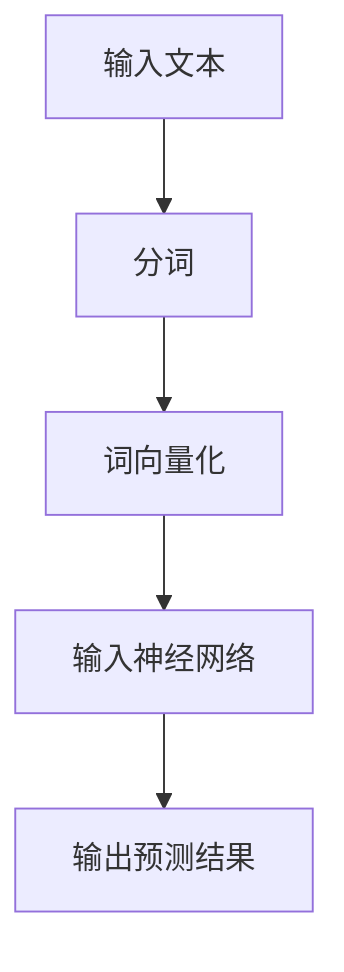
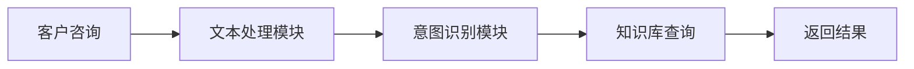

                 


# 《金融领域自然语言理解技术在客户服务中的应用》

> 关键词：自然语言理解，金融客户服务，深度学习，意图识别，情感分析

> 摘要：本文探讨自然语言理解（NLU）技术在金融客户服务中的应用，分析其技术原理、系统架构设计及实际应用案例。通过详细讲解核心概念、算法实现及项目实战，展示NLU如何提升金融服务效率与客户满意度。

---

## 第一部分：金融领域自然语言理解技术概述

### 第1章：问题背景与需求分析

#### 1.1 问题背景

- **金融客户服务的现状与挑战**
  - 传统金融客户服务依赖人工处理，效率低下且成本高昂。
  - 客户咨询多样化，涵盖贷款、投资、理财等多个领域，人工难以高效应对。
  - 客户期望快速响应与精准服务，传统模式难以满足。

- **自然语言理解技术的引入动机**
  - 提高客户咨询处理效率，降低企业成本。
  - 实现24/7全天候服务，提升客户满意度。
  - 通过数据分析，挖掘客户潜在需求，优化金融服务。

- **金融领域NLU技术的独特性**
  - 需处理专业术语与领域特定问题。
  - 对结果准确性要求高，错误解读可能导致经济损失。
  - 需满足严格的隐私与合规要求。

#### 1.2 需求分析

- **客户核心需求**
  - 快速、准确的问题解答。
  - 情感支持与个性化服务。

- **技术实现的边界与外延**
  - 边界：专注于文本处理与理解，不涉及支付等后续操作。
  - 外延：可扩展至风险评估、信用分析等领域。

---

## 第2章：核心概念与原理

### 2.1 自然语言理解技术的基本原理

- **NLU的定义与核心要素**
  - NLU：通过计算机理解人类语言的技术，核心要素包括语言分析、语义理解与意图识别。

- **NLU与NLP的联系与区别**
  - 联系：NLU是NLP的重要组成部分。
  - 区别：NLP涵盖更广，NLU专注于理解与语义分析。

- **金融领域NLU的特殊性**
  - 专业术语多，领域知识复杂。
  - 需处理复杂句式与隐含意图。

### 2.2 金融领域NLU的关键技术

- **词嵌入技术**
  - Word2Vec：通过上下文预测单词，生成词向量。
  - BERT：基于Transformer的预训练模型，捕捉全局语境。

- **情感分析与意图识别**
  - 情感分析：判断客户情绪，如正面、负面或中性。
  - 意图识别：识别客户意图，如查询账户余额或申请贷款。

- **基于规则的文本解析**
  - 利用正则表达式匹配特定模式，提取关键信息。

#### 对比分析

| 技术         | 优点                                   | 缺点                                   |
|--------------|----------------------------------------|----------------------------------------|
| Word2Vec     | 训练速度快，适合小数据集               | 无法捕捉长距离依赖关系                 |
| BERT         | 捕捉全局语境，效果更佳                 | 训练资源需求高                         |

---

## 第3章：算法原理与实现

### 3.1 基于深度学习的NLU算法

- **神经网络模型的输入预处理**
  - 文本分词、去除停用词、词向量化。

- **模型训练流程**
  - 使用训练数据，调整模型参数，最小化损失函数。

- **模型优化策略**
  - 调整学习率，防止过拟合。

#### 用Mermaid展示训练流程



### 3.2 传统机器学习算法的实现

- **支持向量机（SVM）**
  - 原理：寻找最优超平面，区分不同类别。
  - 优缺点：处理中小规模数据快，但不擅长高维数据。

- **决策树算法**
  - 原理：构建树状结构，逐步划分数据。
  - 优缺点：易于解释，但不稳定。

#### 用Mermaid展示SVM与CNN对比

```mermaid
table
| 技术 | 优点 | 缺点 |
|------|------|------|
| SVM  | 分类效果好 | 不适合高维数据 |
| CNN  | 处理图像数据强 | 需大量标注数据 |
```

---

## 第4章：系统分析与架构设计

### 4.1 项目背景与目标

- **项目背景**
  - 金融机构希望通过技术提升客户服务质量。
- **项目目标**
  - 实现智能客服系统，提升客户满意度。

### 4.2 系统功能设计

- **客户咨询处理模块**
  - 接收客户咨询，解析意图，提供回答。
- **情感分析模块**
  - 识别客户情绪，提供情感支持。
- **知识库管理模块**
  - 维护金融知识库，更新FAQ。

### 4.3 系统架构设计

#### 用Mermaid展示系统架构



---

## 第5章：项目实战与实现

### 5.1 环境安装与配置

- **开发环境**
  - Python 3.8+
  - 安装库：numpy、pandas、tensorflow、transformers。

### 5.2 核心代码实现

#### 数据预处理代码

```python
import numpy as np
from tensorflow.keras.preprocessing.text import Tokenizer
from tensorflow.keras.preprocessing.sequence import pad_sequences

text = "How can I apply for a loan?"
tokenizer = Tokenizer(num_words=1000)
tokenizer.fit_on_texts([text])
sequences = tokenizer.texts_to_sequences([text])
padded = pad_sequences(sequences, maxlen=100, padding='post')
```

#### 模型训练代码

```python
from tensorflow.keras.models import Sequential
from tensorflow.keras.layers import Embedding, LSTM, Dense

model = Sequential()
model.add(Embedding(1000, 64, input_length=100))
model.add(LSTM(32))
model.add(Dense(1, activation='sigmoid'))
model.compile(loss='binary_crossentropy', optimizer='adam', metrics=['accuracy'])
model.fit(padded, np.array([1]), epochs=5, verbose=2)
```

---

## 第6章：总结与最佳实践

### 6.1 项目总结

- **主要成果**
  - 实现了高效的客户咨询处理系统。
  - 提升了客户满意度与服务效率。

### 6.2 最佳实践

- **数据隐私**
  - 确保数据加密与合规存储。
- **模型更新**
  - 定期更新模型，保持高准确率。
- **用户体验**
  - 提供多语言支持，优化交互流程。

### 6.3 拓展阅读

- 建议阅读《金融自然语言处理实战》与《深度学习实战》。

---

## 作者：AI天才研究院/AI Genius Institute & 禅与计算机程序设计艺术 /Zen And The Art of Computer Programming

---

以上是文章的详细目录与内容，按照逻辑顺序展开，确保每个部分都详细且技术深度足够，同时保持语言的专业与易懂。

