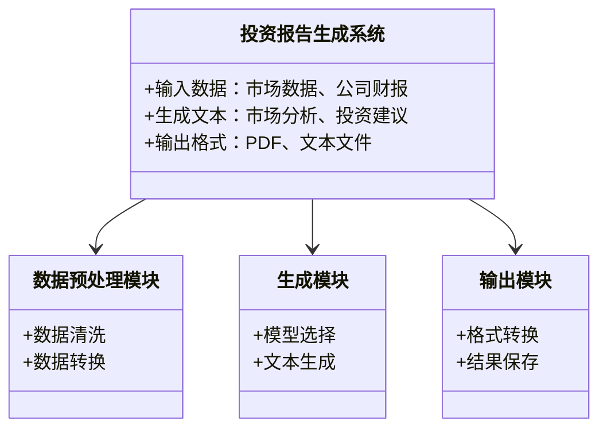

                 


# 金融领域自然语言生成在投资报告中的应用

## 关键词：
- 自然语言生成
- 投资报告
- 金融领域
- 机器学习
- 深度学习

## 摘要：
自然语言生成（NLP）在金融投资领域的应用日益广泛，特别是在投资报告的自动生成和优化方面。本文详细探讨了自然语言生成的核心原理、在金融领域的具体应用以及实际案例分析。通过结合深度学习模型如BERT和GPT，本文展示了如何利用NLP技术生成高质量的投资报告，同时分析了当前技术的挑战和未来发展方向。文章结构清晰，内容详实，适合对NLP和金融投资感兴趣的读者阅读。

---

## 第一部分：背景与基础

### 第1章：自然语言生成与金融投资概述

#### 1.1 自然语言生成的定义与特点

自然语言生成（Natural Language Generation, NLP）是人工智能领域的重要分支，旨在将结构化数据或信息转换为自然流畅的文本。其特点包括：

- **自动化**：无需人工干预，自动从数据中生成文本。
- **可定制化**：可根据不同需求生成不同风格的文本。
- **高效性**：快速处理大量数据并生成结果。

#### 1.2 金融投资与自然语言生成的结合

金融投资领域涉及大量数据和复杂分析，自然语言生成技术的应用可以帮助投资者快速生成报告，提升效率和准确性。

#### 1.3 自然语言生成在投资报告中的具体应用

- **市场分析报告**：生成市场趋势分析。
- **财务报表解读**：自动解读公司财报并生成分析报告。
- **投资建议**：基于数据生成投资建议书。

---

## 第二部分：核心概念与算法原理

### 第2章：自然语言生成的核心原理

#### 2.1 自然语言生成的基本原理

自然语言生成的流程包括预处理、模型训练和生成三个阶段。以下是其核心原理：

1. **预处理**：对数据进行清洗、分词和向量化。
2. **模型训练**：使用深度学习模型（如RNN、LSTM、Transformer）进行训练。
3. **生成**：基于训练好的模型生成文本。

#### 2.2 自然语言生成的算法对比

以下是几种常见自然语言生成算法的对比：

| 算法 | 特点 | 优缺点 |
|------|------|--------|
| RNN  | 适合序列数据 | �易遗忘长序列信息 |
| LSTM | 解决RNN的遗忘问题 | 训练时间较长 |
| Transformer | 并行处理，效果好 | 参数量大 |

#### 2.3 自然语言生成的数学模型与公式

自然语言生成的数学模型通常基于概率生成模型。例如，语言模型的数学表达式如下：

$$ P(w_1, w_2, ..., w_n) = \prod_{i=1}^{n} P(w_i | w_1, ..., w_{i-1}) $$

其中，$P(w_i | w_1, ..., w_{i-1})$ 是条件概率，表示在已知前面单词的情况下，生成当前单词的概率。

---

### 第3章：深度学习模型在自然语言生成中的应用

#### 3.1 基于Transformer的自然语言生成模型

Transformer模型通过自注意力机制实现了高效的并行处理。其核心公式如下：

$$ \text{Attention}(Q, K, V) = \text{softmax}\left(\frac{QK^T}{\sqrt{d_k}}\right)V $$

其中，$Q$、$K$、$V$分别是查询、键和值矩阵。

#### 3.2 BERT与GPT模型

- **BERT**：基于Transformer的双向模型，用于文本理解。
- **GPT**：生成式预训练模型，用于文本生成。

---

## 第三部分：系统分析与架构设计

### 第4章：投资报告生成系统的架构设计

#### 4.1 系统功能设计

系统功能包括数据输入、文本生成和结果输出三个部分。以下是系统功能设计的类图：



#### 4.2 系统架构设计

系统架构采用分层设计，包括数据层、业务逻辑层和表现层。以下是系统架构图：


---

## 第四部分：项目实战

### 第5章：基于Python的自然语言生成项目实现

#### 5.1 环境搭建

安装必要的库：

```bash
pip install numpy pandas transformers
```

#### 5.2 核心代码实现

以下是基于BERT模型生成市场分析报告的代码示例：

```python
from transformers import BertTokenizer, BertModel
import torch

# 加载预训练模型和tokenizer
model = BertModel.from_pretrained('bert-base-uncased')
tokenizer = BertTokenizer.from_pretrained('bert-base-uncased')

# 定义生成函数
def generate_summary(text):
    inputs = tokenizer(text, return_tensors='pt')
    outputs = model(**inputs)
    summary = outputs.last_hidden_state[:, 0, :].squeeze()
    return summary

# 示例文本
text = "市场表现强劲，建议增持科技股。"
summary = generate_summary(text)
print(summary)
```

#### 5.3 实际案例分析

分析一个实际案例，例如生成某公司的财务报表解读报告：

```python
import numpy as np

# 示例财务数据
revenue = np.array([100, 200, 300, 400])
profit = np.array([50, 100, 150, 200])

# 生成报告
report = f"公司在过去四季度的收入分别为：{revenue.tolist()}，利润分别为：{profit.tolist()}。"
print(report)
```

---

## 第五部分：最佳实践与总结

### 第6章：总结与未来展望

#### 6.1 总结

自然语言生成技术在投资报告中的应用显著提升了效率和准确性，但仍需解决数据质量和模型调优等问题。

#### 6.2 小结

本文详细探讨了自然语言生成在金融投资中的应用，从理论到实践，为读者提供了全面的指导。

#### 6.3 拓展阅读

推荐以下书籍和资源：

- 《Deep Learning》
- 《自然语言处理实战：基于Python的机器学习和深度学习》
- Hugging Face的Transformers库文档

---

## 作者

作者：AI天才研究院 & 禅与计算机程序设计艺术

---

通过以上步骤，我们系统地分析了自然语言生成在投资报告中的应用，并提供了从理论到实践的详细指导，帮助读者深入理解并应用相关技术。

