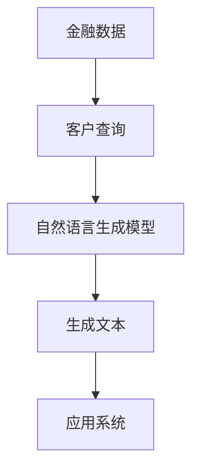
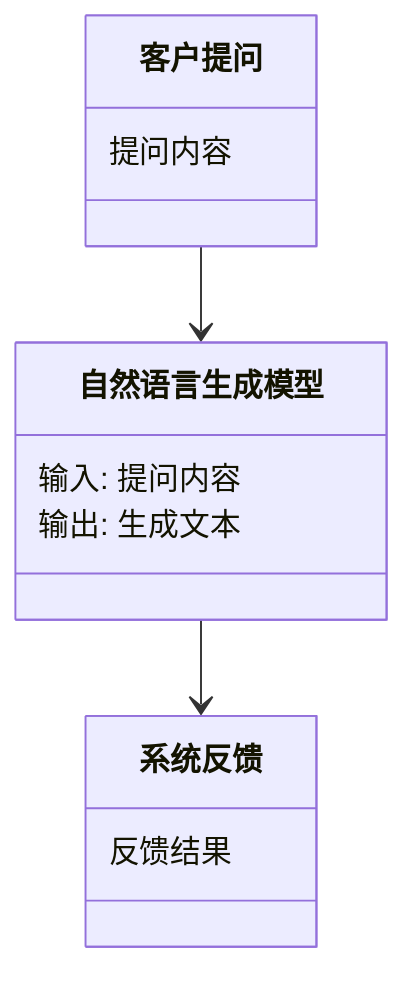
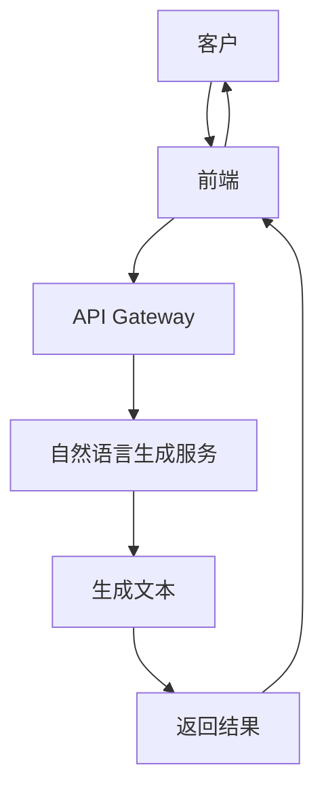

                 


# 金融领域自然语言生成技术的创新应用

## 关键词：
- 自然语言生成
- 人工智能
- 金融应用
- 智能系统
- 技术创新

## 摘要：
自然语言生成技术（NLP）在金融领域的应用正变得越来越重要。本文将从技术背景、核心概念、算法原理、系统架构、项目实战、最佳实践等多个维度，详细探讨自然语言生成技术在金融领域的创新应用。文章结合实际案例，深入分析了自然语言生成技术如何在金融报告生成、股票分析、客户服务等领域发挥重要作用，同时也探讨了技术挑战和未来发展趋势。

---

## 第1章: 自然语言生成技术概述

### 1.1 自然语言生成技术的定义与背景

#### 1.1.1 自然语言生成技术的定义
自然语言生成（Natural Language Generation, NLP）是指利用计算机技术生成符合人类语言表达习惯的文本。它通过分析数据和模式，模拟人类的思维方式，将结构化数据转化为自然语言文本。

#### 1.1.2 自然语言生成技术的发展历程
自然语言生成技术起源于20世纪50年代，经历了从简单的模板生成到复杂的深度学习模型的演变。随着计算能力的提升和大数据技术的发展，生成式AI逐渐成熟。

#### 1.1.3 金融领域对自然语言生成技术的需求
金融领域的复杂性对信息处理提出了更高要求。自然语言生成技术能够帮助金融机构快速生成报告、分析数据、提供客户支持，提升效率和准确性。

### 1.2 自然语言生成技术的核心概念

#### 1.2.1 生成式AI的基本原理
生成式AI通过学习大量文本数据，建立概率模型，生成符合语法规则的文本。其核心在于理解和模拟人类语言的结构和语义。

#### 1.2.2 金融领域的文本生成需求
金融领域的文本生成需要满足准确性和专业性的双重要求，如生成财务报告、市场分析等。

#### 1.2.3 自然语言生成技术的关键技术点
- 数据预处理与特征提取
- 模型训练与优化
- 文本生成与评估

### 1.3 自然语言生成技术的应用场景

#### 1.3.1 金融报告生成
自然语言生成技术可以自动生成财务报告、市场分析报告等，节省时间和成本。

#### 1.3.2 股票分析与预测
通过分析历史数据和市场动态，生成股票预测报告，帮助投资者做出决策。

#### 1.3.3 客户服务对话系统
智能客服可以通过自然语言生成技术，与客户进行自然对话，解答问题和提供服务。

### 1.4 自然语言生成技术的挑战与未来趋势

#### 1.4.1 技术挑战
- 数据质量与多样性
- 模型的可解释性
- 计算资源需求

#### 1.4.2 金融领域的特殊性
- 数据敏感性
- 需求多样性
- 法律与合规要求

#### 1.4.3 未来发展趋势
- 多模态生成技术
- 实时生成与反馈
- 个性化生成服务

---

## 第2章: 金融领域自然语言生成的核心概念与联系

### 2.1 自然语言生成技术的核心原理

#### 2.1.1 生成式模型的数学基础
生成式模型通过概率分布生成文本，常用的技术包括马尔可夫链和变分自编码器（VAE）。

#### 2.1.2 变量之间的关系与依赖性
自然语言生成涉及到词与词之间的依赖关系，可以通过语言模型进行建模。

#### 2.1.3 生成式模型的输入输出结构
输入可以是用户查询，输出是生成的文本。例如，输入“最近科技股表现如何？”输出一段市场分析。

### 2.2 核心概念的属性特征对比

#### 2.2.1 对比表格展示
| 模型类型 | 输入 | 输出 | 优缺点 |
|----------|------|------|--------|
| RNN      | 文本序列 | 文本生成 | 参数少，训练快 |
| Transformer | 文本序列 | 文本生成 | 并行计算，性能高 |
| GPT      | 文本上下文 | 文本生成 | 预测能力强 |

#### 2.2.2 生成式模型的优缺点分析
- 优点：能够生成多样化的文本，适应不同场景。
- 缺点：可能产生不准确或不连贯的内容，需要大量数据和计算资源。

#### 2.2.3 不同模型之间的差异性
RNN适合短文本生成，Transformer适合长文本生成，GPT则在金融领域表现出色。

### 2.3 ER实体关系图架构



---

## 第3章: 自然语言生成技术的算法原理

### 3.1 基于深度学习的生成式模型

#### 3.1.1 GPT模型的结构
GPT通过自注意力机制捕捉文本中的语义信息，生成连贯的文本。

#### 3.1.2 BERT模型的结构
BERT通过双向自注意力机制，捕捉上下文信息，生成高质量的文本。

#### 3.1.3 Transformer模型的结构
Transformer由编码器和解码器组成，通过自注意力机制生成文本。

### 3.2 算法原理的详细讲解

#### 3.2.1 GPT模型的实现代码
```python
import torch
import torch.nn as nn

class GPT(nn.Module):
    def __init__(self, vocab_size, embedding_dim):
        super(GPT, self).__init__()
        self.embedding = nn.Embedding(vocab_size, embedding_dim)
        self.transformer = nn.Transformer(embedding_dim, embedding_dim)
        self.fc = nn.Linear(embedding_dim, vocab_size)
        
    def forward(self, input_ids):
        embedded = self.embedding(input_ids)
        output = self.transformer(embedded, embedded)
        output = self.fc(output)
        return output
```

#### 3.2.2 Transformer模型的数学公式
生成式模型的损失函数：
$$ \text{Loss} = -\sum_{i=1}^{n} \log p(x_i | x_{<i}) $$

#### 3.2.3 实际应用中的举例说明
以股票预测为例，输入历史股价数据，模型生成市场分析文本。

### 3.3 算法原理的总结

#### 3.3.1 GPT模型的优势
- 上下文捕捉能力强
- 生成文本质量高

#### 3.3.2 BERT模型的优势
- 双向注意力机制
- 语义理解能力强

#### 3.3.3 Transformer模型的优缺点
- 优点：并行计算能力强
- 缺点：计算资源消耗大

---

## 第4章: 金融领域自然语言生成系统的分析与设计

### 4.1 问题场景介绍

#### 4.1.1 项目介绍
本项目旨在开发一个金融领域的智能客服对话系统，帮助客户解答问题和提供建议。

#### 4.1.2 系统功能设计
- 客户提问输入
- 文本生成输出
- 系统反馈

### 4.2 系统功能设计

#### 4.2.1 领域模型


#### 4.2.2 系统架构设计


### 4.3 系统接口设计

#### 4.3.1 API接口定义
- 输入接口：`POST /api/generate`
- 输出接口：`GET /api/result`

#### 4.3.2 系统交互流程
1. 客户提交提问
2. 前端接收请求
3. 调用API Gateway
4. 自然语言生成服务处理
5. 返回生成文本

---

## 第5章: 自然语言生成技术的项目实战

### 5.1 项目环境安装

#### 5.1.1 安装Python和相关库
```bash
pip install torch transformers
```

#### 5.1.2 数据预处理
将金融领域的文本数据进行清洗和标注，确保模型输入数据的质量。

### 5.2 系统核心实现源代码

#### 5.2.1 模型训练代码
```python
import torch
import torch.nn as nn

class NLPModel(nn.Module):
    def __init__(self, vocab_size, embedding_dim):
        super(NLPModel, self).__init__()
        self.embedding = nn.Embedding(vocab_size, embedding_dim)
        self.fc = nn.Linear(embedding_dim, vocab_size)
        
    def forward(self, input_ids):
        embedded = self.embedding(input_ids)
        output = self.fc(embedded)
        return output

model = NLPModel(vocab_size=10000, embedding_dim=256)
```

#### 5.2.2 文本生成代码
```python
def generate_text(model, input_str, max_length=50):
    input_ids = tokenizer.encode(input_str)
    with torch.no_grad():
        outputs = model(torch.tensor([input_ids]))
    generated_ids = outputs.argmax(dim=-1).tolist()[0]
    return tokenizer.decode(generated_ids)

print(generate_text(model, "最近科技股表现如何？"))
```

### 5.3 案例分析

#### 5.3.1 智能客服对话系统
客户提问：“如何投资科技股？”
系统生成：“建议关注行业龙头股，分散投资，控制风险。”

#### 5.3.2 股票预测系统
输入数据：历史股价数据
生成文本：市场分析报告

### 5.4 项目小结
通过实际案例展示了自然语言生成技术在金融领域的应用，验证了技术的有效性和可行性。

---

## 第6章: 自然语言生成技术的最佳实践

### 6.1 数据质量的重要性
确保训练数据的多样性和准确性，避免模型生成错误信息。

### 6.2 模型调优技巧
- 调整模型参数
- 优化训练数据
- 增加验证集

### 6.3 模型的可解释性
通过可视化工具，分析模型的生成过程，提升用户信任度。

### 6.4 注意事项
- 数据隐私保护
- 模型的准确性和可解释性
- 技术的持续优化

### 6.5 拓展阅读
建议读者深入学习自然语言生成技术的数学原理和最新研究，关注多模态生成技术的发展。

---

## 第7章: 总结与展望

### 7.1 全文总结
自然语言生成技术在金融领域的应用具有广阔的前景，能够显著提升金融机构的效率和客户体验。

### 7.2 未来展望
随着技术的进步，自然语言生成技术将更加智能化和个性化，为金融行业带来更多创新。

---

## 作者信息

作者：AI天才研究院/AI Genius Institute & 禅与计算机程序设计艺术/Zen And The Art of Computer Programming

---

以上是《金融领域自然语言生成技术的创新应用》的完整内容，涵盖了从基础概念到实际应用的各个方面，旨在帮助读者全面理解并掌握自然语言生成技术在金融领域的创新应用。

