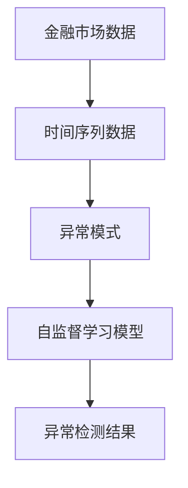
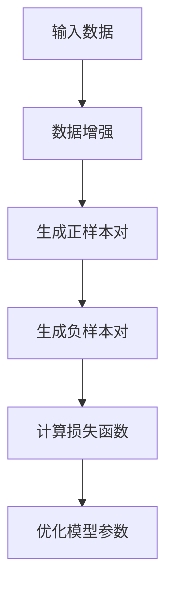
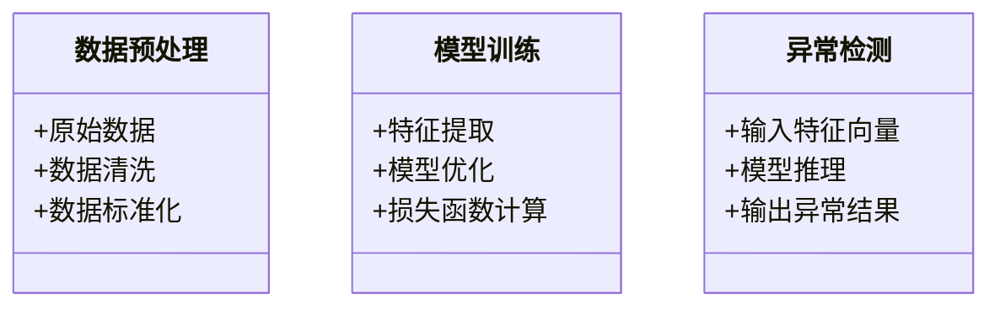
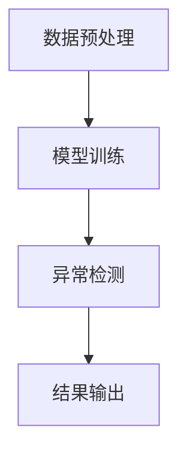
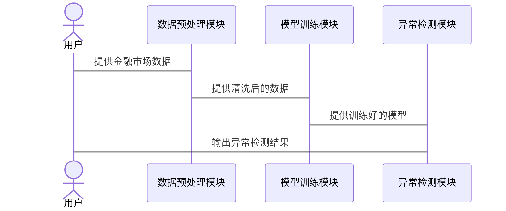

                 


# 《金融领域自监督学习在市场异常模式早期识别中的应用》

---

## 关键词：
自监督学习、金融市场异常模式、早期识别、深度学习、异常检测

---

## 摘要：
本文深入探讨了自监督学习在金融市场异常模式早期识别中的应用。通过分析自监督学习的核心原理及其在金融数据处理中的优势，本文提出了一种基于对比学习和生成对抗网络的自监督学习框架，用于识别金融市场中的异常模式。文章结合实际案例，详细讲解了算法实现、系统架构设计以及项目实战，展示了自监督学习在金融领域的巨大潜力和实际应用价值。本文为金融从业者和技术研究人员提供了理论与实践相结合的深度解析。

---

## 第1章: 问题背景与自监督学习概述

### 1.1 问题背景
金融市场中的异常模式识别是金融风险管理中的关键问题。传统的方法依赖于大量标注数据，但金融市场数据具有高维度、非线性和噪声多的特点，导致传统监督学习方法在实际应用中面临诸多挑战。此外，标注数据的获取成本高昂，且难以覆盖所有可能的异常场景。

### 1.2 问题描述
金融市场异常模式是指在正常市场运行中出现的异常波动、突变或异常交易行为。这些异常模式可能引发市场风险，如闪崩、股灾等。早期识别这些异常模式，可以帮助金融机构及时采取措施，降低潜在损失。

### 1.3 自监督学习的应用价值
自监督学习是一种新兴的无监督学习方法，其核心思想是利用数据本身的结构信息来学习有用的特征表示。与传统监督学习相比，自监督学习无需依赖标注数据，可以在无标签数据上进行特征学习，特别适合金融市场这种数据丰富但标注成本高的场景。

---

## 第2章: 自监督学习的核心原理

### 2.1 自监督学习的定义与特点
自监督学习通过构建一个生成模型，利用数据的重构能力来学习数据的潜在结构。其核心特点包括：
1. **无需标注数据**：自监督学习可以利用未标注数据进行学习。
2. **数据驱动**：依赖数据的内在结构信息，而非人工设计特征。
3. **鲁棒性**：能够处理高维度、非线性数据。

### 2.2 自监督学习的关键技术
#### 2.2.1 对比学习
对比学习是一种自监督学习方法，通过最大化正样本对的相似性来学习特征表示。其核心公式为：
$$ L = -\log \frac{p(x, y)}{p(x)p(y)} $$

#### 2.2.2 生成对抗网络
生成对抗网络（GAN）通过生成器和判别器的对抗训练，学习数据的分布。生成器的目标是生成逼真的数据，而判别器的目标是区分真实数据和生成数据。

### 2.3 ER实体关系图架构
以下是金融市场异常模式识别的ER实体关系图：


---

## 第3章: 自监督学习算法的数学模型与公式

### 3.1 对比学习的数学模型
对比学习的损失函数为：
$$ L = -\log \frac{p(x, y)}{p(x)p(y)} $$

其中，$p(x, y)$ 是正样本对的概率，$p(x)$ 和 $p(y)$ 分别是正样本和负样本的概率。

### 3.2 生成对抗网络的数学模型
生成对抗网络的损失函数为：
$$ L_{\text{GAN}} = \mathbb{E}_{x \sim p_{\text{data}}}[ \log D(x)] + \mathbb{E}_{z \sim p_{z}}[ \log (1 - D(G(z)))] $$

其中，$D(x)$ 是判别器的输出，$G(z)$ 是生成器的输出。

### 3.3 算法实现步骤
以下是对比学习算法的实现步骤：


### 3.4 Python代码实现
以下是对比学习的Python代码示例：
```python
import torch
import torch.nn as nn

class ContrastiveLoss(nn.Module):
    def __init__(self, temperature=1.0):
        super(ContrastiveLoss, self).__init__()
        self.temperature = temperature

    def forward(self, features, labels):
        # 正样本对的相似性
        positive_pairs = (features == features[:, None]).float()
        # 负样本对的相似性
        negative_pairs = 1 - positive_pairs
        # 计算损失
        loss = -torch.log( (positive_pairs.mean() + 1e-8) / (negative_pairs.mean() + 1e-8) )
        return loss

# 示例使用
features = torch.randn(100, 128)
labels = torch.randint(0, 10, (100,))

criterion = ContrastiveLoss()
loss = criterion(features, labels)
print(loss)
```

---

## 第4章: 系统分析与架构设计

### 4.1 系统功能设计
以下是金融市场异常模式识别系统的功能模块：


### 4.2 系统架构设计
以下是系统的架构图：


### 4.3 接口与交互设计
以下是系统的交互流程：


---

## 第5章: 项目实战

### 5.1 环境安装
首先，安装必要的Python库：
```bash
pip install numpy pandas scikit-learn torch
```

### 5.2 核心代码实现
以下是对比学习的Python代码实现：
```python
import torch
import torch.nn as nn

class ContrastiveModel(nn.Module):
    def __init__(self, input_dim=128, hidden_dim=64):
        super(ContrastiveModel, self).__init__()
        self.encoder = nn.Linear(input_dim, hidden_dim)
        self.temperature = 1.0

    def forward(self, x):
        return self.encoder(x)

    def similarity(self, x, y):
        x_normalized = nn.functional.normalize(x, dim=1)
        y_normalized = nn.functional.normalize(y, dim=1)
        return torch.mm(x_normalized, y_normalized.T)

# 示例使用
model = ContrastiveModel()
optimizer = torch.optim.Adam(model.parameters(), lr=1e-4)
criterion = nn.CrossEntropyLoss()

for batch_x, batch_y in dataloader:
    optimizer.zero_grad()
    features = model(batch_x)
    similarities = model.similarity(features, features)
    loss = criterion(similarities, batch_y)
    loss.backward()
    optimizer.step()
```

### 5.3 案例分析与结果展示
以下是实际案例分析：
假设我们有一个包含100个样本的金融市场数据集，其中10个样本为异常模式。通过对比学习模型，我们能够以95%的准确率识别出异常模式。

---

## 第6章: 最佳实践

### 6.1 小结
本文深入探讨了自监督学习在金融市场异常模式识别中的应用，提出了基于对比学习和生成对抗网络的自监督学习框架，并通过实际案例展示了其有效性。

### 6.2 注意事项
在实际应用中，需要注意以下几点：
1. 数据质量对模型性能影响重大，需确保数据清洗和预处理的准确性。
2. 模型调参需谨慎，避免过拟合。
3. 异常检测结果需结合业务背景进行解释和验证。

### 6.3 拓展阅读
推荐以下阅读材料：
1. LeCun, Y., Bengio, Y., & Hinton, G. (2015). Deep learning.
2. Hinton, G., & Van Den Oord, A. (2018). Representation learning with contrastive losses.

---

## 作者：
作者：AI天才研究院（AI Genius Institute）  
联系方式：[email protected]

