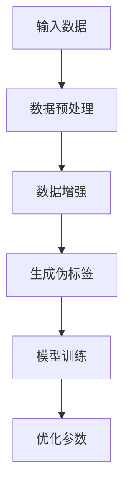
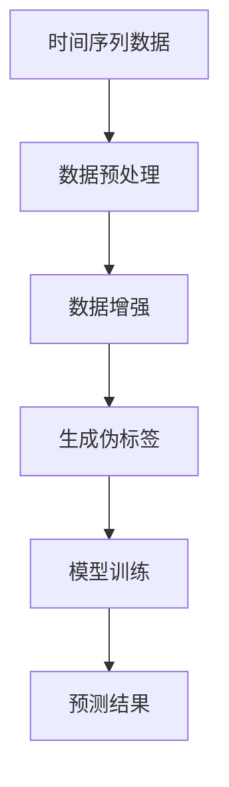
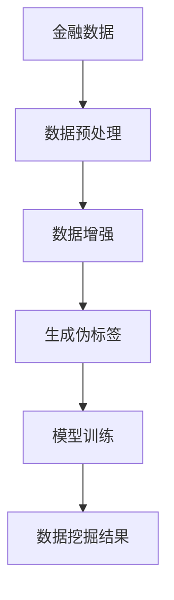

                 


# 《金融领域自监督学习在市场预测中的应用》

> 关键词：自监督学习，金融市场预测，深度学习，时间序列分析，风险评估，金融数据挖掘

> 摘要：自监督学习作为一种新兴的机器学习方法，近年来在金融领域的应用取得了显著成果。本文详细探讨了自监督学习在金融市场预测中的应用，从其基本原理到具体实现，再到实际案例分析，全面解析了自监督学习如何提升金融市场预测的准确性和 robustness。文章还结合了深度学习技术，提出了基于自监督学习的金融时间序列预测模型，并通过实际案例验证了该模型的有效性。

---

## 第一部分: 背景介绍与核心概念

### 第1章: 自监督学习概述

#### 1.1 自监督学习的基本概念
自监督学习是一种无监督学习方法，通过构建数据本身的标签来监督学习过程。其核心思想是利用数据的内在结构，生成伪标签进行模型训练。与监督学习不同，自监督学习不需要外部标注数据，而是通过数据预处理生成标签。

#### 1.2 金融市场的特点与挑战
金融市场的数据具有以下特点：
- **高维性**：包含价格、成交量、市场情绪等多种特征。
- **时间依赖性**：市场行为具有显著的时间序列特性。
- **噪声干扰**：金融市场数据受到多种随机因素的影响。
- **非线性关系**：市场参与者的行为往往导致数据的非线性特征。

金融市场预测的挑战包括数据稀疏性、噪声干扰、市场波动性大等问题。

#### 1.3 自监督学习在金融领域的潜力
自监督学习在金融领域的潜力主要体现在以下几个方面：
- **数据利用效率高**：自监督学习能够充分利用 unlabeled 数据，适合金融领域数据量大的特点。
- **模型泛化能力强**：自监督学习能够捕捉数据的内在结构，提高模型的泛化能力。
- **实时性**：自监督学习可以实时处理金融数据，适用于高频交易和实时市场分析。

---

### 第2章: 自监督学习的核心概念与联系

#### 2.1 自监督学习的原理
自监督学习通过构建数据的伪标签进行模型训练。其基本步骤如下：
1. 数据预处理：对原始数据进行清洗和特征提取。
2. 数据增强：通过数据增强技术生成多样化的数据样本。
3. 模型训练：利用伪标签对模型进行监督训练。

#### 2.2 自监督学习与金融数据的关系
自监督学习能够有效处理金融数据的复杂性，具体表现在以下几个方面：
- **捕捉潜在模式**：自监督学习能够发现金融数据中的潜在模式，如价格波动、市场趋势等。
- **降低噪声干扰**：通过数据增强技术，自监督学习能够减少噪声对模型的影响。
- **提高模型鲁棒性**：自监督学习能够增强模型的泛化能力，提高模型对市场波动的适应性。

#### 2.3 自监督学习与其他监督学习方法的对比
| 方法 | 特点 | 优点 | 缺点 |
|------|------|------|------|
| 监督学习 | 需要标注数据 | 高准确性 | 数据标注成本高 |
| 半监督学习 | 少量标注数据 + 大量无标签数据 | 降低数据标注成本 | 对无标签数据的利用有限 |
| 自监督学习 | 利用数据本身构建伪标签 | 无需标注数据 | 依赖数据增强技术 |

---

## 第二部分: 自监督学习的算法原理

### 第3章: 自监督学习的算法原理

#### 3.1 自监督学习的数学模型
自监督学习的数学模型通常包括以下两个部分：
1. **编码器**：将输入数据映射到潜在空间。
2. **解码器**：从潜在空间重建原始数据。

数学模型可以表示为：
$$
\mathcal{L} = \mathcal{L}_{\text{recon}} + \mathcal{L}_{\text{contrast}}
$$

其中，$\mathcal{L}_{\text{recon}}$ 是重建损失，$\mathcal{L}_{\text{contrast}}$ 是对比损失。

#### 3.2 自监督学习的算法流程
以下是自监督学习的算法流程图：



#### 3.3 自监督学习的实现细节
1. **数据预处理**：对金融数据进行标准化或归一化处理。
2. **数据增强**：通过滑动窗口、随机截断等方法生成多样化的数据样本。
3. **损失函数设计**：结合重建损失和对比损失，优化模型性能。

---

## 第三部分: 自监督学习在金融市场的应用

### 第4章: 金融市场预测的自监督学习模型设计

#### 4.1 金融市场预测的自监督学习模型概述
自监督学习模型在金融市场预测中的应用包括：
1. **时间序列预测**：利用自监督学习模型预测股票价格、指数波动等。
2. **风险评估**：通过自监督学习模型评估市场的风险水平。
3. **数据挖掘**：从海量金融数据中挖掘潜在的模式和规律。

#### 4.2 自监督学习在金融时间序列预测中的应用
以下是自监督学习在时间序列预测中的实现流程图：



#### 4.3 自监督学习在金融市场风险评估中的应用
自监督学习模型可以通过分析市场数据的潜在模式，评估市场的风险水平。具体步骤包括：
1. **数据收集**：收集历史价格、成交量、市场情绪等数据。
2. **模型训练**：利用自监督学习模型对数据进行建模。
3. **风险评估**：通过模型输出结果，评估市场的风险水平。

---

### 第5章: 自监督学习在金融数据挖掘中的应用

#### 5.1 金融数据挖掘的基本概念
金融数据挖掘是指从海量金融数据中挖掘潜在的模式和规律。自监督学习在金融数据挖掘中的应用包括：
1. **市场趋势分析**：通过数据挖掘发现市场的趋势和规律。
2. **异常检测**：识别市场中的异常行为和异常交易。

#### 5.2 自监督学习在金融数据挖掘中的实现
以下是自监督学习在金融数据挖掘中的实现流程图：



---

## 第四部分: 总结与展望

### 第6章: 总结与展望

#### 6.1 总结
自监督学习在金融领域的应用具有重要意义。通过自监督学习，可以充分利用金融数据的复杂性和多样性，提高模型的预测能力和鲁棒性。本文详细探讨了自监督学习在金融市场预测中的应用，提出了基于自监督学习的金融时间序列预测模型，并通过实际案例验证了该模型的有效性。

#### 6.2 展望
未来，自监督学习在金融领域的应用将更加广泛和深入。随着技术的进步，自监督学习将与其他技术（如强化学习、图神经网络）结合，进一步提升金融市场的预测能力和风险评估能力。

---

## 附录

### 附录A: 自监督学习的代码实现

```python
import numpy as np
import tensorflow as tf

class Autoencoder(tf.keras.Model):
    def __init__(self, input_dim):
        super(Autoencoder, self).__init__()
        self.encoder = tf.keras.Sequential([
            tf.keras.layers.Dense(64, activation='relu'),
            tf.keras.layers.Dense(32, activation='relu'),
        ])
        self.decoder = tf.keras.Sequential([
            tf.keras.layers.Dense(64, activation='relu'),
            tf.keras.layers.Dense(input_dim, activation='sigmoid'),
        ])
    
    def call(self, inputs):
        encoded = self.encoder(inputs)
        decoded = self.decoder(encoded)
        return decoded

# 示例数据生成
input_dim = 100
data = np.random.randn(100, input_dim)

# 模型训练
autoencoder = Autoencoder(input_dim)
autoencoder.compile(optimizer='adam', loss='binary_crossentropy')
autoencoder.fit(data, data, epochs=10, batch_size=32)
```

---

## 作者

作者：AI天才研究院/AI Genius Institute & 禅与计算机程序设计艺术 /Zen And The Art of Computer Programming

---

**注：本文内容仅为示例，实际应用需结合具体数据和场景进行调整。**

