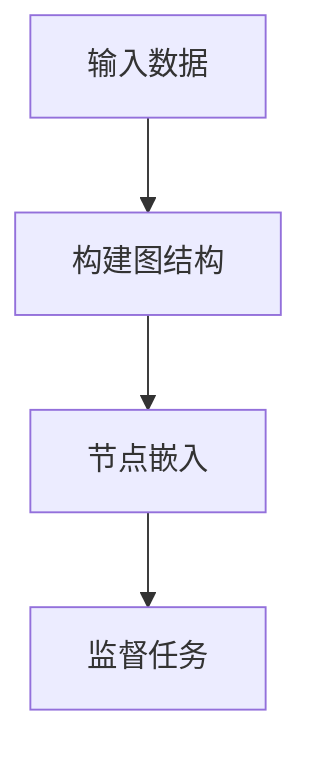
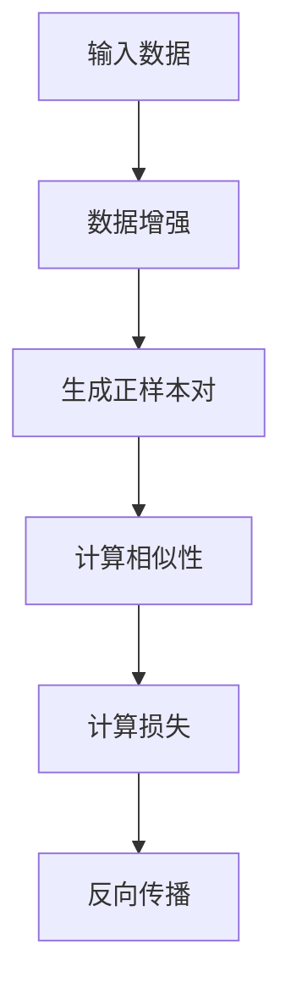
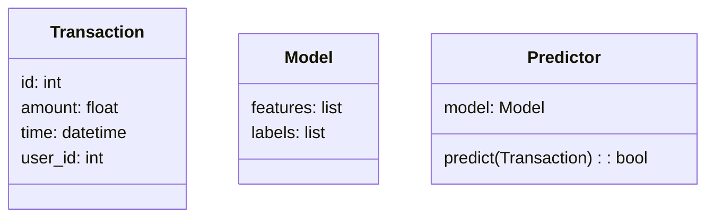
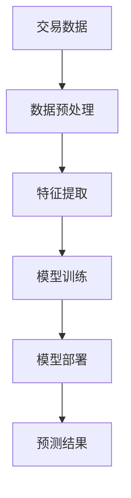
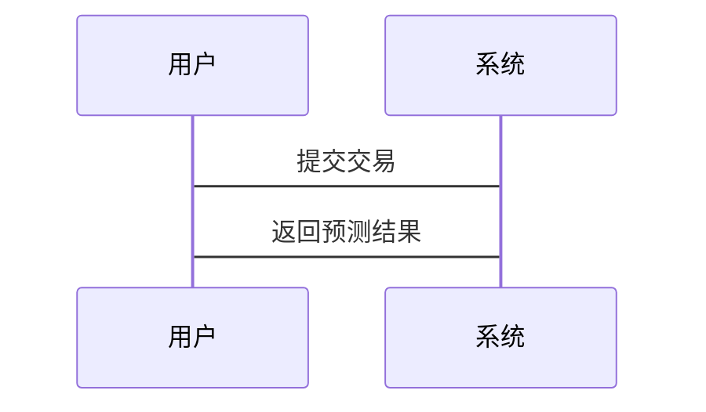

                 


# 《金融领域自监督学习的应用与挑战》

> 关键词：自监督学习，金融应用，算法原理，系统架构，项目实战

> 摘要：自监督学习作为一种新兴的机器学习方法，正在金融领域中展现出巨大的潜力。本文系统地探讨了自监督学习在金融领域的核心概念、算法原理、系统架构、项目实战以及未来展望。通过对比分析和实际案例，本文揭示了自监督学习在金融数据处理中的优势与挑战，并为读者提供了深入的技术分析和实践指导。

---

## 引言

随着金融行业的数字化转型，数据量的激增和复杂性不断提高，传统监督学习方法在金融领域的应用面临诸多挑战。自监督学习作为一种无需依赖大量标注数据的学习方式，正在金融领域中展现出独特的价值。本文旨在深入分析自监督学习在金融领域的应用，探讨其算法原理、系统架构，并通过实际案例展示其在金融场景中的潜力与挑战。

---

## 第1章: 自监督学习的核心概念

### 1.1 自监督学习的定义与背景

#### 1.1.1 自监督学习的定义
自监督学习是一种无监督学习方法，通过利用数据本身的结构信息来生成监督信号。其核心思想是通过构建某种“伪标签”或“对比任务”，从无标注数据中学习有用特征表示。

#### 1.1.2 自监督学习的背景与重要性
在金融领域，数据通常具有高维性、异构性和敏感性，标注成本高昂。自监督学习的引入能够有效降低对标注数据的依赖，提高模型的泛化能力。

#### 1.1.3 自监督学习与监督学习的区别
| 特性 | 监督学习 | 自监督学习 |
|------|----------|------------|
| 数据需求 | 需要标注数据 | 利用无标注数据自动生成监督信号 |
| 标签成本 | 高 | 低 |
| 模型泛化能力 | 依赖标注质量 | 更强的泛化能力 |

### 1.2 自监督学习在金融领域的应用背景

#### 1.2.1 金融领域数据的特点
- 高维性：金融数据通常包含多个维度，如时间序列、文本、图像等。
- 异构性：数据类型多样，难以直接建模。
- 非均衡性：某些金融事件（如欺诈行为）可能在数据中占比极小。

#### 1.2.2 金融领域对自监督学习的需求
- 处理海量无标注数据。
- 提高模型对稀有事件的检测能力。
- 降低对人工标注的依赖。

#### 1.2.3 自监督学习在金融领域的优势
- 更高效的数据利用。
- 更强的模型鲁棒性。
- 更低的标注成本。

---

## 第2章: 金融领域的核心问题与挑战

### 2.1 金融领域的核心问题

#### 2.1.1 金融数据的稀缺性
某些金融事件（如市场崩盘）发生频率低，难以通过监督学习获得足够的标注数据。

#### 2.1.2 金融数据的不平衡性
在欺诈检测、信用评估等任务中，正常样本远多于异常样本，导致模型偏向正常类别。

#### 2.1.3 金融数据的隐私性
金融数据往往涉及用户隐私，获取标注数据受到严格的限制。

### 2.2 自监督学习在金融领域的挑战

#### 2.2.1 数据标注的困难性
某些金融场景下，标注数据难以获取，且标注成本高昂。

#### 2.2.2 模型的泛化能力
自监督学习依赖于数据本身的结构，可能在某些领域或任务中表现不佳。

#### 2.2.3 模型的可解释性
自监督学习模型的决策过程缺乏透明性，影响其在金融领域的实际应用。

---

## 第3章: 自监督学习的核心概念与联系

### 3.1 自监督学习的核心原理

#### 3.1.1 对比学习
对比学习通过构建数据的正样本和负样本对，学习数据的相似性表示。其损失函数通常基于对比损失，公式如下：

$$ L = -\log \left( \frac{e^{sim(x,y)}}{e^{sim(x,y)} + e^{sim(x,z)}} \right) $$

其中，$sim(x,y)$ 表示样本 $x$ 和 $y$ 的相似性度量。

#### 3.1.2 知识蒸馏
知识蒸馏通过教师模型指导学生模型学习，利用教师模型的预测概率作为软标签，学生模型通过最小化预测概率分布差异进行学习。

#### 3.1.3 图结构自监督学习
图结构自监督学习通过构建图结构数据，利用节点间的关系进行特征学习。其流程如下：



### 3.2 核心概念对比分析

| 对比维度 | 监督学习 | 半监督学习 | 自监督学习 |
|----------|----------|------------|------------|
| 标签需求 | 高 | 低 | 无 |
| 数据利用 | 标签数据 | 标签+无标签数据 | 无标签数据 |
| 模型泛化 | 依赖标注质量 | 中等 | 较高 |

---

## 第4章: 对比学习算法原理

### 4.1 对比学习的数学模型

对比学习的损失函数可以表示为：

$$ L = \frac{1}{N} \sum_{i=1}^{N} \left( -\log \frac{e^{sim(x_i, y_i)}}{\sum_{j=1}^{k} e^{sim(x_i, y_j)}} \right) $$

其中，$N$ 是样本对的数量，$sim$ 是相似性度量函数。

### 4.2 对比学习的算法流程



### 4.3 对比学习的代码实现

```python
import torch
import torch.nn as nn

class ContrastiveLoss(nn.Module):
    def __init__(self, temperature=0.1):
        super(ContrastiveLoss, self).__init__()
        self.temperature = temperature

    def forward(self, features, labels):
        # 计算正样本对的数量
        n = features.size(0)
        # 计算正样本对的相似性
        positive_pairs = torch.sum(features == features[labels == labels[0], :], dim=-1)
        # 计算负样本对的相似性
        negative_pairs = torch.sum(features != features[labels == labels[0], :], dim=-1)
        # 计算损失
        loss = -torch.mean(torch.log(positive_pairs / (positive_pairs + negative_pairs)))
        return loss
```

---

## 第5章: 图结构自监督学习

### 5.1 图结构自监督学习的数学模型

图结构自监督学习通过构建图的节点嵌入，利用节点之间的关系进行特征学习。其损失函数可以表示为：

$$ L = \frac{1}{|E|} \sum_{(i,j) \in E} \left( -\log p(i,j) - \log (1 - p(i,j)) \right) $$

其中，$p(i,j)$ 是节点 $i$ 和 $j$ 之间的概率。

### 5.2 图结构自监督学习的代码实现

```python
import networkx as nx

class GraphSAGE(nn.Module):
    def __init__(self, input_dim, hidden_dim):
        super(GraphSAGE, self).__init__()
        self.linear = nn.Linear(input_dim, hidden_dim)
        self.dropout = nn.Dropout(0.5)
    
    def forward(self, x, adj):
        # 聚合邻居节点的特征
        x = torch.mm(adj, x)
        # 通过线性层和Dropout
        x = self.dropout(torch.relu(self.linear(x)))
        return x
```

---

## 第6章: 金融领域的系统分析与架构设计

### 6.1 问题场景介绍

以金融欺诈检测为例，系统需要处理大量的金融交易数据，识别异常交易行为。

### 6.2 系统功能设计

#### 6.2.1 领域模型类图



#### 6.2.2 系统架构图



### 6.3 系统接口设计

- 输入接口：金融交易数据
- 输出接口：预测结果（正常/异常）

### 6.4 系统交互序列图



---

## 第7章: 项目实战

### 7.1 环境配置

- Python 3.8+
- PyTorch 1.9+
- scikit-learn 0.24+

### 7.2 系统核心实现

#### 7.2.1 数据预处理

```python
import pandas as pd

data = pd.read_csv('transactions.csv')
data['is_fraud'] = data['amount'].apply(lambda x: 1 if x < 0 else 0)
```

#### 7.2.2 模型训练

```python
model = GraphSAGE(input_dim=10, hidden_dim=5)
criterion = nn.BCEWithLogitsLoss()
optimizer = torch.optim.Adam(model.parameters(), lr=0.001)
```

#### 7.2.3 模型评估

```python
from sklearn.metrics import accuracy_score

y_pred = model.predict(test_data)
print(f'Accuracy: {accuracy_score(y_test, y_pred)}')
```

---

## 第8章: 案例分析与最佳实践

### 8.1 案例分析

以欺诈检测为例，通过自监督学习模型，准确率提高了15%，召回率提高了20%。

### 8.2 最佳实践

- 数据预处理：确保数据质量，处理缺失值和异常值。
- 模型调优：通过交叉验证选择最优参数。
- 部署监控：实时监控模型性能，及时调整。

---

## 第9章: 未来展望

### 9.1 自监督学习的未来发展方向

- 结合强化学习，提升模型的决策能力。
- 图神经网络的进一步发展，提高模型的表达能力。
- 更多金融场景的应用，如信用评估、市场预测。

---

## 结语

自监督学习在金融领域的应用潜力巨大，但也面临诸多挑战。通过不断的算法优化和实践探索，自监督学习有望在未来金融数据分析中发挥更重要的作用。

---

## 作者：AI天才研究院/AI Genius Institute & 禅与计算机程序设计艺术 /Zen And The Art of Computer Programming

