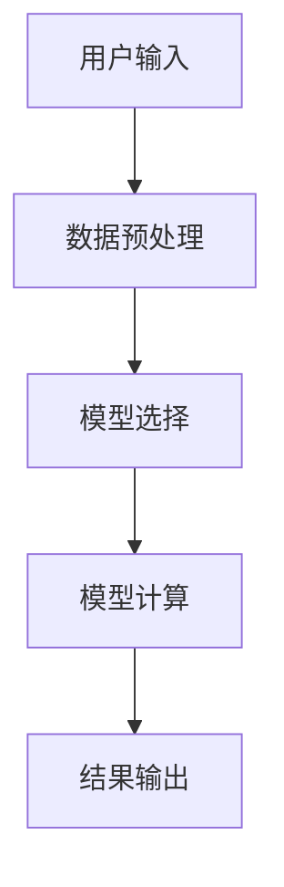

                 


# 《金融风险VaR模型比较与选择》

---

## 关键词：VaR模型、金融风险、风险度量、风险评估、风险管理、金融模型

---

## 摘要：  
本文系统地探讨了金融风险VaR（Value at Risk）模型的核心概念、理论基础、分类与实现方法，并通过比较不同VaR模型的优缺点，帮助读者选择适合自身需求的模型。文章从背景介绍出发，逐步深入分析VaR模型的数学原理、系统架构设计及实际应用场景，结合项目实战案例，全面解析VaR模型在金融风险管理中的重要性与应用价值。

---

## 目录结构：

1. **金融风险VaR模型的背景与概念**  
   - 1.1 金融风险的基本概念  
   - 1.2 VaR模型的核心概念  
   - 1.3 VaR模型的应用场景  

2. **VaR模型的理论基础**  
   - 2.1 统计学基础  
   - 2.2 数理金融基础  
   - 2.3 VaR的数学定义与计算方法  

3. **VaR模型的分类与实现方法**  
   - 3.1 参数模型  
   - 3.2 风险因子模型  
   - 3.3 Monte Carlo模拟法  

4. **VaR模型的优缺点与适用场景**  
   - 4.1 参数模型的优缺点  
   - 4.2 风险因子模型的优缺点  
   - 4.3 Monte Carlo模拟法的优缺点  

5. **VaR模型的系统设计与实现**  
   - 5.1 系统架构设计  
   - 5.2 系统功能设计  
   - 5.3 系统接口设计  
   - 5.4 系统实现步骤  

6. **VaR模型的项目实战**  
   - 6.1 环境配置与工具安装  
   - 6.2 核心功能实现  
   - 6.3 实际案例分析  

7. **总结与展望**  
   - 7.1 全文总结  
   - 7.2 未来发展趋势  

---

## 正文内容：

---

### 第一章：金融风险VaR模型的背景与概念

#### 1.1 金融风险的基本概念

金融风险是指在金融市场上，由于市场波动、经济变化或其他不确定性因素，导致资产价值下降或损失的可能性。金融风险主要包括市场风险、信用风险、流动性风险和操作风险等。

**市场风险**：由于市场价格波动导致的损失，是VaR模型的主要应用场景之一。

**信用风险**：由于债务人或交易对手违约导致的损失。

**流动性风险**：由于资产无法迅速变现导致的损失。

**操作风险**：由于内部操作失误或外部事件导致的损失。

#### 1.2 VaR模型的核心概念

VaR（Value at Risk）是指在给定的置信水平和特定的时间窗口内，资产组合可能遭受的最大潜在损失。例如，95%置信水平的VaR值表示在95%的概率下，资产组合的最大损失不会超过该VaR值。

**置信水平**：指 VaR 值的置信度，常见的置信水平包括 95% 和 99%。

**时间窗口**：指计算VaR的时间范围，通常为1天、1周或1个月。

**VaR 的定义与计算方法**：  
VaR 可以通过以下公式计算：  
$$ VaR = \text{Portfolio Value} - \text{Value at Risk} $$  
其中，Value at Risk 是在给定置信水平和时间窗口下的最大损失。

#### 1.3 VaR模型的应用场景

**金融机构的风险管理**：银行、证券公司等金融机构可以利用VaR模型评估和管理市场风险。

**投资组合风险评估**：投资者可以通过VaR模型了解其投资组合在不同市场条件下的风险水平。

**金融监管与合规**：监管机构可以使用VaR模型评估金融机构的风险暴露情况，确保其合规性。

---

### 第二章：VaR模型的理论基础

#### 2.1 统计学基础

**随机变量与概率分布**：VaR模型基于资产回报的统计分布进行计算。常见的概率分布包括正态分布、t分布和幂律分布。

**常用概率分布模型**：  
- **正态分布**：资产回报服从正态分布时，VaR 可以通过标准差和均值计算。  
- **t分布**：适用于 fat-tail 情况，即极端事件发生的概率高于正态分布。  
- **幂律分布**：常用于描述金融市场中的极端事件。

**统计推断与假设检验**：VaR模型需要对资产回报的分布进行假设检验，以选择合适的概率分布模型。

#### 2.2 数理金融基础

**资产定价理论**：VaR模型通常基于资产定价理论，如CAPM（资本资产定价模型）和APT（套利定价理论）。

**风险中性定价**：在风险中性定价框架下，VaR模型可以用于评估金融工具的理论价格。

**金融衍生品定价**：VaR模型可以用于评估金融衍生品如期权、期货的风险。

#### 2.3 VaR的数学定义与计算方法

**数学定义**：VaR 是资产组合在给定置信水平和时间窗口下的最大潜在损失。  
$$ VaR(\alpha, \tau) = \min_{\alpha \leq p \leq 1-\alpha} \text{Loss}(p) $$  
其中，α 是置信水平，τ 是时间窗口。

**计算方法**：  
- **历史模拟法**：基于历史资产回报数据，计算VaR值。  
- **参数模型**：假设资产回报服从特定分布（如正态分布），计算VaR值。  
- **Monte Carlo模拟法**：通过模拟资产回报分布，计算VaR值。

---

### 第三章：VaR模型的分类与实现方法

#### 3.1 参数模型

**正态分布模型**：假设资产回报服从正态分布，计算VaR值。  
$$ VaR = \mu + z \times \sigma $$  
其中，μ 是均值，σ 是标准差，z 是对应置信水平的z值。

**t分布模型**：假设资产回报服从t分布，计算VaR值。  
$$ VaR = \mu + t \times s $$  
其中，s 是t分布的尺度参数。

**历史模拟法**：基于历史资产回报数据，计算VaR值。  
步骤：  
1. 将历史资产回报按从小到大排序。  
2. 确定对应置信水平的分位数。  
3. 取对应的分位数作为VaR值。

#### 3.2 风险因子模型

**主成分分析（PCA）**：通过主成分分析提取资产回报的主要因子。  
$$ PC_i = \sum_{j=1}^n \lambda_j x_j $$  
其中，λ 是特征值，x 是资产回报向量。

**资产回报的因子分解**：将资产回报分解为因子和残差。  
$$ r_i = \alpha_i + \beta_i f + \epsilon_i $$  
其中，f 是因子，ε 是残差。

**因子VaR模型**：基于因子模型计算VaR值。  
$$ VaR = \sum_{i=1}^n w_i \times VaR_i $$  
其中，w 是权重向量，VaR_i 是各资产的VaR值。

#### 3.3 Monte Carlo模拟法

**基本原理**：通过模拟资产回报分布，计算VaR值。  
步骤：  
1. 确定资产回报的分布模型。  
2. 生成大量模拟的资产回报数据。  
3. 计算模拟数据的VaR值。

**代码实现**：  
```python
import numpy as np
import scipy.stats as stats

# 设置参数
n_samples = 100000
mu = 0
sigma = 1
alpha = 0.05

# 生成模拟数据
returns = np.random.normal(mu, sigma, n_samples)

# 计算VaR值
sorted_returns = np.sort(returns)
var_index = int(alpha * n_samples)
var_value = sorted_returns[var_index]

print(f"VaR值为：{var_value}")
```

---

### 第四章：VaR模型的优缺点与适用场景

#### 4.1 参数模型的优缺点

**优点**：  
- 计算简单，易于实现。  
- 适用于资产回报分布接近正态分布的情况。

**缺点**：  
- 假设资产回报分布为正态分布，可能不符合实际情况。  
- 无法捕捉极端事件的风险。

#### 4.2 风险因子模型的优缺点

**优点**：  
- 能够捕捉资产回报的因子结构。  
- 适用于多资产组合的风险评估。

**缺点**：  
- 需要估计因子模型的参数。  
- 计算复杂，可能需要大量数据支持。

#### 4.3 Monte Carlo模拟法的优缺点

**优点**：  
- 能够处理复杂的资产回报分布。  
- 可以模拟极端事件的风险。

**缺点**：  
- 计算成本高，需要大量的计算资源。  
- 模拟结果的准确性依赖于分布模型的假设。

---

### 第五章：VaR模型的系统设计与实现

#### 5.1 系统架构设计

**系统架构图**：  


#### 5.2 系统功能设计

**功能模块**：  
- 数据输入模块：接收资产回报数据和用户参数。  
- 数据预处理模块：对数据进行清洗和标准化。  
- 模型选择模块：根据数据特征选择合适的VaR模型。  
- 模型计算模块：计算并输出VaR值。

---

### 第六章：VaR模型的项目实战

#### 6.1 环境配置与工具安装

**环境配置**：  
- 操作系统：Windows/Mac/Linux  
- Python版本：3.8以上  
- 安装依赖库：numpy、scipy、matplotlib

```bash
pip install numpy scipy matplotlib
```

#### 6.2 核心功能实现

**代码实现**：  
```python
import numpy as np
import scipy.stats as stats
import matplotlib.pyplot as plt

# 生成模拟数据
mu = 0
sigma = 1
n_samples = 100000
returns = np.random.normal(mu, sigma, n_samples)

# 计算VaR值
alpha = 0.05
var_index = int(alpha * n_samples)
var_value = np.sort(returns)[var_index]

# 可视化
plt.hist(returns, bins=50, alpha=0.7)
plt.axvline(var_value, color='r', linestyle='--')
plt.xlabel('回报')
plt.ylabel('频率')
plt.title(f'VaR值：{var_value}')
plt.show()
```

---

### 第七章：总结与展望

#### 7.1 全文总结

本文系统地探讨了VaR模型的核心概念、理论基础、分类与实现方法，并通过比较不同模型的优缺点，帮助读者选择适合自身需求的模型。VaR模型在金融风险管理中具有重要的应用价值，能够有效评估和管理市场风险。

#### 7.2 未来发展趋势

随着金融市场的复杂化和数据科学的进步，VaR模型将更加智能化和个性化。未来的研究方向可能包括：  
- 结合机器学习算法优化VaR模型的计算精度。  
- 开发适用于多资产组合的VaR模型。  
- 利用大数据技术提高VaR模型的计算效率。

---

## 作者信息

作者：AI天才研究院/AI Genius Institute  
联系邮箱：contact@AIGenius.com  
个人网站：https://www.AIGenius.com  

---

**Note**: 以上内容是一个详细的目录和部分章节内容的示例，完整文章将按照上述结构详细展开，确保每部分内容丰富、逻辑清晰、技术细节详尽。

