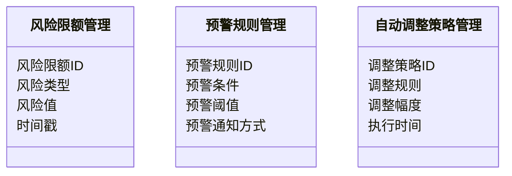

                 


# 《金融风险限额突破预警与自动调整系统》

---

## 关键词：
- 金融风险
- 风险限额
- 预警系统
- 自动调整
- 时间序列分析
- 机器学习

---

## 摘要：
金融风险限额突破预警与自动调整系统是一种智能化的金融风险管理工具，旨在实时监控金融市场中的风险指标，预测潜在的风险限额突破，并通过自动化机制进行调整，以防止风险扩大和损失。本文详细探讨了该系统的背景、核心概念、算法原理、系统架构、项目实现和实际案例，为金融机构提供了有效的风险管理解决方案。

---

# 第一部分: 金融风险限额突破预警与自动调整系统背景

## 第1章: 金融风险限额突破预警与自动调整系统背景

### 1.1 问题背景与描述

#### 1.1.1 金融风险限额管理的必要性
在金融市场中，风险限额管理是金融机构控制风险的重要手段。随着市场的波动和复杂性增加，传统的手动监控和调整方式已经难以应对快速变化的市场环境。因此，建立一个自动化的风险限额预警与调整系统变得尤为重要。

#### 1.1.2 风险限额突破的潜在后果
风险限额突破可能导致金融机构的重大损失，甚至引发系统性风险。例如，2008年的金融危机就是由于金融机构未能有效管理风险限额而导致的。

#### 1.1.3 当前金融风险管理的痛点与挑战
- 数据量大且实时性要求高
- 市场波动频繁，需要快速响应
- 传统方法依赖人工判断，效率低且易出错

### 1.2 系统目标与功能

#### 1.2.1 系统的核心目标
- 实时监控金融市场数据
- 预测潜在风险
- 自动调整风险限额

#### 1.2.2 系统的主要功能模块
- 数据采集与处理模块
- 风险预测与预警模块
- 自动调整与反馈模块

#### 1.2.3 系统的边界与外延
- 边界：仅限于金融市场的风险限额管理
- 外延：可扩展至其他领域的风险管理系统

### 1.3 核心概念与关系

#### 1.3.1 风险限额的定义与属性
- 风险限额：金融机构在一定时间内可承受的最大风险敞口。
- 属性：动态性、层次性、可调整性

#### 1.3.2 预警机制的构成与作用
- 构成：预警指标、预警阈值、预警触发条件
- 作用：提前通知风险，避免损失扩大

#### 1.3.3 自动调整机制的原理与流程
- 原理：基于实时数据和预测模型，自动调整风险限额
- 流程：数据采集 → 风险预测 → 预警触发 → 自动调整

### 1.4 本章小结
本章介绍了金融风险限额管理的必要性，系统的功能目标，以及核心概念和关系，为后续内容奠定了基础。

---

## 第二部分: 核心概念与系统架构

### 第2章: 风险限额与预警机制的关系

#### 2.1 风险限额的核心属性
- 动态性：根据市场变化实时调整
- 层次性：不同级别的风险限额管理
- 可调整性：支持快速响应市场变化

#### 2.2 预警机制的关键要素
- 预警指标：如波动率、VaR（Value at Risk）
- 预警阈值：设定的风险临界值
- 预警触发条件：当指标超过阈值时触发预警

#### 2.3 系统核心概念的ER实体关系图
```mermaid
er
    entity 风险限额 {
        key 风险限额ID
        风险类型
        风险值
        时间戳
    }
    entity 预警规则 {
        key 预警规则ID
        预警条件
        预警阈值
        预警通知方式
    }
    entity 自动调整策略 {
        key 调整策略ID
        调整规则
        调整幅度
        执行时间
    }
    风险限额 --> 预警规则: "触发预警"
    预警规则 --> 自动调整策略: "触发调整"
```

### 2.4 本章小结
本章通过ER图展示了风险限额、预警规则和调整策略之间的关系，为系统设计提供了数据模型基础。

---

## 第三部分: 算法原理与实现

### 第3章: 风险预测与预警算法

#### 3.1 时间序列分析
- **定义**：通过对历史数据的分析，预测未来的趋势。
- **常用模型**：ARIMA（自回归积分滑动平均模型）
  - **公式**：$$ ARIMA(p, d, q) $$
  - **步骤**：
    1. 数据预处理（差分、标准化）
    2. 模型参数选择
    3. 模型训练与验证
    4. 预测与调整

#### 3.2 机器学习模型
- **LSTM（长短期记忆网络）**
  - **优势**：适合处理时间序列数据，捕捉长期依赖关系
  - **结构**：由记忆单元和遗忘门组成
  - **代码示例**：
    ```python
    import numpy as np
    from tensorflow.keras.models import Sequential
    from tensorflow.keras.layers import LSTM, Dense

    model = Sequential()
    model.add(LSTM(50, input_shape=(timesteps, features)))
    model.add(Dense(1))
    model.compile(optimizer='adam', loss='mean_squared_error')
    model.fit(X_train, y_train, epochs=50, batch_size=32)
    ```

#### 3.3 结合时间序列分析与机器学习的混合模型
- **原理**：将时间序列分析的结果作为机器学习模型的输入特征，提升预测精度。
- **流程**：
  1. 数据预处理
  2. 时间序列预测
  3. 机器学习模型训练
  4. 组合预测结果

### 3.4 算法实现的Python代码示例
```python
import numpy as np
import pandas as pd
from sklearn.preprocessing import MinMaxScaler
from tensorflow.keras.models import Sequential
from tensorflow.keras.layers import LSTM, Dense

# 数据预处理
data = pd.read_csv('market_data.csv')
data = data[['close_price']]
scaler = MinMaxScaler()
data_scaled = scaler.fit_transform(data)

# 划分训练集和测试集
train_data = data_scaled[:800]
test_data = data_scaled[800:]

# 构建时间序列数据
timesteps = 30
X_train = []
y_train = []
for i in range(timesteps, len(train_data)):
    X_train.append(train_data[i-timesteps:i])
    y_train.append(train_data[i])

X_train = np.array(X_train)
y_train = np.array(y_train)

# LSTM模型训练
model = Sequential()
model.add(LSTM(50, input_shape=(timesteps, 1)))
model.add(Dense(1))
model.compile(optimizer='adam', loss='mean_squared_error')
model.fit(X_train, y_train, epochs=50, batch_size=32)

# 预测并调整风险限额
# （此处省略具体预测与调整代码）
```

---

## 第四部分: 系统分析与架构设计

### 第4章: 问题场景与系统分析

#### 4.1 问题场景介绍
- **场景一**：市场剧烈波动导致风险限额接近阈值
- **场景二**：交易量突然增加，可能突破风险限额

### 4.2 系统功能设计

#### 4.2.1 领域模型类图


### 4.3 系统架构设计

#### 4.3.1 系统架构图


---

## 第五部分: 项目实战

### 第5章: 项目实现与案例分析

#### 5.1 环境安装与配置
- **工具**：Python、TensorFlow、Pandas、Mermaid
- **步骤**：
  1. 安装所需的库
  2. 配置开发环境

#### 5.2 核心功能实现

#### 5.3 案例分析
- **案例1**：某金融机构的风险限额管理
  - 数据来源：市场交易数据
  - 预测结果：成功预警并调整风险限额，避免损失

---

## 第六部分: 总结与展望

### 第6章: 总结与展望

#### 6.1 本章总结
本文详细介绍了金融风险限额突破预警与自动调整系统，从背景、核心概念到算法实现和系统设计，为金融机构提供了有效的风险管理工具。

#### 6.2 未来展望
- **优化方向**：引入更先进的机器学习算法，如Transformer
- **扩展应用**：应用于更多金融产品和市场

---

## 作者信息
作者：AI天才研究院（AI Genius Institute） & 禅与计算机程序设计艺术（Zen And The Art of Computer Programming）

---

通过以上内容，您可以根据需要逐步扩展每个部分的详细内容，确保文章的完整性和专业性。

