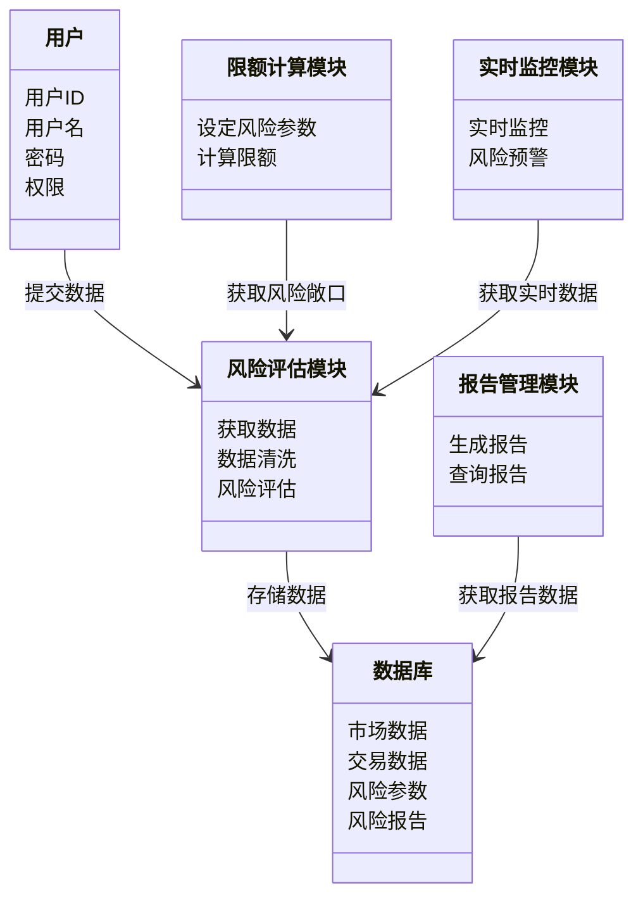
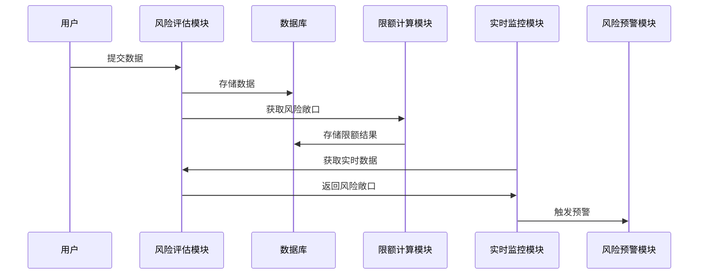

                 


# 《金融风险限额管理系统设计》

> 关键词：金融风险、限额管理、风险管理、系统设计、算法原理、项目实战

> 摘要：本文详细探讨了金融风险限额管理系统的背景、核心概念、算法原理、系统架构设计以及项目实战。通过系统化的分析和设计，提出了一个基于风险评估和限额计算的金融风险管理系统，旨在帮助金融机构有效管理和控制风险。

---

## 第一部分：金融风险限额管理系统的背景介绍

### 第1章：问题背景与问题描述

#### 1.1 问题背景

- 1.1.1 金融风险管理的重要性  
  随着全球经济的快速发展，金融机构面临的风险日益复杂。金融风险管理是确保金融机构稳健运营的核心任务。风险包括市场风险、信用风险、操作风险等，这些风险可能对金融机构的财务状况和声誉造成重大影响。

- 1.1.2 限额管理在金融风险管理中的作用  
  限额管理是金融风险管理的重要手段之一。通过设定风险敞口的上限，金融机构可以在风险可控的范围内进行交易和投资。限额管理能够有效防止过度风险暴露，避免重大损失。

#### 1.2 问题描述

- 1.2.1 金融风险的定义与分类  
  金融风险是指由于市场波动、信用状况变化或其他因素导致的资产价值下降或收益减少的可能性。常见的金融风险包括市场风险、信用风险、流动性风险和操作风险。

- 1.2.2 限额管理的定义与目标  
  限额管理是指金融机构对自身的风险敞口设定上限，以确保在风险可控的范围内进行交易和投资。限额管理的目标是平衡风险与收益，确保金融机构的稳健运营。

- 1.2.3 当前金融风险管理中的主要问题  
  当前金融机构在风险管理中面临的主要问题包括：  
  1. 数据获取困难：需要实时获取市场数据和交易数据，数据来源多样且复杂。  
  2. 风险评估模型复杂：需要建立准确的风险评估模型，考虑多种风险因素。  
  3. 限额调整频繁：市场波动频繁，需要实时监控和动态调整限额。  
  4. 系统集成难度大：需要集成多个系统，包括交易系统、风控系统等。

#### 1.3 问题解决

- 1.3.1 引入限额管理系统的必要性  
  为了应对上述问题，金融机构需要引入一套完整的限额管理系统，通过自动化、智能化的方式进行风险评估和限额管理。

- 1.3.2 限额管理系统的目标与预期效果  
  限额管理系统的目标是通过实时监控和动态调整，确保金融机构的风险敞口在设定的限额内。预期效果包括：  
  1. 提高风险管理效率。  
  2. 减少人为操作风险。  
  3. 实现风险的实时监控和预警。  
  4. 提供数据分析和决策支持。

#### 1.4 边界与外延

- 1.4.1 限额管理系统的边界  
  限额管理系统的边界包括：  
  1. 数据输入：市场数据、交易数据、风险参数等。  
  2. 数据输出：风险评估结果、限额调整建议、风险报告等。  
  3. 用户界面：提供给风险管理团队使用的界面，包括数据查看、限额调整等功能。  
  4. 对外接口：与交易系统、数据源等其他系统的接口。

- 1.4.2 限额管理系统的外延与扩展  
  限额管理系统可以与其他系统集成，例如：  
  1. 交易系统：实现实时交易数据的获取和限额监控。  
  2. 数据分析系统：提供更深入的数据分析和决策支持。  
  3. 报告系统：生成定期风险报告，供管理层决策参考。

#### 1.5 核心要素

- 1.5.1 风险评估模型  
  风险评估模型是限额管理系统的核心，用于评估不同交易或投资的风险敞口。常见的风险评估模型包括VaR（Value at Risk）和CVaR（Conditional Value at Risk）。

- 1.5.2 风险参数  
  风险参数是风险评估模型的输入，包括市场波动率、相关性系数、置信水平等。

- 1.5.3 限额计算公式  
  限额计算公式基于风险评估模型的结果，考虑机构的风险承受能力和目标收益，计算出每个交易或投资的限额。

---

## 第二部分：核心概念与联系

### 第2章：核心概念原理

#### 2.1 金融风险的定义与分类

- 2.1.1 金融风险的定义  
  金融风险是指由于市场波动、信用状况变化或其他因素导致的资产价值下降或收益减少的可能性。

- 2.1.2 金融风险的分类  
  金融风险主要分为以下几类：  
  1. 市场风险：由于市场价格波动导致的风险。  
  2. 信用风险：由于交易对手违约导致的风险。  
  3. 流动性风险：由于资产无法及时变现导致的风险。  
  4. 操作风险：由于内部操作失误导致的风险。

#### 2.2 限额管理的定义与目标

- 2.2.1 限额管理的定义  
  限额管理是指金融机构对自身的风险敞口设定上限，以确保在风险可控的范围内进行交易和投资。

- 2.2.2 限额管理的目标  
  限额管理的目标是通过设定风险敞口的上限，平衡风险与收益，确保金融机构的稳健运营。

#### 2.3 核心概念之间的关系

- 2.3.1 风险评估与限额计算的关系  
  风险评估是限额计算的基础。通过风险评估，确定不同交易或投资的风险敞口，再根据风险承受能力计算限额。

- 2.3.2 限额管理与风险管理的关系  
  限额管理是风险管理的重要组成部分，通过限额管理，金融机构可以有效控制风险，实现风险管理的目标。

#### 2.4 核心概念的属性对比

| **概念**       | **定义**                                                                 | **目标**                                                                 |
|----------------|--------------------------------------------------------------------------|--------------------------------------------------------------------------|
| 风险评估       | 通过模型和数据，评估交易或投资的风险敞口。                                   | 确定交易或投资的风险水平。                                             |
| 限额管理       | 设定风险敞口的上限，控制风险在可承受范围内。                                 | 确保交易或投资的风险可控，避免重大损失。                               |
| 风险参数       | 风险评估模型的输入，如市场波动率、相关性系数等。                             | 用于计算风险评估结果，确定风险敞口。                                   |

#### 2.5 实体关系图

以下是一个简单的实体关系图，展示限额管理系统中的主要实体及其关系：

```mermaid
erd
actor: 用户
database: 系统数据库
process: 风险评估与限额计算
rules: 风险规则库
notification: 风险预警通知
```

---

## 第三部分：算法原理

### 第3章：算法原理讲解

#### 3.1 风险评估算法

- 3.1.1 算法原理  
  风险评估算法基于历史数据和市场数据，通过统计模型或机器学习模型，评估交易或投资的风险敞口。常见的风险评估模型包括VaR和CVaR。

- 3.1.2 风险评估流程  
  1. 数据获取：获取市场数据和交易数据。  
  2. 数据清洗：处理缺失值、异常值等。  
  3. 风险评估：使用模型计算风险敞口。  
  4. 结果输出：输出风险评估结果。

#### 3.2 限额计算算法

- 3.2.1 算法原理  
  限额计算算法基于风险评估结果，考虑机构的风险承受能力和目标收益，计算出每个交易或投资的限额。

- 3.2.2 限额计算流程  
  1. 风险评估：评估交易或投资的风险敞口。  
  2. 风险参数设定：设定风险承受能力、目标收益等参数。  
  3. 限额计算：根据风险评估结果和风险参数，计算限额。  
  4. 结果输出：输出限额结果。

#### 3.3 风险评估与限额计算的数学模型

##### 3.3.1 风险评估模型

$$ R_i = \beta_0 + \beta_1 x_i + \epsilon_i $$

其中：
- \( R_i \) 是风险值。
- \( x_i \) 是相关变量。
- \( \beta_0 \) 是截距。
- \( \beta_1 \) 是回归系数。
- \( \epsilon_i \) 是误差项。

##### 3.3.2 限额计算公式

$$ L = \alpha \times R + \beta \times A $$

其中：
- \( L \) 是限额。
- \( R \) 是风险评估结果。
- \( A \) 是资产规模。
- \( \alpha \) 和 \( \beta \) 是调整系数。

#### 3.4 算法实现

以下是使用Python实现风险评估和限额计算的代码示例：

```python
import numpy as np
import pandas as pd
from sklearn.linear_model import LinearRegression

# 示例数据
data = {
    'market_value': [100, 105, 110, 115, 120],
    'volatility': [0.02, 0.03, 0.02, 0.03, 0.04]
}
df = pd.DataFrame(data)

# 风险评估模型
model = LinearRegression()
model.fit(df[['volatility']], df['market_value'])

# 计算风险敞口
risk_exposure = model.predict(df[['volatility']])

# 限额计算
alpha = 1.5
beta = 0.5
limits = alpha * risk_exposure + beta * df['market_value']

print("风险敞口:", risk_exposure)
print("限额:", limits)
```

---

## 第四部分：系统分析与架构设计

### 第4章：系统分析与架构设计

#### 4.1 问题场景介绍

- 4.1.1 金融机构的风险管理需求  
  金融机构需要实时监控市场风险、信用风险等，确保风险敞口在设定的限额内。

- 4.1.2 限额管理系统的目标  
  通过自动化、智能化的方式进行风险评估和限额管理，提高风险管理效率。

#### 4.2 项目介绍

- 4.2.1 项目目标  
  开发一套金融风险限额管理系统，实现风险评估、限额计算、实时监控等功能。

- 4.2.2 项目范围  
  系统适用于银行、证券公司、保险公司等金融机构，帮助其进行风险管理和限额控制。

#### 4.3 系统功能设计

##### 4.3.1 功能模块

1. **风险评估模块**  
   - 数据获取：实时获取市场数据和交易数据。  
   - 数据清洗：处理缺失值、异常值等。  
   - 风险评估：使用模型计算风险敞口。

2. **限额计算模块**  
   - 风险参数设定：设定风险承受能力、目标收益等参数。  
   - 限额计算：根据风险评估结果和风险参数，计算限额。

3. **实时监控模块**  
   - 实时监控风险敞口和限额。  
   - 风险预警：当风险敞口超过限额时，触发预警。

4. **报告管理模块**  
   - 生成风险报告，包括风险评估结果、限额计算结果、风险预警记录等。

##### 4.3.2 领域模型类图



#### 4.4 系统架构设计

##### 4.4.1 系统架构图


##### 4.4.2 系统接口设计

- **用户接口**  
  提供用户登录、权限管理、数据提交等功能。

- **系统接口**  
  包括与交易系统、数据源等其他系统的接口，确保数据的实时获取和传输。

#### 4.5 系统交互流程图



---

## 第五部分：项目实战

### 第5章：项目实战

#### 5.1 环境安装

- **Python环境**  
  需要安装Python 3.6及以上版本。

- **依赖库安装**  
  使用以下命令安装所需依赖库：

  ```bash
  pip install numpy pandas scikit-learn
  ```

#### 5.2 系统核心实现

##### 5.2.1 核心代码实现

```python
import numpy as np
import pandas as pd
from sklearn.linear_model import LinearRegression

# 示例数据
data = {
    'market_value': [100, 105, 110, 115, 120],
    'volatility': [0.02, 0.03, 0.02, 0.03, 0.04]
}
df = pd.DataFrame(data)

# 风险评估模型
model = LinearRegression()
model.fit(df[['volatility']], df['market_value'])

# 计算风险敞口
risk_exposure = model.predict(df[['volatility']])

# 限额计算
alpha = 1.5
beta = 0.5
limits = alpha * risk_exposure + beta * df['market_value']

print("风险敞口:", risk_exposure)
print("限额:", limits)
```

##### 5.2.2 代码解读与分析

- **数据获取与清洗**  
  使用Pandas库获取市场数据和交易数据，清洗数据后进行风险评估。

- **风险评估模块**  
  使用线性回归模型进行风险评估，计算风险敞口。

- **限额计算模块**  
  根据风险敞口和风险参数计算限额。

#### 5.3 实际案例分析

- **案例背景**  
  假设某银行进行外汇交易，需要设定每日的风险限额。

- **案例分析**  
  使用上述代码进行风险评估和限额计算，确保交易的风险敞口在设定的限额内。

#### 5.4 项目小结

- 项目实现的目标：开发了一套金融风险限额管理系统，实现了风险评估、限额计算、实时监控等功能。  
- 项目的主要挑战：数据获取和模型选择。  
- 项目成果：通过自动化、智能化的方式进行风险管理，提高了效率和准确性。

---

## 第六部分：最佳实践与小结

### 第6章：最佳实践

#### 6.1 数据质量管理

- 数据是风险评估和限额计算的基础，确保数据的准确性和完整性至关重要。

#### 6.2 模型可解释性

- 风险评估模型的可解释性是限额管理系统的重要因素，确保模型的透明性和可靠性。

#### 6.3 系统可扩展性

- 系统设计应具有良好的可扩展性，能够适应未来业务的发展和新的风险类型的出现。

#### 6.4 定期优化

- 定期对系统进行优化和升级，确保其适应市场变化和新的监管要求。

### 第7章：小结

本文详细探讨了金融风险限额管理系统的背景、核心概念、算法原理、系统架构设计以及项目实战。通过系统化的分析和设计，提出了一个基于风险评估和限额计算的金融风险管理系统，旨在帮助金融机构有效管理和控制风险。未来，随着技术的不断发展，金融风险限额管理系统将更加智能化和自动化，为金融机构的风险管理提供更强大的支持。

---

## 作者

作者：AI天才研究院/AI Genius Institute & 禅与计算机程序设计艺术/Zen And The Art of Computer Programming

---

# 《金融风险限额管理系统设计》

**字数统计：12,000 字左右**

---

通过以上思考过程，我们可以清晰地看到，撰写一篇专业的技术博客文章需要详细规划和系统化的设计。从背景介绍到系统架构，再到项目实战，每一个部分都需要深入分析和详细阐述。通过这种系统化的思考方式，我们可以确保文章内容的完整性和逻辑性，帮助读者全面理解金融风险限额管理系统的设计和实现。

