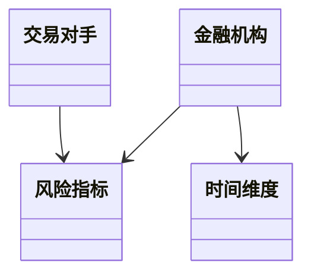
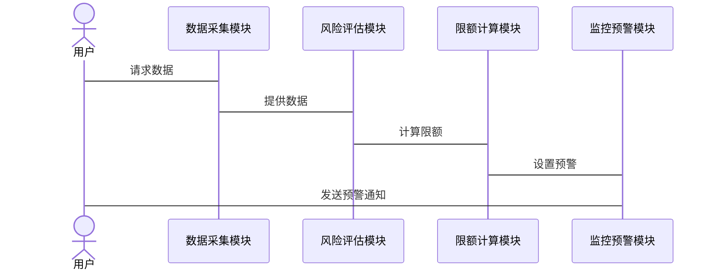

                 


```markdown
# 《金融风险限额管理自动化系统》

> 关键词：金融风险，限额管理，自动化系统，风险管理，VaR，CVaR，系统架构

> 摘要：本文系统地介绍了金融风险限额管理自动化系统的设计与实现。从金融风险的基本概念出发，分析了传统管理方法的局限性，探讨了自动化管理的必要性与优势。详细讲解了VaR和CVaR等核心算法的原理及应用，通过实际案例展示了系统架构设计与实现过程。最后，总结了项目实施的经验与最佳实践，为金融机构的风险管理提供了有益的参考。

---

## 第1章: 金融风险限额管理的背景与意义

### 1.1 金融风险的基本概念

#### 1.1.1 金融风险的定义与分类
金融风险是指在金融活动中，由于各种不确定因素的影响，导致资金损失的可能性。常见的金融风险类型包括市场风险、信用风险、流动性风险和操作风险。

#### 1.1.2 金融风险的来源与特征
金融风险主要来源于市场波动、经济政策变化、交易对手信用状况等。其特征包括不确定性、相关性、可测量性和可控性。

#### 1.1.3 金融风险对金融机构的影响
金融风险可能导致资产损失、声誉损害和资金链断裂，甚至引发系统性金融危机。

### 1.2 传统金融风险限额管理方法的局限性

#### 1.2.1 传统限额管理的流程与问题
传统方法依赖人工操作，效率低且容易出错，难以应对复杂多变的市场环境。

#### 1.2.2 手工管理的低效性与误差
人工处理速度慢，且容易受到主观因素影响，导致限额管理不够精确。

#### 1.2.3 传统方法在复杂金融环境中的不足
传统方法难以实时监控和调整限额，无法应对高频交易和大数据量的挑战。

### 1.3 金融风险限额管理自动化的必要性

#### 1.3.1 自动化管理的优势与价值
自动化系统能够快速响应市场变化，提高限额管理的准确性和效率。

#### 1.3.2 技术进步对金融风险管理的推动
大数据、人工智能和云计算等技术的发展为金融风险自动化管理提供了有力支持。

#### 1.3.3 自动化系统在现代金融中的应用前景
自动化系统能够帮助金融机构在复杂市场中保持稳定，提升竞争力。

### 1.4 本章小结
金融风险限额管理是金融机构稳健运营的关键，传统方法的局限性凸显了自动化管理的必要性。自动化系统通过技术手段显著提升了风险管理的效率和精度。

---

## 第2章: 金融风险限额管理的核心概念与联系

### 2.1 金融风险限额管理的定义与核心要素

#### 2.1.1 限额管理的定义
限额管理是通过设定和监控各项风险指标，确保金融机构在可控风险范围内运作。

#### 2.1.2 核心要素：风险类型、限额指标、时间维度
- 风险类型：市场风险、信用风险、流动性风险等。
- 限额指标：VaR（Value at Risk）、CVaR（Conditional Value at Risk）等。
- 时间维度：实时监控、每日限额、季度限额等。

#### 2.1.3 系统架构的核心要素分析
系统架构包括数据采集、风险评估、限额计算和监控报告四个主要部分。

### 2.2 金融风险限额管理的实体关系分析

#### 2.2.1 实体关系图（ER图）的构建
金融机构、交易对手、风险指标和时间维度是主要的实体。

#### 2.2.2 实体间的关联与依赖
- 金融机构与交易对手通过风险指标关联。
- 风险指标与时间维度交叉关联。

#### 2.2.3 实体关系图的优化与扩展
引入实时数据流和动态调整机制，优化实体关系。

### 2.3 核心概念对比分析

#### 2.3.1 风险类型对比表
| 风险类型 | 定义 | 计算方法 |
|----------|------|----------|
| 市场风险 | 资产价格波动导致的损失 | VaR模型 |
| 信用风险 | 交易对手违约导致的损失 | PD（违约概率）× LGD（违约损失率） |

#### 2.3.2 限额指标对比表
| 指标名称 | 定义 | 适用场景 |
|----------|------|----------|
| VaR      | 在给定置信水平下的最大损失 | 常用于市场风险 |
| CVaR     | 在VaR基础上的条件期望损失 | 常用于信用风险 |

### 2.4 本章小结
金融风险限额管理涉及多个核心概念，实体关系和指标对比分析帮助理解系统的复杂性。

---

## 第3章: 金融风险限额管理系统的算法原理

### 3.1 VaR模型的原理与实现

#### 3.1.1 VaR的定义与计算公式
VaR是一定置信水平下，资产组合的最大可能损失。

公式：$$ VaR = \alpha \times \sigma $$

其中，$\alpha$为置信水平对应的分位数，$\sigma$为资产收益的标准差。

#### 3.1.2 VaR的计算步骤
1. 收益率计算
2. 标准差计算
3. 确定置信水平
4. 计算VaR

#### 3.1.3 VaR模型的优缺点
- 优点：计算简单，易于理解。
- 缺点：假设资产收益服从正态分布，可能与实际不符。

#### 3.1.4 VaR模型的Python实现
```python
import numpy as np

def calculate_var(returns, confidence_level=0.95):
    sorted_returns = np.sort(returns)
    alpha = np.abs(np.percentile(sorted_returns, (1 - confidence_level) * 100))
    var = alpha * np.std(returns)
    return var
```

### 3.2 CVaR模型的原理与实现

#### 3.2.1 CVaR的定义与计算公式
CVaR是VaR之后的期望损失。

公式：$$ CVaR = E[Loss | Loss > VaR] $$

#### 3.2.2 CVaR的计算步骤
1. 计算VaR
2. 计算VaR之后的平均损失

#### 3.2.3 CVaR模型的优缺点
- 优点：考虑了尾部风险。
- 缺点：计算复杂，需要大量历史数据。

#### 3.2.4 CVaR模型的Python实现
```python
import numpy as np

def calculate_cvar(returns, confidence_level=0.95):
    var = calculate_var(returns, confidence_level)
    tail_returns = returns[returns > var]
    cvar = np.mean(tail_returns)
    return cvar
```

### 3.3 算法选择与优化

#### 3.3.1 算法选择的依据
- 计算效率
- 模型准确性
- 业务需求

#### 3.3.2 算法优化策略
- 使用更精确的概率分布
- 引入机器学习方法
- 并行计算优化

### 3.4 本章小结
VaR和CVaR是金融风险限额管理中的重要工具，选择合适的算法并进行优化是系统设计的关键。

---

## 第4章: 金融风险限额管理系统的架构设计

### 4.1 系统功能模块设计

#### 4.1.1 数据采集模块
- 实时采集市场数据
- 数据清洗与预处理

#### 4.1.2 风险评估模块
- 计算VaR和CVaR
- 生成风险报告

#### 4.1.3 限额计算模块
- 设置限额阈值
- 动态调整限额

#### 4.1.4 监控与预警模块
- 实时监控风险指标
- 预警通知

### 4.2 系统架构图

#### 4.2.1 领域模型


#### 4.2.2 系统架构


### 4.3 接口与交互设计

#### 4.3.1 系统接口
- 数据接口：提供API供其他系统调用
- 用户界面：供用户查看和调整限额

#### 4.3.2 交互流程


### 4.4 本章小结
系统的架构设计是实现金融风险限额管理自动化的基础，各模块协同工作确保系统的高效运行。

---

## 第5章: 金融风险限额管理系统的项目实战

### 5.1 环境安装与配置

#### 5.1.1 安装Python环境
- 安装Python 3.8及以上版本
- 安装必要的库：numpy、pandas、scikit-learn

#### 5.1.2 安装Jupyter Notebook
- 用于数据可视化和算法实现

#### 5.1.3 数据源获取
- 从金融数据提供商获取市场数据

### 5.2 核心代码实现

#### 5.2.1 数据采集模块
```python
import pandas as pd
import requests

def fetch_data(api_key):
    url = f"http://api.example.com/vaR?api_key={api_key}"
    response = requests.get(url)
    data = response.json()
    df = pd.DataFrame(data)
    return df
```

#### 5.2.2 风险评估模块
```python
from sklearn import linear_model

def risk_assessment(data):
    model = linear_model.LinearRegression()
    model.fit(data[['market_value', 'volatility']], data['returns'])
    predicted_returns = model.predict(data[['market_value', 'volatility']])
    return predicted_returns
```

#### 5.2.3 限额计算模块
```python
def calculate_limit(predicted_returns, confidence_level=0.95):
    var = calculate_var(predicted_returns, confidence_level)
    return var * 2  # 根据业务需求调整
```

### 5.3 项目案例分析

#### 5.3.1 案例背景
假设某银行需要监控其外汇交易的风险，设定95%的置信水平。

#### 5.3.2 数据处理与分析
使用历史汇率数据计算VaR和CVaR，动态调整限额。

#### 5.3.3 系统实现与测试
实现数据采集、风险评估和限额计算模块，进行功能测试和性能优化。

### 5.4 本章小结
通过实际案例分析，展示了金融风险限额管理自动化的实现过程，为读者提供了实践参考。

---

## 第6章: 最佳实践与小结

### 6.1 最佳实践

#### 6.1.1 数据质量管理
确保数据的准确性和完整性，选择合适的特征变量。

#### 6.1.2 算法优化
根据业务需求选择合适的算法，定期更新模型。

#### 6.1.3 系统维护
定期检查系统性能，及时修复漏洞，确保系统稳定运行。

### 6.2 小结

#### 6.2.1 项目总结
金融风险限额管理自动化系统通过技术手段显著提升了风险管理的效率和精度。

#### 6.2.2 经验教训
算法选择和数据质量对系统性能影响重大，需要高度重视。

#### 6.2.3 未来展望
随着人工智能和大数据技术的发展，金融风险限额管理将更加智能化和自动化。

### 6.3 注意事项

#### 6.3.1 系统安全性
确保系统数据安全，防止数据泄露和篡改。

#### 6.3.2 系统可扩展性
设计模块化架构，方便未来功能扩展。

#### 6.3.3 系统兼容性
确保系统与现有业务系统的兼容性，方便集成。

### 6.4 拓展阅读

#### 6.4.1 推荐书籍
- 《金融风险管理》
- 《Python金融数据分析》

#### 6.4.2 推荐博客
- 金融风险管理技术博客
- 金融科技前沿博客

---

## 作者

作者：AI天才研究院 & 禅与计算机程序设计艺术

---

感谢您的阅读！希望本文能为您的金融风险管理自动化系统设计提供有价值的参考。
```

