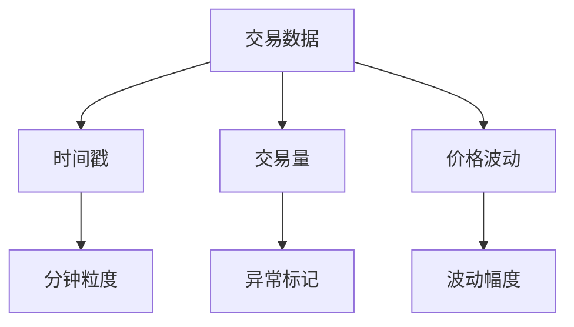
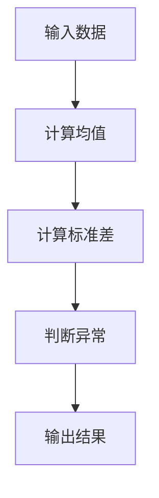
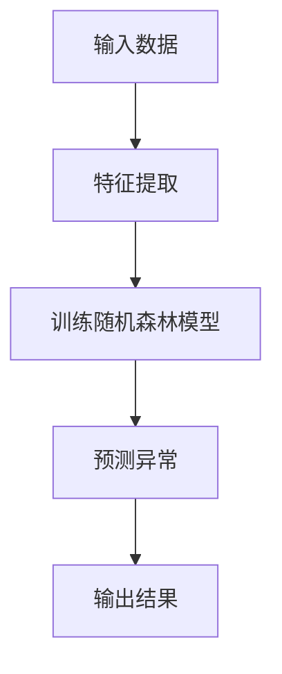
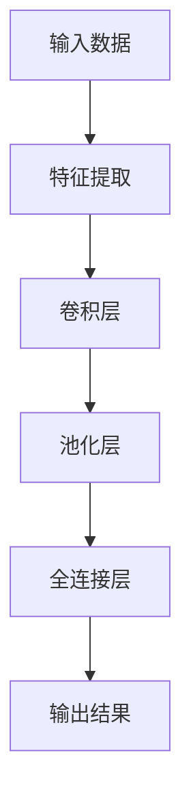
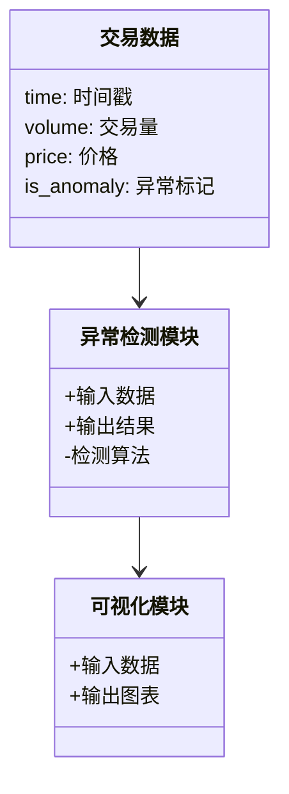
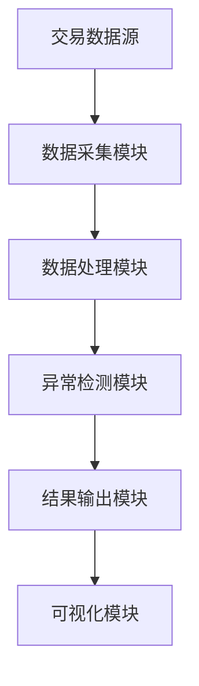

                 


# 《金融高频交易异常模式识别系统》

## 关键词：高频交易，异常模式识别，金融风控，机器学习，算法交易

## 摘要：本文详细探讨了金融高频交易中的异常模式识别系统，从背景、核心概念、算法原理到系统架构和项目实战，全面分析了该系统的构建与应用。通过统计方法、机器学习和深度学习等多种技术手段，结合实际案例，揭示了异常交易行为的识别与防范策略，为金融市场的稳定运行提供了技术支持。

---

# 第一部分: 金融高频交易异常模式识别系统概述

---

## 第1章: 异常模式识别的背景与意义

### 1.1 高频交易的定义与特点

高频交易是指在极短时间内进行的大量交易行为，通常依赖先进的算法和高速网络技术。其特点包括：

- **高速性**：交易速度极快，通常以微秒为单位。
- **高频性**：短时间内产生大量交易订单。
- **自动化**：依赖算法自动执行交易策略。
- **高波动性**：高频交易可能导致市场价格的剧烈波动。

### 1.2 异常模式识别的定义与特点

异常模式识别是指通过分析交易数据，发现与正常交易模式不符的异常行为。其特点包括：

- **数据密集性**：需要处理大量高频交易数据。
- **实时性**：需要在交易发生时快速识别异常。
- **多样性**：异常模式可能涉及多种类型，如市场操纵、虚假交易等。

### 1.3 异常模式识别的重要性

异常模式识别在金融高频交易中的作用至关重要：

- **防范市场操纵**：识别潜在的市场操纵行为。
- **维护市场公平性**：确保交易环境的公平公正。
- **提升交易安全**：保护投资者和金融机构的交易安全。

---

## 第2章: 异常模式识别的核心概念与联系

### 2.1 核心概念原理

- **异常检测**：通过统计方法或机器学习算法识别异常交易行为。
- **模式识别**：利用算法发现数据中的模式，帮助识别异常行为。
- **特征提取**：从交易数据中提取关键特征，用于异常检测和模式识别。

### 2.2 核心概念对比表

| 概念       | 定义                                                                 | 特点                                                                 | 应用场景                     |
|------------|----------------------------------------------------------------------|----------------------------------------------------------------------|------------------------------|
| 异常检测   | 识别数据中的异常点                                                     | 数据分布差异性                                                 | 金融 fraud detection         |
| 模式识别   | 发现数据中的模式                                                     | 数据结构规律性                                                 | 金融 market pattern recognition |
| 异常模式识别| 结合异常与模式识别，识别异常交易行为中的模式                         | 数据异常与模式双重性                                           | 金融高频交易监控             |

### 2.3 ER实体关系图



---

## 第3章: 异常模式识别的算法原理

### 3.1 统计方法

#### 3.1.1 基于均值和标准差的异常检测

- **算法流程图**



- **数学模型**

$$ \mu = \frac{1}{n}\sum_{i=1}^{n}x_i $$
$$ \sigma = \sqrt{\frac{1}{n-1}\sum_{i=1}^{n}(x_i - \mu)^2} $$

---

### 3.2 机器学习算法

#### 3.2.1 随机森林算法

- **算法流程图**



- **代码示例**

```python
import pandas as pd
from sklearn.ensemble import RandomForestClassifier
from sklearn.metrics import accuracy_score

# 加载数据
data = pd.read_csv('transaction_data.csv')

# 特征提取
features = data[['time', 'volume', 'price']]
labels = data['is_anomaly']

# 训练模型
model = RandomForestClassifier(n_estimators=100)
model.fit(features, labels)

# 预测
predictions = model.predict(features)
print("准确率:", accuracy_score(labels, predictions))
```

---

### 3.3 深度学习算法

#### 3.3.1 卷积神经网络（CNN）

- **算法流程图**



- **数学模型**

$$ y = f(x) $$
其中，$x$ 是输入数据，$y$ 是输出结果，$f$ 是深度神经网络模型。

---

# 第二部分: 金融高频交易异常模式识别系统的构建

---

## 第4章: 系统分析与架构设计

### 4.1 问题场景介绍

- **目标**：识别高频交易中的异常模式。
- **输入**：高频交易数据。
- **输出**：异常交易标记。

### 4.2 项目介绍

- **项目目标**：构建一个能够实时识别高频交易中异常模式的系统。
- **项目范围**：涵盖交易数据的采集、处理、分析和可视化。

### 4.3 系统功能设计

- **领域模型**



### 4.4 系统架构设计

- **系统架构图**



### 4.5 系统接口设计

- **接口描述**

```plaintext
+-------------------+      +-------------------+
| 交易数据源        | <--> | 数据采集模块      |
+-------------------+      +-------------------+
```

---

## 第5章: 项目实战

### 5.1 环境安装

```bash
pip install numpy pandas scikit-learn tensorflow
```

### 5.2 系统核心实现

```python
import numpy as np
import pandas as pd
from sklearn.ensemble import RandomForestClassifier
from tensorflow.keras import layers

# 数据加载
data = pd.read_csv('transaction_data.csv')

# 特征提取
features = data[['time', 'volume', 'price']]
labels = data['is_anomaly']

# 随机森林模型训练
rf_model = RandomForestClassifier(n_estimators=100)
rf_model.fit(features, labels)

# 卷积神经网络模型训练
model = tf.keras.Sequential()
model.add(layers.Dense(64, activation='relu', input_shape=(3,)))
model.add(layers.Dense(1, activation='sigmoid'))
model.compile(optimizer='adam', loss='binary_crossentropy', metrics=['accuracy'])
model.fit(features, labels, epochs=10, batch_size=32)
```

### 5.3 案例分析

- **案例1**：识别市场操纵行为。
- **案例2**：检测虚假交易。

---

## 第6章: 最佳实践与总结

### 6.1 小结

- 异常模式识别是高频交易中的重要环节。
- 统计方法、机器学习和深度学习各有优缺点。

### 6.2 注意事项

- 数据质量：确保数据的准确性和完整性。
- 模型选择：根据实际需求选择合适的算法。
- 系统优化：持续优化系统性能和准确性。

### 6.3 拓展阅读

- 《机器学习实战》
- 《深度学习入门》
- 《金融风险管理》

---

# 结语

金融高频交易异常模式识别系统的构建是一个复杂而重要的任务。通过结合统计方法、机器学习和深度学习，我们可以有效识别异常交易行为，维护金融市场的稳定运行。

---

# 作者：AI天才研究院/AI Genius Institute & 禅与计算机程序设计艺术 /Zen And The Art of Computer Programming

