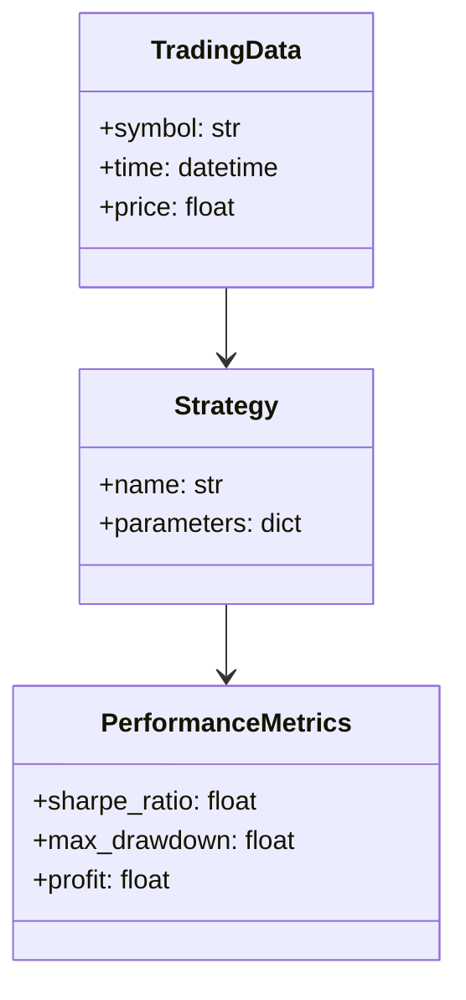

                 


# 《金融高频交易策略性能评估框架》

## 关键词：高频交易、策略评估、金融算法、性能分析、交易系统

## 摘要：  
本文详细探讨了金融高频交易策略的性能评估框架，从背景、核心概念、评估维度、技术实现到系统架构设计，系统性地分析了高频交易策略的评估方法。通过数学模型和实际案例，本文提出了一个全面的评估框架，帮助交易者和系统设计者更好地理解和优化高频交易策略的性能。

---

# 正文

## 第一章：高频交易策略概述

### 1.1 高频交易的定义与特点

高频交易（High-Frequency Trading, HFT）是一种通过计算机算法在极短时间内完成大量交易的策略。其特点包括：

- **高速性**：依赖高性能计算机和低延迟网络，能够在几毫秒内完成交易。
- **自动化**：交易决策完全由算法驱动，无需人工干预。
- **短期性**：交易时间窗口通常在几秒到几分钟内。
- **高频性**：短时间内生成大量订单，捕捉微小价格波动。

### 1.2 高频交易策略的类型

高频交易策略可以分为以下几类：

#### 1.2.1 算法交易策略
- 基于数学模型和统计分析，寻找市场中的短期价格偏差。
- 例如，利用套利机会或统计套利模型。

#### 1.2.2 统计套利策略
- 利用资产价格的统计特性，通过多因子模型构建交易信号。
- 例如，均值回归策略和动量策略。

#### 1.2.3 裱形套利策略
- 利用不同市场或资产之间的价差进行套利。
- 例如，跨市场套利和跨期套利。

### 1.3 高频交易的市场影响

高频交易对市场的影响复杂且多面：

- **流动性提供**：高频交易者通过频繁报价增加市场流动性。
- **价格发现**：高频交易能够快速反映市场信息，促进价格发现。
- **市场波动**：可能导致市场波动加剧，甚至引发闪崩。

---

## 第二章：高频交易策略性能评估的核心概念

### 2.1 问题背景与问题描述

高频交易策略的性能评估是交易系统设计中的核心问题。由于高频交易的高速性和复杂性，传统评估方法难以满足需求。如何在短时间内准确评估策略的收益、风险和执行质量，成为亟待解决的难题。

### 2.2 核心概念与原理

#### 2.2.1 性能评估的维度

高频交易策略的性能可以从以下几个维度进行评估：

1. **收益**：策略的盈利能力，包括 Sharpe 比率、年化收益等。
2. **风险**：策略的波动性和最大回撤。
3. **执行质量**：交易执行的延迟和成本。

#### 2.2.2 评估指标的选择

选择合适的评估指标是构建评估框架的关键。常用的指标包括：

- **夏普比率**：衡量单位风险下的超额收益。
- **回撤**：策略的最大亏损幅度。
- **胜率**：策略的盈利交易次数占比。

#### 2.2.3 框架的构建逻辑

评估框架的构建需要遵循以下步骤：

1. **数据采集**：收集高频交易数据，包括价格、成交量等。
2. **信号生成**：通过算法生成交易信号。
3. **交易执行**：模拟交易过程，计算收益和风险指标。
4. **结果分析**：结合多维度指标对策略进行综合评估。

### 2.3 核心概念对比分析

通过对比分析不同策略和指标的特点，可以帮助我们更好地理解评估框架的设计逻辑。

#### 2.3.1 不同策略类型的特点对比

| 策略类型 | 信号生成 | 执行频率 | 风险特征 |
|----------|-----------|----------|----------|
| 算法交易 | 统计模型驱动 | 高频 | 高风险 |
| 统计套利 | 均值回归模型 | 中频 | 中风险 |
| 裱形套利 | 跨市价差套利 | 低频 | 低风险 |

#### 2.3.2 不同评估指标的优劣势对比

| 指标 | 优势 | 劣势 |
|------|------|------|
| 夏普比率 | 全面衡量收益与风险的平衡 | 易受极端值影响 |
| 回撤 | 衡量策略的最大亏损 | 易受样本选择影响 |
| 胜率 | 易计算，适合策略筛选 | 易受噪声影响 |

#### 2.3.3 实体关系图（ER图）


---

## 第三章：高频交易策略性能评估的算法与数学模型

### 3.1 评估算法原理

#### 3.1.1 算法流程


#### 3.1.2 数学模型与公式

1. **收益率计算**：
   $$ R = \frac{P_{t+1} - P_t}{P_t} \times 100\% $$

2. **夏普比率**：
   $$ Sharpe Ratio = \frac{E[R - R_f]}{\sigma} $$

3. **最大回撤**：
   $$ MDD = \max_{i}( \max_{j \leq i} P_j) - P_i $$

### 3.2 算法实现的代码示例

#### 3.2.1 计算夏普比率

```python
import numpy as np

def calculate_sharpe_ratio(returns, risk_free_rate):
    # 计算超额收益
    excess_returns = returns - risk_free_rate
    # 计算夏普比率
    sharpe_ratio = np.mean(excess_returns) / np.std(excess_returns)
    return sharpe_ratio
```

#### 3.2.2 计算最大回撤

```python
def calculate_max_drawdown(returns):
    # 累积收益
    cumulative = np.cumsum(returns)
    # 最大回撤
    max_drawdown = 0
    for i in range(len(cumulative)):
        for j in range(i+1, len(cumulative)):
            drawdown = (cumulative[i] - cumulative[j])
            if drawdown > max_drawdown:
                max_drawdown = drawdown
    return max_drawdown
```

---

## 第四章：系统架构设计

### 4.1 问题场景介绍

高频交易系统的性能评估需要一个高效的架构设计，包括数据采集、策略执行和结果分析模块。

### 4.2 系统功能设计

#### 4.2.1 领域模型（领域类图）



#### 4.2.2 系统架构设计（系统架构图）


---

## 第五章：项目实战与总结

### 5.1 环境安装

- 数据源：使用交易所API获取高频数据。
- 工具：Python（Pandas、NumPy、Matplotlib）。

### 5.2 核心实现代码

#### 5.2.1 数据处理

```python
import pandas as pd

def load_data(symbol, start, end):
    # 获取数据
    data = pd.DataFrame(...)
    return data
```

#### 5.2.2 策略回测

```python
def backtest(strategy, data):
    returns = []
    for i in range(len(data)):
        # 计算信号
        signal = strategy.generate_signal(data[i])
        # 执行交易
        return_ = strategy.execute_trade(signal)
        returns.append(return_)
    return returns
```

### 5.3 案例分析

假设我们有一个简单的均值回归策略，回测结果显示夏普比率为2.5，最大回撤为-5%。

### 5.4 总结

高频交易策略的性能评估需要综合考虑收益、风险和执行质量。本文提出的框架能够帮助交易者和系统设计者更好地优化交易策略。

---

## 作者信息

作者：AI天才研究院/AI Genius Institute & 禅与计算机程序设计艺术 /Zen And The Art of Computer Programming

---

### 注意事项

1. 避免过度依赖单一指标，结合多维度指标进行评估。
2. 数据质量对评估结果影响重大，确保数据清洗和预处理。
3. 系统架构设计需考虑高可用性和可扩展性。

通过本文的分析，读者可以全面理解高频交易策略的性能评估框架，并在实际应用中进行优化和改进。

