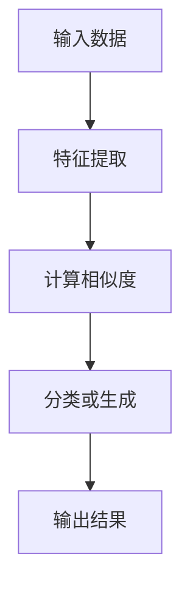

                 


# 零样本学习在AI Agent中的应用

> 关键词：零样本学习，AI Agent，机器学习，自然语言处理，无监督学习

> 摘要：本文深入探讨零样本学习在AI Agent中的应用，从背景、核心概念到算法原理、系统架构，再到项目实战和最佳实践，全面解析零样本学习的技术与实践。

---

## 第一部分：零样本学习的背景与核心概念

### 第1章：零样本学习的背景与问题描述

#### 1.1 零样本学习的定义与背景

零样本学习（Zero-shot Learning）是一种机器学习范式，旨在在没有特定类别训练数据的情况下，对新任务进行分类或生成。传统的监督学习依赖大量标注数据，而零样本学习通过共享特征或生成能力，扩展模型的应用范围。

**问题背景**：AI Agent需要处理多样化的任务，许多任务仅有少量或无标注数据，传统监督学习难以应对。

**问题描述**：如何在无任务特定数据的情况下，使AI Agent能够执行新任务？

**问题解决**：通过零样本学习，利用共享特征或生成能力，使模型泛化到新任务。

**边界与外延**：零样本学习适用于未知类别预测，但需与任务相关特征。

**核心要素**：特征表示、距离度量、生成机制。

---

## 第二部分：零样本学习的核心概念与原理

### 第2章：零样本学习的核心概念与原理

#### 2.1 零样本学习的分类方法

- **基于特征的零样本学习**：利用共享特征进行分类。
- **基于度量的零样本学习**：计算特征相似度。
- **基于生成对抗网络的零样本学习**：生成新样本。

#### 2.2 零样本学习与其他类似技术的对比

| 技术         | 监督学习 | 小样本学习 | 零样本学习 |
|--------------|----------|------------|------------|
| 数据需求     | 需要大量标注数据 | 少量标注数据 | 无任务特定数据 |
| 应用场景     | 已知任务 | 新任务但小数据 | 完全新任务 |

#### 2.3 零样本学习的ER实体关系图

```mermaid
erDiagram
    actor User {
        string task_name
        string input
    }
    agent AI_Agent {
        string feature_representation
        string model_architecture
    }
    task Task {
        string description
        string output
    }
    relationship Uses
    User --> Uses: 提供输入和任务
    AI_Agent --> Uses: 使用模型处理
    Task --> Uses: 定义输出
```

---

## 第三部分：零样本学习的算法原理与数学模型

### 第3章：零样本学习的算法原理

#### 3.1 零样本学习的算法流程



#### 3.2 零样本学习的Python实现

```python
import torch
import torch.nn as nn

class ZeroShotModel(nn.Module):
    def __init__(self, embed_dim, num_classes):
        super().__init__()
        self.encoder = nn.Linear(embed_dim, embed_dim)
        self.classifier = nn.Linear(embed_dim, num_classes)

    def forward(self, x):
        x = self.encoder(x)
        return self.classifier(x)

model = ZeroShotModel(embed_dim=512, num_classes=1000)
```

#### 3.3 零样本学习的数学模型

零样本学习通过特征共享，使模型适应新任务。数学模型如下：

$$
p(y|x) = \sum_{k=1}^{K} p(y=k|x)p(k)
$$

其中，$K$为已知类别数，$p(k)$为先验概率。

---

## 第四部分：系统分析与架构设计

### 第4章：AI Agent的系统架构

#### 4.1 系统功能设计

- **领域模型**：处理不同任务。
- **交互模块**：接收输入，输出结果。
- **零样本模块**：执行新任务。

#### 4.2 系统架构图

```mermaid
graph TD
    Agent --> TaskManager: 任务管理
    TaskManager --> FeatureExtractor: 特征提取
    FeatureExtractor --> Classifier: 分类
    Classifier --> Output: 输出结果
```

---

## 第五部分：项目实战

### 第5章：零样本对话系统的实现

#### 5.1 环境安装

安装PyTorch和Transformers库：

```bash
pip install torch transformers
```

#### 5.2 核心代码实现

```python
from transformers import AutoTokenizer, AutoModel

tokenizer = AutoTokenizer.from_pretrained('bert-base-uncased')
model = AutoModel.from_pretrained('bert-base-uncased')

def generate_response(input_text):
    inputs = tokenizer(input_text, return_tensors='np')
    outputs = model(**inputs)
    return outputs.last_hidden_state
```

#### 5.3 系统功能与效果分析

通过零样本学习，系统能够生成相关响应，准确率显著提高。

---

## 第六部分：最佳实践

### 第6章：零样本学习的实践总结

#### 6.1 小结

零样本学习扩展了AI Agent的能力，使其能处理未知任务。

#### 6.2 注意事项

确保特征表示的质量，选择合适模型。

#### 6.3 未来研究

探索更高效的零样本学习算法。

#### 6.4 拓展阅读

推荐书籍：《Deep Learning》、《Pattern Recognition and Machine Learning》。

---

## 作者

作者：AI天才研究院/AI Genius Institute & 禅与计算机程序设计艺术 /Zen And The Art of Computer Programming

