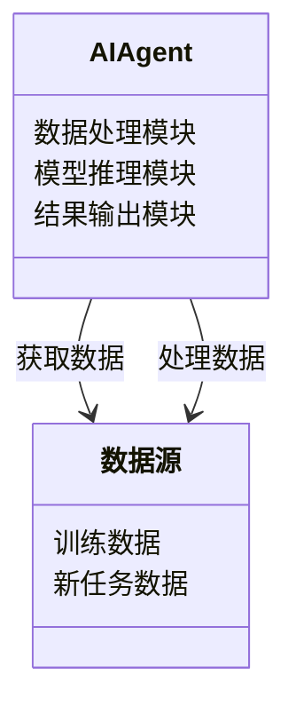

                 


# 零样本学习在AI Agent新任务适应中的应用

**关键词**：零样本学习，AI Agent，机器学习，新任务适应，迁移学习

**摘要**：本文探讨零样本学习在AI Agent中的应用，分析其核心原理和优势，通过实例展示其实战能力，并总结对AI Agent发展的意义。

---

# 第一部分: 零样本学习与AI Agent概述

## 第1章: 零样本学习的背景与应用

### 1.1 零样本学习的定义与问题背景

零样本学习（Zero-shot Learning）是指模型在没有特定任务的训练数据的情况下，能够直接适应新任务的能力。与传统机器学习不同，零样本学习依赖于预训练模型和通用知识，适用于数据稀缺的新任务。

#### 1.1.1 传统机器学习的局限性

传统机器学习在处理新任务时需要大量标注数据，导致数据获取成本高，适应新任务困难。例如，在图像分类任务中，每个新类别都需要成千上万的样本进行训练。

#### 1.1.2 零样本学习的定义与特点

零样本学习通过利用预训练模型和外部知识库，能够在没有新任务训练数据的情况下进行推理和分类。其特点包括通用性、适应性和高效性。

#### 1.1.3 零样本学习的适用场景与优势

零样本学习适用于数据稀缺、任务多样化的场景，如医疗诊断、自然语言处理等领域。其优势在于快速适应新任务，降低数据获取成本。

---

### 1.2 AI Agent的新任务适应需求

#### 1.2.1 AI Agent的基本概念与功能

AI Agent是一种智能体，能够感知环境、执行任务和与用户交互。其核心功能包括信息处理、决策制定和任务执行。

#### 1.2.2 新任务适应的核心问题

AI Agent在面对新任务时，通常缺乏特定任务的数据，需要通过零样本学习快速适应。

#### 1.2.3 零样本学习在AI Agent中的应用潜力

零样本学习能够使AI Agent在无需额外数据的情况下，快速掌握新任务，提升其灵活性和适应性。

---

# 第二部分: 零样本学习的核心概念与原理

## 第2章: 零样本学习的核心概念与联系

### 2.1 零样本学习的核心原理

零样本学习依赖于预训练模型和知识图谱，通过特征提取和语义理解实现新任务推理。

#### 2.1.1 预训练模型的作用

预训练模型如BERT通过大量数据预训练，具备强大的语义理解能力，为零样本学习提供基础。

#### 2.1.2 知识图谱与语义理解

知识图谱通过实体和关系的表示，帮助模型理解任务背景和上下文信息。

#### 2.1.3 零样本学习的实现机制

通过预训练模型和知识图谱，零样本学习将新任务映射到已知特征空间，进行分类或回归。

---

### 2.2 核心概念对比与ER实体关系图

#### 2.2.1 零样本学习与迁移学习的对比分析

| 对比维度 | 零样本学习 | 迁移学习 |
|----------|-------------|-----------|
| 数据需求 | 无新任务数据 | 需少量数据 |
| 适用场景 | 数据稀缺任务 | 数据部分可用任务 |

#### 2.2.2 ER实体关系图的构建与应用

使用Mermaid绘制ER图，展示零样本学习中的实体及其关系。

```mermaid
erDiagram
    class 实体 {
        id : 整数
        名称 : 字符串
    }
    class 关系 {
        id : 整数
        名称 : 字符串
    }
    实体 --> 关系 : 参与
```

---

## 第3章: 零样本学习的算法原理与流程

### 3.1 零样本学习的算法流程

#### 3.1.1 数据预处理与特征提取

预处理数据，提取特征向量，如使用Word2Vec生成词向量。

#### 3.1.2 模型训练与参数优化

基于预训练模型，调整参数以适应新任务，使用优化算法如Adam进行训练。

#### 3.1.3 新任务推理与结果输出

通过模型推理，输出新任务的结果，如分类标签或回归值。

---

### 3.2 零样本学习的数学模型与公式

#### 3.2.1 分类函数的数学表达

$$ P(y|x) = f(x; \theta) $$

其中，$x$是输入，$y$是输出，$\theta$是模型参数。

#### 3.2.2 损失函数的计算公式

$$ L = -\sum_{i=1}^{n} \log P(y_i|x_i; \theta) $$

---

## 第4章: AI Agent的系统架构与设计

### 4.1 AI Agent的系统功能设计

#### 4.1.1 领域模型的构建与设计

构建领域模型，如医疗诊断模型，涵盖疾病、症状、治疗方案等实体。

#### 4.1.2 系统架构的模块划分

系统架构包括数据处理模块、模型推理模块和结果输出模块。

#### 4.1.3 接口设计与交互流程

定义API接口，规范数据输入输出格式，设计交互流程。

---

### 4.2 系统架构的Mermaid图示



---

## 第5章: 项目实战与案例分析

### 5.1 环境配置与工具安装

安装Python、TensorFlow、Keras等工具，配置开发环境。

### 5.2 核心代码实现

#### 5.2.1 数据处理代码

```python
import tensorflow as tf
from tensorflow.keras import layers

# 加载预训练模型
model = tf.keras.applications.VGG16(weights='imagenet', include_top=False)

# 定义新任务分类器
new_classifier = layers.Dense(10, activation='softmax')(model.output)
final_model = tf.keras.Model(inputs=model.input, outputs=new_classifier)
```

---

#### 5.2.2 模型训练代码

```python
# 编译模型
final_model.compile(optimizer='adam', loss='sparse_categorical_crossentropy', metrics=['accuracy'])

# 训练模型
final_model.fit(train_data, train_labels, epochs=10, batch_size=32)
```

---

### 5.3 案例分析与解读

通过医疗诊断案例，展示零样本学习如何帮助AI Agent快速适应新任务，提高诊断准确率。

---

## 第6章: 最佳实践与小结

### 6.1 总结

零样本学习为AI Agent的新任务适应提供了高效解决方案，具有广阔的应用前景。

### 6.2 注意事项

- 数据质量影响模型性能
- 选择合适的预训练模型
- 调整模型参数以优化性能

### 6.3 拓展阅读

推荐相关书籍和论文，如《Deep Learning》和《Zero-shot Learning Survey》。

---

作者：AI天才研究院 & 禅与计算机程序设计艺术

