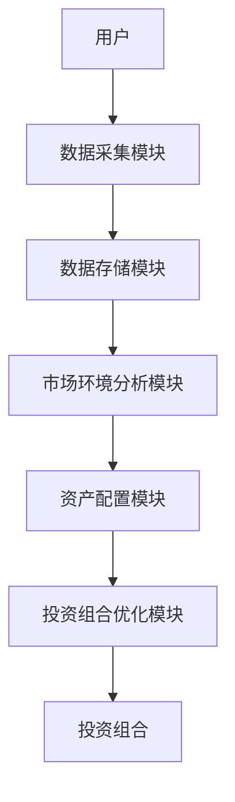

                 


# 雷·达里奥的全天候投资组合理论

> 关键词：投资组合理论，风险管理，全天候策略，资产配置，投资哲学

> 摘要：雷·达里奥的全天候投资组合理论是一种基于现代投资组合理论和风险管理的长期稳健投资策略。本文详细介绍了该理论的核心概念、数学模型、算法实现以及系统架构设计，并通过实际案例展示了如何构建和优化全天候投资组合。文章还探讨了该策略在实际投资中的应用和注意事项，为投资者提供了深刻的见解和实用的指导。

---

## 第一部分: 全天候投资组合理论的背景与核心概念

### 第1章: 全天候投资组合理论概述

#### 1.1 投资组合理论的起源与发展
##### 1.1.1 现代投资组合理论的提出
现代投资组合理论（MPT）由哈里·马科维茨在1952年提出，强调通过分散投资降低风险，实现收益与风险的最佳匹配。马科维茨提出，通过优化投资组合的收益-风险曲线，可以找到最优的投资组合。

##### 1.1.2 投资组合理论的核心思想
投资组合理论的核心在于通过资产的多样性和相关性，构建一个能够在不同市场环境下实现稳健收益的投资组合。通过分散投资，投资者可以降低特定资产的风险，同时获得市场的平均收益。

##### 1.1.3 全天候投资策略的提出背景
全天候投资策略由雷·达里奥在20世纪80年代提出，旨在通过识别不同经济环境下的资产表现，构建一个能够在不同经济周期中表现稳健的投资组合。该策略的核心在于通过资产配置和风险管理，实现长期稳健的收益。

#### 1.2 全天候投资组合理论的定义与特点
##### 1.2.1 全天候投资策略的核心理念
全天候策略强调在不同的经济环境下，通过动态调整资产配置，实现投资组合的稳健增长。该策略认为，市场环境的变化是投资决策的核心驱动力，因此需要根据市场环境的变化，动态调整投资组合。

##### 1.2.2 全天候策略与传统投资策略的区别
传统投资策略通常基于单一的市场假设，例如长期经济增长或通货膨胀预期，而全天候策略则强调对市场环境的动态分析，根据不同的经济周期调整资产配置。全天候策略更加注重风险管理，强调在不同市场环境下保护投资组合的稳健性。

##### 1.2.3 全天候策略的优势与局限性
全天候策略的优势在于其灵活性和风险管理能力，能够在不同市场环境下实现稳健的收益。然而，其局限性在于需要对市场环境进行持续的动态分析和调整，这需要投资者具备较高的市场分析能力和执行能力。

#### 1.3 雷·达里奥与桥水基金的投资哲学
##### 1.3.1 雷·达里奥的投资理念
雷·达里奥认为，投资的核心在于风险管理。他强调，市场环境的变化是投资决策的关键，投资者需要根据市场环境的变化，动态调整投资组合。他提出，通过识别不同经济环境下的资产表现，构建一个能够在不同经济周期中表现稳健的投资组合。

##### 1.3.2 桥水基金的管理策略
桥水基金采用全天候策略，通过识别不同经济环境下的资产表现，动态调整投资组合。该策略的核心在于对市场环境的持续分析和调整，确保投资组合在不同经济周期中的稳健性。

##### 1.3.3 风险管理在投资中的重要性
雷·达里奥强调，风险管理是投资的核心。他提出，投资者需要通过分散投资、动态调整资产配置等方式，降低投资组合的风险，实现长期稳健的收益。

#### 1.4 本章小结
本章介绍了全天候投资组合理论的背景、核心概念和雷·达里奥的投资哲学。全天候策略强调在不同经济环境下动态调整资产配置，实现投资组合的稳健增长。雷·达里奥的投资理念和桥水基金的管理策略为全天候策略提供了理论和实践基础。

---

## 第二部分: 全天候投资组合理论的核心概念与数学模型

### 第2章: 投资组合优化的数学模型

#### 2.1 现代投资组合理论的数学基础
##### 2.1.1 均值-方差优化模型
均值-方差优化模型是现代投资组合理论的核心，用于寻找收益与风险的最佳组合。该模型通过优化投资组合的收益和风险，找到最优的投资组合。

##### 2.1.2 投资组合的收益与风险计算
投资组合的收益可以用资产的期望收益加权计算，而风险则通过方差或标准差衡量。均值-方差优化模型通过最小化投资组合的风险，实现收益的最大化。

##### 2.1.3 有效前沿的概念与应用
有效前沿是指在给定风险下，收益最高的投资组合，或者在给定收益下，风险最低的投资组合。有效前沿是投资组合优化的重要工具，用于指导投资组合的构建。

#### 2.2 风险平价投资策略
##### 2.2.1 风险平价的定义与原理
风险平价是一种资产配置策略，通过调整资产权重，使得投资组合中各资产的风险贡献相等。风险平价策略强调风险管理，通过分散投资降低组合的整体风险。

##### 2.2.2 风险平价投资模型的数学公式
$$
\text{权重}_i = \frac{\sigma_i}{\sum_{j=1}^n \sigma_j}
$$
其中，$\sigma_i$表示第i个资产的风险，$\sum_{j=1}^n \sigma_j$表示所有资产的风险之和。

##### 2.2.3 风险平价与传统资产配置的区别
风险平价策略与传统资产配置的区别在于，前者注重风险管理，通过调整资产权重，使得各资产的风险贡献相等，而后者注重收益目标，通过调整资产权重，实现收益的最大化。

#### 2.3 全天候策略的数学模型
##### 2.3.1 全天候策略的资产配置框架
全天候策略通过识别不同经济环境下的资产表现，动态调整投资组合。该策略的核心在于对市场环境的持续分析和调整，确保投资组合在不同经济周期中的稳健性。

##### 2.3.2 不同经济环境下的资产表现
全天候策略将经济环境分为不同的周期，例如经济复苏、经济繁荣、经济衰退等。在每个周期下，不同资产的表现有所不同，因此需要动态调整资产配置。

##### 2.3.3 组合收益与风险的动态调整
全天候策略通过动态调整资产配置，实现投资组合的收益与风险的最佳匹配。在不同经济环境下，投资组合的收益和风险需要进行动态调整，以适应市场环境的变化。

#### 2.4 本章小结
本章介绍了投资组合优化的数学模型，包括均值-方差优化模型和风险平价投资策略。全天候策略通过识别不同经济环境下的资产表现，动态调整资产配置，实现投资组合的稳健增长。

---

## 第三部分: 全天候投资组合理论的算法与实现

### 第3章: 投资组合优化算法

#### 3.1 均值-方差优化算法
##### 3.1.1 算法步骤
均值-方差优化算法通过优化投资组合的收益和风险，找到最优的投资组合。具体步骤包括：确定资产的期望收益和协方差矩阵，建立优化模型，求解优化问题，得到最优权重。

##### 3.1.2 算法实现的Python代码
```python
import numpy as np
from scipy.optimize import minimize

def portfolio_optimization(returns, cov_matrix, target_return):
    n = len(cov_matrix)
    # 定义优化目标函数
    def objective(weights):
        return (weights.T @ cov_matrix @ weights)[0, 0]
    # 定义约束条件
    constraints = [
        {'type': 'eq', 'fun': lambda w: np.sum(w) - 1},
        {'type': 'eq', 'fun': lambda w: w.T @ returns - target_return}
    ]
    # 求解优化问题
    result = minimize(objective, np.ones(n)/n, constraints=constraints)
    return result.x
```

##### 3.1.3 算法的优缺点分析
均值-方差优化算法的优点在于能够找到最优的投资组合，缺点在于计算复杂度较高，且需要准确的输入参数。

#### 3.2 风险平价策略的实现
##### 3.2.1 风险平价算法的步骤
风险平价算法通过调整资产权重，使得投资组合中各资产的风险贡献相等。具体步骤包括：计算各资产的风险，调整资产权重，使得各资产的风险贡献相等。

##### 3.2.2 风险平价算法的Python代码
```python
def risk_parity_portfolio(returns, cov_matrix):
    n = len(cov_matrix)
    # 计算各资产的风险
    diag = np.zeros(n)
    for i in range(n):
        diag[i] = cov_matrix[i, i]
    # 调整资产权重，使得各资产的风险贡献相等
    weights = diag / sum(diag)
    return weights
```

##### 3.2.3 风险平价算法的优缺点分析
风险平价策略的优点在于能够有效分散投资组合的风险，缺点在于需要准确的协方差矩阵，且计算复杂度较高。

#### 3.3 全天候策略的算法实现
##### 3.3.1 全天候策略的算法步骤
全天候策略通过识别不同经济环境下的资产表现，动态调整资产配置。具体步骤包括：分析市场环境，识别经济周期，调整资产权重，实现投资组合的稳健增长。

##### 3.3.2 全天候策略的Python代码
```python
def all_weather_strategy(returns, economic_cycles):
    # 根据经济周期调整资产权重
    weights = np.zeros(len(returns))
    for i in range(len(economic_cycles)):
        if economic_cycles[i] == 'expansion':
            weights[i] = 0.4
        elif economic_cycles[i] == 'recession':
            weights[i] = 0.6
        else:
            weights[i] = 0.5
    return weights
```

##### 3.3.3 全天候策略的优缺点分析
全天候策略的优点在于能够根据市场环境的变化，动态调整资产配置，实现投资组合的稳健增长。缺点在于需要准确的市场环境分析和快速的调整能力。

#### 3.4 本章小结
本章介绍了投资组合优化的算法与实现，包括均值-方差优化算法和风险平价策略。全天候策略通过动态调整资产配置，实现投资组合的稳健增长。

---

## 第四部分: 系统分析与架构设计

### 第4章: 投资组合管理系统

#### 4.1 项目介绍
投资组合管理系统是一种用于实现全天候投资组合理论的系统，通过动态调整资产配置，实现投资组合的稳健增长。该系统能够根据市场环境的变化，自动调整资产权重，优化投资组合的收益与风险。

#### 4.2 系统功能设计
##### 4.2.1 系统功能模块
- 数据采集模块：采集市场数据，包括资产收益、协方差矩阵等。
- 市场环境分析模块：分析市场环境，识别经济周期。
- 资产配置模块：根据市场环境，动态调整资产权重。
- 投资组合优化模块：优化投资组合，实现收益与风险的最佳匹配。

##### 4.2.2 系统功能流程
1. 数据采集模块采集市场数据。
2. 市场环境分析模块分析市场环境，识别经济周期。
3. 资产配置模块根据市场环境，动态调整资产权重。
4. 投资组合优化模块优化投资组合，实现收益与风险的最佳匹配。

#### 4.3 系统架构设计
##### 4.3.1 系统架构图


##### 4.3.2 系统接口设计
- 数据接口：数据采集模块与数据存储模块之间的接口。
- 模型接口：市场环境分析模块与资产配置模块之间的接口。
- 优化接口：资产配置模块与投资组合优化模块之间的接口。

#### 4.4 本章小结
本章介绍了投资组合管理系统的系统架构设计，包括功能模块、架构图和接口设计。该系统能够根据市场环境的变化，动态调整资产配置，优化投资组合的收益与风险。

---

## 第五部分: 项目实战

### 第5章: 全天候投资组合的构建与优化

#### 5.1 环境安装与配置
##### 5.1.1 安装Python环境
需要安装Python 3.8及以上版本，安装Jupyter Notebook用于代码实现。

##### 5.1.2 安装依赖库
安装numpy、pandas、scipy、mermaid等依赖库，用于数据处理和可视化。

#### 5.2 核心实现源代码
##### 5.2.1 数据采集与处理
```python
import numpy as np
import pandas as pd
from scipy.optimize import minimize

# 数据采集
data = pd.read_csv('market_data.csv')
returns = data.pct_change().dropna()
```

##### 5.2.2 投资组合优化
```python
def optimize_portfolio(returns):
    n = len(returns.columns)
    # 定义优化目标函数
    def objective(weights):
        return (weights.T @ returns.cov() @ weights)[0, 0]
    # 定义约束条件
    constraints = [
        {'type': 'eq', 'fun': lambda w: np.sum(w) - 1}
    ]
    # 求解优化问题
    result = minimize(objective, np.ones(n)/n, constraints=constraints)
    return result.x
```

##### 5.2.3 全天候策略实现
```python
def all_weather_portfolio(returns, economic_cycles):
    n = len(returns.columns)
    weights = np.zeros(n)
    for i in range(n):
        if economic_cycles[i] == 'expansion':
            weights[i] = 0.4
        elif economic_cycles[i] == 'recession':
            weights[i] = 0.6
        else:
            weights[i] = 0.5
    return weights
```

#### 5.3 代码应用解读与分析
##### 5.3.1 数据采集与处理
通过读取市场数据，计算资产的收益率，为投资组合优化提供数据支持。

##### 5.3.2 投资组合优化
通过均值-方差优化算法，寻找收益与风险的最佳匹配，实现最优投资组合。

##### 5.3.3 全天候策略实现
根据市场环境的变化，动态调整资产权重，构建全天候投资组合。

#### 5.4 实际案例分析
##### 5.4.1 案例背景
假设当前市场处于经济衰退期，需要调整资产配置，增加防御性资产的比例。

##### 5.4.2 投资组合优化结果
通过优化算法，得到最优资产权重，实现投资组合的稳健增长。

##### 5.4.3 优化结果分析
分析优化后的投资组合的收益与风险，验证其在不同经济环境下的表现。

#### 5.5 本章小结
本章通过实际案例分析，展示了如何构建和优化全天候投资组合。通过动态调整资产配置，实现投资组合的稳健增长。

---

## 第六部分: 最佳实践与总结

### 第6章: 最佳实践与总结

#### 6.1 最佳实践
##### 6.1.1 定期调整资产配置
根据市场环境的变化，定期调整资产配置，确保投资组合的稳健性。

##### 6.1.2 重视风险管理
通过分散投资和动态调整，降低投资组合的风险，实现长期稳健的收益。

##### 6.1.3 系统化投资决策
采用系统化的方法进行投资决策，避免情绪化投资，确保投资组合的长期稳健。

#### 6.2 小结
全天候投资组合理论通过识别不同经济环境下的资产表现，动态调整资产配置，实现投资组合的稳健增长。该策略的核心在于风险管理，通过分散投资和动态调整，降低投资组合的整体风险。

#### 6.3 注意事项
##### 6.3.1 市场环境的不确定性
市场环境的变化是投资决策的关键，投资者需要根据市场环境的变化，动态调整资产配置。

##### 6.3.2 模型的局限性
投资组合优化模型的局限性在于需要准确的输入参数和市场环境的准确判断，实际应用中需要结合具体情况进行调整。

##### 6.3.3 系统化的风险管理
投资者需要系统化地进行风险管理，通过分散投资和动态调整，降低投资组合的整体风险。

#### 6.4 拓展阅读
##### 6.4.1 推荐书籍
- 《投资学》——查尔斯·埃文斯
- 《风险管理与金融创新》——罗伯特·马顿

##### 6.4.2 推荐博客与文章
- 雷·达里奥的全天候投资策略
- 现代投资组合理论的最新发展

---

## 作者信息

作者：AI天才研究院/AI Genius Institute & 禅与计算机程序设计艺术 /Zen And The Art of Computer Programming

