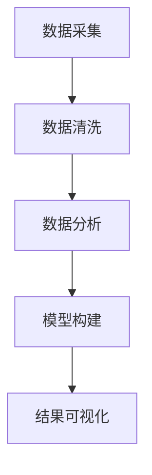
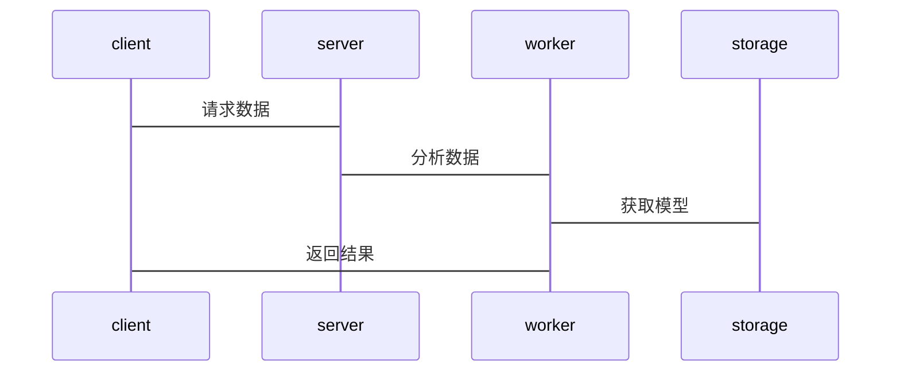

                 


# 霍华德·马克斯的信贷周期投资策略

> 关键词：信贷周期，投资策略，霍华德·马克斯，经济周期，金融分析

> 摘要：本文深入分析了霍华德·马克斯的信贷周期投资策略，探讨了信贷周期的核心概念、驱动因素、数学模型以及在实际投资中的应用。通过系统化的分析和案例研究，本文为投资者提供了基于信贷周期的决策支持和风险管理策略。

---

## 第一部分: 信贷周期的核心概念与理论基础

### 第1章: 信贷周期的基本概念

#### 1.1 信贷周期的定义与特征

**1.1.1 信贷周期的定义**  
信贷周期是指信贷市场从繁荣到衰退，再从衰退到复苏的周期性波动过程。它通常与经济周期密切相关，是金融市场的重要驱动因素之一。

**1.1.2 信贷周期的核心特征**  
- **波动性**：信贷周期表现为扩张和收缩交替进行的周期性波动。
- **非线性**：信贷周期的变化并非简单的线性关系，而是受到多种因素的复杂影响。
- **周期性**：信贷周期具有明显的周期性特征，包括扩张、繁荣、衰退和复苏四个阶段。

**1.1.3 信贷周期与经济周期的关系**  
信贷周期是经济周期的重要组成部分，信贷市场的波动直接影响实体经济的运行。例如，信贷扩张通常伴随着经济繁荣，而信贷收缩则可能导致经济衰退。

#### 1.2 信贷周期的历史发展

**1.2.1 信贷周期的历史案例分析**  
信贷周期并非孤立现象，历史上多次金融危机都与信贷周期密切相关。例如：
- 1929年的美国经济大萧条：源于信贷过度扩张和股市泡沫的破裂。
- 2008年的全球金融危机：源于次级抵押贷款市场的过度扩张和信贷违约。

**1.2.2 信贷周期的演变规律**  
信贷周期的演变通常包括以下几个阶段：
1. **信贷扩张阶段**：信贷供给增加，资产价格上涨。
2. **信贷繁荣阶段**：信贷需求旺盛，资产价格达到顶峰。
3. **信贷收缩阶段**：信贷供给减少，资产价格下跌。
4. **信贷复苏阶段**：信贷市场逐渐恢复，资产价格企稳。

**1.2.3 信贷周期与金融危机的关系**  
信贷周期的波动往往会导致金融市场的剧烈波动，甚至引发金融危机。例如，20世纪80年代的拉美债务危机、20世纪90年代的亚洲金融危机，以及21世纪初的全球金融危机，都与信贷周期密切相关。

#### 1.3 霍华德·马克斯的投资理念

**1.3.1 马克斯的投资哲学**  
霍华德·马克斯是著名投资家，其投资理念的核心是“逆向投资”。他认为，市场情绪的波动会导致资产价格的周期性变化，投资者应该在市场恐慌时买入，在市场狂热时卖出。

**1.3.2 信贷周期在投资中的作用**  
马克斯认为，信贷周期是影响资产价格波动的重要因素。通过分析信贷周期，投资者可以更好地判断市场的周期性波动，从而做出更明智的投资决策。

**1.3.3 马克斯的投资策略总结**  
马克斯的投资策略主要包括以下几点：
1. **逆向投资**：在市场低迷时投资，市场高涨时退出。
2. **价值投资**：寻找被市场低估的资产。
3. **风险管理**：避免过度杠杆和高风险投资。

---

### 第2章: 信贷周期的核心驱动因素

#### 2.1 利率与信贷周期

**2.1.1 利率对信贷周期的影响**  
利率是信贷周期的重要驱动因素。低利率通常会刺激信贷需求，推动信贷扩张；高利率则会抑制信贷需求，导致信贷收缩。

**2.1.2 主要经济体的利率政策分析**  
美联储、欧洲央行等主要央行的利率政策对全球信贷周期有重要影响。例如，美联储的量化宽松政策在2008年金融危机后推动了全球信贷的扩张。

**2.1.3 利率与资产价格的关系**  
低利率环境下，债券、股票等资产价格上涨，而高利率环境下，资产价格通常会下跌。

#### 2.2 市场情绪与信贷周期

**2.2.1 市场情绪的定义与测量**  
市场情绪是指投资者对市场的看法和预期，通常通过市场参与度、成交量、波动率等指标来衡量。

**2.2.2 市场情绪对信贷周期的影响**  
市场情绪的波动会导致信贷市场的周期性变化。例如，市场乐观时，信贷需求增加；市场悲观时，信贷需求减少。

**2.2.3 市场情绪的周期性变化**  
市场情绪通常表现为周期性波动，与信贷周期密切相关。例如，市场情绪从乐观到悲观的转变通常对应信贷周期的扩张到收缩。

#### 2.3 经济基本面与信贷周期

**2.3.1 经济基本面的定义**  
经济基本面是指影响经济运行的基础因素，包括GDP增长率、就业率、通胀率等。

**2.3.2 经济基本面与信贷周期的关系**  
经济基本面的波动直接影响信贷周期。例如，经济繁荣时，信贷需求增加；经济衰退时，信贷需求减少。

**2.3.3 经济基本面的周期性分析**  
通过分析经济基本面的周期性变化，可以更好地理解信贷周期的波动规律。例如，经济周期的波动可以通过GDP增长率的变化来预测信贷周期的变化。

---

### 第3章: 信贷周期的数学模型与算法

#### 3.1 信贷周期的数学模型

**3.1.1 时间序列模型**  
时间序列模型是研究信贷周期的重要工具。常用的时间序列模型包括ARIMA（自回归积分滑动平均模型）和GARCH（广义自回归条件异方差模型）。

**3.1.2 马尔可夫链模型**  
马尔可夫链模型可以用来描述信贷周期的状态转移过程。例如，可以将信贷周期分为几个状态（如扩张、收缩），并分析状态之间的转移概率。

**3.1.3 系统动力学模型**  
系统动力学模型可以用来模拟信贷周期的动态变化。例如，可以将信贷周期视为一个非线性系统，并通过微分方程来描述其动态行为。

#### 3.2 信贷周期预测的算法实现

**3.2.1 基于机器学习的信贷周期预测**  
机器学习算法（如随机森林、支持向量机）可以用来预测信贷周期的变化。通过训练历史数据，机器学习模型可以识别信贷周期的模式和规律。

**3.2.2 基于统计学的信贷周期预测**  
统计学方法（如回归分析、因子分析）可以用来预测信贷周期的变化。例如，可以通过分析多个经济指标的综合影响来预测信贷周期。

**3.2.3 基于计量经济学的信贷周期预测**  
计量经济学方法（如Granger因果关系检验、脉冲响应分析）可以用来研究信贷周期的驱动因素和相互关系。

#### 3.3 算法实现的Python代码示例

**3.3.1 时间序列模型代码**  
```python
import pandas as pd
import numpy as np
from statsmodels.tsa.arima_model import ARIMA

# 假设我们有一个时间序列数据df，其中包含信贷周期相关指标
# df['date'] = 时间序列
# df['value'] = 信贷周期指标

# 数据预处理
data = df['value'].values
model = ARIMA(data, order=(5, 1, 0))
model_fit = model.fit()

# 预测未来值
forecast = model_fit.forecast(steps=10)
print(forecast)
```

**3.3.2 机器学习模型代码**  
```python
from sklearn.ensemble import RandomForestRegressor
from sklearn.metrics import mean_squared_error
from sklearn.model_selection import train_test_split

# 假设我们有一个特征矩阵X和目标变量y
X_train, X_test, y_train, y_test = train_test_split(X, y, test_size=0.2)

# 训练随机森林模型
model = RandomForestRegressor(n_estimators=100)
model.fit(X_train, y_train)

# 预测测试集
y_pred = model.predict(X_test)
print(mean_squared_error(y_test, y_pred))
```

---

### 第4章: 信贷周期的系统分析与架构设计

#### 4.1 信贷周期分析系统的功能设计

**4.1.1 系统功能模块划分**  
- 数据采集模块：采集信贷周期相关数据（如利率、市场情绪、经济指标等）。
- 数据分析模块：对数据进行清洗、转换和分析。
- 模型构建模块：构建信贷周期预测模型。
- 可视化模块：将分析结果以图形化形式展示。

**4.1.2 系统功能流程图**  


**4.1.3 系统功能的实现方式**  
- 数据采集：通过API接口获取实时数据。
- 数据分析：使用Pandas和NumPy进行数据处理。
- 模型构建：使用Scikit-learn和Statsmodels进行模型训练。
- 结果可视化：使用Matplotlib和Seaborn绘制图表。

#### 4.2 信贷周期分析系统的架构设计

**4.2.1 系统架构设计**  


**4.2.2 系统交互设计**  


---

### 第5章: 信贷周期的项目实战与最佳实践

#### 5.1 项目实战

**5.1.1 环境安装**  
- 安装Python和必要的库（如Pandas、NumPy、Scikit-learn）。
- 安装Jupyter Notebook用于数据可视化和模型训练。

**5.1.2 核心实现**  
- 数据清洗与预处理：使用Pandas对数据进行清洗和转换。
- 模型训练：使用时间序列模型或机器学习模型进行信贷周期预测。
- 结果可视化：使用Matplotlib绘制信贷周期的波动图。

**5.1.3 案例分析**  
- 以2008年全球金融危机为例，分析信贷周期的变化及其对资产价格的影响。
- 使用模型预测未来信贷周期的变化，并制定相应的投资策略。

#### 5.2 最佳实践

**5.2.1 投资策略总结**  
- 在信贷扩张阶段，适当增加杠杆，投资高收益资产。
- 在信贷收缩阶段，减少杠杆，投资防御性资产。

**5.2.2 风险管理注意事项**  
- 设定止损点，避免过度亏损。
- 分散投资，降低单一资产的风险。

**5.2.3 拓展阅读**  
- 霍华德·马克斯的《投资的艺术》。
- 克里斯蒂安·弗雷德里克森的《信贷周期理论》。

---

## 作者：AI天才研究院/AI Genius Institute & 禅与计算机程序设计艺术 /Zen And The Art of Computer Programming

