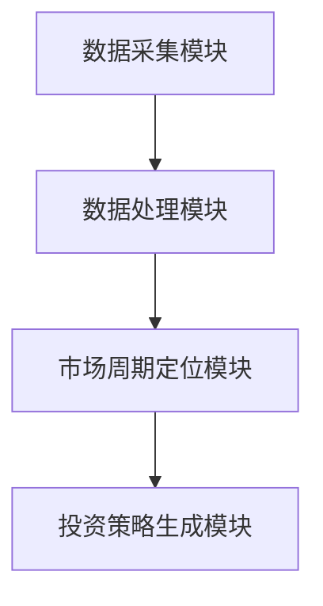
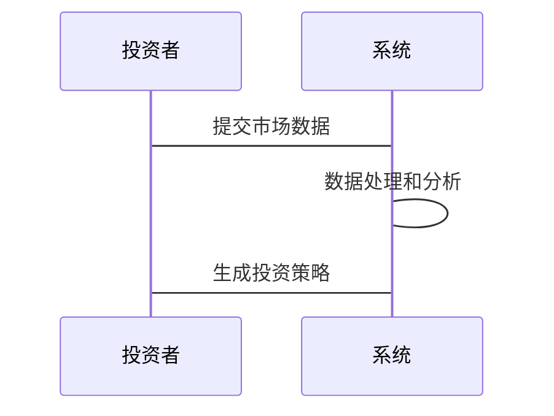

                 


# 霍华德·马克斯的市场周期定位技巧

> **关键词**：霍华德·马克斯、市场周期、投资策略、价值投资、市场定位技巧  
>
> **摘要**：霍华德·马克斯是全球著名投资家，其市场周期理论在投资界备受推崇。本文详细探讨霍华德·马克斯的市场周期定位技巧，包括市场周期的基本概念、形成机制、定位方法以及在投资策略中的应用。通过理论与实践的结合，本文旨在帮助读者更好地理解和运用这些技巧，提升投资决策的准确性。

---

## 第一章：市场周期的基本概念

### 1.1 市场周期的定义与特征

#### 1.1.1 市场周期的定义
市场周期是指市场在经济发展过程中，由于供需变化、经济波动、政策调整等因素，导致市场价格和参与者行为呈现周期性波动的现象。市场周期的核心特征包括波动性、周期性、均值回归和非线性特征。

#### 1.1.2 市场周期的核心特征
- **波动性**：市场的价格和成交量呈现波动性变化。
- **周期性**：市场经历多个阶段的循环，如衰退、筑底、上升和泡沫。
- **均值回归**：市场倾向于回归长期均值，避免极端偏离。
- **非线性特征**：市场波动并非完全随机，存在一定的模式和结构。

#### 1.1.3 市场周期的阶段划分
市场周期通常分为四个阶段：
1. **衰退期**：市场处于下行趋势，投资者情绪低落。
2. **筑底期**：市场触底，投资者逐渐恢复信心。
3. **上升期**：市场开始复苏并上升，投资者情绪乐观。
4. **泡沫期**：市场出现过度投机，价格远高于内在价值。

### 1.2 霍华德·马克斯的投资理念

#### 1.2.1 霍华德·马克斯的生平与投资成就
霍华德·马克斯是橡树资本管理公司的创始人，以其价值投资理念闻名。他强调市场的非理性波动和均值回归特性，主张在市场低谷时买入，高点时卖出。

#### 1.2.2 马克斯的市场周期理论概述
马克斯认为，市场周期是由投资者情绪和市场估值共同驱动的。他提出了“橡子理论”，即市场在低谷时类似于橡树落下的橡子，潜在价值被低估，适合长期投资。

#### 1.2.3 马克斯投资哲学的核心思想
马克斯强调：
1. 市场周期的存在是投资机会的基础。
2. 投资者应关注市场的长期趋势，而非短期波动。
3. 价值投资的核心是寻找市场低估的资产。

---

## 第二章：市场周期的形成机制

### 2.1 市场周期的驱动因素

#### 2.1.1 经济基本面因素
- **经济增长**：GDP、就业率等指标影响市场周期。
- **通胀与通缩**：通胀上升可能导致市场泡沫，通缩可能导致市场衰退。
- **利率政策**：央行的利率调整影响市场流动性和估值。

#### 2.1.2 市场参与者的心理因素
- **投资者情绪**：贪婪和恐惧导致市场的波动。
- **行为偏差**：投资者的羊群效应和过度自信影响市场周期。

#### 2.1.3 政策与制度的影响
- **政府政策**：财政政策和货币政策直接影响市场。
- **监管变化**：监管放松或加强会影响市场参与者的行为。

### 2.2 市场周期的波动规律

#### 2.2.1 市场周期的波动性分析
市场的波动性可以通过统计学方法进行分析，如标准差和波动率模型。

#### 2.2.2 市场周期的均值回归特性
均值回归是市场周期的重要特征，可以通过回归分析模型来量化。

#### 2.2.3 市场周期的非线性特征
市场的非线性特征可以通过分形理论或混沌理论进行分析。

---

## 第三章：霍华德·马克斯的市场周期定位技巧

### 3.1 马克斯的市场周期定位方法

#### 3.1.1 定位市场的当前阶段
马克斯通过分析市场估值和投资者情绪来判断市场所处的阶段。

#### 3.1.2 定位市场的潜在转折点
马克斯关注市场估值的极端值和政策变化，作为市场转折点的信号。

#### 3.1.3 定位市场的长期趋势
马克斯强调长期趋势的重要性，建议投资者关注市场的长期均值回归特性。

### 3.2 马克斯的投资策略与市场周期的关系

#### 3.2.1 不同市场周期下的投资策略
- **衰退期**：寻找低估资产，增加投资。
- **筑底期**：逐步增加仓位，等待市场反弹。
- **上升期**：保持适度仓位，避免过度乐观。
- **泡沫期**：减少投资，防范风险。

#### 3.2.2 市场周期中的风险控制
马克斯强调在市场高点时控制风险，避免过度杠杆和投机行为。

#### 3.2.3 市场周期中的机会捕捉
马克斯建议在市场低谷时寻找被低估的资产，抓住长期投资机会。

---

## 第四章：市场周期定位的理论与实践

### 4.1 市场周期的阶段划分

#### 4.1.1 衰退期
衰退期的特征是市场估值低，投资者情绪悲观。

#### 4.1.2 筑底期
筑底期的特征是市场开始触底，投资者情绪逐渐恢复。

#### 4.1.3 上升期
上升期的特征是市场复苏，投资者情绪乐观。

#### 4.1.4 泡沫期
泡沫期的特征是市场估值过高，投资者情绪极度乐观。

### 4.2 市场周期的指标体系

#### 4.2.1 市场估值指标
- 市盈率（P/E）
- 市净率（P/B）
- 市场收益率

#### 4.2.2 市场情绪指标
- 投资者信心指数
- 恐慌指数（VIX）
- 市场成交量

#### 4.2.3 市场资金流动指标
- 资金流入流出
- 资金周转率

---

## 第五章：市场周期定位的数学模型

### 5.1 市场周期定位的统计模型

#### 5.1.1 时间序列分析
时间序列分析用于预测市场周期的变化趋势，常用的模型包括ARIMA和GARCH。

#### 5.1.2 马尔可夫链模型
马尔可夫链模型用于分析市场周期的转移概率，帮助判断市场状态的变化。

#### 5.1.3 市场周期波动的回归分析
回归分析用于量化市场周期与经济指标之间的关系。

### 5.2 市场周期定位的机器学习模型

#### 5.2.1 基于神经网络的市场周期预测
神经网络模型可以捕捉市场的非线性特征，用于市场周期的预测。

#### 5.2.2 基于支持向量机的市场周期分类
支持向量机用于将市场周期分为不同的阶段，帮助投资者进行分类决策。

#### 5.2.3 基于随机森林的市场周期识别
随机森林模型用于市场周期的识别和分类，具有较高的准确率。

---

## 第六章：市场周期定位的系统架构

### 6.1 系统功能设计

#### 6.1.1 数据采集模块
数据采集模块负责收集市场数据，包括价格、成交量、市场情绪等。

#### 6.1.2 数据处理模块
数据处理模块对原始数据进行清洗、转换和特征提取。

#### 6.1.3 市场周期定位模块
市场周期定位模块通过统计模型和机器学习模型，判断市场所处的阶段。

#### 6.1.4 投资策略生成模块
投资策略生成模块根据市场周期定位结果，生成相应的投资策略。

### 6.2 系统架构设计

#### 6.2.1 系统架构图


#### 6.2.2 系统交互流程


---

## 第七章：项目实战

### 7.1 环境安装
需要安装Python、Pandas、NumPy、Scikit-learn、TensorFlow等工具。

### 7.2 系统核心实现源代码

```python
# 示例代码：市场周期定位模型
import pandas as pd
import numpy as np
from sklearn.ensemble import RandomForestClassifier

def market_phase_classifier(data):
    # 数据预处理
    data = data.dropna()
    features = data[['P/E', 'P/B', 'VIX']]
    labels = data['Market Phase'].astype(int)
    
    # 模型训练
    model = RandomForestClassifier()
    model.fit(features, labels)
    
    return model

# 示例数据
data = pd.DataFrame({
    'P/E': [10, 15, 20, 25, 30],
    'P/B': [2, 3, 4, 5, 6],
    'VIX': [20, 15, 10, 5, 30],
    'Market Phase': [0, 1, 2, 3, 4]
})

model = market_phase_classifier(data)
print("模型训练完成")
```

### 7.3 案例分析
以某次市场周期为例，分析如何利用模型进行市场定位和投资策略生成。

### 7.4 项目小结
总结项目实施过程中的关键点和经验教训，强调模型的优势和局限性。

---

## 第八章：最佳实践与总结

### 8.1 最佳实践 Tips
- 定期更新市场数据，保持模型的有效性。
- 结合市场实际情况，调整模型参数。
- 多关注市场周期中的转折点，及时调整投资策略。

### 8.2 小结
霍华德·马克斯的市场周期定位技巧为投资者提供了重要的理论和实践指导，帮助投资者在不同市场阶段做出明智的投资决策。

### 8.3 注意事项
- 市场周期分析需要结合实际情况，避免机械套用模型。
- 投资者应具备风险控制意识，避免过度杠杆和投机行为。

### 8.4 拓展阅读
推荐阅读霍华德·马克斯的经典著作《投资最重要的事》，深入理解其投资理念。

---

**作者：AI天才研究院/AI Genius Institute & 禅与计算机程序设计艺术 /Zen And The Art of Computer Programming**

---

以上就是《霍华德·马克斯的市场周期定位技巧》的完整内容，希望对您有所帮助！

